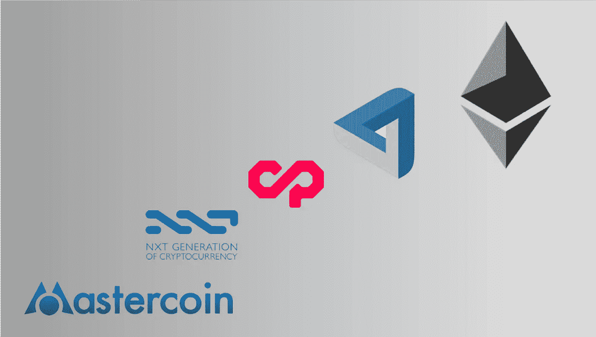
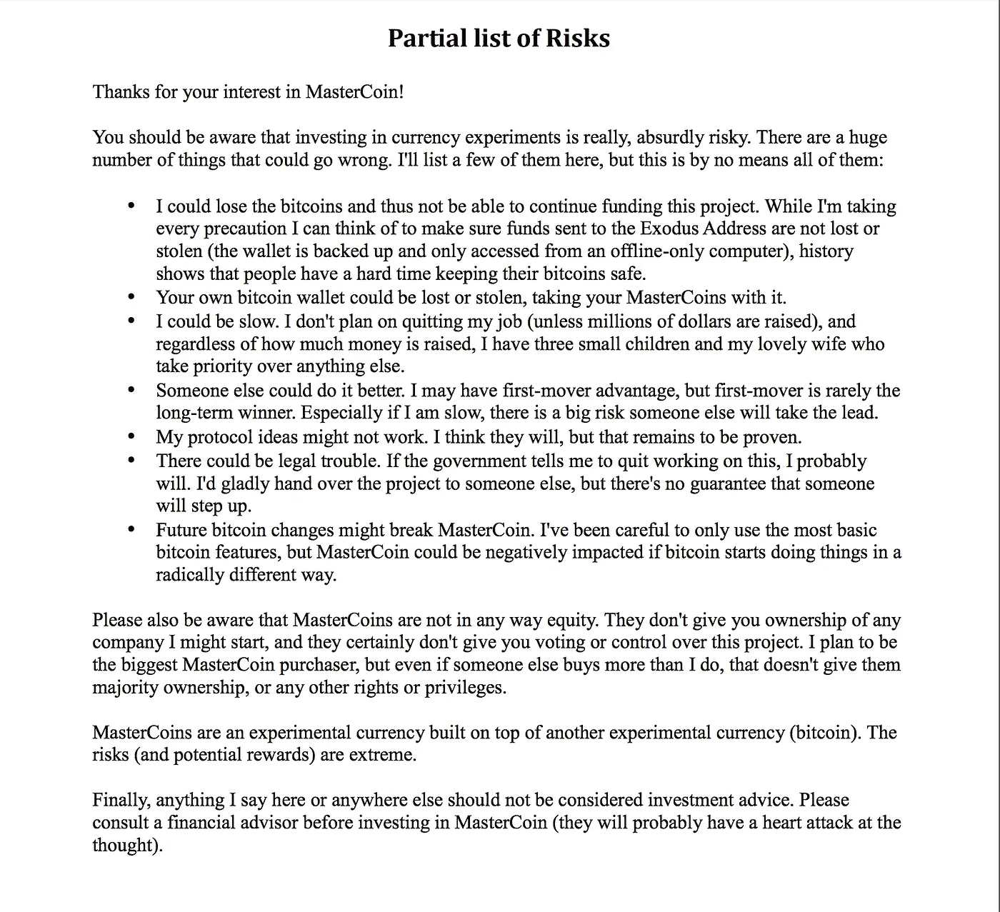
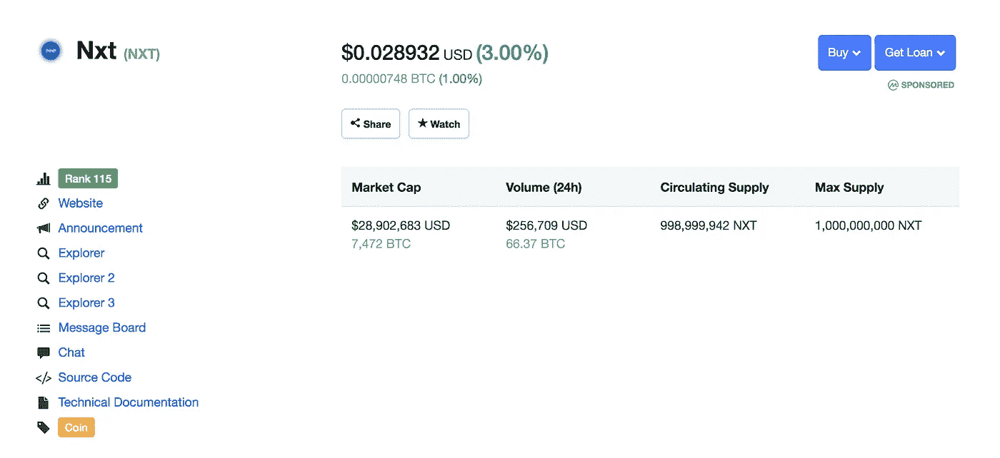
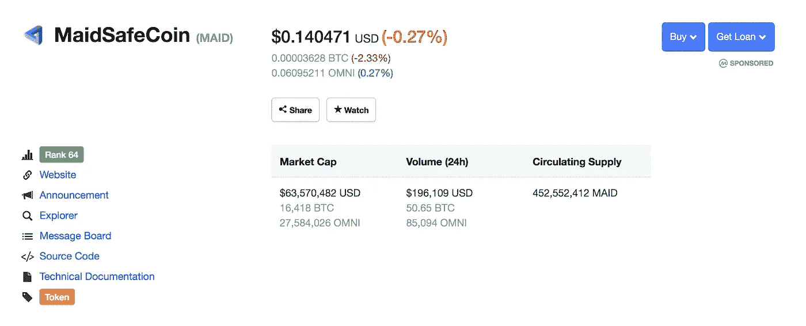

# ICO 101 —首次硬币发行(ICO)的历史

> 原文：<https://medium.com/hackernoon/ico-101-history-of-initial-coin-offerings-icos-part-1-from-mastercoin-to-ethereum-4689b7c2326b>

# 第一部分——从主币到以太坊

# 0.介绍

亲爱的读者:

本文是关于初始硬币发行(ico)、初始交易所发行(ieo)、分散自治 ico(DAICOS)和安全令牌发行(sto)的完整系列文章的一部分，最后是: [IDOs](/ngrave/from-ico-to-ido-evolution-of-the-crypto-funding-hype-cycle-5f867a1c367d) 。

你可以找到最重要的[部分 I 她的](https://hackernoon.com/a-comprehensive-guide-to-icos-crypto-funding-the-rise-the-boom-the-bust-the-next-b159fdf38010) e:

 [## 下一代 ico 和加密基金的综合指南

### 为什么需要转变观念& ico 的未来会是什么样子

hackernoon.com](https://hackernoon.com/a-comprehensive-guide-to-icos-crypto-funding-the-rise-the-boom-the-bust-the-next-b159fdf38010) 

这里还有[第二部](https://hackernoon.com/a-comprehensive-guide-to-the-next-generation-of-crypto-funding-v-ico-ieo-daico-eto-sto-939909782da6):

 [## 下一代加密基金综合指南| (V)ICO | IEO |戴科|埃托| STO |

### ICOs 时代的到来。探索加密资金革命的下一步。(第二部分)

hackernoon.com](https://hackernoon.com/a-comprehensive-guide-to-the-next-generation-of-crypto-funding-v-ico-ieo-daico-eto-sto-939909782da6) 

以及第三部分(向 ieo 和 ido 的演进)[这里](/ngrave/from-ico-to-ido-evolution-of-the-crypto-funding-hype-cycle-5f867a1c367d):

 [## 从 ICO 到 IDO:加密资金炒作周期的演变

### ico 如何以及为什么演变成 ieo 和 ido(初始 Dex 产品)

medium.com](/ngrave/from-ico-to-ido-evolution-of-the-crypto-funding-hype-cycle-5f867a1c367d) 

快乐阅读！

# 1.ICO 的起源——一切开始的地方。不，那不是以太坊！

2013.嘭！在默默为他的想法工作了两年之后，这个家伙 [J.R. Willett](https://www.linkedin.com/in/jrwillett/) 突然出现在 bitcointalk 论坛[上，解释比特币的补充协议](https://bitcointalk.org/index.php?topic=265488.0)，内置对 a.o .自定义令牌、分布式货币交换(想想 [DEX](https://en.wikipedia.org/wiki/Decentralized_exchange) )、分布式下注(无需信任网站来协调下注)、智能财产令牌等的支持！简而言之，一个名为“ **MasterCoin** ”的协议将通过向现有的比特币区块链添加额外的功能和可能性来利用它。

显然，Willet 需要为他的想法提供资金，所以他友好地四处请求一些 BTC 捐款(听起来很熟悉，对吗？！).为了激励潜在投资者真正做出贡献，他还补充说，该协议中的几个功能将只对那些实际拥有 MasterCoins 的人开放。瞧，明智的 Willet 先生不仅向我们介绍了后来被称为第一个 ICO 的东西，还介绍了第一个实用令牌。现在是有两个女婿和一个女儿了！(我的“一石二鸟”的花式说法)。

**请看下面视频中威利特在密码史上留下的印记**；它应该在 4 分 30 秒时自动启动:

> 威利特:“今天，如果你想在比特币的基础上建立一个新的协议层，很多人没有意识到，你可以不去找一群风险投资家，而不是说，嘿，我有这个想法，你可以——我想你熟悉 Kickstarter 吧？你们大多数人？你实际上可以说，好吧，这是我的推介，这是我的开发团队——这个房间里有很多开发人员。如果你召集一群值得信赖的人，他们听说过，然后说，好吧，我们要做这个。我们要做一个新的协议层。它将在比特币的基础上增加新的功能 X，Y 和 Z，这是我们的身份和我们的计划，这是我们的比特币地址，任何向这个地址发送硬币的人都拥有我们新协议的一部分。任何人都可以这样做。至少一年来我一直在告诉人们这一点，因为我想投资它。我没有很多硬币，但我想把我的硬币投资在那里。我还没找到想要我硬币的人。这个房间里有人想要我的比特币吗，因为我想——”

**募集资金总额**:60 万美元

**有趣的事实** ( &感谢[2013 年 7 月筹集的资金总额达到峰值，约为 4740 BTC，这是一大笔比特币。当时价值约 50 万美元，今天则是一大笔钱。](https://medium.com/u/bdd9bfe4b591# OMNI)，它现在充当系链令牌(#USDT)的底层协议，这是仅次于 BTC 本身的交易量最大的加密令牌。</li><li id=)

*   [MasterCoin (#MSC)令牌本身未能在协议中找到实际用途。显然，*“要求用户持有令牌才能访问基本功能是糟糕的 UX，效率低得可怕&不必要的复杂*。](https://medium.com/u/bdd9bfe4b591# OMNI)，它现在充当系链令牌(#USDT)的底层协议，这是仅次于 BTC 本身的交易量最大的加密令牌。</li><li id=)*   [#MSC 硬币今天仍然存在，没有目的，没有计划。然而，在 2017 年的狂热中，他们加入了到月球的伟大非理性泵，从 4 美元到 123 美元。现在它们的价格是每只 7 美元。谁知道未来会发生什么…](https://medium.com/u/bdd9bfe4b591# OMNI)，它现在充当系链令牌(#USDT)的底层协议，这是仅次于 BTC 本身的交易量最大的加密令牌。</li><li id=)

[**非常值得注意:**](https://medium.com/u/bdd9bfe4b591# OMNI)，它现在充当系链令牌(#USDT)的底层协议，这是仅次于 BTC 本身的交易量最大的加密令牌。</li><li id=)

[与大多数 ico 推销自己的方式不同，威利特](https://medium.com/u/bdd9bfe4b591# OMNI)，它现在充当系链令牌(#USDT)的底层协议，这是仅次于 BTC 本身的交易量最大的加密令牌。</li><li id=)[实际上是超级透明的(多么令人愉快的对比！)列出并传达投资他的 ICO 的风险。](https://e33ec872-a-62cb3a1a-s-sites.googlegroups.com/site/2ndbtcwpaper/MasterCoinRisks.pdf?attachauth=ANoY7cpagxwr3xfHVSNGZE354YQbksBukoH5omTWGn8yI8aO2magyzh2dt_cHu7hMMKWvQA7Yaf5YZ3nz8QaZi2BtRBKpGWOv2cwku7YpWUdsUH5LHTy7IytEAY3hqeFR0hllytdKkuT0YJRyyrCeVonctdsETgbcWi3-HN7_vjCppv0cG9tKooQ3imhcUwrjCMHRq-lnkNTF-3RGCuKcweu9bSDdtQ-ww%3D%3D&attredirects=0)阅读下面的摘录:

# 2.非凡的第二枚——下一枚硬币

[NextCoin](https://nxtplatform.org/what-is-nxt/) (#NXT)在我们谈论 ICOs 的时候是一个奇特的秒。2013 年 9 月 28 日，另一位匿名的 Bitcointalk.org 成员 BCNext [创建了一个论坛帖子，宣布计划推出“Nxt”](https://bitcointalk.org/index.php?topic=303898.0)作为第二代加密货币。他只要求非常小的比特币捐赠，以便决定如何分配最初的股份。几个月后，2013 年 11 月 18 日，Nxt 的筹款活动结束了。最初的硬币发行“成功地”——因为它的目标不是筹集大量资金——收集了 21 个价值约 3000 美元的比特币——当时价值 17000 美元(取决于你采取的确切时间，因为 BTC 在此期间经历了一点飙升)。

今天(2019 年 1 月初，撰写本文时)，NextCoin 以不到 3000 万美元的估值跻身 coinmarketcap 前 100 名。

**筹资总额**:1.68 万美元

**有趣的事实**

*   NextCoin 是第一种完全依赖于[利益证明(POS)](https://en.wikipedia.org/wiki/Proof-of-stake) 共识机制的加密货币。

# 3.微小的第三个——交易对手代币销售

今天，交易对手(XCP)以 600 万美元的市值在 Coinmarketcap 排名第 339 位，甚至经常被遗漏在开创性的历史 ico 名单之外。然而，交易对手实际上是有史以来的第三个 ICO，因此我认为它仍然值得在这个介绍性列表中占据特殊位置。

简单地说，XCP 用于在技术上不可能使用 BTC 的地方提供功能。例如，XCP 是用于支付所有智能合约代码执行的货币(而比特币本身本来就没有这种智能合约的可能性)。更一般地说，XCP 代表交易对手协议中的利益，并且是机构群体决定的变更的投票货币。

如果你想了解更多，这个网站比我解释得更清楚:

 [## 对手方

### “网站”(Counterparty.io 和 Counterwallet.io)由交易对手开发商所有和运营。由…

交易对手. io](https://counterparty.io/) 

**Noteworty**:2014 年，克里斯·德罗斯(Chris DeRose)在英国硬币展(Coins in the Kingdom)上与交易对手和资产革命相关的 YouTube 视频:

**筹资总额**:180 万美元

**有趣的事实**

*   在上一轮牛市的顶部(2018 年 1 月)，XCP 的峰值约为 2.4 亿美元。

# 4.一个名字奇怪的第四名:MaidSafeCoin

MaidSafe 乍一看可能是个奇怪的名字。但它实际上只是代表大规模互联网磁盘阵列，每个人都可以安全访问。所以不要去抱怨缩写！虽然这个奇怪的名字并没有阻止它在过去筹集大量资金。#MAID 通过象征性发售筹集了相当于 700 万美元的资金。

站在巨人的肩膀上，SAFE(“每个人的安全访问”)网络希望(并且今天仍在努力)结合历史上著名的去中心化网络(如 Napster、Freenet、BitTorrent 和比特币)的特征，它旨在提供以下特征:

*   完全加密的数据存储和文件共享
*   匿名使用网络的能力
*   抵制审查的通信
*   无服务器数据
*   免交易费的可扩展加密货币

安全网络最终希望“创建一个安全、自治、以数据为中心的对等网络，作为当前以服务器为中心的模式的替代方案。更多信息请参考 Coincentral 的文章。

今天，它自豪地在 coinmarketcap 上占据了前 100 名的位置，在撰写本文时价值约 6400 万美元。正如你所看到的，它的价格不仅表现在 BTC，而且也表现在 OMNI(即在威利特的 MasterCoin 继承者#OMNI 为不太上心！)

筹资总额:600 万美元

# 5.几乎被遗忘的第五个？—蜂群

2014 年 7 月，这个项目 [Swarm](http://swarmcorp.com/?utm_source=coinschedule) 通过代币销售筹集了 80 万美元。然而，很难找到关于它的任何信息。最近的一些努力很可能给这个项目蒙上阴影。例如 [Swarm.fund](https://swarm.fund/) (#SWM)，这是一个安全令牌提供平台(STOs 我们马上会在第二部分谈到 STOs)，它在 2017 年底完成了令牌销售。然后是[蜂群城市](https://swarm.city/) (#SWT)，其中 [Ngrave 的](https://www.ngrave.io/) CTO Xavier Hendrickx 目前也担任 CTO 一职。虫群城 2016 年底完成 ICO。

 [## 群体基金——投资的未来就在现在

### Swarm 为投资者带来了前所未有的机会，以及安全令牌和投资未来的基础设施。

群体基金](https://swarm.fund/)  [## 蜂群城市

### Swarm City 是一个基于区块链的市场，具有内置的声誉系统。它使用区块链技术和智能…

swarm.city](https://swarm.city/) 

**筹资总额**:80 万美元

# 6.进入真正的交易:以太坊

2014.按照美国的标准，俄罗斯“小伙子”维塔利克·布特林(Vitalik Buterin)勉强够得上喝酒的年龄，他试图为一个新的值得关注的 ICO 筹集资金，他设想这是世界上第一个零基础设施平台，名为“以太坊”。代币销售在头 12 个小时内筹集了 3700BTC，现在谁不想要这个呢？！正如你所看到的，它可以给你买一些漂亮的 t 恤！

**筹资总额**:1830 万美元

**有趣的事实**

*   以太坊 2014 年 8 月 31 日的 ICO 代币价格为 0.31 美元，随后几年，1 单 ETH 的市值在 2017 年的热潮中爆发到 1400 多美元。这是一个我有时很难理解的百分比增长。
*   此次融资发生在相当大的比特币熊市期间。
*   就市值而言，以太坊已经上升到典型的加密行业前三名，与比特币和 Ripple 并列。它通常稳坐第二把交椅。
*   与此同时，自以太坊成立以来，自其最初的 ICO 以来，已有超过 1000 种所谓的“ **ERC20** ”加密货币在该平台上发行。ERC20 本身是一种协议标准，它定义了在以太坊的网络和基础设施上发行令牌的某些规则和标准。ERC 代表以太坊征求意见，20 代表一个唯一的 ID 号，以区别于其他标准。
*   2016 年，一个名为 [The DAO](https://en.wikipedia.org/wiki/The_DAO_(organization)) 的 [**去中心化自治组织**在该平台上开发了一套智能合同，通过众筹/代币销售筹集了创纪录的 1.5 亿美元来资助该项目。DAO 在 6 月份被利用，当时一个不知名的黑客窃取了 5000 万美元(这是一次抢劫！).随后，以太坊被拆分成两个独立的区块链(一个所谓的“](https://en.wikipedia.org/wiki/Decentralized_autonomous_organization)[分叉事件](https://en.wikipedia.org/wiki/Fork_(blockchain)#Hard_fork)”)—新的独立版本变成了盗窃反转的以太坊(ETH)，原版继续作为以太坊经典(ETC)。
*   **Solidity** ，最初由 Gavin Wood 于 2014 年 8 月提出，是以太坊平台上使用的初级编程语言(面向契约)。大多数对 crypto 稍感兴趣的人肯定听说过它。然而，如果你发现自己陷入了一个加密测验，请记住，当与名为“**以太坊虚拟机**”(EVM)的编程接口交互时，Serpent、LLL、Viper 和 Mutan 是其他相对流行的语言。
*   Vitalik 在浏览了维基百科关于元素和科幻小说的文章后选择了这个名字。当他找到这个名字时，他立刻意识到我喜欢它胜过我见过的所有其他选择；我想这是因为它听起来不错，而且它有一个词'[*ether*](https://en.wikipedia.org/wiki/Luminiferous_aether)*'，指的是弥漫宇宙并允许光传播的假设的无形介质。”*

Initial Coin Offerings — From MasterCoin to Ethereum

**注**:作者 2021 年快速更新:请点击此处找到关于 ido(初始 Dex 发行)以及 ico 如何演变成 ido 的最新文章:

 [## 从 ICO 到 IDO:加密资金炒作周期的演变

### ico 如何以及为什么演变成 ieo 和 ido(初始 Dex 产品)

medium.com](/ngrave/from-ico-to-ido-evolution-of-the-crypto-funding-hype-cycle-5f867a1c367d) 

**Outro:**

如果你喜欢这篇文章，别忘了点击拍手按钮！

并随时关注我的 [**中**](/@ruben.merre) **。**

再次感谢阅读和鼓掌。

[鲁本](https://www.linkedin.com/in/ruben-merre/)

**关于 Ruben 和 NGRAVE:**

*Ruben Merre 是一位技术企业家，通晓多种语言，终身学习，是世界上最安全的加密货币钱包“ZERO”背后的数字资产安全公司*[*【n grave】*](https://ngrave.io/)*的创始人兼首席执行官。自 2018 年以来，鲁本和他的团队与纳米技术、密码学和硬件安全领域的顶级人士以及思想领袖合作，如著名密码学教授、比特币论文的第二参考文献 Jean-Jacques Quisquater。结果是:一个真正的端到端数字资产管理解决方案，具有最高的安全性(EAL7，世界上最高的安全认证)，以及直观的用户交互。*

 [## NGRAVE |无与伦比的加密安全性和无缝体验

### 第一个端到端的加密管理解决方案。最冷的硬件钱包。最冷的钥匙备份。不…

ngrave.io](https://ngrave.io)