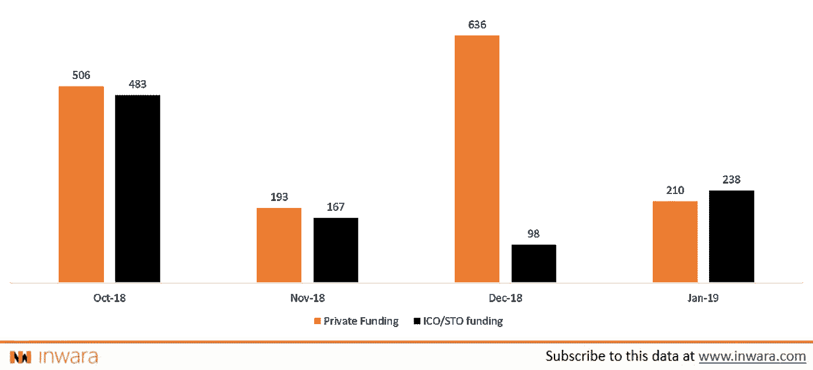
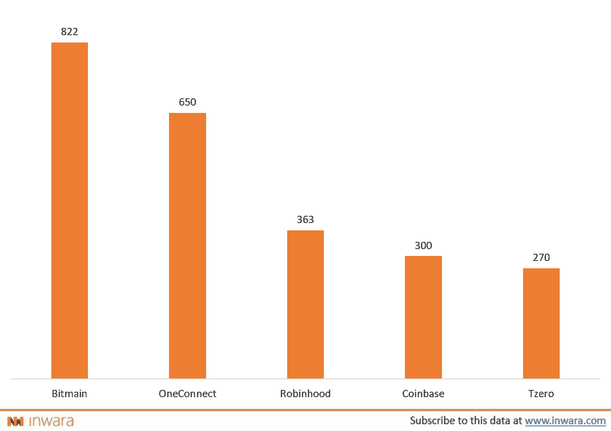
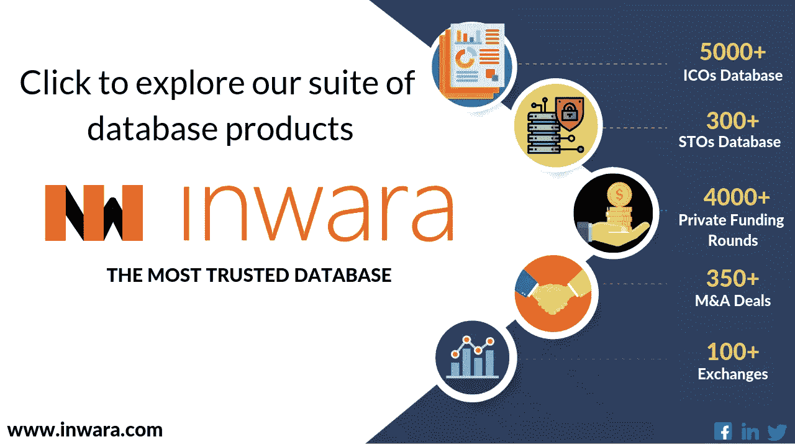

# 资金策略解码:ico 在 2019 年扭转局面！

> 原文：<https://medium.com/hackernoon/ico-funding-strategies-decoded-icos-turn-the-tables-in-2019-f5742f6dac4c>

Flippenning 一直与以太坊和 Ripple 等另类硬币联系在一起，它们都试图在总市值方面确立自己的主导地位。预计比特币也会出现类似的情况，尽管它是第一种加密货币，自诞生以来一直占据市场主导地位，但加密社区现在认为，仅仅依靠支付解决方案，BTC 的未来可能不会那么光明，它将失去目前的市场主导地位，让位于替代品。

## **这会是 flippen 2.0 吗？**

Flippening 2.0 似乎是一种市场趋势，可能会见证首次硬币发行变得越来越少面向公众，越来越只面向高净值个人和机构。最初创建 ico 是为了支持分散化，从而使交易所的交易价格看起来正常，现在 ico 已经与传统投资者达成了融资协议。随着市场继续疲软&主要监管机构寻求逮捕骗子，代币发行活动筹集资本的想法似乎正在失去青睐。

**通过私人融资和 ICO 销售筹集的资金(百万美元)**

[Source: InWara’s ICO+STO database](https://www.inwara.com?utm_source=fliphacker&utm_medium=fliphacker&utm_campaign=fliphacker)

仅在过去四个月中，区块链企业通过合格投资者和私人机构筹集的资本就相当高，达到 9 亿美元([来源](https://www.inwara.com/report/monthly-report-january-2019))，而 ICO/STOs 的销售额为 15 亿美元。然而，有趣的是，这一差距在第三季度缩小，并在 2019 年 1 月翻转，私募基金超过了主要的销售增长！

**监管机构推动了这一转变？**

代币生成事件中日益增长的监管审查，尤其是在美国，正迫使企业家转向像机构投资者那样的传统融资来源。

早些时候，有“突破性”想法的企业家可以很容易地为他们的项目筹集资金，只需建立一个网站并上传一份关于项目细节的白皮书。当无数的 ICO 骗局开始出现时，这种情况发生了变化。根据 Statis group 的一项研究[, 2017 年进行的所有 ico 中有近 80%是骗局，这迫使监管机构变得更加警惕。现在，企业家们发现通过传统方式筹集资金比通过公开销售的监管雷区更容易。](https://research.bloomberg.com/pub/res/d28giW28tf6G7T_Wr77aU0gDgFQ)

.

**筹集私人资本的好处**

除了“更容易”之外，筹集私人资本还有许多其他好处，如为公司管理层创造一个关注长期目标的有利环境，散户投资者通常会受到短期目标的激励，并获得快速回报。散户投资者通常除了他们的资本之外没有什么可以提供的，但另一方面，私人投资者的加入为利用他们的专业关系网提供了选择。这可以帮助公司更快地扩大规模，实现长期目标。

此外，这允许公司担心核心开发，而不是部署资源来确保围绕开发的公共关系。毕竟不是每个项目都有一个孙正义！

## 加密市场需要机构投资者吗？

区块链自诞生以来的短短时间内，已经在许多行业掀起了波澜。尽管如此，对于区块链技术的主流采用，它需要扩展到一个全球平台。资金雄厚的大型银行和私人机构可以通过提供金融实力以及对业务的理解来推动区块链，从而允许追求相关的用例并过滤噪音。机构投资还可以通过提高公众眼中的可信度来帮助推动大规模采用。

2018 年 11 月，全球“四大”审计事务所之一的[毕马威](https://home.kpmg.com/us/en/home.html)发布了一份[报告](https://assets.kpmg/content/dam/kpmg/us/pdf/2018/11/institutionalization-cryptoassets.pdf)，强烈倡导密码市场的增长，并推动机构投资者进入该市场，而不是保持观望。“制度化是 crypto 的下一个必要步骤，是建立信任、促进规模化、提高可访问性和推动增长所必需的。”报道援引毕马威的话说。

目前，世界上只有一小部分人直接与 crypto 和区块链互动，他们主要是散户投资者、企业家和加密爱好者。然而，越来越多专门从事区块链和类似技术的风险投资和风险投资基金可能表明，机构投资者正在向这个仍处于萌芽状态的市场迈进。

## **2018 年大型私募基金交易**

[Source: InWara’s ICO+STO database](https://www.inwara.com?utm_source=fliphacker&utm_medium=fliphacker&utm_campaign=fliphacker)

## **比特大陆**

中国私营公司比特大陆运营着最大的比特币挖矿池之一蚂蚁金服。在加密领域被称为高科技加密采矿硬件制造商的比特大陆在两轮独立的融资中总共筹集了**8 . 22 亿**美元，得到了知名风险投资公司如[红杉资本](https://www.sequoiacap.com/)的支持。

## **OneConnect**

OneConnect 是一家中国公司，为银行等大型公共机构提供金融服务和金融科技解决方案。作为首轮私募融资的一部分，他们筹集了 6.5 亿美元。OneConnect 此前参与了一些高调的交易，例如与香港金融管理局合作，推出一个由区块链驱动的金融交易系统。

## **罗宾汉**

根据[财富](http://fortune.com/2018/05/10/robinhood-stock-crypto-trading/)的一份报告，受欢迎的股票交易应用 Robinhood 被认为是美国顶级金融科技初创公司之一。这款应用的估值高达 56 亿美元，并在 D 轮融资中筹集了 3 . 63 亿美元，投资方包括红杉资本和凯鹏华盈等知名风险投资公司。虽然该公司最初是一个股票交易平台，但后来推出了一个交易加密资产的平台。

## **比特币基地**

[比特币基地](https://www.coinbase.com/)是一家总部位于旧金山的数字货币交易所，它允许用户使用法定货币直接购买密码。众所周知，比特币基地资金充裕，经常走在收购的前列。作为 2019 年 E 轮融资的一部分，该交易所设法从 Andreessen Horowitz 等加密领域的风投那里筹集了高达 3 亿美元的资金。

## 这是散户投资之路的尽头吗？

不完全是。ICO 不仅仅是为了筹集资金，它还是一种在散户投资者、开发商和密码爱好者之间分发代币的机制。

考虑一个由区块链驱动的消息平台或支付平台，ICO 可以为平台提供用户起步和扩散所需的初步推动。有鉴于此，尽管初创公司似乎倾向于专业投资者来筹集资金，但散户投资者被完全隔离的可能性很小。

