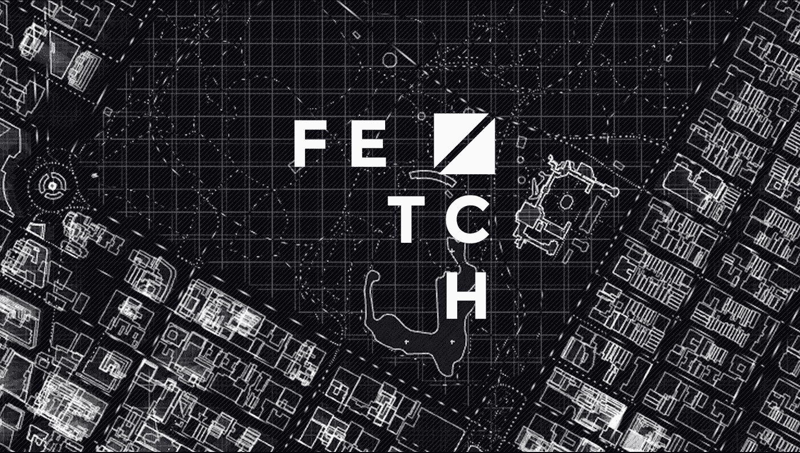
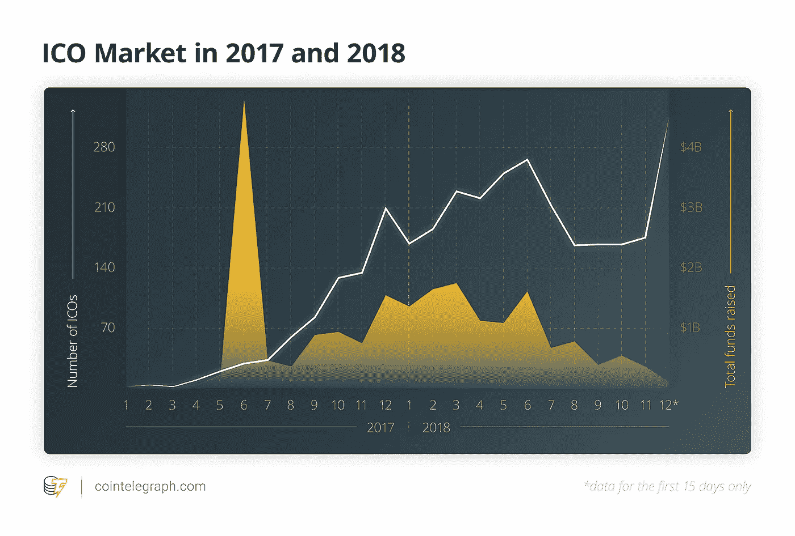
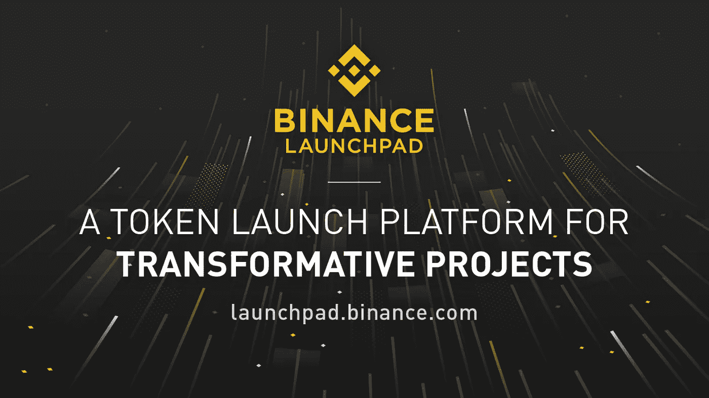
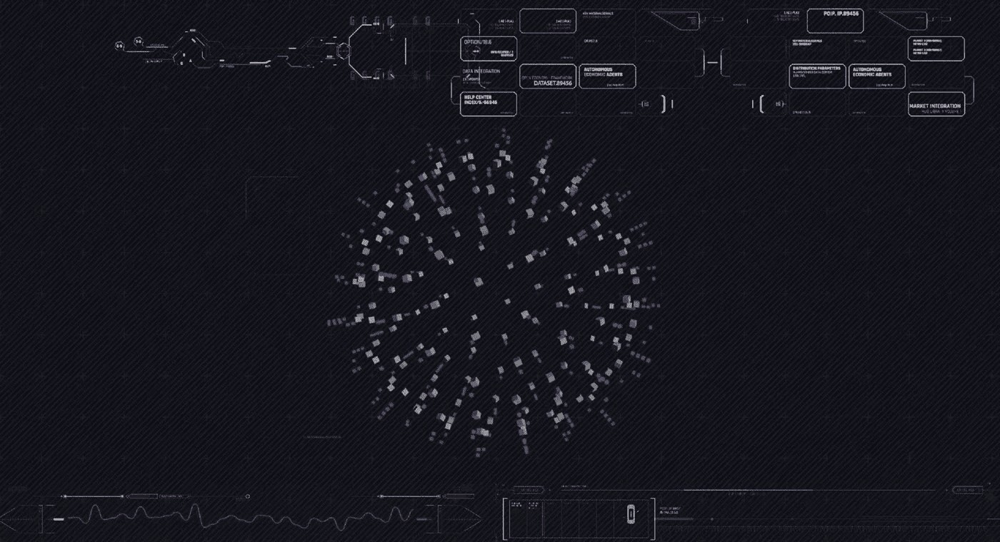
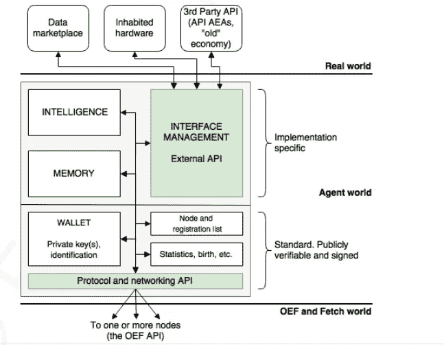
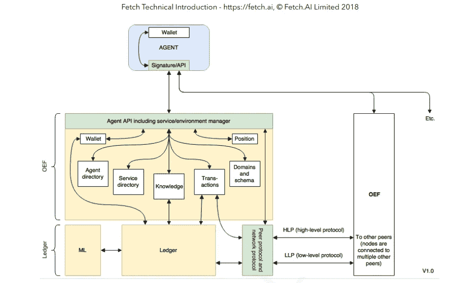
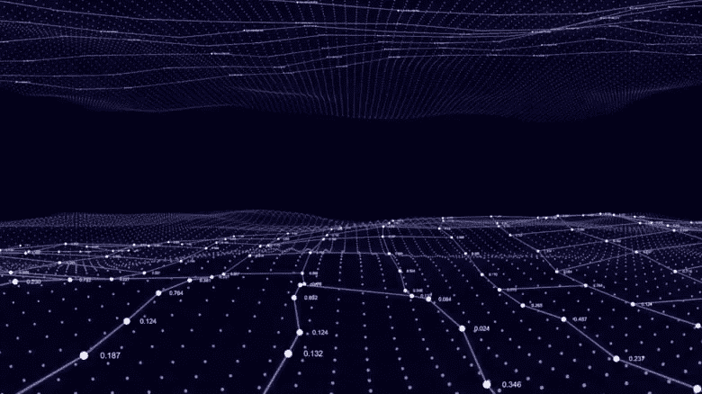
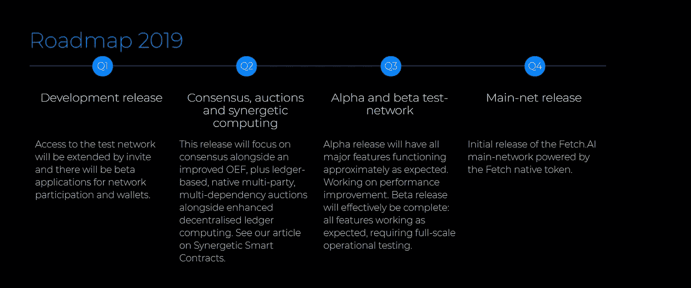
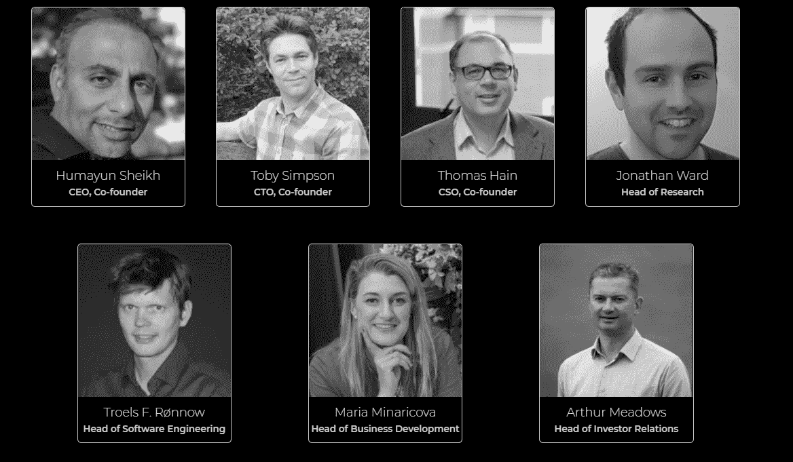
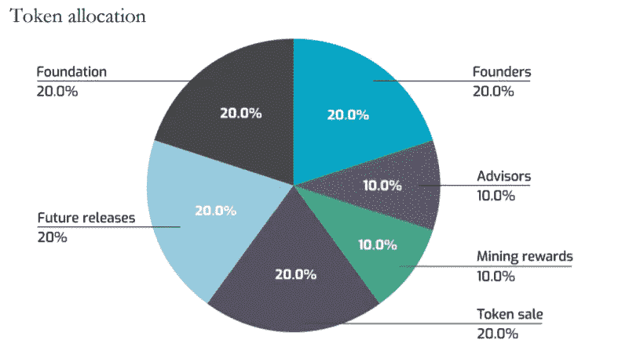

# ICO 新闻:为什么币安在 Fetch 上下赌注？AI？

> 原文：<https://medium.com/hackernoon/ico-news-why-is-binance-betting-on-fetch-ai-51bf3f714d94>

## 让我们来看看为什么币安 launch pad——以质量评估和推广“真正变革性”的加密项目而闻名——入围了“Fetch”。下一次象征性的拍卖。

我们正在经历加密史上最长的熊市。在过去的一年里，我们看到了最具标志性的牛市之一，从 2017 年第四季度开始到 2018 年的 Q1，几乎所有主要货币都达到了历史最高水平。一旦熊市开始控制市场，我们就见证了所有主要数字资产的清洗——多达 80%-90%。

仅在 2018 年，我们就提供了几乎 2200+ICO；其中大多数引起了社区的高度兴趣。2018 年夏季后，ICO 市场也感受到了加密崩溃的冲击，因为他们中的大多数人都在努力筹集启动项目所需的资金。

Source: cointelegraph.com

到 2018 年第四季度，大多数 ICO 市场干涸，大多数密码专家预测 ICO 的时代已经结束。

# 然后，币安发射台发生了变化。

[币安发射台](https://launchpad.binance.com/?lang=en)是数字资产交易巨头币安的独家代币发射平台，旨在帮助区块链项目筹集资金，并为他们提供更广泛的支持者网络。

除此之外，币安还打算通过提供指导和商业建议来帮助项目发展。

2017 年，币安 launchpad 举行了两个主要项目 Bread (BRD)和 Gifto (GTO)的销售——两个项目都在一瞬间售罄。于 2018 年，由于不利的市场环境，并无进行销售。

2019 年 1 月，币安 launchpad 决定推出 BitTorrent token(BTT)，仅 16 分钟就销售一空。如果不是因为软件故障，据推测，销售可能会在 1 或 2 分钟内结束，这表明了市场对 Launchpad 支持的 ICO 项目的兴趣和信任。

最近，币安 launchpad 宣布了它的下一次象征性销售——fetch . ai

根据币安[播音员](https://support.binance.com/hc/en-us/articles/360022556372) t:

> “币安发射台将开始获取。AI (FET)代币发售时间 2019/02/25 下午 2:00(UTC)。象征性销售将接受 BNB，只有一个会议。”

让我们看看为什么以质量评估闻名的币安 Launchpad 入围了“Fetch。AI”进行下一次代币销售。

# 那么，什么是 Fetch。AI？

> ***“今天的互联网是为电子商务解决方案而构建的，但新的网络需要支持更多自主解决方案，这需要构建基础设施和工具来使其可部署。拿来。人工智能正在建立部署基础设施，这将使新的基于人工智能的自主机器经济成为现实。”——huma yun Sheikh，Fetch.AI 的 CEO***

拿来。人工智能是一个雄心勃勃的项目:区块链和人工智能的结合。它成立于 2017 年初，由两家独立公司 Itzme AI 和 uVue 合并而成。

拿来。人工智能的目标是创造一个基于自主“代理”的全新经济。这些自主的人工智能“代理”将用于执行各种任务，这些任务可以简单到预订酒店套房，也可以复杂到天气建模或设计有效的供应链。

> **正如开发者解释的，“取。人工智能是一种“集体超级智能主动向你提供答案的世界:在这个世界里，对你有益的信息和可能对你有益的信息被毫不费力地传递。"**

拿来。AI 将使用利益证明(PoS)和工作证明(PoW)的组合来提供他们称为有用的工作证明(UPoW)的共识。新块是通过正常的利害关系证明协议生成的，事务顺序由两个块之间执行的工作决定。

这项工作记录在块之间增长的有向无环图(DAG)上。DAG 从前一个块开始，并由标桩证明生成的块终止，这消除了对协调器的需要。

# **拿来。AI 架构由三部分组成:**

## 自主经济主体

Source@Fetch.ai Whitepaper

根据白皮书， **AEA(自主经济代理)**是一个软件实体，它可以在没有外部刺激的情况下执行操作。这些轻量级程序将代表用户执行预定的任务，这些用户相互交互以解决复杂的问题，并且共享过去的交互，从而改进未来的过程。

你可以从[官方博客](/fetch-ai/introducing-autonomous-economic-agents-d5ff6694ea67)阅读更多关于 AEA 的内容。

## 开放经济框架(OEF)

Source@Fetch.ai Whitepaper

根据白皮书:

> 开放经济框架(OEF)为自主软件代理提供生命支持。这些可以被认为是能够自己做出决定的数字实体。他们存在于一个动态重组的数字世界中，为代理人提供最佳的操作环境。

简而言之，所有的 AEA 都将被托管在 OEF，它将作为一个不断发展的生态系统，允许代理搜索、发现和相互交流。随着生态系统开始成熟，由此形成的集体智慧将提供无与伦比的指导，允许快速和高可靠性的交易，帮助获取智能总账变得更加有效。

你可以从官方博客[了解更多关于 OEF 的信息。](/fetch-ai/putting-fetch-ais-open-economic-framework-in-context-55d4441fd1dd)

## 提取智能分类帐

Fetch ledger 是一种新颖的结构，它结合了来自有向无环图(DAG)的元素。为了提高可伸缩性，Fetch 将使用分片，这将有助于适应" *n* "数量的交易，同时仍能提供快速一致的确认时间。

Fetch Smart ledger 的另一个无声的特性是，它可以根据客户的需要(将来)以无许可或许可的方式使用，这有助于行业适应。

你可以从[官方博客](/fetch-ai/design-of-the-fetch-ai-scalable-ledger-fde2e23e362f)了解更多关于获取智能账本的信息。

# 他们的 2019 年路线图:

main-net 预计将于 2019 年第四季度推出。[获取的 Github](https://github.com/fetchai) 。到目前为止，人工智能已经有了五个知识库，并且相当活跃。

# 组

拿来。AI 总部位于英国剑桥，由三位联合创始人领导。

**Humayun Sheikh，首席执行官-** 创新型企业家，DeepMind 的创始投资者，该公司已被谷歌收购。

Toby Simpson，首席技术官(CTO)——拥有三十年软件开发经验的老手，成功的 a-life 生物系列游戏的制作人。也是 DeepMind 的早期开发者。

**托马斯·海恩—首席安全官**。谢菲尔德大学教授，高级机器学习人工智能领域的知名科学家。

他们还得到其他成员的支持，这些成员带来了来自人工智能、机器学习、区块链专家、软件开发等各个领域的各种专业知识。

# 令牌度量

获取的令牌。人工生态系统被称为获取令牌( **FET** )。目前，Fetch Token 是一种基于 ERC-20 的令牌，但正如路线图中所述，main-net 预计将于 2019 年第 4 季度推出。

生成的令牌总数预计为 1，152，997，575，不会再创建更多令牌。

下面给出的是 Fetch 的分配方案。铝

# 结论

除了所有的技术进步。AI 将会带来，它最重要的卖点将会是 ***币安发射台*** 因素。众所周知，一旦代币出售完成，币安迟早会将该项目上市。币安肯定会在短期内帮助该项目吸引更多的投资者，但令牌的长期性能将完全取决于其性能和路线图交付。

根据网站，获取。AI 已经有了一个 MVP，现在正在内部测试。

> 我们内部有一个有效的取货系统。这次内部测试展示了 Fetch 中涉及的关键创新:可扩展的智能账本、开放经济框架(为附属于数字世界的代理提供了了解数字世界的窗口)以及我们正在使用的机器学习技术的一些方面。今年夏天，我们将发布一个公共测试网，并附带必要的代码，让每个人都可以参与进来，用 Fetch 进行构建。

这说明球队进步很快，也可能是币安在他们身上下注的原因之一。

另一个因素是其强大的团队。**马云·谢赫和托比·辛普森**是创建 Deepmind 团队的一员，deep mind[被谷歌](https://www.telegraph.co.uk/technology/0/googles-deepmind-ethics-ai/)以 6.6 亿美元击败脸书收购。

拿来。人工智能旨在融合区块链和人工智能，这将面临 IOTA、SingularityNet、Hashgraph 等老牌公司的激烈竞争。拿来。人工智能刚刚开始它的旅程，而其他项目在他们的路线图中遥遥领先，包括主网和测试网的推出。

看看它的价格会是多么有趣。在不久的将来，人工智能将在其他项目中找到自己的位置。

***免责声明*** *:本文无意作为投资建议。你应该经常做自己的研究，明智地投资。我不拥有令牌，也不会因为写这篇文章而获得任何形式的奖励。*