# 2018 年 ICO 基金及趋势分析

> 原文：<https://medium.com/hackernoon/icos-annual-report-2018-private-funding-analysis-security-tokens-market-trends-m-a-in-cryptos-710e9dfd5297>

## 2018 年度报告| ICOs+STOs 景观|市场趋势|私募基金活动|并购

[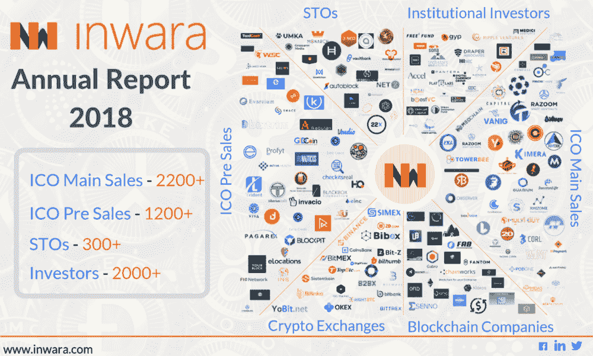](https://www.inwara.com/report/annual-report-2018)

Source: InWara’s Annual Report

免责声明:这不是财务建议。更多详情请访问 [*条款与条件。*](https://www.inwara.com/disclaimer)

> [下载完整的 40 页年报](https://www.inwara.com/report/annual-report-2018)

随着 2017 年前所未有的牛市停止，Cryptomarket 有了一个戏剧性的开始，仅在 1 月份的一个月内，总市值就损失了 60%以上。此外，2018 年随着加密市场的下行趋势变得更加悲观。从光明的一面来看，加密市场正在走向成熟阶段，超过 FOMO 和 FUD 阶段。

InWara 的研究涵盖了 ICO 和 STO 宇宙中的这些重要趋势。这项研究进一步提出了对密码市场的务实观点，根据专家的说法，密码市场将在明年做出一些重大举措。

*InWara 提供基于机构级 ICO/VC 数据的深刻分析，为零售和机构投资者提供该领域当前趋势和发展的清晰评估。*

这项研究涵盖

*   ICO 景观
*   STO 景观
*   2018 年加密货币市场趋势分析
*   ico 和区块链公司的私人融资活动
*   ico 和区块链公司的并购

> [下载完整的 40 页年报](https://www.inwara.com/report/annual-report-2018)

# ICO 景观 2018

## 美国引领加密空间

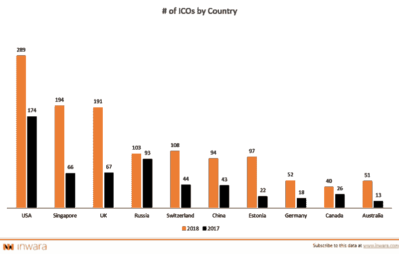

[Source: InWara’s Annual Report](https://www.inwara.com/report/annual-report-2018)

美国以 60%的 ICO 数量(同比)保持领先地位。有趣的是，英国和新加坡的 ico 数量同比增长超过 180%。随着新加坡位居第二，中国在 2018 年的增长超过 100%，亚洲市场展示了密码的美好未来。

## 金融服务继续在 ICO 领域占据主导地位

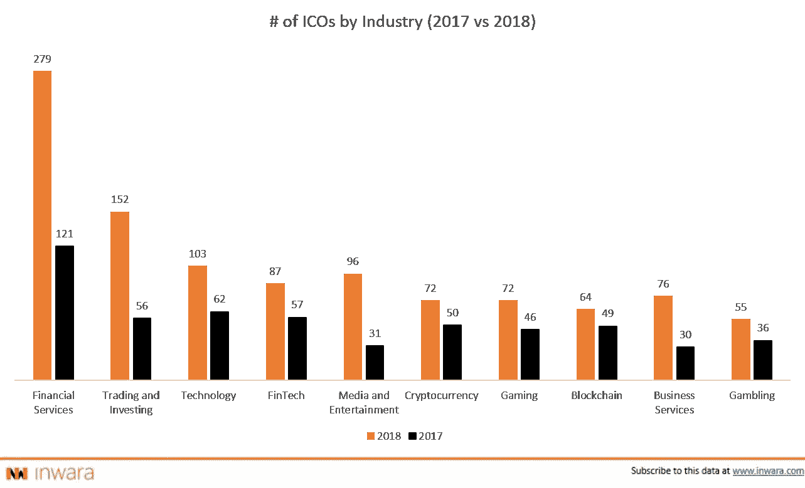

[Source: InWara’s Annual Report](https://www.inwara.com/report/annual-report-2018)

金融服务仍然是 2018 年最受欢迎的行业，从 2017 年开始，ico 的数量增长了 130%以上。随着多个基于加密的基金在 2018 年涌现，媒体和娱乐行业出现了显著增长。

## 2018 年 ICO 上市受挫

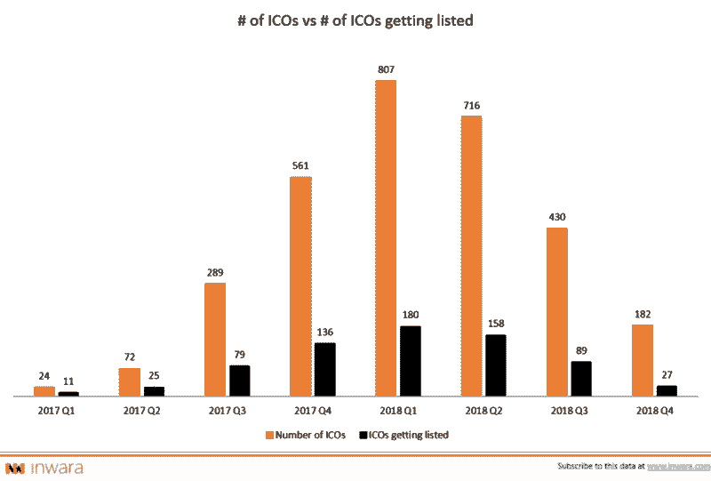

[Source: InWara’s Annual Report](https://www.inwara.com/report/annual-report-2018)

在交易所上市的 ico 数量大幅下降，2018 年上市的 ico 不到 20%。2018 年第四季度，只有 15%的 ico 在交易所上市，这对投资者来说是一个严重的问题，因为他们可能会被代币困住，没有流动性。

# 斯托斯景观 2018

## 安全令牌产品(sto)在 ico 减少的地方悄然兴起

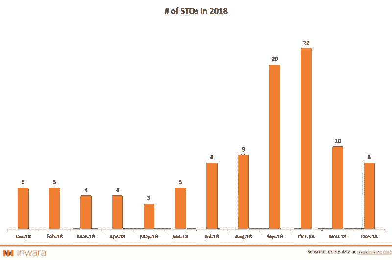

Source: InWara’s Annual Report

安全令牌(sto)本质上是受联邦法规和法规约束的可交易资产。总的来说，投资者希望 s to 能带来更好的投资回报，同时降低长期风险。

安全令牌获得了超过 ico 的势头，尤其是在法规遵从性问题得到监管机构(如美国的 SEC 和韩国的 FSC)积极解决的情况下。SEC 严厉打击欺诈活动(如 Paragon 和 Airfox ),并警告计划通过数字代币筹集资金的严肃玩家。总的来说，投资者信心的削弱促使投资者更喜欢 sto。

## 按行业划分的 sto 数量

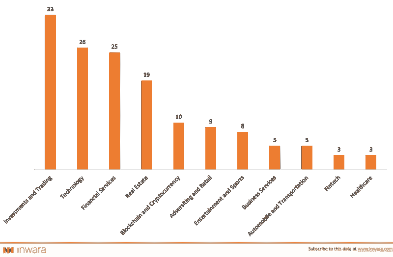

[Source: InWara’s Annual Report](https://www.inwara.com/report/annual-report-2018)

投资和交易占代币发行的 20%以上。在 ico 中领先的金融服务现在排在科技之后，位居第三。

> [下载完整的 40 页年报](https://www.inwara.com/report/annual-report-2018)

# 2018 年加密货币市场趋势分析

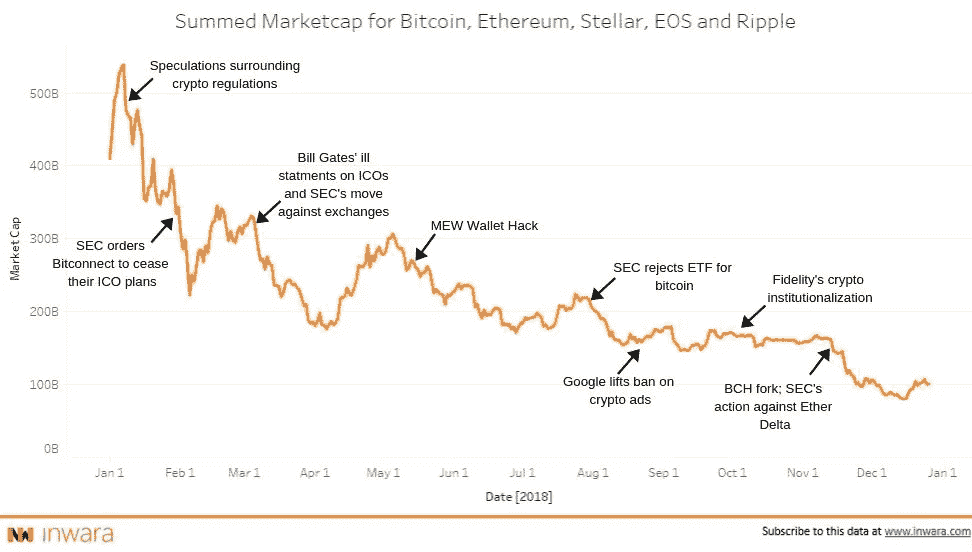

[Source: InWara’s Annual Report](https://www.inwara.com/report/annual-report-2018)

这份长达 40 页的报告涵盖了对每个事件的详细分析。

# ico 和区块链公司的私人融资活动

## 私人投资回合遭遇加密风暴

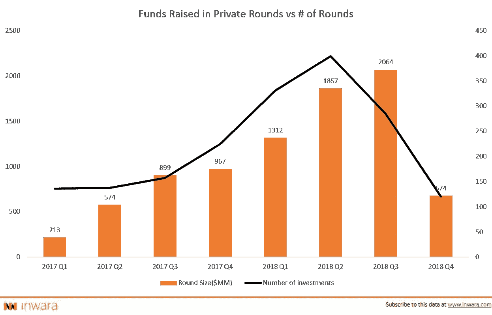

Source: InWara’s Annual Report

2018 年第四季度，融资额下降了 65%以上，风投和机构投资者在这场市场熊市中后退了一步。然而，私人融资在 2018 年出现了显著增长，融资总额比 2017 年翻了一番。

## 现有的玩家随着恐惧的到来而离开。

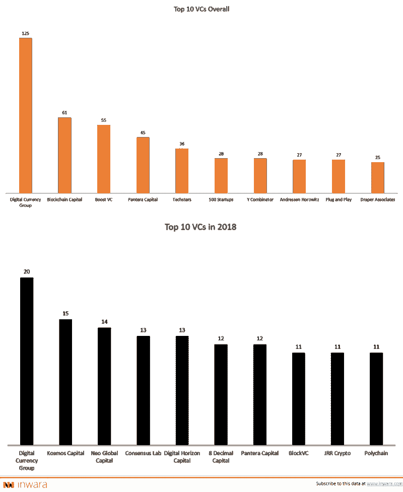

[Source: InWara’s Annual Report](https://www.inwara.com/report/annual-report-2018)

即使在低迷的 2018 年市场，数字货币集团也一直保持着投资的一致性，而所有其他人都喘了口气。然而，2018 年出现了一些新的进入者，如 Kosmos Capital、Neo Global Capital 和 more 对 cryptos 的投资。

积极的方面包括，几乎所有的参与者都在 2018 年筹集了以加密为重点的资金，并吸引了金融市场上最优秀的人才。

# 并购活动激增

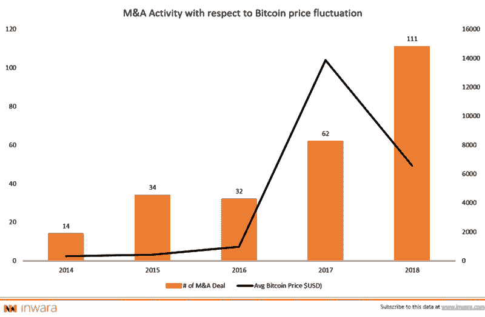

[Source: InWara’s Annual Report](https://www.inwara.com/report/annual-report-2018)

2018 年，加密和区块链相关的并购数量激增 90%以上。这种大幅上涨归因于比特币的崩溃(T2 BTC T3)，比年初低了 50%以上。

风投、机构投资者和资金雄厚的实体将熊市视为押注未来技术的机会，这些技术可能会让银行破产。

## 年度最佳交易

Circle 是一家采用区块链技术的公司，其愿景是让比特币更容易获得，该公司于 2018 年 2 月以 4 亿美元收购了最大的交易所之一 Poloniex。

通过收购 Poloniex Circle，我们期望解决与可靠性相关的问题，并增强现有的可扩展性，从而提高平台的健壮性。

这份执行摘要仅提供了完整的 40 页年度报告的 15%的分析。点击此处获取 InWara 年度报告的优先版本。

> [下载 40 页完整年报](https://www.inwara.com/report/annual-report-2018)

[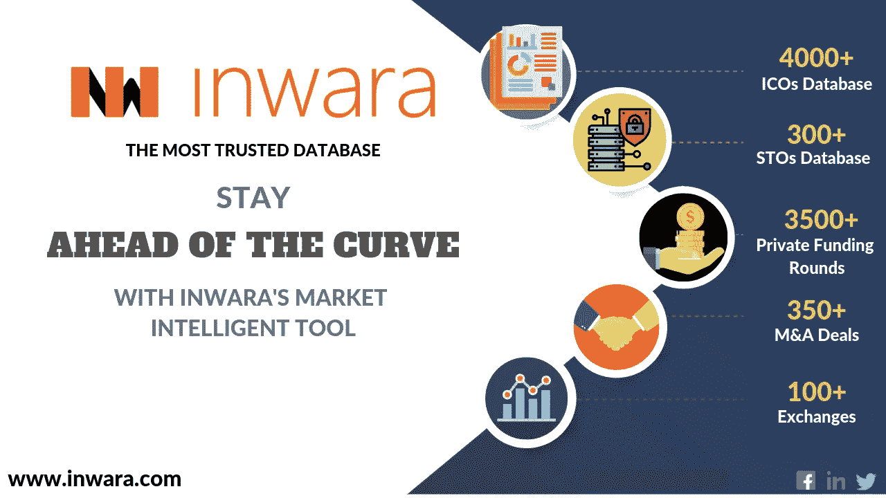](https://www.inwara.com/report/annual-report-2018)