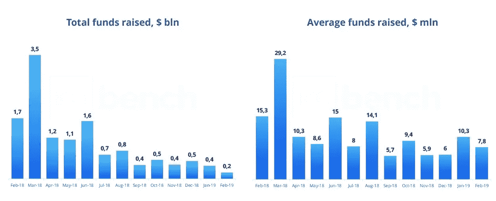
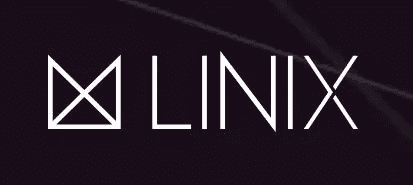
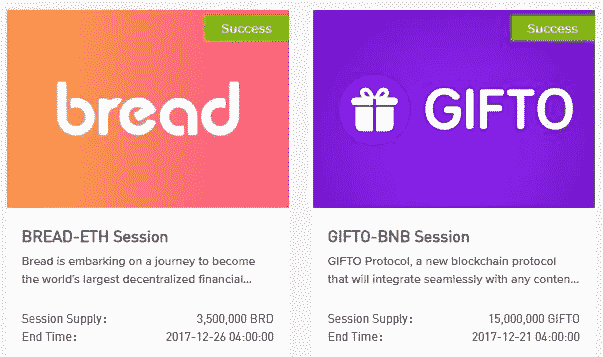
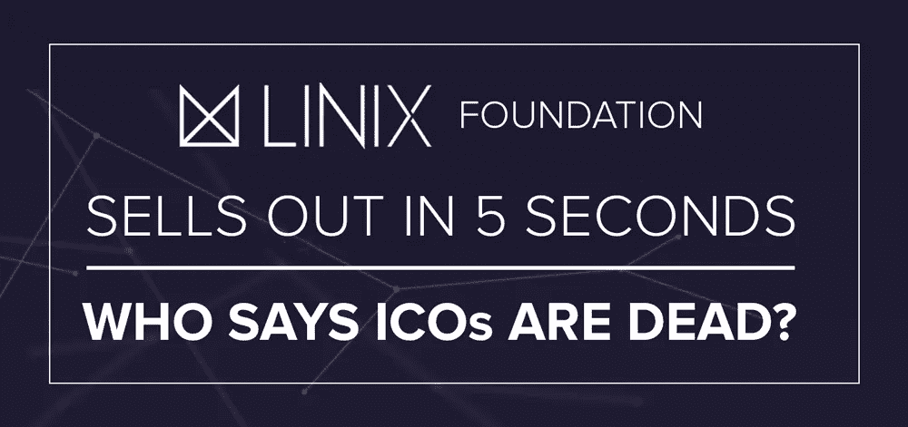

# 谁说 ICOs 死了？它没有死，它在进化。

> 原文：<https://medium.com/hackernoon/icos-arent-dead-theyre-evolving-linix-5-second-ieo-5fd3f6c4ebfc>

# IEO 的连胜还在继续:LINIX 在令人兴奋的五秒钟内售罄。与此同时，ico 继续下滑。

通过 ico 筹集资金的传统方法无疑变得越来越没有吸引力。事实上，自 2018 年 3 月以来，通过传统 ico 筹集的资金一直在稳步下降——数字不会说谎。

Courtesy of ICOBench: Funds Raised Through ICOs the Past Year

散户投资者对 ico 兴趣的急剧下降，迫使项目以各种方式调整和重塑其筹资技巧。月球数字资产公司的 ICO 专家注意到了以下几个趋势:

*   项目无限期推迟众筹日期，直到市场开始看涨
*   推迟众筹日期并显著延长众筹期的项目
*   完全跳过众筹销售、私下筹集资金的项目
*   将目标上限降低到更合理水平的项目

然而，有一种新形式的“ICO”席卷了市场——IEOs。令人惊讶的是，他们做得非常好。

# IEOs 的兴起:什么，为什么，在哪里？

IEOs，或者说“初始交易”并不是一个全新的概念；事实上，它们已经存在一年多了。从本质上讲，ieo 是项目通过授予交易所出售其代币的独家经营权来筹集资金的一种方式，在许多情况下，这些代币很快就开始交易。

虽然 ieo 通常比我们都熟悉的传统 ico 的上限小得多，但它们可能会有多个回合，很快销售一空。当我说快时，我指的是快。尽管 ico 的募集期现在平均超过 3 个月，但 ieo 往往在几分钟、几小时甚至几秒钟内售罄，正如我们在 [LINIX](https://linix.foundation/) 看到的那样，这是一个总部位于韩国的项目，号称是“世界上第一个注入 DAG 的区块链”他们的网站声称通过一种新的共识算法，检查和平衡证明(PoCB)，具有无限的 TPS 可扩展性，近即时确认和强大的安全性。

独立董事越来越受散户投资者的欢迎，对他们越来越有吸引力。没有必要等 6 到 12 个月才能收到你的代币，更不用说可以随心所欲的转让了。ICO 智能合约已经变得越来越复杂，包括锁定期、令牌冻结、授权时间表等。未来市场条件的不确定性是一个主要问题，还有不确定的交易所上市。有了 IEOs，散户投资者最关心的两个问题马上就解决了。他们确切地知道代币什么时候开始交易，在哪里交易。

# 币安发射台最初被认为是失败的

币安 Launchpad 显然是最令人垂涎的一个项目，以推出他们的令牌；然而，情况并非总是如此。2017 年 12 月，币安推出了 GIFTO 协议(GTO)和面包(BRD)的令牌，两者都在令人印象深刻的时间内售罄:ETH 会议在 98 秒内完成，GIFTO 的 BNB 会议在 131 秒内完成，面包在 116 秒和 216 秒内完成。

这两种代币最初的交易价格都达到了其 IEO 价值的大约 5 到 10 倍，但实际上在发行后几周交易价格就低于了最初的价格。到 2017 年底——2018 年初的标准，他们被视为失败。我们必须把自己放回到那个时期去理解；ico 做 10-100 倍并保持其价值并不罕见(当然，在随后的熊市中，它们也失去了价值)。不出所料，币安 Launchpad 已经悄然隐退，而 ICO 依然称王。币安花了超过 15 个月的时间推出了他们的下一个 IEO :创造轰动效应的 BitTorrent (BTT)令牌，目前的交易价格约为其最初价值的 5 倍。

# IEOs:比币安大；快速增长的现象

当币安的 Launchpad 还躲在暗处的时候，IEO 的开始在中国和朝鲜流行起来。事实上，越来越多的交易所已经成功地进行了 IPO:coin bene，Gate.io，Coinsuper，ProBit，BitMax，还有更多的交易所已经看到了 IEO 的成功。现在，“大男孩”正在 FOMO 进入 IEO 热潮，OKEx、Huobi，甚至 Bittrex 等交易所都在寻求推出自己的代币。

出乎所有人意料的是，引起业界关注的最令人印象深刻的交易所是 [BitMax 交易所](https://bitmax.io/)。BitMax 引入了“反向开采”的概念，为做市商提供了一个单独的激励结构，为其许多交易对推出了高达 10 倍杠杆的保证金交易，并对项目进行了大量推广活动。结果呢？持续的高性能 IEO 发布和超过 35 亿美元的每日报告交易量(尽管这个数字在调整后变得小得多——另一天的另一个主题)。问题是，BitMax 的模式可持续吗？只有时间能证明一切，因为我们看到交易所的交易量一直在波动(还记得 Poloniex 是排名前三的交易所吗？).

总部位于韩国的实体 ProBit 是另一个表现令人印象深刻的交易所，现在已经连续三次售罄:Spin Protocol(第一轮 3 分钟)，CLINK(第一轮 140 分钟)，以及昨天的 IEO 与 LINIX(第一轮 5 秒)。

# IEOs 能重振区块链筹款吗？

环顾四周，闻闻咖啡的味道——它已经开始复兴那些不寻求通过一个只有白皮书和网站的 ICO 筹集荒谬的 5000 万美元的项目。对于散户投资者来说，这种新的融资形式更快、更容易(也更安全，因为交易所有其尽职调查程序)，对于项目来说更容易(因为它们将 KYC/反洗钱合规责任移交给了交易所)，而且它正在以令人兴奋的速度增长。

在某种程度上，这是公平的竞争环境，因为币安不再是唯一的“热门”交易所。就在几个月前，在我们从未听说过的交易所上市的项目正在击败熊市，并公布令人印象深刻的收益。

sto 是排他性的，受制于长期的锁定期和 SEC 非常严格的规定，并且没有可以自由交易的交易所。我从来不热衷于 sto，因为它违背了加密货币的许多价值和去中心化运动。不过，我还是欢迎 sto，因为他们肯定会给这个领域带来更多机构资金。

但是现在让我们诚实一点。独立评价办公室更有吸引力，更令人兴奋，也更不排外。我看到了 IEOs 更光明的未来。欢迎来到秘密筹款的新时代。