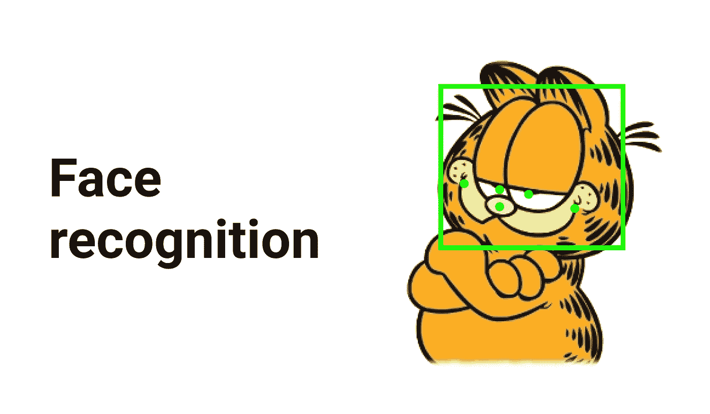
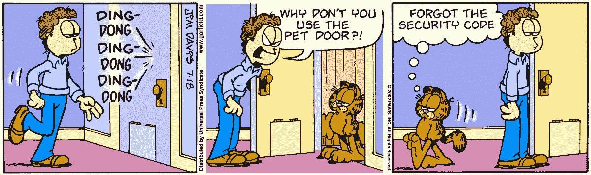
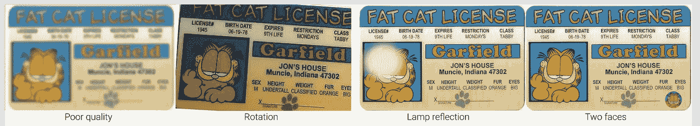
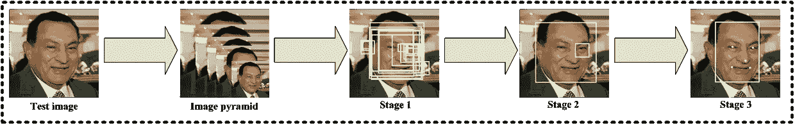
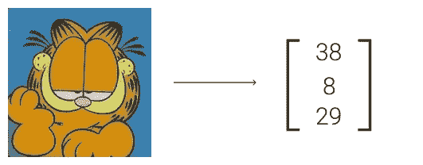

# 具有深度学习的身份验证管道

> 原文：<https://medium.com/hackernoon/id-verification-with-deep-learning-7bae0a5dffd8>

*作者格里戈里·伊万诺夫，* [*波特哈实验室*](https://potehalabs.com/) 的计算机视觉研究员兼工程师

无论您是一家努力吸引更多客户而不强迫他们访问分行的银行，还是一家需要优化安全区域访问的大型政府机构，您都可能希望将身份验证服务作为您系统的一部分，也称为 KYC ( [了解您的客户](https://en.wikipedia.org/wiki/Know_your_customer))。

除了拥有使您成为“高科技”公司的尖端功能之外，自动身份验证还可以用于许多方面。首先，它允许自动登记，从而减少工作人员的费用。其次，由于速度和方便，它可以导致新用户流量的增加。

此外，它可以安装在检查站，以便只为通过验证的人开门。最后，该系统将几乎消除疏忽、缺乏安全防范等人为因素的影响。

[Image credit](https://garfield.dale.ro/garfield-2002-july.html)

由于深度学习，今天最简单的验证技术之一是人脸验证。例如，可能的服务可以将 ID 文档和自拍作为输入，并返回包含在这些照片中的两张脸的“平等分数”的值。其中一个这样的系统是中国的 DocFace [1]:它实际上执行我们正在努力的一切，并成功地用于检查站的自动护照控制。因此，接下来在这篇文章中，我们将描述如何使用开源项目实现一个类似的系统 **1)** 并且 **2)** 有一些可用的训练数据。

## **问题陈述和警告**

首先，让我们修正并讨论问题陈述。

*   给:两张照片。身份证件(或任何其他用于证明身份的证件)照片一张，自拍照一张。为了简单起见，我们将考虑只包含一张脸的图像。
*   找出:给定照片中的人脸是否属于一个人。

这个看似简单的问题有很多陷阱。如果训练数据集由低质量的照片组成会怎样？或者如果一些图像被翻转或旋转了呢？如果灯光或闪光灯反射到脸上怎么办？

另一个例子是当文档的照片包含多个面部时:主面部，其应该用于识别，而另一个面部作为水印。

一个更重要的警告是，护照照片的人脸分布与自拍不同。这同样适用于名人照片(这些人脸通常用于训练现代开源神经网络)。

上面列出的一些问题不需要收集自己的数据集就可以解决。然而，有一些在我们的限制范围内相当复杂(最后两个)。由于只考虑使用开源项目，我们现在将跳过它们(可以通过收集额外的数据并使用自拍和护照的独立模型来解决这些问题，共享一些权重，如[2]中所述)。

## **用于个人验证的典型深度学习管道**

现在让我们转向开发步骤。最简单的人脸识别验证流程如下:

1.  检测图像上的人脸。
2.  计算人脸的描述符/嵌入。
3.  比较描述符。

因此，我们将处理和描述每个块。

## 人脸检测

人脸检测算法有很多: [Haar cascades](https://en.wikipedia.org/wiki/Haar-like_feature) (在 [opencv](https://docs.opencv.org/3.4.1/d7/d8b/tutorial_py_face_detection.html) 和 [dlib](https://github.com/davisking/dlib) 中有流行的实现)，基于 [HOG 的检测器](https://www.learnopencv.com/histogram-of-oriented-gradients/)和[神经网络](https://towardsdatascience.com/how-does-a-face-detection-program-work-using-neural-networks-17896df8e6ff)。

一方面，经典方法通常速度快，但不如基于 DNN ( [深度神经网络](https://en.wikipedia.org/wiki/Deep_learning#Deep_neural_networks))的技术准确。另一方面，DNN 在计算上很昂贵，直到最近才开始使用，但是现在这些缺点正在被积极地消除。

我们最喜欢的深度学习算法之一是**mt CNN**【3】。在其他 DNN 方法中，它快速、简单且准确。它检测 5 个人脸的标志:眼睛，嘴角和鼻尖。这些点然后被用来旋转和缩放面，以便我们比较的所有面都在相同的方向。

[Image credit](https://kpzhang93.github.io/MTCNN_face_detection_alignment/index.html)

基本上，MTCNN 由三个小的神经网络组成。第一个会产生很多提议:可能包含人脸的区域。然后第二个过滤掉大部分。最终，第三个网络改进预测并回归面部的标志。为了在多个尺度上检测人脸，该算法在原始照片的尺寸调整版本的金字塔上运行。

为了变换面部，使它们处于相同的方向，可以使用“正常”面部的预定义点，然后从检测到的面部估计相似性变换(例如，使用`[skimage.estimate_transform](http://scikit-image.org/docs/dev/api/skimage.transform.html)`)。

我们选择使用一个很棒的 tensorflow 实现[4],它像 python 包一样容易使用。

## 面部嵌入

这是管道中最重要的阶段。在这个过程中，我们需要“数字化”每张脸——用数字向量(或描述符，嵌入)来描述它，这样一个人的脸就会有相似的嵌入(在某种意义上)。相反，不同人的面部描述符应该彼此远离。有很多方法可以获得嵌入，目前最有效的还是基于神经网络的方法。

Garfield’s got a rather simple face embedding

一个流行的机械解决方案是使用**余弦相似度**来比较球体上的嵌入(更多细节见【5】)。只需谷歌一下*‘sphereface pytorch’*并选择第一个链接，我们就能看到其中一个模型的 py torch 实现([6])。我们将只需要 sphere20a 类和模型的重量。

这里有几个不明显的技巧，我们用来解决上面**问题陈述**部分描述的问题。首先，我们应该如何检测‘坏脸’？人脸可能被遮挡，在恶劣的光线条件下拍摄，或者位于远离相机的位置，因此其分辨率较低。事实证明，计算嵌入的范数就足以将低质量的图像与好的图像分开。

让我们描述一下这背后的直觉。该模型是在名人脸部的高质量照片上训练的，因此每张脸的嵌入可以描述图像中每个特征的“存在”，其中我们所说的特征是指任何矢量分量。这些成分可以代表眼睛的颜色、肤色等。图像中“存在”的特征越多，矢量分量的值就越高。但是如果没有脸或者是在恶劣的条件下拍摄的呢？那么就没有特色，每个组件都得低分。因此，描述符的最终范数会很低。

我们推荐的另一个技巧是**为每张脸加上两个描述符**:原始脸和翻转后的脸。它提高了系统的准确性，并解决了图像翻转的问题。

## **比较描述符**

如前所述，我们使用余弦相似度来比较两张人脸的向量。这个函数实际上将两个向量映射到[-1，1]区间。所以，我们最后的问题是选择比较阈值。最好的方法是让你的朋友和同事给他们的文档自拍和拍照(实际上不太容易做到)，然后把它们作为验证集。这里有一个折衷:在错误接受率(FAR)和错误拒绝率(FRR)之间。阈值越高，FAR 越低，但 FRR 越高，反之亦然。这里我们唯一想强调的是，门槛通常取决于客户需求。

假设我们已经设法了解到，从一百万对不同的人中错误地接受一对“身份证——自拍”是可以接受的。那么我们的任务就是最大化 FRR@FAR=1e-6。即，在给定 FAR=1e-6 的阈值的情况下最大化 FRR。

## **结果**

我们简要讨论了以下主题:

*   设计人脸验证系统的典型问题及其解决方法。
*   人脸检测和对齐。
*   面孔嵌入及其比较。
*   评估身份验证的标准。

我们的真实数据集太小，无法对我们创建的系统做出任何精确的结论。但这种类型的数据不容易收集(有时甚至是合法的)。所以，如果你只是想用着玩玩，可以和现在的性能相处。为了进一步提高质量，您可以尝试联系您的政府服务部门以获取更多的 face id 数据集。

## 结论

总之，我们已经描述了一个仅由开源组件构建的易于实现的人脸 id 验证管道。接下来我们能做什么？下一个合乎逻辑的步骤是识别 ID 的文本信息，这样我们可以更加自动化注册过程。显然，有许多文本识别方法，我们将在下一篇文章中介绍其中的一种。

## **参考文献**

1.  [DocFace](https://github.com/seasonSH/DocFace)
2.  [DocFace+:与自拍匹配的 ID 文档](https://arxiv.org/abs/1809.05620)
3.  [MTCNN](https://kpzhang93.github.io/MTCNN_face_detection_alignment/index.html)
4.  [mt CNN 的 Tensorflow 实现](https://github.com/ipazc/mtcnn)
5.  [NormFace](https://arxiv.org/abs/1704.06369)
6.  [PyTorch 实现 SphereFace](https://github.com/clcarwin/sphereface_pytorch)

**感谢您的阅读！请向我们提问，留下您的评论，敬请关注！在**[**【https://potehalabs.com】**](https://potehalabs.com)找到我们