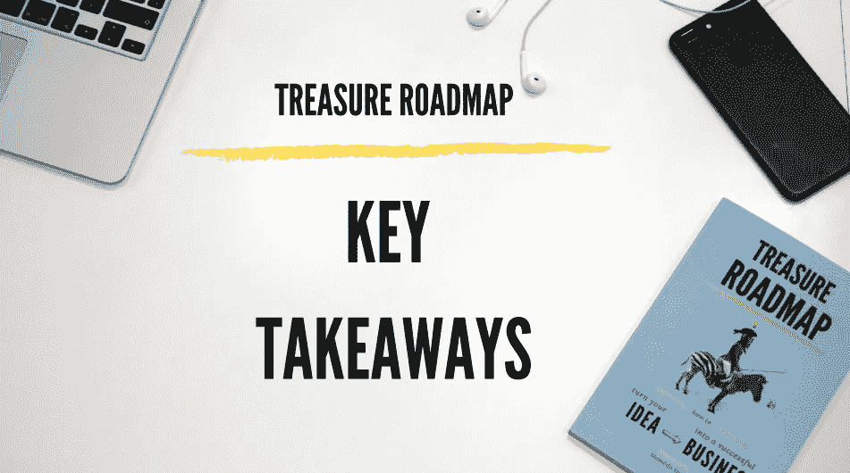

# 想法溢出和邻近的可能性

> 原文：<https://medium.com/hackernoon/idea-spillover-and-adjacent-possible-98799ee1ddab>

创新的历史是当时看似愚蠢的想法的故事。—安迪·邓恩

Artwork from the [book](https://treasureroadmap.com/) cover: Treasure Roadmap — How to turn your idea into a successful business

我们都知道灯泡时刻。突然间一切都变得清晰明了。一个想法已经诞生，现在看来是如此明显。但是这个想法是如何实现的呢？

一个想法是你大脑中神经元的新集合。这是一个前所未有的突触序列。为了刺激这种新的组合，你必须把自己放在一个富有成效的环境中。本质上，神经元集合是一个网络。当你置身于人际网络之中时，神经元网络会得到更好的刺激。我们的大脑似乎遵循这种网络模式。如果你和以前从未交谈过的人交谈，更有可能的是，对话会产生全新的突触轨迹。这会引导你到一个新的观点，一个新的视角，这将会打开你以前从未想过的可能性。以咖啡店为例。这个地方在产生[想法](https://hackernoon.com/tagged/ideas)方面极其富有成效。首先，咖啡是一种兴奋剂，它会使你的大脑清醒。第二，你处在一个全新的物理环境中，这打破了你的日常模式。第三，也是最重要的，你有一家公司。一个可以交流的人，一个会倾听你的想法并分享他们对这个话题的观点的人。你听到的一些事情可以打开新的可能性，并改善你头脑中已经形成的想法。我的观点是，将想法联系起来要比保护想法好得多。这样，你可以在最初想法的基础上，创造更大更好的东西。

# 创意溢出

知识溢出或思想溢出是个体之间的思想交流。这种溢出效应刺激了技术和经济增长。知识溢出的一个例子可能是与社交网络平台发展相关的集体增长。这些平台为用户创造了各种新的软件、新的市场和利益，而这些都是最初没有预料到的。这些概念上的突破延续了整个行业的发展。作为一个小型的利基平台，它打开了一扇门，让无限的可能性传播到它所起源的行业之外。今天，溢出效应使媒体公司获得了更多的受众，营销人员接触到了更多的客户，顾问接触到了更多的客户。

知识溢出有两种:内部和外部。同一主题的组织内个人之间知识改进的积极影响是内部知识溢出。它可以在一个单一的行业中实现增长。另一方面，当一个行业内知识的这种积极影响影响到生产组织之外的个人，并使增长超越知识起源的行业时，外部知识溢出就发生了。内部知识溢出创造了行业内的专业化。另一方面，外部知识溢出能够实现更大规模的增长，影响更多的个人和行业。它不会在相邻的行业内创造专业化，它只是将专业化提升到另一个层次。

另一个需要考虑的点是[创新](https://hackernoon.com/tagged/innovation)的地理位置。想法在当地被分享，接近源头是非常重要的。知识溢出有两种类型，与溢出的地理位置有关:专业化产业的邻近和一般知识的邻近。

专业化行业或共同行业的邻近性通常会影响知识在公司之间传播的程度，从而促进创新和增长。思想交流主要是员工之间的交流，来自同一行业不同公司的员工就新产品和生产商品或提供服务的新方法交流思想。事实上，专业化、地理上集中的行业的知识溢出刺激了增长。本地竞争促进了对创新的追求和快速采用。交流思想的机会带来了新产品和改进的生产方法和框架。一个很好的例子是企业孵化器或创新园。

一般知识的接近程度会影响知识在不同行业的公司之间传播的好坏。这种不同的接近汇集了具有不同观点的个人之间的想法。这鼓励讨论，并通过将旧的工具和方法用于新的用途来促进创新。不同行业的员工之间正在进行思想交流，一个领域的创新可能会为另一个完全不同、看似不相关的领域的创新打开大门。

# 相邻的可能

那个看似不相关的领域可能会帮助你改进你的想法。在史蒂文·约翰逊的畅销书《好主意从何而来:创新的自然历史》中，他解释说，大多数创新实际上并不是灵感的辉煌时刻。相反，它们是自然的结果或进化或其他现有的创新以新的有趣的方式相互结合。他优雅地解释道:

“邻近的可能性是一种影子未来，徘徊在事物现状的边缘，是一张现在可以重塑自我的所有方式的地图……[邻近的可能性]抓住了变化和创新的限制和创造潜力。” —史蒂文·约翰逊

相邻的可能性可以被看作是历史的逆过程，我们越往未来发展，它的可能性就越大。然而，由于目前的限制，向前迈进的每一步，可能性的数量都在缩小。

对知识溢出的再思考。来自不同行业的每一个想法都可以与你自己行业的另一个想法结合，使之成为一个成功的组合或发明。同样，每一个新的组合都开启了其他新组合的可能性。因此，当你探索新的想法并尝试它们时，你为自己和你的直接同事打开了新的可能性。

我能想到很多例子。比如移动应用。史蒂夫·乔布斯首先展示了这个想法，触摸屏上几幅缩略图大小的图像展现了一幅创新的图景，而这在不久前还只是科幻小说。这个想法简化了移动电话领域硬件和软件开发的未来。

回到你，在个人层面上，每次你阅读或创造新的东西，你都在刷邻近的可能性。它打开了新的大门，让你能够创新。请记住，你的发明和创新实际上是打开他人邻近可能性的钥匙。通过这种方式，你消除了无数以不同方式解决问题的可能性，从而简化了你和你周围人的未来。

# 如何激发一个好的想法？

允许思维从一个环境转移到另一个环境会迫使你从不同的角度处理同一个问题。浏览不同的主题并有广泛的兴趣是很重要的，因为想法可以从完全不相关的背景中激发出来。浏览印刷报纸就是一个很好的例子。报纸有助于意外发现，因为找到你感兴趣的话题需要浏览其余的页面。一些无关的标题可以抓住你的注意力，给你一个好主意。这里有几个想法来打开相邻的可能性:

1.多读书

书是最接近下载别人经验的东西。阅读一本书可以开阔你的视野，给你新的见解，激发你的思考。虽然你离书作者很远，但读书让你离知识溢出很近。如果你阅读与你的行业相关的书籍，这就相当于专业行业的邻近和知识溢出。另一方面，你可以通过阅读一个完全不相关领域的书来刺激你的思维。通过这种方式，你可以模仿一般知识的接近程度，并从思想溢出中受益。

2.与你正常圈子之外的人交往

和你正常圈子里的人混在一起会让你进入同样的思维循环。你可以利用 LinkedIn 上的所有关系，开始一些激动人心的对话。新人不知道你所有的思维模式和老故事。反之亦然。你可以从一个完全陌生的人那里听到一些新鲜的见解。令人耳目一新的观点将有助于展现新的想法，并可能将他们的想法与你自己的想法结合起来，做出一些伟大的东西。

3.锻炼你的创造力

提高创造性思维的最好方法之一就是尝试。说真的。研究表明，当人们试图更具创造性地思考时，他们几乎总能做到——而且这些效果既显著又可重复。这个想法是，你用你的大脑做的事情越多，相关细胞之间的联系就变得越强。试着引入一种日常生活方式，这样你就可以摆脱社交媒体和电子邮件等干扰。我喜欢称之为“十种方法……”惯例。强迫你的大脑思考十种方法来改善这个，十种方法来解决那个，十种方法来破坏那个。思考一个以上的解决方案会迫使你以不同的方式思考。你想到的第一个解决方案来自于你平时的思维方式。强迫自己去想越来越多的解决方案会让你用新的和创新的方式思考。

4.注意新的想法

白天，我们接触到如此多的信息和新思想。我们获得的信息越多，捕捉到的信息就越少。信息超载使我们达到饱和。为了克服这个问题，开始捕捉有趣的想法。你不一定需要马上评估每个想法，但是把它写下来是很重要的。如果你刚好有笔和纸，那就更好了。当你用手写字时，你的大脑会捕捉到这个想法。大脑参与了写作过程，这个想法很可能会被记住。你可以在方便的时候重新考虑这个想法。当与你自己的想法结合时，这些想法中的一个可能会成为一个突破。

5.混合搭配

通常，一个新想法是来自一个看似不相关的领域的两个独立想法的结合。您可以通过创建两个类别并尝试将它们混合在一起来强制实现这一点。比如列出十个平台，十个商家。然后，尝试将它们一一匹配。换句话说，探索某个业务在某个平台上的生存能力。也许它已经存在，但也许你会混合一些看不见的东西。这可能会照亮通往尚未开发的新市场的道路。

# 已经有主意了？

学习如何将你的想法转化为成功的业务。

我的新书为你提供了创建成功企业整个过程的全面指导。它旨在为你展示整个[商业计划](https://treasureroadmap.com/)，让你的开始变得更加容易。整个过程归结为它的要点，使步骤简单易懂。

如果你遵循我在这本书里揭示的公式，很有可能你可以通过把一个[想法变成一个成功的商业](https://treasureroadmap.com/)来谋生。

 [## 宝藏路线图-如何把你的想法变成一个成功的企业-企业家的最佳书籍…

### 如果你选择遵循我在这本书里揭示的公式，很有可能你可以通过转行谋生…

treasureroadmap.com](https://treasureroadmap.com/) 

点击下面的图片获取您的免费图书摘要:

