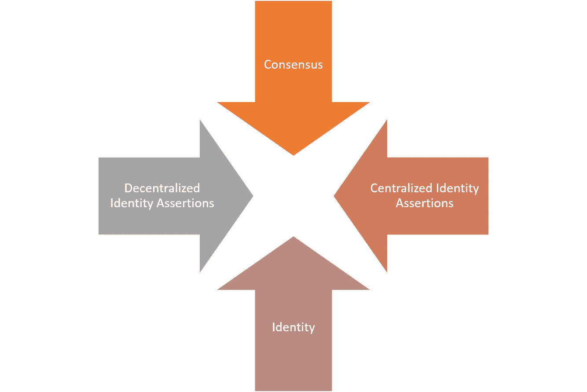
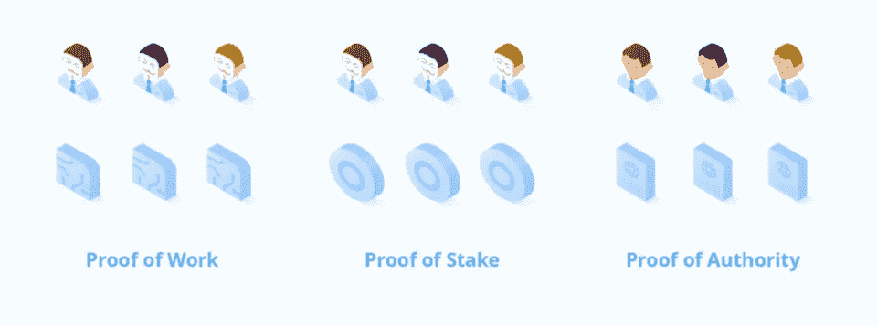
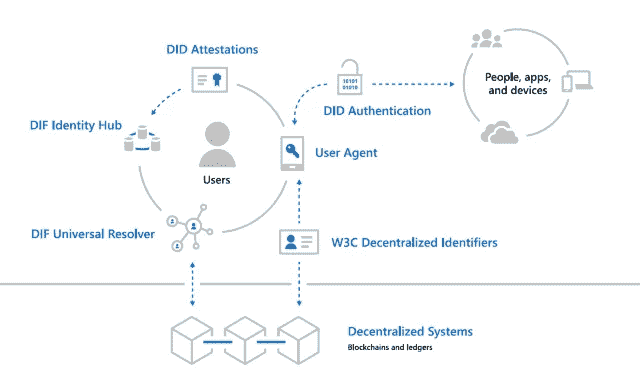

# 身份:企业区块链室里的大象

> 原文：<https://medium.com/hackernoon/identity-the-elephant-in-the-enterprise-blockchain-room-6f31ed8d4132>

在企业中采用许可的区块链技术是一条充满挑战的道路。基于分散式分类帐的所谓 Web3 堆栈对于支持复杂的企业业务流程来说还不成熟。在企业区块链平台缺失的构建模块中，身份成为新一代企业解决方案无处不在的挑战之一。在 [Invector Labs](http://invectorlabs.com/) ，我们经常面临在许可的区块链解决方案中启用身份管理功能的挑战。因此，我们对企业区块链解决方案的身份层的关键功能和模型有了一些想法，我将在本文中对此进行概述。

在过去五年中，随着新一代技术的出现，身份管理领域经历了一次复兴，这些技术从复杂的系统(如 CA 或 Microsoft Active Directory)过渡到更加开放的 API 驱动的平台(如 Okta、Ping Identity、One Login)以及云平台(如 AWS、Azure 或 Google Cloud)中的相应堆栈。这些平台将身份功能从专有系统转移到开放协议，如 SAML、OpenID Connect 等。然而，这并不意味着企业身份管理技术简单易用。恰恰相反，随着身份功能的发展，身份管理解决方案需求的复杂性也随之增加。如果看看企业中当前的身份管理体系结构，有几个特征值得强调:

**基于集中式身份提供者:**企业身份管理解决方案通常依赖于集中式身份提供者，它们接收某种形式的用户凭证作为输入，并输出身份令牌。

**基于身份协议:**目前，很大一部分企业身份管理解决方案利用 SAML、OAuth2 等协议进行交互。

**细分:**企业环境中的用户身份分布在不同的业务线系统或用户目录中。因此，不同的应用程序倾向于与用户身份的不同表示进行交互。

# 在许可的区块链实现身份认同的基本摩擦

将所有这些放在一起，我们可以看到这样一幅画面:企业中用户的身份分布在许多系统中，但由中央身份提供者强制执行。当谈到身份时，在企业系统的当前架构和区块链技术的宇宙之间有两个基本的摩擦需要解决。

共识与认同

集中式与分散式身份断言

## 共识与认同

在许可的区块链场景中启用身份管理功能不仅仅是一个技术挑战，还会与分散层的一个基本原则产生冲突。区块链技术公司最大的贡献是，在计算机科学的历史上，我们第一次有了一个模型，在这个模型中，我们可以信任数学和密码学，而不是中央集权的政党。以该原则为基础，区块链体系结构基于共识协议(如工作证明(PoW)或利益证明(PoS ))而发展，这些协议依赖于计算来做出决策。在这个去中心化的世界里，身份已经不再是一个基本的构建模块，因为网络的动力应该达到一个最佳的决策过程。

区块链堆栈基于计算的共识模型与参与者身份众所周知的企业解决方案形成了根本的对比。从这个意义上来说，你可以说共识协议在一个身份已知的世界里没有什么作用。

## 集中式与分散式身份断言

企业身份管理系统的当前架构依赖于集中式网守来创建关于用户身份的断言。将该模型与分布式分类帐体系结构相协调绝非易事，在分布式分类帐体系结构中，断言将分布在一个参与者网络中。理想情况下，我们需要一种模型，在这种模型中，身份断言以加密的方式进行链上编码，并分发到相关的网络实体。

# 在许可的区块链，分散身份的基石

为了解决前一节中列出的一些挑战，我们发现有几个技术组件与许可的区块链架构非常相关。

## 授权证明

权威证明(PoA)是一种基于一等公民身份的共识机制。在 PoA 网络中，共识是通过引用一系列验证者(当它们与物理实体相关联时称为权威)来实现的。验证者是一组被允许参与共识的账户/节点；他们验证交易和冻结。PoA 不需要解决计算量大的难题来提交事务。取而代之的是，交易只需由大多数验证人签字，在这种情况下，它将成为永久记录的一部分。

当适应企业区块链场景时，PoA 共识非常相关，因为它可以利用用户和系统的现有身份，而不是依赖于计算难题。有几个 PoA 共识的实现与许可的区块链相关，包括[奇偶校验的](https://wiki.parity.io/Proof-of-Authority-Chains)和[微软 Azure 的](https://azure.microsoft.com/en-us/blog/ethereum-proof-of-authority-on-azure/)

## 分散身份协议

新兴的分散身份领域希望在分散运行时的新世界中利用身份方法和标准方面几十年的技术进步。为了实现这一点，身份需要被重新构建，使用一种架构将许多传统的身份动态转移到参与者的分散网络中。

在过去的 20 年中，微软一直是身份管理领域的领导者之一，但即使是他们也意识到区块链运行时需要一种新的身份模型。受 DIF 的启发，微软最近提出了一个前瞻性的架构，在区块链运行时支持分散身份。Microsoft 体系结构包括以下组件:

**W3C 分散标识符(DIDs):** IDs 用户独立于任何组织或政府创建、拥有和控制。did 是链接到分散公钥基础设施(DPKI)元数据的全局唯一标识符，这些元数据由包含公钥材料、身份验证描述符和服务端点的 JSON 文档组成。

分散式系统: DIDs 根植于分散式系统，提供 DPKI 所需的机制和特性。

**DID 用户代理:**使真实的人能够使用分散身份的应用。用户代理应用程序有助于创建 DID、管理数据和权限，以及签署/验证与 DID 相关的声明。

**DIF 通用解析器:**一种服务器，它利用 DID 驱动程序的集合为跨实现和分散系统的 DID 提供标准的查找和解析方法，并返回 DID 文档对象(DDO ),该对象封装了与 DID 相关联的 DPKI 元数据。

**DIF 身份中心:**加密个人数据存储的复制网格，由云和边缘实例(如手机、PC 或智能音箱)组成，有助于身份数据存储和身份交互。

**DID 证明:** DID 签名证明基于标准格式和协议。它们使身份所有者能够生成、提交和验证声明。这形成了系统用户之间信任的基础。

在许可的区块链实现的上下文中，分散的身份协议在传统的企业身份管理系统和区块链 DApps 之间提供了一个清晰的桥梁。

## 零知识证明身份存储

证明或声明以及分散中心的概念是分散身份模型的一些最重要的原则。一个有趣的想法是将分散的集线器与零知识证明协议(如 zk-SNARKs)结合起来，为 DIDs 增加另一层隐私，同时允许其他协议验证身份证明。我喜欢把这个概念称为零知识身份存储，它已经被像 [uPort](https://www.uport.me/) 这样的协议所接受。

在零知识身份存储模型中，与用户身份相关的断言将使用 zk-SNARKs 进行编码，并在链上发布。智能契约可以验证关于用户身份的断言，而不会泄露关于底层用户身份的任何信息，从而在强制实施高级隐私的同时保持链上的执行。

# 您应该了解的一些分散式身份解决方案

分散身份的空间当然是非常新生的，但是已经有一些相关的努力可以为安全令牌协议提供灵感。以下是我最喜欢的一些:

[**uPort**](https://www.uport.me/)**:**uPort 一直在稳步构建一系列在分散应用中管理身份的协议和解决方案。当前堆栈与以太坊智能合约兼容，可以在许可的区块链应用中使用

[**Azure BaaS:**](https://azure.microsoft.com/en-us/solutions/blockchain/)Azure 团队在扩展不同区块链的核心协议以利用 Azure Active Directory 身份方面做得非常出色。这项工作最近的一个例子是在以太坊应用中实现了[权威证明共识协议](https://docs.microsoft.com/en-us/azure/blockchain/templates/ethereum-poa-deployment)。

[**side tree**](https://github.com/decentralized-identity/sidetree-core/blob/master/docs/protocol.md)**:**它是代码级组件的组合，包括确定性处理逻辑、内容可寻址存储抽象和状态验证程序，可部署在第 1 层分散式分类帐系统(如公共区块链)之上，以产生无许可的第 2 层 DID 网络。

[**Hyperledger Indy**](https://www.hyperledger.org/projects/hyperledger-indy)**:**如果你生活在 Hyperledger 的土地上，Indy 提供了一个最完整的堆栈来启用身份管理功能。Indy 的当前版本包括一些工具和库，它们实现了分散身份解决方案中一些最常见的模式。

身份是许可的区块链应用程序的基本构建块之一，也是支持主流采用这些技术需要解决的一个问题。像分散身份基金会(DIF)这样的努力正在引领弥合传统身份系统和区块链新世界之间的差距。尽管该领域有一些协议和工具，但在企业区块链解决方案中启用身份功能仍然是一项相当复杂的工作。