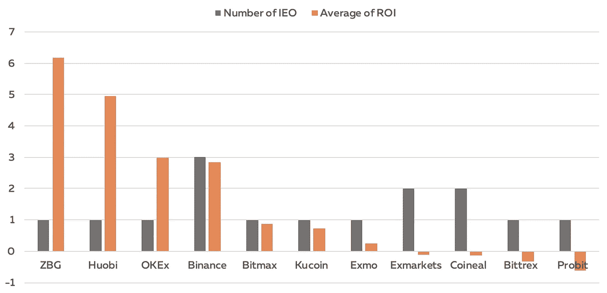
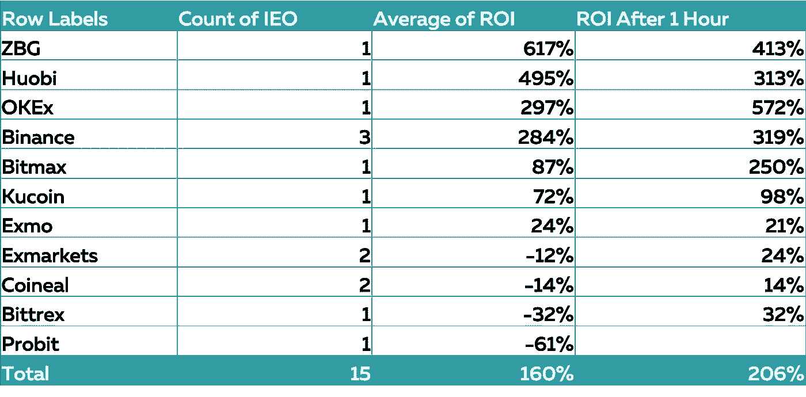
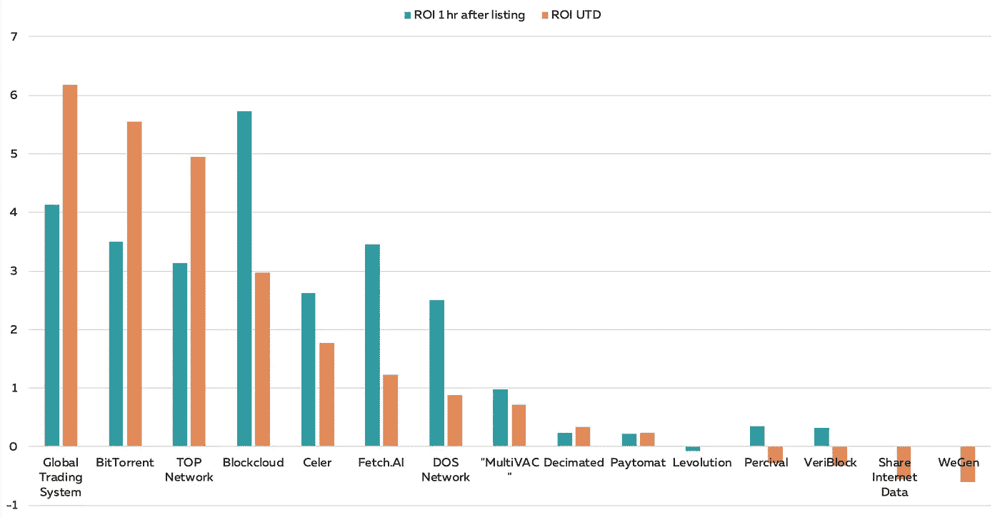
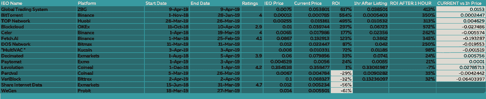

# IEO 炒作，值得吗？

> 原文：<https://medium.com/hackernoon/ieo-hype-is-it-worth-it-4ddc35bd8ba9>

首次公开募股(IEO)基本上是 ICO 的更名。尽管有一些不同之处。

主要是，代币是由交易所发行的，因此它有立即上市的可能性。此外，项目应通过交易所的尽职调查流程。因此，安全性和流动性应该更好，从而提高项目质量

ieo 现在被大肆宣传，但是数字呢？我们对所有最近的产品进行了研究和数据分析。然而，数据集仍然很小，所以对下面的数字持怀疑态度。

## 资料组

我们分析了来自 11 个平台的 47 个 ieo，其中 15 个是交易的。以下价格已被记录:IEO 价格，上市后 1 小时收盘价，当前价格(2019 年 4 月 14 日，太平洋标准时间下午 5:00)。Coincodex.com 被用作主要的数据来源。

## 平台故障

正如你所看到的，币安列出了最高数量的 IEOs)，同时保持了非常稳定的平均投资回报率。4 月 11 日的收益率为 284%，上市一小时后为 407%。

ZBG、火币和 OKEx 各推出了 1 只 IEO，它们都获得了令人敬畏的牵引力，收益率分别为 617%、494%和 297%。但是，样本量极小。

在 Exmarkets、Coineal、Bittrex 和 Probit 上市的代币很难被称为成功的，因为它们都没有成功维持正的投资回报率，而在 Bittrex 上市的 VeriBlock 在第一个小时产生了 32%的投资回报率，但在 4 月 14 日一路下跌至-31%。

关于尚未交易的代币，Probit 宣布了 11 个 ioe，Coinlean 宣布了其中的 8 个。然而，Probit 设法只列出了 WeGen，它实际上正在 Bitforex 上交易。Coinlean 上市的左旋和珀西瓦尔。

值得一提的是，只有提到的平台在宣布的和实际列出的令牌之间有如此大的差异。

## 项目摘要

排名前三的公司(全球交易系统、BitTorrent 和 TOP Network)不仅成功上市，还成功提高了投资者的投资回报率。所有其他项目的投资回报率在上市后逐渐下降。

您可以在下表中看到每个项目的回报。

## IEO 是新 ICO？

样本量仍然很小，无法得出真正可靠的决策结论。然而，最初的数字与前几年的 ICO 热潮非常相似。

如果你投资了所有上市的独立企业，你的平均回报率将在 150%左右，但是考虑到尚未上市的 21 个独立企业，由于不确定性，很难做出这样的假设。

如果你比较 ico 的增长动力，在一个著名的交易所上市可能会导致 FOMO，使价格飙升，但在 IEO 期间，这基本上是从一开始就定价，因此它限制了增长的可能性。

从更广泛的角度来看，事情与前几年的 ICO 热潮非常相似。投资者只是想相信一些东西，就像 Grin 刚推出时那样。人们只是在没有充分了解基本面的情况下扔钱。我会说，这是一个赚快钱的好机会，但从长远来看，这种模式有很多瓶颈。

在不久的将来，你可以期待更多由斯奎拉资本准备的关于 IEO 市场的研究。

同时，在[推特](https://twitter.com/DanilMyakin)上关注我。