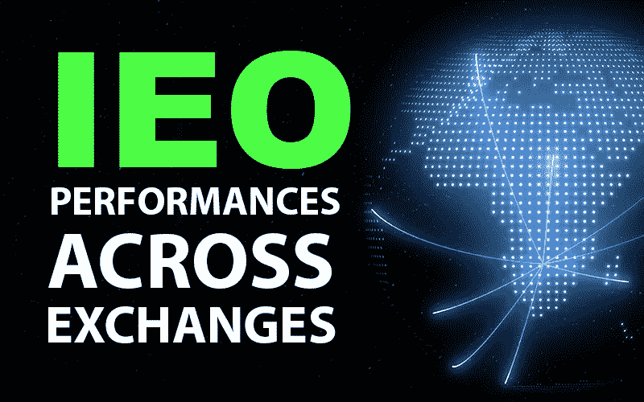
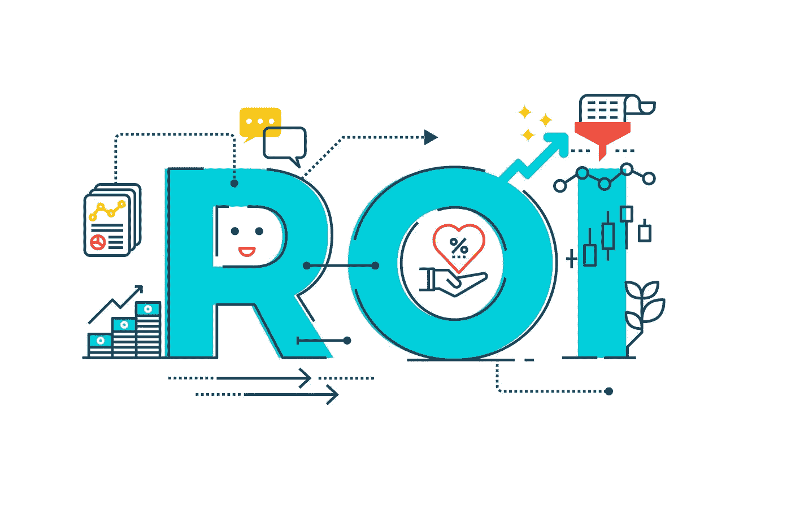
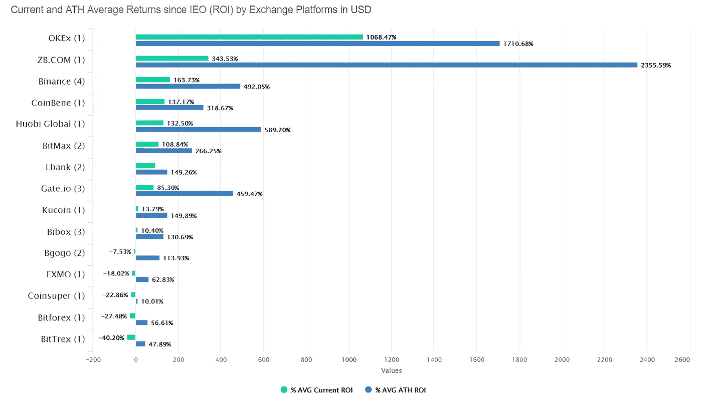
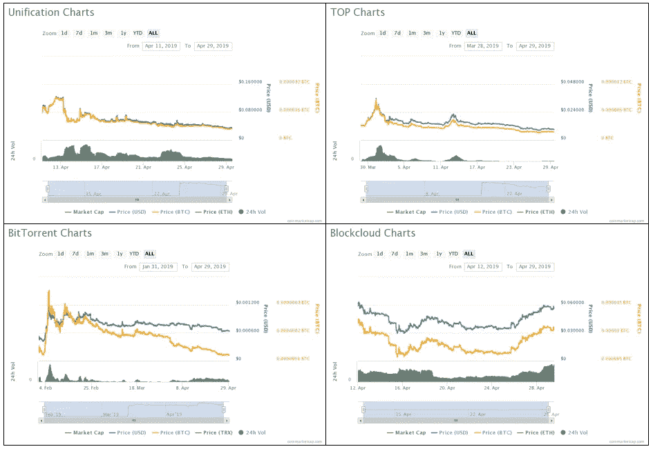
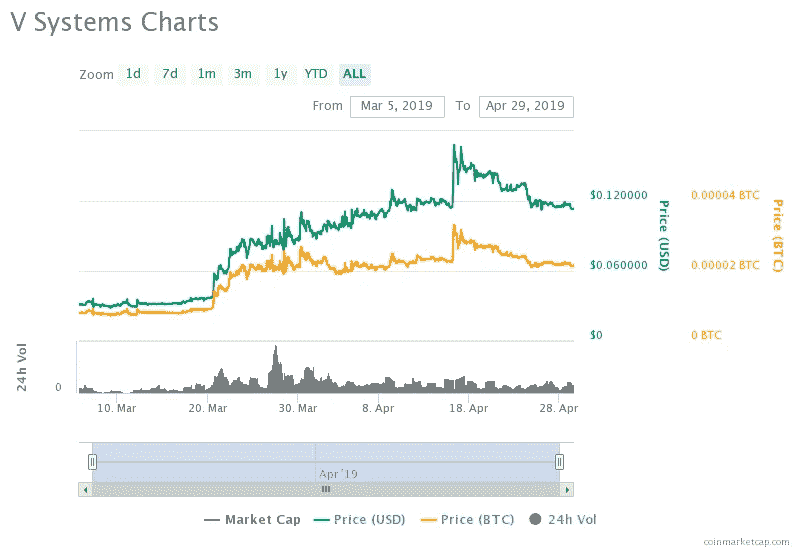

# 跨交易所的 IEO 表现:迄今为止最好和最差的 IEO 发射台

> 原文：<https://medium.com/hackernoon/ieo-performances-across-exchanges-the-best-and-worst-ieo-launchpads-so-far-d828c064a161>

The Best and Worst IEO Launchpads

对于整个区块链行业最年轻的创业公司来说，2019 年标志着众筹的新发展。首次公开募股(ieo)已经出现，为自 2017 年以来让投资者感到厌倦的独立 ico 提供了一个有吸引力的替代选择。

随着几个月来完成的 IEO 记录在案，现在可以查看数据并评估哪些 IEO 发射台迄今为止表现最好和最差。

## IEO 通过交流平台回归

IEO Returns by Exchange Platform

对于 IEO 平台来说，最重要的指标是投资者在其支持的项目中实现的投资回报(ROI)。

原因如下:

当投资者参与 IEO 时，他们中的许多人这样做不仅仅是因为他们喜欢筹集资金的项目，还因为他们 ***信任*** 提供 IEO 发射台的交易所。

问题是，信任必须不断赢得。对于一个交易所来说，在支持独立评价机构之前拥有良好的声誉是不够的，他们需要通过选择在市场上成功的独立评价机构来维持这种声誉。

想象一下会发生什么，IEO 被证明是一个骗局，投资者失去了他们所有的钱。没有人会愿意在未来再次相信这种交易。

另一方面，如果一个交易所支持持续表现良好的独立企业，从而为其投资者带来高投资回报率，会发生什么？随着每一次 IEO 的成功，投资者将更有信心从这个发射台支持未来的项目。

多亏了 CryptoRank，我们可以查看每个 IEO 发射台迄今为止的当前和历史最高投资回报率。

*(Source: CryptoRank)*

现在，需要注意的一件事是，到目前为止，大交易所的表现远远好于小交易所。

根据 [**CoinMarketCap**](https://coinmarketcap.com/rankings/exchanges/) 的数据，投资回报率最高的平台——OKEx、币安、CoinBene 和 ZB.com——都是排名前 20 的加密货币交易所。与此同时，目前在 IEOs 上投资回报率为负的交易所都没有进入前 50 名。

尽管现在还为时过早，一些 IEO 平台只支持 1 到 2 个项目，但数据表明了一些直观的道理:更好的交易所有更好的 ieo 表现。

随着 IEO 市场的发展，至少有三个理由可以预期这种趋势会继续下去:

*   更大的交易所拥有更多的用户，这有助于 ieo 在早期发展更强大的社区。
*   随着 IEO 的支持，自动交易所上市，在更大的交易所上市意味着代币将具有更高的流动性。
*   具有杠杆作用的项目(例如，已建立的支持者社区、工作产品、强大的象征性经济等。)将选择最好的交易所来举办他们的 IEO。

考虑到这几点，显然，寻求众筹的区块链项目应该把眼光放高，瞄准最大的交易所。这需要更多的前期工作，以使项目尽可能吸引人，但如果它成功地吸引了一家顶级交易所与你合作，那这项工作就更值得了。

## 交易开始时，IEO 价格跟随 BTC 价格

IEO’s Price Follows BTC Price When Trading Begins

仔细观察单个 IEO 的表现，很明显，美元价格和 BTC 价格从一开始就高度相关。

以上四个图表分别是来自 Bitforex 的 Unification (UND)，来自 Huobi 的 Top Network (TOP)，来自 OKEx 的 Blockcloud (BLOC)，以及来自币安的 BitTorrent (BTT)。在这些情况下，以及我们研究的大多数其他情况下，IEO 的初始性能更多地取决于更大的加密货币市场，而不是任何其他因素。

即使是经历了所谓的“抽水和倾倒”的 ieo 也或多或少地跟随比特币的价格行动。

此外，我们可以从价格图表中看到，大多数 ieo 都以接近初始市值的价格出售了代币。这是一件好事，因为这表明该行业已经从 2017 年和 2018 年的过度众筹活动中吸取了教训，这些活动引起了美国证券交易委员会(SEC)等监管机构的注意。

话虽如此，IEO 市场仍有便宜货可寻。例如，V Systems 的 IEO 价格为 0.0265 美元，此后随着比特币在 4 月中旬的飙升，该价格升至约 0.17 美元的历史高点。对于卖出 top 的 IEO 投资者来说，一个月的投资回报率超过了 500%。

只要一些 ieo 继续表现强劲，我们预计从旧的 ICO 模型到这种新的交易所支持的模型的转变将继续获得动力。

# 获得关于 IEO 进程的指导

多年来，我们一直通过众筹活动支持区块链项目。

我们深入了解 IEO 市场，可以利用我们与主要加密货币交易所的关系来帮助您准备 IEO 项目。如需了解更多信息，请通过 telegram @amidatonga 联系我。