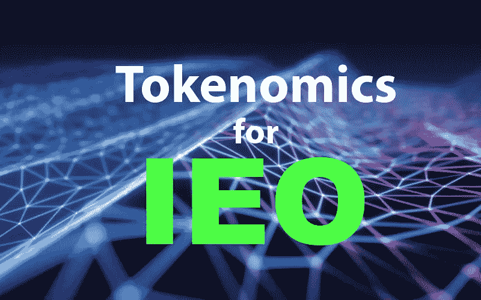
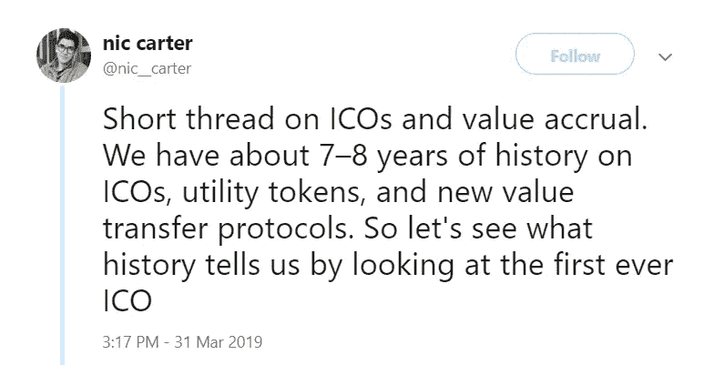

# IEO 复数:如何为 IEOs 钉代币经济学

> 原文：<https://medium.com/hackernoon/ieo-plural-how-to-nail-token-economics-for-ieos-d8b785445837>

Initial Exchange Offering: How to nail token ecenomics for IEOs

> 请看上一篇文章—[IEO 平台/发射台终极列表:前 15+交易所](https://hackernoon.com/ultimate-list-of-ieo-platforms-launchpads-top-15-exchanges-42af67dfda69)

2019 年的典型加密货币投资者比 2017 年更加精明和老练。随着首次交易所发行(IEOs)新趋势的流行，加密货币交易所正在通过非常谨慎地选择他们将通过 IEO 支持的项目来迎合这些更成熟的投资者。

在[的这篇](https://cryptopotato.com/7-must-have-keys-for-a-project-looking-to-conduct-an-ieo/)文章中，我们讨论了加密货币交易所在一个项目中寻求的所有重要功能，他们将通过他们的 IEO 平台帮助众筹。在本文中，我们将专注于其中最关键的特性:代币经济学。

具体来说，我们将解释为什么代币经济学在项目规划的初始阶段如此重要，然后我们将从加密货币行业的现有项目中查看一些成功和不成功的代币经济学案例。

# 坚实的象征经济学是启动 IEO 的先决条件

现在，全球监管机构已经开始打击几年前常见的各种骗局 ico，分散式众筹市场已经演变成两个独立的类别:安全令牌产品(sto)和 ieo/ico。

ieo 和 ico 现在专门用于公用令牌，因为任何可被视为证券的令牌都必须选择 STO 模型以保持法律合规性。问题是，大多数实用令牌都失败了。

在实用代币短暂的历史中，最大的误解是随着使用的增加代币的价值也会增加。换句话说，投资者认为，他们可以通过成为一个生态系统的最早成员而获利，这个生态系统将随着时间的推移变得越来越受欢迎。

相反，我们学到的是，公用事业代币的代币经济学实际上与传统经济学没有什么不同。为了使公用事业代币增值，需要一种机制来增加代币相对于其供给的相对需求。

话虽如此，还是有实用程序令牌的成功故事的。通过避免失败项目的错误，并以成功者为榜样，你的代币经济学将会脱颖而出，大大增加你获得 IEO 奖的机会。

# 范例案例:好的和坏的代币经济学

我们不需要看得比第一个 ICO 和公用事业代币更远，就可以找到一个例子，说明糟糕的代币经济学如何毁灭一个本来很有前途的项目。Nic Carter 在 Twitter 上发了一个启发性的帖子对此进行了解释。

*(Source:* [*https://twitter.com/nic__carter/status/1112479150147862528*](https://twitter.com/nic__carter/status/1112479150147862528?ref_src=twsrc%5Etfw%7Ctwcamp%5Etweetembed%7Ctwterm%5E1112479150147862528&ref_url=https%3A%2F%2Fbitcoinexchangeguide.com%2Fa-successful-crypto-token-failure-revisiting-the-first-ever-altcoin-mastercoin%2F)*)*

Omni 最初被称为 Mastercoin，多年来已经展示了一些重要的效用。正如 Carter 解释的那样，Omni 协议从一开始就被用来处理仅是 Tether (USDT)的 1440 亿美元的链上交易。

尽管有这种显著的效用，但 OMNI 代币本身从未产生任何内在价值。Omni 团队未能开发出一种机制来从他们的协议利用中提取价值，结果令牌变得毫无用处。

另一方面，有一个公用事业令牌已经超越了所有的宣传和期望:BNB。除了市场领先的加密货币交易所，币安还建立了一个代币经济模型，其他公用代币忽视这个模型是愚蠢的。

我们可以将 BNB 的代币经济学分解为三个核心部分。

1.  实际效用:向 BNB 付费的币安用户可以享受折扣，这使得 BNB 在币安生态系统中拥有独一无二的效用。
2.  **通货紧缩机制**:每个季度，币安用他们利润的 20%在公开市场上购买 BNB 代币并烧掉。这减少了代币供应，增加了对剩余代币的相对需求。
3.  **持有**的动机:公用事业代币的一个潜在问题是，投资者除了投机未来价值之外，没有理由持有它们。币安通过一种分级折扣结构解决了这个问题，这种结构为持有最多 BNB 的用户提供最大的折扣。

币安已经证明，如果公用事业代币的代币经济学设计得好，并且成功地解决了市场的需求，那么公用事业代币可以产生强有力的价值主张。

# 设计问题

这让我们想到了设计公用事业令牌经济学的最终指导方针，它不仅会吸引 IEO 平台和投资者，还会在接下来的几年里留住他们。我们会把这些作为问题提出来。

***问题 1* :** 除了访问您的产品或平台之外，您的令牌是否还提供其他用途？示例包括折扣、治理权和/或对额外功能的访问。

***问题 2* :** 你的代币经济模型是否包含一种相对于代币的供给来增加其相对需求的机制，比如烧钱计划？

***问题三* :** 投资者有理由持有你的代币吗？这可以是支付，如股份证明系统、分层产品折扣(如 BNB ),或者针对您的特定令牌生态系统的创意。

开发解决这些挑战的方案当然不是一件容易的事情，但是代币经济学实在太重要了，不容忽视。

最重要的是，你不需要独自经历这个过程。

[我们直接与项目合作](http://ptoken.io/full-list-of-our-services-for-ieo.html),借助与我们合作的主要交易所的即时反馈，开发强大的经济模型。

只靠一个有前途的产品就能筹集数百万美元的日子已经过去了。但对于那些找到方法将产品成功传递给投资者的项目来说，未来从未如此光明。

如果你在 IEO 需要帮助，请发短信给我。