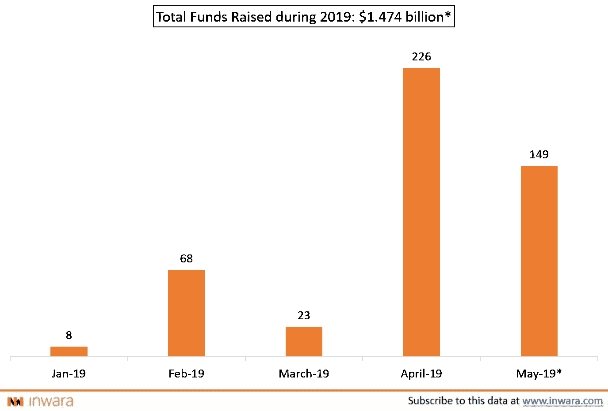

# 2019 年，ieo 筹集的资金超过了 ICOs 迎来了一个新时代？

> 原文：<https://medium.com/hackernoon/ieos-have-raised-more-money-than-icos-in-2019-ushering-in-a-new-era-3d4dabbc16e>

在“ICOs 的秘密冬天”的恐怖秀之后，一种新的趋势正在秘密空间迅速发展。

IEOs！

在 ico 的全盛时期，即 2017 年底至 2018 年年中，最初的交易所发行项目不到十几个。现在，随着对 ICO 兴趣的下降，IEO 在 2019 年掀起了一场风暴，推出了 100 多个 ieo。

> 就在 2019 年 5 月，IEO 项目全年筹集的资金突破了 10 亿美元大关。自成立以来，IEO 项目在全球筹集的资金总额超过 16 亿美元，其中绝大多数资金在 2019 年筹集了约 14 亿美元([来源](https://www.inwara.com/report/initial-exchange-offering-report-inwara))。

**ICO 模式 vs IEO 模式 vs 风险投资**

ieo 和 ico 类似，都是众筹的象征性形式。他们提供代币作为交换投资，这些代币对于公司以后提供的服务具有一定的功能/实用价值。

ICO 的巨大成功毫无疑问地证明了这一点对全球投资者的吸引力——这主要是因为进入该项目投资的门槛非常低。

ICO 和 IEO 之间的主要区别很简单——在 IEO 中，加密货币交易所在其平台上促进代币发行，并随后将其上市，而在 ICO 中，项目管理团队通常必须通过建立网站、设置支付网关等来解决这一问题。

委婉地说，这确保了代币购买的便利性，鉴于代币通常是用交易所自己的本地代币购买的，这使得普通散户投资者更容易购买代币。

ICO 模式快速增长的一个主要因素是，它可以轻松进入全球投资者群体，这与传统的风险投资形成鲜明对比。

随着在 ICO 模型中加入基于交易所的启动平台，IEO 让投资一个项目变得简单得可笑。

此外，交易所随后创造的流动性为投资者提供了退出项目的机会，这是 ICO 模式的一个主要优势，在这种模式下，大量 ICO 从未在交易所上市，给投资者留下了毫无价值的代币，也没有地方进行交易。

> ***仔细想想:ICO 到 2019 年为止已经筹集了~ 11 亿美元，所以 IEO 项目筹集的资金第一次与 ICO 项目筹集的资金交叉(*** [***来源***](https://www.inwara.com/) ***)！***

**2019 年独立董事募集的资金**

[来源](https://www.inwara.com/report/initial-exchange-offering-report-inwara)

**筹集的资金总额包括 Bitfinex 筹集的 10 亿美元。图中未显示*

随着 IEO 项目筹集到如此大量的资金，问题仍然存在，监管框架会说些什么，更重要的是，这种情况会持续下去吗？