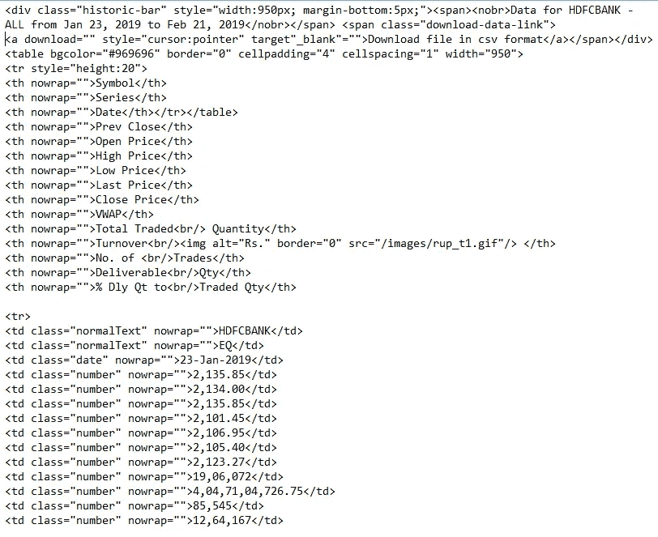
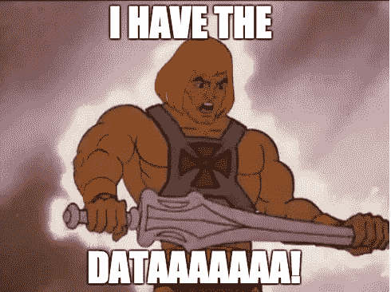
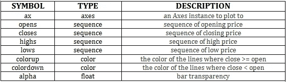
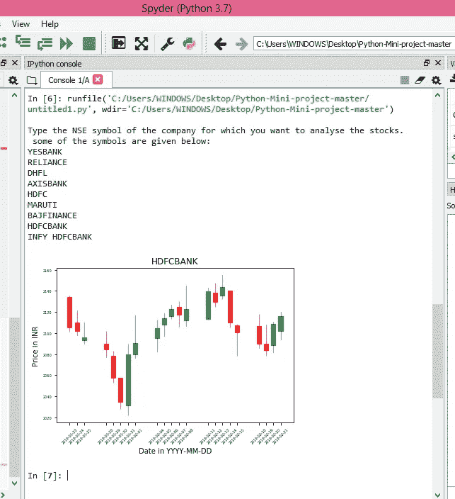

# 看得见就刮！

> 原文：<https://medium.com/hackernoon/if-you-can-see-it-you-can-scrape-it-1f51561933d9>

## 一套六个步骤，可以帮助你刮一个网站，并生成烛台图表。


是啊！你在任何网站上看到的任何东西都可以被刮掉。从搜索房屋出租到分析股票，网络抓取使事情变得简单。您可以根据需要随时提取数据并使用它。

在这篇博客中，我将带你经历我在浏览国家证券交易所网站时遵循的六个步骤，并使用蜡烛图分析数据。现在让我们从一些定义开始。

# 什么是网页抓取？

网络抓取或网络采集是一种技术，用于从网络上的不同网站提取数据，如天气预报、市场价格或任何您想要的数据。

我发现与使用网络抓取相比，使用 API 很简单。如果你能找到一个很好的 API，就不需要抓取网页了。这里重要的一点是，并不是所有的网站都提供 API，所以这就是网络抓取的作用。

# 先决条件:

# A.网页抓取的先决条件:

既然我们要废弃一个网站，那么掌握 [HTML](https://www.w3schools.com/html/) 、 [JavaScript](https://www.w3schools.com/js/) 以及 [python](https://www.geeksforgeeks.org/python-programming-language/) 的基本知识就很重要。

# B.选择 IDE:

在实现一个想法的过程中，您可能希望安装各种模块和软件包。所以，选择一个好的 IDE 其实是非常重要的一步。

我在实现中使用了 Anaconda 发行版。我选择 Spyder IDE 是因为它内置了很多包。安装包也很容易。

如果你喜欢使用在线 IDE 实现你的想法，我会推荐你使用 [Repl](https://repl.it/) 。

# C.安装:

如果您正在使用 anaconda(点击[此处](https://www.anaconda.com/download/)下载)，您可以使用以下命令来设置 mpl_finance 模块。

首先，使用`pip --version`检查您的 pip 版本。如果您的 pip 需要更新，请使用`python -m pip install --upgrade pip` 进行更新。

要安装`mpl_finance`模块，使用以下命令。

```
pip install [https://github.com/matplotlib/mpl_finance/archive/master.zip](https://github.com/matplotlib/mpl_finance/archive/master.zip)
```

如果您选择在 repl 上运行代码，那么不用担心！所有的包都在运行时安装。

# 实施:

浏览你想删除的网页的 HTML 结构。

# 第一步。了解 URL:

众所周知，URL 是互联网上特定资源的标识符。它有各种组件，如方案名、主机名、端口号、路径、查询字符串和片段标识符。要复习这方面的知识，可能需要参考这个[链接](https://www.tutorialrepublic.com/html-tutorial/html-url.php)。

我们将要废弃的网页的 URL 是

[https://www . NSE India . com/products/dyna content/common/products symbol mapping . JSP？% 20 symbol = coal India&segment link = 3&symbol count = 1&series = ALL&date range = 1 个月&from date =&toDate =&dataType = PRICEVOLUMEDELIVERABLE](https://www.nseindia.com/products/dynaContent/common/productsSymbolMapping.jsp?%20symbol=COALINDIA&segmentLink=3&symbolCount=1&series=ALL&dateRange=1month&fromDate=&toDate=&dataType=PRICEVOLUMEDELIVERABLE)

当我们查看 URL 时，我们看到了名为“符号”的单词。这里的关键是，如果我们传递我们选择的安全性的符号，我们将获得该安全性的相应页面。

# 第二步。发出 HTTP 请求:

要访问网页，我们需要首先发送一个 HTTP 请求。这可以在一个叫做“请求”的 python 库的帮助下完成。这个库提供了很多特性，比如[保持活动状态](https://blog.stackpath.com/glossary/keep-alive/)和连接池，与 [cookie 持久化](https://www.techopedia.com/definition/4901/persistent-cookie)的会话，流下载，连接超时等等。请求库可以处理许多错误和异常。

*   ***ConnectionError 异常*** :网络有问题时引发。例如，在拒绝网络或 DNS 失败的情况下，会引发此异常。
*   ***HTTPError 异常***:HTTP 响应无效时引发。
*   ***超时异常*** :请求时间到时引发。
*   ***太多重定向异常*** :如果请求超过预先配置的最大重定向次数。

关于这个库及其方法的更多信息可以在这里找到。

可以使用`import requests` 导入请求库。您可以通过向该库传递 URL 来使用该库发送 HTTP 请求。然后就可以从页面中获取内容了。

```
headers={“Referer”:”[https://www.nseindia.com](https://www.nseindia.com)","Host":"[www.nseindia.com](http://www.nseindia.com)","DNT":"1"}
 page = requests.get(URL, headers = headers)
```

如果你做到了这一点，那么是时候提取汤了。

# 第三步。美丽声音的作用:

BeautifulSoup 是一个 python 库，专为像屏幕抓取这样的快速周转项目而设计。您可以使用导入 BeautifulSoup

`from bs4 import BeautifulSoup`

当您通过 BeautifulSoup 传递一个页面时，它会给我们一个 BeautifulSoup 对象，该对象以嵌套数据结构的形式表示该文档。

```
cont = page.content 
soup = BeautifulSoup(cont,’html.parser’)
```

提取的汤的结构看起来有点像这样，



# 第四步。数据提取:

由于我们已经将所需的符号名称传递给了 URL 函数，网站从该函数中提取相应的页面，因此我们使用上一步获得的 soup 以结构化格式提供了所需的数据。

查看 soup 的结构(上面显示了它的一部分),我们知道我们必须在每个表行或 *tr* 中找到所有的表数据或*到*。找到它之后，我们可以将它存储在 python 字典中，并将表头作为键。所以本质上，

*   我们首先提取汤。
*   我们找到所有的“th”或表头，并将内容追加到 header_array 中。
*   接下来，我们使用`soup.findAll(’th’)`查找所有表格行，然后您使用`.findAll(’td’)`查找每一行中的数据。
*   然后，我们尝试以 JSON 格式存储提取的数据。



You must be feeling somewhat like this after you extract your data :P

# 第五步。将数据存储在 CSV 中:

存储数据非常重要，因为它可以在未来用于任何参考目的。虽然数据可以以 JSON 格式存储，但是股票数据通常以 CSV 格式存储。这就是如何做到的，

# 第六步。理解和生成蜡烛图:

## 什么是蜡烛图，为什么它们很重要？

烛台图表是一种金融分析图表，携带关于证券、衍生产品或货币的开盘价、最高价、最低价和收盘价的信息。每个烛台带有特定交易日的信息。


## “烛台”功能:

使用`candlestick_ohlc`功能可以生成蜡烛图。一个基本的烛台函数应该是这样的，

```
candlestick_ohlc(ax, opens, closes, highs, lows, width=4, colorup=’k’, colordown=’r’, alpha=0.75)
```



更多关于烛台 _ohlc 的信息，可以参考这个[链接](https://matplotlib.org/api/finance_api.html)。

我们可以将包含每天的开盘价、最高价、最低价和收盘价的元组列表传递给`candlestick_ohlc`函数，而不是分别传递开盘价、最高价、最低价和收盘价。除此之外，我们还将传递绘制图表所需的其他参数。

# 日期问题:

我们绘图的 x 轴将是日期。我们将把日期传递给`candlestick_ohlc`函数。因此，以适当的数据类型和格式传递信息非常重要。

首先，使用`from datetime import datetime`导入日期时间

您可能会遇到这个*错误*说*一个非日期时间对象被传递给了日期时间轴。*这个可以用这个来解决。

```
datetime_object = datetime.strptime(’2018-10–09’,’%Y-%m-%d ’)
```

除了将字符串转换为 datetime 对象之外，您可能还想将其转换为您选择的格式。可以使用 strftime 来完成。

```
datetime.datetime.strptime("1996–10–25", '%Y-%m-%d’).strftime(’%m/%d/%y’)
```

因此，总而言之，

***strptime*** 将字符串转换为 datetime 对象。

***strftime****根据指定的格式为给定的 datetime 对象创建格式化字符串。此链接包含 strftime 中可以使用的各种格式的详细信息。*

> **你不应该忽略你正在传递的日期的数据类型和格式**

# ***完整的代码！***

***这个链接会把你带到我的 Github 页面，在那里你可以看到完整的代码！***

***[https://github . com/SruthiSathya/Stock-Price-Analyzer-with-custom-screener-/blob/master/烛台%20generator](https://github.com/SruthiSathya/Stock-Price-Analyzer-with-custom-screener-/blob/master/Candlestick%20generator)***

***如果你成功运行这个程序，维奥拉！为了你选择的安全，你一定会看到这样的东西。***

******

***Candlestick chart for HDFC BANK***

# ***数据抽象:***

***在这个项目中，正如我所说的，我遵循了模块化的方法。我用这样的方式编码，如果你调用最后一个程序，一个在另一个之前，它通过调用前一个程序回溯它的路径。采用这种方法的主要原因是，虽然有大约 5 个函数，但它们中的大多数都是作为一个实用程序。从最终用户的角度来看，这些功能并不是必需的。***

> ***将代码抽象成函数增强了可读性和可用性！***

# ***结论和延伸***

*   ***这个程序能够为你输入的公司生成一个蜡烛图并以. png 格式存储。除此之外，它还可以将数据存储在 CSV 文件夹中。按照你的意愿编辑路径，享受结果！***
*   ***很多精彩的网页抓取工具[在这里](https://www.hongkiat.com/blog/web-scraping-tools/amp/)！根据您的需求和可用性，您可以选择该工具。***

***你好，我是斯鲁西。这是我第一次尝试写作。得知你坚持到了这里，我高兴极了！如果你喜欢这篇文章，请按👏来支持。***

***我很想听听大家的看法和建议。在下面的评论区把它们评论出来吧！***