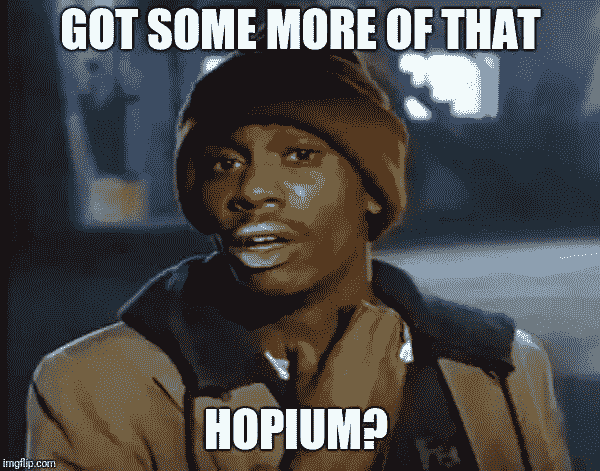
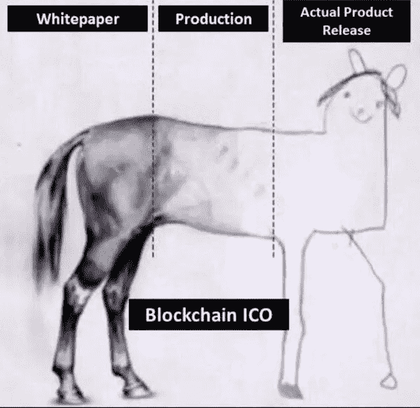
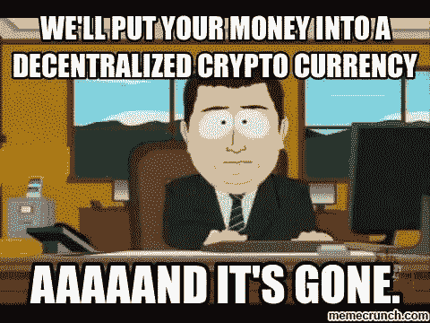
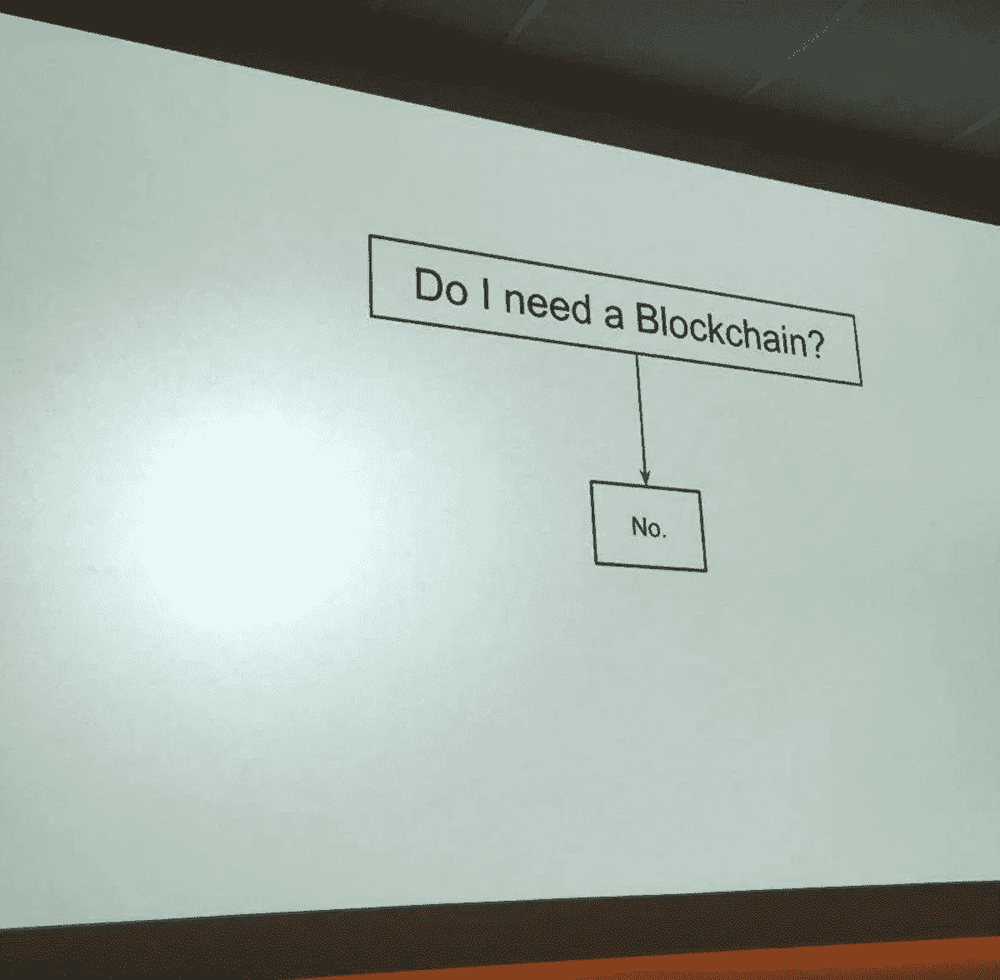

# ICO 提交给澳大利亚财政部

> 原文：<https://medium.com/hackernoon/illegal-coin-offering-submission-to-australian-treasury-e687454e9fda>

## 为什么 ICO 应该代表“非法发行硬币”

99.9% of Whitepapers

# 前言

本文是作者在信息收集过程中向澳大利亚财政部提交的一份材料的延伸。

我们认为，让人们更好地了解在这场狂热中到底发生了什么，由此产生的扭曲的激励以及这种盲目过度的后果是至关重要的。最终目标是帮助确保这种疯狂的事情不会发生在一个充满希望的地方。

还请注意:罗里和我本人都百分之百**支持**自由市场、选择和人们做自己想做的事情的权利——所以这不是什么社会主义补偿的要求。

*这是一次曝光。*

我们的目标是唤醒人们，并希望鼓励人们在这个领域承担责任。任何考虑 ICO 的人都应该阅读这篇文章，并意识到你所想的可能是错误的方式。任何做过 ICO 的人都应该认真记下来。你很可能做了错事，不管你的恶意是故意的，还是因为你的无能，你也应该承担责任——无论是法律上的、经济上的还是名誉上的。

这个世界需要更多的皮肤。让我们希望这是一个开始。

非常感谢反馈，如 ***分享此文*** 。它不仅适用于澳大利亚，而且适用于全世界。

# 介绍

在我们所有的集体经历中，我们参与了比特币和加密货币领域、资本市场、早期技术初创公司和种子期融资，我们认为就我们所知，ICO 融资模式在最好的情况下是误导性的，具有边缘欺骗性行为，在最坏的情况下；公然欺诈。

真相为何并非完全黑白分明，但为了证明这一点，我们将展示 ICO 如何在很大程度上辜负了几乎所有参与者，以及这些 ICO 如何仅仅被用作规避证券法和投资者权利的 Rube Goldberg 机器。

我们首先需要做出法律上的区分，为 ICO *提供资金的参与者是*的“**投资者**”，理性的大多数人是为了潜在的利润而*只*“**投资**”。因此，在投资者权利、**筹资者**和**投资者**之间的权益、透明度和信息共享方面，类似的权利应适用于*所有*证券。

我们还必须承认，这些 ico 中的*许多*故意从事不道德的营销行为，以引诱“**投资者**”、**投机者**、**而非**积极寻找潜在的**用户**，通过利用流行的加密货币**影响者**“吸引来自的大额**投资****来实现这一点**

**

*The unfortunate reality*

*具有讽刺意味的是，许多投资者并不知道他们正在被推销，也不知道这些**有影响力的人**为他们的服务获得了报酬，然而在这个领域还没有执行任何营销标准。在加密货币市场中，关于影响者应遵守的广告标准的 [**#AD** 法律](https://www.abc.net.au/triplej/programs/hack/social-influencers-must-reveal-ad-under-new-transparency-rules/8315962)已被广泛忽视，这对其和“**投资者**都是不利的。*

*这种欺骗行为使得许多不知情的"**投资者"**"将变得极其庞大，不知情的"**投资到*可能*永远不会实现的项目中。而且，即使它们最终成为“**实用令牌**”也可能因为毫无意义而变得一文不值。澳大利亚 ico 的大多数投资者已经失去了他们的衬衫、裤子和尊严，所有这些都是为了一个零利率的股权礼物，来为一个实际上不需要自己的本土“**公用事业令牌**的项目融资。***

***在这种不道德的筹资模式中，**投资者**“承担不对称投资的全部风险”**，“筹资者”几乎没有风险。承担这种风险的投资者完全没有权利，没有透明度，没有权益，也没有法律追索权。另一方面，“**资金筹集者**”可以获得非常有利可图的资金筹集，几乎没有追索权，不需要放弃任何股权，不需要盈利或高效，不需要对“**投资者**”透明，甚至完全不需要交付成功的项目。*****

*****让我们更深入地探讨一下跑步或曾经跑过 ICO 的核心问题:*****

# *******1)非稀释性资本筹集*******

*****ICOs 筹集了巨额资金(有时高达数千万美元),同时放弃了零股权。是的——零。我不确定这是否合法。这些所谓的“**项目**”可能已经在他们华而不实的白皮书中的某处小字中表明，代币是“有风险的”或“没有价值的”，但事实是，这整个概念是建立在以下叙述的基础上的*****

> ******“散户投资者终于能够“***”投资早期协议/项目/业务/公司(实体无关)，而不再是为世界上老练的投资者保留的”*******

******可悲的事实是，在现实中“**投资者**”购买的是与基础实体没有任何关系或归属的无价值代币，或者任何股票、股份、债务、投票权或任何与实体有关的东西。******

************

******ICO issuers were MUCH worse******

******因此，ico 能够筹集到无风险资本，并给投资者一张名为“公用事业代币”的优惠券。他们被告知，最终人们会需要这种代币，它可以作为货币使用。我们认为"**公用事业代币**"这一术语已被随意用于榨取"**投资者**"通过过度使用&对诸如"**区块链**"、**、【加密货币】、**"去中心化"等术语完全缺乏理解，以及对诸如**、**、**货币**、**、【份额】等货币单位之间的功能差异普遍缺乏理解********

# ********2)未注册证券********

******有价证券是**任何**投资合同，而且现在已经陈旧，但仍然非常有效，豪伊的试验表明它是一种投资合同，如果:******

## ********1。这是金钱的投资；********

******ICO 投资是金钱的投资。******

## ********2。投资有利润预期；********

******ICO 投资者期望盈利。不管一些 ICO 发行人会说什么，有趣的是，谁曾经有，现在仍然没有产品、需求、用户或任何其他有形的东西。******

## ********3。钱的投资是在一个共同的企业；********

******去中心化的平台是共同的企业，投资者有公用事业令牌来证明这一点。此外，使用这种融资方法从投资者那里非法获得资金，并将其重新注入他们拥有 100%所有权的企业的企业，仍然是这种分类的代表。******

## ********4。任何利润都来自于发起人或第三方的努力；********

******该项目最终必须进行营销，创造对代币的需求，否则价格将会下跌。******

******尽管所有的说法都与此相反，**所有进行 ICO 的** 公司实际上都在出售“**公用事业代币**”以达到投机的目的，因此总是存在利润预期，而这种利润依赖于通过 ICO 筹集资金的基础业务的推广和努力。******

******这是无可争议的；否则就不会有围绕所述代币的促销而形成的整个营销服务行业。全球最大的两个广告平台(谷歌、脸书)禁止销售这些未注册证券*是有原因的。*******

******此外，如果一个 ICO 向*任何*单个参与者出售的代币多于他们成为*潜在用户所需的代币，这显然是一项投资，因此毫无疑问，他们知道自己出售的是未注册证券。很大程度上，这些代币的购买者从未打算成为“平台的用户”，而且几乎在所有情况下都是如此；那些平台并不存在，并且大多数*(如果不是全部*)至今仍然不存在。“**公用事业令牌**”的说法百分之百是错误的，完全是误导，最终是有害的。*******

******我必须向技术上不知情的人说清楚，“实用令牌”并没有被消费、使用，甚至对于创建几乎所有功能分散的应用程序(**dapp**)来说根本上是不必要的。我们必须定义诸如 ETH 的平台令牌和在平台上发布的"**实用令牌**之间的技术差异，其中一个是必要的，而后者实际上并不是在所有情况下都是必要的。******

******“一般来说，从功能上来说，代币是没有任何用处的，如果你被卖给了其他人，那么你很不幸地被那些想寻租的人误导了。一旦一个“**实用令牌**”被发送给一个服务，他们必须将这些令牌转售回市场以获利；这意味着 ico 必须引导双边市场，而不仅仅是单边市场。******

> ******"**实用程序令牌**"是一个没有真正价值和*实际*实用程序的烫手山芋。******

************

******Hoping for Utility******

********公用事业代币**“一般来说，几乎所有代币都没有经济意义，会导致低效、不可持续和完全不必要的二级市场，这些二级市场已经一次又一次地被证明主要由虚假交易量组成，机器人和做市商清洗交易，以进一步诱使人们继续赌博，并补贴他们低效的商业模式。******

******最终，ico 能够绕过监管筹集资金，给“T0”项目“这些项目只是一群人(又名:企业)一种无风险、合法、有利可图的方式来试图筹集资金，同时试图“引导”尚不存在的产品的未经证实的市场，为**不需要的**服务**区块链**。******

******这些未受监管/未注册的实体充分利用了 ASICs 宽松的标准，然后充分利用了公众对加密货币的缺乏了解——并将其全部敲竹杠，向他们出售风险极高的无用代币，这些代币实际上只是没有权利、所有权或追索权的证券。******

# ********3)营销&透明度********

******在二级市场上出售代币很大程度上是这些“**项目**”的商业模式。这些商业支出的大部分集中在试图提高需求并因此提高代币价格的营销努力上。他们试图通过继续营销来引导“网络”,并向这个投机市场出售公司的多余代币，尽管通常还没有实际的产品。这是一个完全投机的市场，因为代币的购买者在很大程度上(如果不是全部的话)也不是平台的“用户”,而仅仅是“投机者”( T12)和“投资者”( T14)。******

******这些二级市场可能会受到支付加密货币“**影响者**”和出版物进行营销的不公平影响。这可能会产生误导性的营销努力，通过发布领先的新闻稿，鼓噪成功和合作伙伴关系的幻觉，而没有任何真正的成就，试图提高象征性的价格。这些活动很少承认这些实际上是付费广告或营销活动，而且根据广告标准，“**影响者**”几乎**从不**承认**#广告的**。******

******这些做法被自由地用来绕过市场营销的法律，并再次创造更多的"**投机者"**"**"投资**"一个协议(在某些情况下)，更糟糕的是，一个尚不存在的"**产品**"或"**业务**"。******

************

******No difference between this guy & the rest******

******加密货币领域的影响者为 ico 提供咨询已经赚了数百万美元，加密货币项目中的顾问一词实际上具有极大的误导性。大多数顾问只是在推销这些 ico，他们的建议也就到此为止了。******

******实际上，他们是在向不知情的粉丝出售未注册的证券，并以真正欺骗性和不道德的营销手法进行操作。这些“**建议**”这些“**影响者**”提供了完全不透明的服务，以获得发行的全部代币的 1.5%，似乎也没有任何种类的归属期(好像这无论如何都很重要)。这导致了非常危险的潜在激励，即具有“参与代币投机游戏”的影响者急于推动、推广和营销代币，仅仅是为了增加要出售的投机者的数量。******

# ********4)代币支付********

******创始人、员工、顾问和公司通常构成了代币持有者的很大一部分，以极其有利可图的美元成本计算。他们通常被给予很少的销售条款和/或持有/授予时间表(同样，好像这很重要)。******

******经常提到的条款从来没有被强制执行，这里完全缺乏透明度。通常不需要满足目标、里程碑或交付可交付成果，而这些在传统上是经营企业所必需的。******

******在这种情况下，更糟糕的是完全虚伪的，他们通过出售伪造代币赚钱，同时在自己的国库中保留 20%、30%、40%、50%甚至 60%的伪造代币！！******

******因此，这些项目不仅凭空创造了一项毫无价值的“资产”(如果我可以这么称呼的话)&把它卖给了某个人(因此赚了钱)，而且它们为自己保留了大部分“市场中的代币”。******

************

*********如果那不是双蘸的定义；我不知道什么是。*********

******他们创造了一个市场，通过同时限制供应(人为地)和在交易所上市来推高代币的价格，当代币的价格被向上挤压时，他们作为大多数代币的持有者而致富，并在市场顶部将其出售给**“投资者】**。******

******在我们生活的宇宙中，绝对没有任何道德理由认为，这些 ICO 发行者应该不仅能够出售毫无价值的令牌并从中获得资金(这赋予了它们市场价值)，同时还可以获得总网络供应的一部分(相当大的一部分),随后可以出售给人们。******

******这进一步强化了这一 ICO 惨败是明目张胆的抢现金行为，任何团队、公司、团体或项目，无论是收钱还是为自己保留代币，都应该长时间认真审视自己——代币的买家和当局也应该如此。******

# ********5)做 ICOs 需要代币的业务********

******在考虑对令牌的需求时，可以使用一个简单的石蕊测试。******

******如果这是一个不归任何人所有的网络，而更像是一个公共“公地”，如比特币，那么它需要自己的货币/经济模型来激励验证者(矿工)、法官(节点运营商)和持有者(用户)——换句话说；所有参与者—支持网络，维护其完整性。******

******虽然我们不同意以太坊通过 ICO 方法筹集资金以初步启动其网络(例如:比特币没有“出售”给任何人，也没有筹集到任何资金——它是 100%有机的)，并且可能不同意它适当分散的想法；人们可以理直气壮地指出，它的网络更符合比特币，为了让它运行，它需要一个令牌，原因与上面概述的比特币相同。******

******因此，如果有人/一个团队，或一个"**项目**"声称要建立这样一个分散的网络；然后有一个存在代币的论点，尽管请注意，它**并不意味着**它需要一个 ICO，此外，围绕 ICO 资本筹集的激励通常会导致与建立一个公平分配的强大网络所需的激励相反的激励。******

********另一方面**的企业，其现实世界中的对等物是功能性的、商业性的、操作性的，甚至是非商业性的&亏损，但仍然存在或可能被构建为企业或产品**将永远**不需要令牌。任何情况下都不行。******

******这里有许多问题。******

## ********1。锤子找钉子********

******这些企业中的大多数，他们的创始人，他们的顾问和他们的团队都知道，毫无疑问，他们的产品或业务**不需要**令牌来运行。******

******为了解决这一问题，他们开始叙述“为什么”他们需要一个“**区块链**”，以便他们的业务能够“在这个新的数字时代”实际运作。******

******他们专注于创建一个复杂的“网络”，或一些新的基于区块链的“证据”,他们发行的令牌需要在这些区块链上运行，以便他们的业务更有效，或他们的产品更具功能性。******

******我还没有看到这样一个网络的例子，它不仅证明了区块链的“某些东西的证明”,而且证明了对他们需要从人们那里筹集资金来建造它的整个概念来说是“至关重要”的令牌的价值。******

************

******The reality of mal-incentives.******

******这些企业几乎都是明目张胆地攫取现金的例子，他们创造了一个充满技术术语的故事，旨在混淆视听，没有人真正理解，只是为了证明一个并不需要的令牌的存在；当然；为了然后“**需要**做一个 ICO”。******

******这条规则没有例外；无论是对于 ATM 机业务、供应链产品、实现其自己的令牌的交易所，还是对于似乎是一个好主意的小额投资/综述应用；并以此为由，为了一个不必要的代币，骗取人们的钱财。******

******有完全合法的企业存在，直接证明了令牌最终是不需要的，即；橡子，比特币基地，旅行比特，琥珀。******

## ********2。道德风险/不一致的激励********

******这些“**项目**”是在建立一项业务，还是仅仅在维持一个庞氏骗局式的“代币经济”网络？******

******创业已经够难了；还必须管理一个随心所欲的微观经济，这是完全不可能的。******

******到了紧要关头，这些团队会专注于真正让他们赚钱的东西(这是他们的动力所在)。赚钱的方法不是试图在你凭空创造并出售给人们的代币上赌博(这是获得所谓“REKT”的好方法)，而是拿他们出售的假代币换来的真钱&至少尝试经营一家他们 100%拥有并能长期盈利的企业。******

******让我说清楚:******

*   ********他们提前拿到了所有的钱。**这是免费的钱。没有稀释，没有责任，什么都没有。******
*   ******然后，他们可以把钱花在提高他们卖给你的代币的价值上(除非他们特别笨，否则不太可能)，或者他们可以继续发展自己的业务，开发自己的产品，赚些钱。******

******你，代币持有者刚刚得到…等一下…shafted！******

************

******The Harsh Truth******

******我们称之为:******

> ********慈善无因……********

******这里需要注意“团队”或“项目”的三个类别:******

1.  ********那些拿了钱就跑的**(直接骗子)******
2.  ******那些拿了钱然后试图交易的人得到了回报。)******
3.  ********那些拿了钱，然后漏点进自己的生意**(或者另一种商业想法)**为了自己的利益**(记住；他们拥有 100%的股份，而你什么也不拥有。******

******我会说第三条实际上是最糟糕的——因为它们仍然存在。他们声称已经“徘徊”,“建造”或仍在“建造”产品，而人们(或代币持有者)太无知而没有注意到现实:他们只是拿了你的钱，买了全新的汽车，给自己丰厚的报酬，并建立了一家公司。取而代之的是，社区简单地表扬他们实际上建造了一些东西。******

******他们是最阴险的，因为他们还在，他们还在做他们的事情——无论他们是明显的骗子，还是真的被欺骗到对基本的一加一经济学没有什么概念/理解，认为他们在做正确的事情——这都不会改变他们绝对误导了他们的“**投资者**”和向他们寻求建议的人的事实。******

******如果那些“**投资者**在第一时间被告知真相，即；“你的付款是慈善捐款给我们的事业，即；我们将长期赚钱的生意”，我向你保证**没有人**会投资**，除了完全精神错乱的人。********

********激励是错位的，道德风险是真实的。********

# **********6)不公平优势**********

********最后但同样重要的是:********

> ********一个人的动机是另一个人的动机。********

********政府和更广泛的生态系统应该支持做正确事情的企业家和创新者。我是说；这是假设我们想要一个关注生产力，而不是寻租和压榨不知情的投资者的社会。********

********允许那些做错事的人(ICO 发行人)逍遥法外的问题，事实上是带着大笔的钱；*间接* ***去激励*** *那些努力做正确的事情*的人，卖掉他们公司的大部分股份，日夜工作&去获得一些实实在在的东西。********

******创新很难。建立一个合法的企业是极其困难的。让它在商业上可行甚至更难，当一个人需要与那些欺骗投资者和系统的人竞争时，这只会让它变得更难&难以置信的不公平。******

******这是我们为了支持创新而想要推广的体验和生态系统吗？我认为不是。动机是筹集资金，而不是解决问题。******

******事实上；“成功 ICO”的定义过去是，现在仍然是——“我们筹集了多少资金”。******

******真的吗？？？******

******结果是区块链和 ICO 领域(比特币之外)的创新几乎为零。唯一真正的创新是如何从没有追索权或责任的人身上赚钱——所以如果我们可以说他们在某件事上成功了——那就是成功了。******

******可悲的是，所有这一切的后果导致加密货币市场整体疲软。******

******坚持到底并做正确事情的真正企业受到了严重影响，员工流失到了每年付给开发商和营销人员 30 万美元的 ICO 小贩手中。与 ICO 叫卖的同行相比，他们的资本明显更少，他们必须工作更长时间，更努力地推动剩余人员，并与具有不公平优势的团队进行艰苦的斗争。******

******难怪我们几乎看不到创新。******

******整个空间因错误的激励而扭曲，错误的人因错误的行为而受到奖励。******

# ********结论********

******ICO 应该被重新标记为“**非法发行硬币**”。******

******象征经济学、激励模型、证据以及所有这些打着“**区块链**”标签的垃圾，只不过是一把寻找钉子的锤子。******

******几乎所有使用“**区块链**”这一术语的项目都是为了非法资助他们的项目，从技术的角度来看，他们只是真正成功地使他们的技术基础设施的一些成本比使用简单的集中服务高出几个数量级，有时甚至高出数百万倍。******

******这些实体作为“公司”存在，需要将代币卖回市场，这一事实实际上意味着它们根本无法以分散的方式运作**，因此在很大程度上是在出售一个包裹在谎言中的完全彻底的谬误。********

****************

********From a talk given by Aleks: [https://youtu.be/5c02o8WwYAk](https://youtu.be/5c02o8WwYAk)********

********虽然这个领域有一些惊人的创新，特别是来自那些致力于开源、草根项目(如比特币)的创新，但由于技术知识的不对称水平(或技术术语)和“区块链”的神秘本质，它在很大程度上被兜售他们无法提供的东西的骗子所接管。********

********比特币是一个非常不同的概念；它从未出售给任何人，从未有过 ICO，它是互联网上自发产生的东西——没有个人从出售给不知情的投资者中获利。********

********另一方面，ico 利用了人们对比特币、加密货币和所谓的“**区块链**”技术(充其量只是昙花一现)的误解，并基于两个虚假陈述被出售未注册证券:********

********a)你正在投资早期想法/协议/公司********

********b)交易所列表/稍后你可以在交易所出售你的代币**(意味着价值会增加)******

******这种行为必须被揭露，正如在开始时提到的，那些参与并从中获利的人必须被追究责任，如果不是在法律上和经济上；至少在声誉上。(我知道不是一个词)。******

******我希望我们的评论将有助于特别是澳大利亚 ico 有某种形式的追索权；因为允许他们继续下去而不偿还原始投资者或放弃他们的股权，就意味着他们的行为没有任何后果。******

******我们避免在文章中引用特定的项目，但是欢迎任何人在下面的评论部分这样做。******

******本文由亚历山大·斯维特斯基和罗里·海赛德共同撰写。******

******意见是我们自己的，但肯定会得到许多人的响应。******

## ******如果你已经读到这里，请分享。******

******让我们制造一些噪音，激发一些意识，这样这种愚蠢的事情就不会再发生，或者至少在将来会更难发生。******

******你可以在 Twitter 上关注这些作者:******

****** [## 亚历山大·斯维茨基(@亚历山大·斯维茨基)|推特

### Aleksandar Svetski 的最新推文(@AleksSvetski)。对金钱、BTC、人类学感兴趣的无毛黑猩猩…

twitter.com](https://twitter.com/AleksSvetski)  [## Rory (@highsidecrypto) | Twitter

### 罗里的最新推文(@highsidecrypto)。澳大利亚经济学，她是对的，伙计。比特币至上主义者…

twitter.com](https://twitter.com/highsidecrypto)******