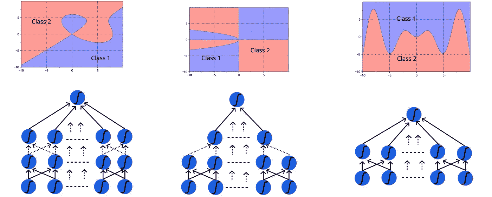
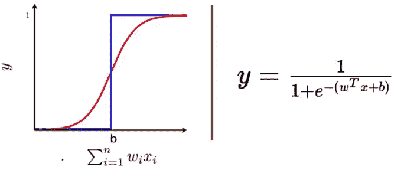
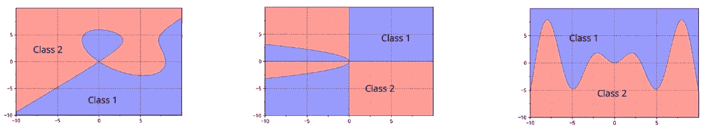
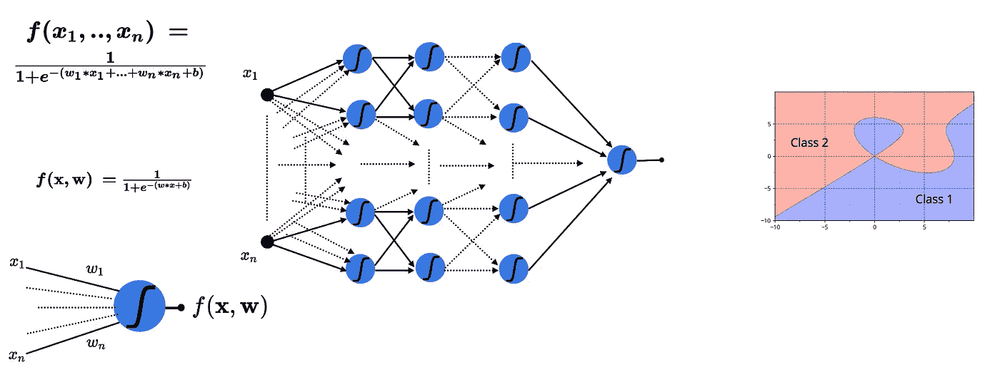
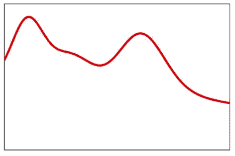
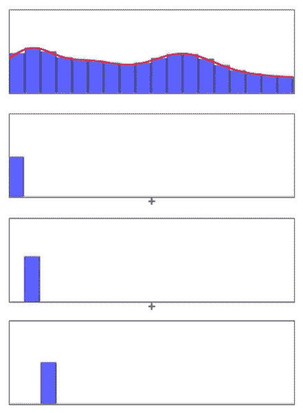
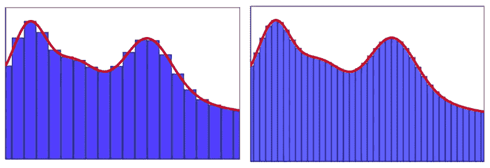
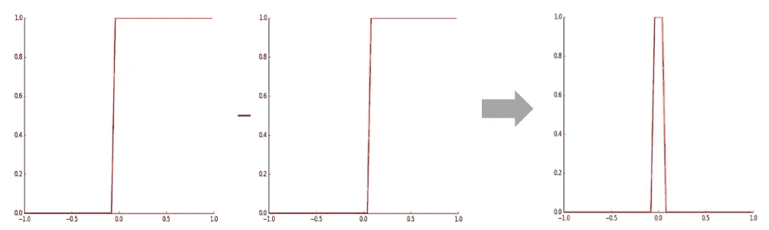
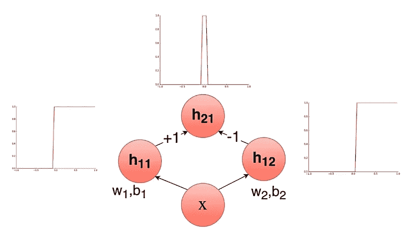

# 普适逼近定理的图示证明

> 原文：<https://medium.com/hackernoon/illustrative-proof-of-universal-approximation-theorem-5845c02822f6>

在这篇文章中，我们将讨论通用逼近定理，我们也将用图表证明该定理。这是我上一篇关于[乙状结肠神经元](https://towardsdatascience.com/sigmoid-neuron-deep-neural-networks-a4cd35b629d7)的后续文章。

*引用注:本文内容和结构基于四分之一实验室的深度学习讲座——*[*pad hai*](https://padhai.onefourthlabs.in)*。*

# 乙状结肠神经元

在我们进入通用逼近定理的实际讨论之前，我将简要回顾 Sigmoid 神经元的工作以及它将如何处理非线性可分数据。

sigmoid 神经元类似于感知器神经元，对于每个输入`xi`,它都具有与该输入相关联的权重`wi`。权重表明决策过程中输入的重要性。与感知器模型不同，sigmoid 的输出不是 0 或 1，而是 0-1 之间的真实值，可以解释为概率。最常用的 sigmoid 函数是逻辑函数，它具有“ **S** 形曲线的特征。

Sigmoid Neuron Representation

# 处理非线性数据

从我上一篇关于 [Sigmoid 神经元](https://towardsdatascience.com/sigmoid-neuron-deep-neural-networks-a4cd35b629d7)的文章中，我们已经看到，即使我们引入了非线性 Sigmoid，它仍然不能有效地区分 1 和 0。重要的一点是，从[感知器](https://hackernoon.com/perceptron-deep-learning-basics-3a938c5f84b6)中的刚性决策边界开始，我们已经朝着创建适用于非线性可分离数据的决策边界的方向迈出了第一步。因此，乙状结肠神经元是深层神经网络的构建模块。

# 复杂关系建模

在现实生活中，我们处理复杂的函数，其中输入和输出之间的关系可能是复杂的，不像简单的 sigmoid 神经元或感知器。

Complex Functions

> 我们是怎么想出如此复杂的函数的？

很难想出这样的函数，这样的函数可能有无限的可能性，我们需要一个简单的方法。要解决这个问题，我们来打个盖房子的比方。

你可以把房子想象成一个复杂的功能，我们建造房子的方式是从一个积木开始，也就是说...在这种情况下是砖头。首先，我们将奠定基础，在此基础上，我们将铺设另一层，我们将继续以这种方式，直到我们得到非常复杂的输出，即…房子。在这个过程中，我们以一种有效的方式将非常简单的积木组合在一起，这样我们就可以得到这个房子。

Modeling Complex Functions

在我们的例子中，我们对复杂的功能感兴趣，而不是砖块和房子。构建复杂函数的基础是 sigmoid 神经元。我们将创建复杂函数的方式是，我们将以有效的方式组合乙状结肠神经元，以便在不同层的神经元之间存在相互作用。因此预测的输出是输入的复函数，并且将存在跨多层关联的权重。现在问题来了，我们如何决定使用多少层，每层有多少个神经元等等…这些都是有效的问题，但对这些问题的讨论超出了本文的范围。

现在我需要向你们证明，使用神经元网络创建的复杂函数的输出非常接近输入和输出之间的真实关系。

> 具有一定数量隐层的深度神经网络应该能够逼近存在于输入和输出之间的任何函数。

**普适逼近定理**说:
一个单隐层包含有限个神经元的前馈网络，在激活函数的温和假设下，可以逼近 **R** 的紧致子集上的连续函数——维基百科

简单地说，UAT 说——你总是可以提出一个深度神经网络，它将逼近输入和输出之间的任何复杂关系。

# 普适逼近定理的证明

在这一节中，我们将看到通用逼近定理的说明性证明。

为了进行说明性证明，我们将考虑一个简单的例子，其中我们有一维输入 **x** 和输出 **y** ，下图显示了输入和输出之间的真实关系。让我们假设我不知道在 **x** 和 **y** 之间的函数方程，我不能给出这个方程的表达式。

True relationship between x and y

为了解决这个问题，我将把这个函数分解成多个更小的部分，这样每个部分都由一个更简单的函数来表示。通过组合一系列更小的函数(矩形条/塔),我可以尽可能接近真实的关系来逼近 **x** 和 **y** 之间的关系。

Combination of simpler functions

在这种情况下，需要注意的关键点是，我不必担心用复杂的方程来表示输入和输出之间的关系。我可以想出一个简单的函数，用这些函数的组合来逼近我的真实关系。我在这个方法中选择的函数越多，我的近似值就越好。

> 我们如何想出这些矩形/塔，以及它将如何与乙状结肠神经元联系起来？

让我们取两个斜率非常陡的 sigmoid 函数，注意它们的峰值位置不同。左边的 s 形峰值正好在零之前，右边的 s 形峰值正好在零之后。如果我减去这两个函数，最终结果将是一座塔(矩形输出)。

如果我们能得到这些塔的级数，那么我们就能逼近输入和输出之间的任何真函数。

# 神经网络

我们能不能想出一个神经网络来表示这种从一个 sigmoid 函数中减去另一个 sigmoid 函数的操作？。

Neural network for subtraction

如果我们有一个输入 **x** ，它通过两个乙状结肠神经元，这两个神经元的输出在另一个权重为+1 和-1 的神经元中合并，也就是说…这与减去这两个输出相同，那么我们将得到我们的塔。现在你可以看到我们已经准备好了构建模块，它是三个乙状结肠神经元的连接。如果我们能构建许多这样的积木，并把它们全部加起来，我们就能近似出输入和输出之间任何复杂的真实关系。这被称为深度神经网络的*代表能力*，可以近似输入和输出之间的任何类型的关系。

Photo by [Sergey Pesterev](https://unsplash.com/@sickle?utm_source=medium&utm_medium=referral) on [Unsplash](https://unsplash.com?utm_source=medium&utm_medium=referral)

# 结论

在这篇文章中，我们简要介绍了 sigmoid neuron 的工作原理及其处理非线性数据的能力。然后，我们看了如何对复杂关系建模，并看到了通用逼近定理的正式定义，然后继续看通用逼近定理的说明性证明。

# 了解更多信息

如果你想学习更多的数据科学，机器学习。查看来自 Starttechacademy[的 Abhishek 和 Pukhraj 的](https://courses.starttechacademy.com/full-site-access/?coupon=NKSTACAD)[机器学习基础知识](https://courses.starttechacademy.com/full-site-access/?coupon=NKSTACAD)和[高级机器学习](https://courses.starttechacademy.com/full-site-access/?coupon=NKSTACAD)。这些课程的一个优点是它们同时用 Python 和 R 语言授课，所以这是你的选择。

*推荐阅读*

 [## Sigmoid 神经元—深度神经网络

### 深层神经网络的构建模块被称为乙状结肠神经元。

towardsdatascience.com](https://towardsdatascience.com/sigmoid-neuron-deep-neural-networks-a4cd35b629d7)  [## Niranjan Kumar -黑客正午

### 阅读《黑客正午》中 Niranjan Kumar 的文章。汇丰分析的实习生。ML 和 DL 爱好者。作家在…

hackernoon.com](https://hackernoon.com/@niranjankumarc) 

> 在我的下一篇文章中，我们将详细讨论用于回归和分类任务的前馈神经网络。敬请关注。

[Niranjan Kumar](https://medium.com/u/3e4fb2985698?source=post_page-----5845c02822f6--------------------------------) 在汇丰银行分析部门实习。他对深度学习和人工智能充满热情。他是[人工智能](/tag/artificial-intelligence/top-writers)中[媒体](https://medium.com/u/504c7870fdb6?source=post_page-----5845c02822f6--------------------------------)的顶尖作家之一。在 LinkedIn[上与我联系，或者在 Twitter](https://www.linkedin.com/in/niranjankumar-c/)[上关注我，了解关于深度学习和人工智能的最新文章。](https://twitter.com/Nkumar_283)

**免责声明** —这篇文章中可能有一些相关资源的附属链接。你可以以尽可能低的价格购买捆绑包。如果你购买这门课程，我会收到一小笔佣金。