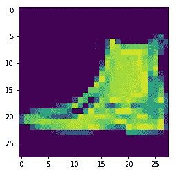
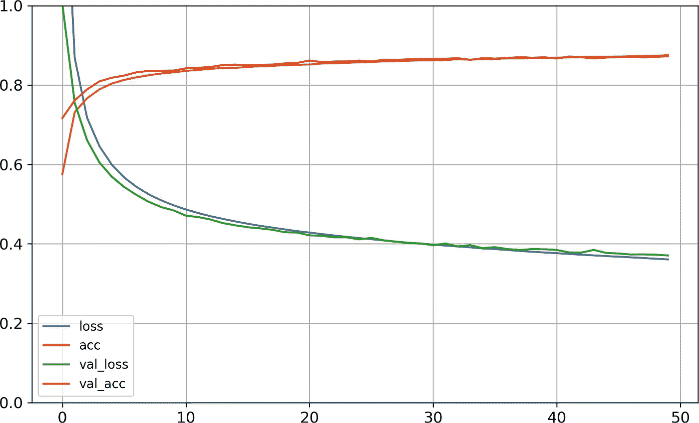

# 利用 Tensorflow 2.x 的高级 API 进行影像分类

> 原文：<https://medium.com/hackernoon/image-classification-with-tensorflow-2-0-d5a98bcffce1>

## 与之前的版本不同，[*# Download dataset with Keras utility function*fashion_mnist = keras.datasets.fashion_mnist
(X_train_full, y_train_full), (X_test, y_test) = fashion_mnist.load_data()print(X_train_full.shape)
(60000, 28, 28)

将数据集分成训练集、验证集和测试集始终是一个好的做法。因为我们已经有了测试集，所以让我们创建一个验证集。我们可以将数据的像素强度除以 255.0，从而将其调整到 0–1 的范围内。缩放导致更好的梯度更新。

```
X_valid, X_train = X_train_full[:5000] / 255.0, X_train_full[5000:] / 255.0y_valid, y_train = y_train_full[:5000], y_train_full[5000:]
```

我们可以使用 matplotlib 查看任何照片。

```
plt.imshow(X_train[5])
```



## 使用 Keras 顺序 API 创建模型

现在是时候建立我们简单的图像分类人工神经网络了。

```
model = keras.models.Sequential()
model.add(keras.layers.Flatten(input_shape=[28, 28]))
model.add(keras.layers.Dense(300, activation="relu"))
model.add(keras.layers.Dense(100, activation="relu"))
model.add(keras.layers.Dense(10, activation="softmax"))
```

如果你没有得到它，那么不要担心，让我一行一行地解释代码。

**顺序**模型是层的线性堆栈，按顺序连接。

下一层，即 **Flatten** 只是将 28x28 维数组转换成 1D 数组。如果它接收输入数据 X，那么它计算 X . shape(-1，1)。它需要一个 **input_shape** 参数来指定输入数据的大小。但是，Keras 可以自动检测到 input_shape。

**密集**层是神经网络中全连接的神经元。这里有两个隐层，第一个隐层有 300 个神经元，第二个隐层有 100 个神经元。

最后一个致密层由输出层中的 10 个神经元组成。它负责计算损失和预测。

## 现在，我们需要编译我们的模型

Keras 有一个 compile()方法，它指定要使用的损失函数、优化器和度量。

```
model.compile(loss=keras.losses.sparse_categorical_crossentropy,
optimizer="sgd", metrics=["accuracy"])
```

## 培训和评估

模型编译后，我们可以通过指定历元、批量大小等来拟合()方法。

```
*# Training model for 30 epochs*history = model.fit(X_train, y_train,
epochs=30, validation_data=(X_valid, y_valid*))*
```

该方法将训练 30 个时期的模型。训练丢失、验证丢失和训练精度、验证精度可在**历史中找到。**

我们可以使用**历史**创建学习曲线的可视化。

```
import pandas as pd
pd.DataFrame(history.history).plot(figsize=(8, 5))
plt.grid(True)
plt.gca().set_ylim(0, 1) *# set the vertical range to [0-1]*
plt.show()
```



Source: “Hands-on Machine Learning with Scikit-Learn, Keras, and TensorFlow”

我们可以看到，验证曲线和训练曲线之间的空间很小，这就是为什么没有过度拟合的问题。

现在，我们可以尝试不同的超参数来提高数据集的准确性。

如果您对训练和验证的准确性感到满意，那么就在测试集上对其进行评估。

```
model.evaluate(X_test, Y_test)
```

> *测试集的精度可能低于验证集，因为超参数是为验证集调整的。*

## 保存训练好的模型

当你在测试集上训练和评估了你的神经网络模型后，你可以使用 Keras save()方法下载你的模型，然后可以随时加载它进行推理。

```
# save your model as HDF5 format
model.save("my_keras_model.h5")
```

它保存模型的架构和每个层的所有模型参数的值(所有训练的权重和偏差)。

如果您想使用您的训练模型进行推理，只需加载它:

```
model = keras.models.load_model("my_keras_model.h5")
```

现在，是时候自己训练不同的数据集了。祝你好运😄！

**推荐:**](https://medium.com/u/b1d410cb9700# tensorflow implementation of keras</em><br/>import matplotlib.pyplot as plt</span><span id=) 

[*   深度学习专业化(Coursera)](https://medium.com/u/b1d410cb9700# tensorflow implementation of keras</em><br/>import matplotlib.pyplot as plt</span><span id=)
2.  [《用 Scikit-Learn 和 TensorFlow 进行机器实践学习》作者](https://medium.com/u/b1d410cb9700# tensorflow implementation of keras</em><br/>import matplotlib.pyplot as plt</span><span id=) [Aurélien Géron](https://medium.com/u/c939be75faee?source=post_page-----d5a98bcffce1--------------------------------) (作者 O'Reilly)

**你可以通过**[**【twitter.com/aniketmaurya】**](http://twitter.com/iamaniketmaurya)**联系我或者留言安📧在**[**aniketmaurya@outlook.com**](http://aniketmaurya@outlook.com)