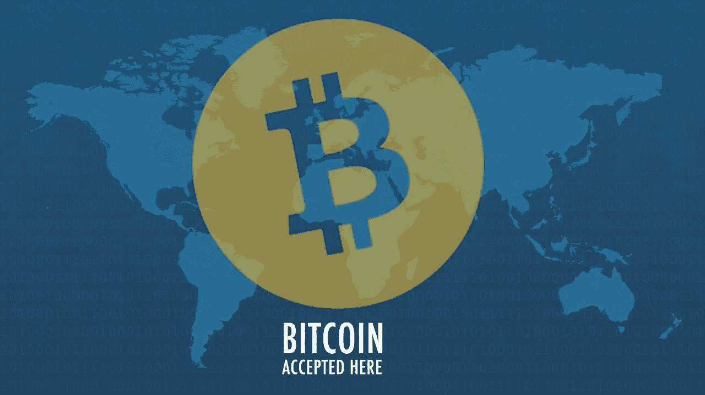
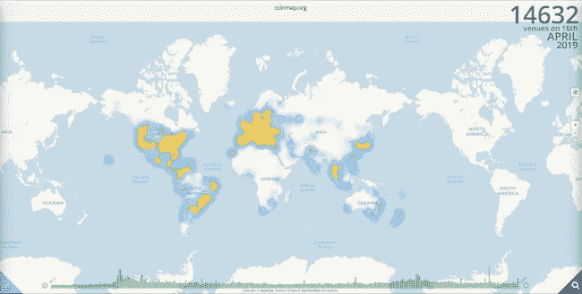
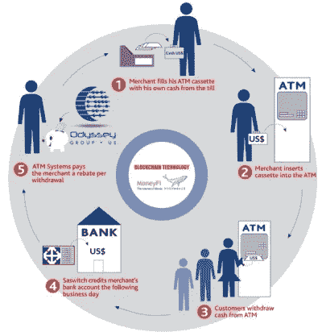

# IMF 调查显示对加密支付解决方案的真实需求

> 原文：<https://medium.com/hackernoon/imf-poll-shows-real-demand-for-crypto-payment-solutions-9bdfc21a25e6>

4 月 10 日，国际货币基金组织发起了一项推特民意调查，询问“你认为 5 年后你将如何支付午餐费用？”。选择包括现金、加密货币、手机和银行卡。加密货币的选择获得了 37，000 张选票中的 56%,其次是通过手机，占 27%。因此，国际货币基金组织的调查可以作为未来的线索吗:大规模采用加密货币？加密支付成为主要支付方式的潜力是实实在在的。

# 接受加密支付的商家正在增加

卡巴斯基 2018 年货币报告调查发现，13%的人使用过加密支付。这项研究收集了来自 22 个不同国家的 12，000 多名消费者的反馈。越来越多的企业提供加密货币作为支付方式。企业包括接受加密支付的零售商和食品商店。卡巴斯基实验室增长中心验证主管 Vitaly Mzokov 说:

> “尽管加密货币价格下跌，但消费者对数字交易仍有强烈的需求。我们的消费者研究发现，13%的人使用加密货币作为支付方式，这令人惊讶。”

上面的图片来自 Coinmap，它显示有超过 14，600 家机构接受加密支付。

# 加密支付的有力证据

Apple Pay、Google Pay 和 Samsung Pay 等移动非接触式支付正在兴起。根据 Statista 的数据，从 2015 年到 2018 年，NFC(近场通信)移动支付用户[的数量增加了两倍多，从 5390 万增加到 1.66 亿。NFC 移动支付的采用需要一段时间，但在短短 6 年内，我们的用户从 2012 年的 500 万增加到 1.66 亿。27%的投票者选择手机，上面的数字确实有意义。还记得我们关于三星 Galaxy S10](https://www.statista.com/statistics/461512/nfc-mobile-payment-users-worldwide/) 中的[加密钱包的文章吗？三星是这一领域的先行者，其他公司很可能会紧随其后。因此，我们可以假设电话公司正在为采用加密支付打下坚实的基础。](https://moonwhale.io/ways-samsung-global-crypto-adoption/)

## 脸书和 WhatsApp

在另一篇文章中，我们讨论了 WhatsApp 与第三方加密钱包开发商 Wuabit 的加密支付的可能关系。Whatsapp 在 109 个国家拥有 15 亿用户。最受欢迎的国家包括印度、巴西、墨西哥、俄罗斯和许多其他国家。由于发展中国家庞大的用户数量和良好的声誉，他们可以成为推动加密应用的主要力量。

Wuabit 将于本月推出公共测试版。根据他们在 [Medium](/wuabit/introducing-wuabit-the-first-crypto-wallet-for-whatsapp-28faf4c315e4) 的文章，Wuabit 将 WhatsApp 定位为第一即时通讯平台，因为它在全球范围内广受欢迎。很快，他们将致力于整合脸书信使、电报、微信和 Viber。Wuabit 还计划将这项服务扩展到其他流行的加密项目，如莱特币、[比特币](https://hackernoon.com/tagged/bitcoin)现金和以太坊。因此，使 WhatsApp 成为未来真正的支付解决方案。

## 比特币基地

比特币基地推出了一项新的支付服务，用户可以“免费国际汇款”我们可以假设比特币基地也在建设加密支付的基础设施吗？此外，总部位于旧金山的加密货币交易所正在英国推出一种 [Visa 卡](https://edition.cnn.com/2019/04/11/business/bitcoin-visa-debit-card/index.html)，允许用户用比特币、以太坊和莱特币支付。

> “比特币基地卡支持所有可以在比特币基地平台上买卖的加密资产，这意味着他们可以用比特币支付一顿饭，或者使用以太坊来支付回家的火车票，”比特币基地英国分公司负责人 Zeeshan Feroz 在一篇博客文章[中说。](https://blog.coinbase.com/spend-your-crypto-instantly-with-coinbase-card-4c840e59a8d8)

# 拉丁美洲准备开发加密支付

自 2019 年初以来，拉丁美洲的加密采用量达到了历史最高水平，记录了 8，000 笔交易。虽然世界上大部分地区仍在努力度过漫长的加密冬天，但南美交易员似乎致力于加密货币事业。数字代币被视为摆脱经济和政治动荡的最有效方式。委内瑞拉金融危机和国际制裁导致公民放弃玻利瓦尔，转而选择其他货币。然而，似乎成千上万的人没有转向外币，而是选择了加密货币。CoinDance 的统计数据还显示，自今年年初以来，邻近的哥伦比亚的交易量大幅上升。

与此同时，在阿根廷，CoinDance 的 LocalBitcoin 数据显示，交易量已达到 2019 年的高点。成交量超过 850 万，是有史以来第二高的周成交量。据一名阿根廷加密货币专家对新闻媒体 La Verda 表示，该国目前约有 20，000 人拥有加密货币。如果这是真的，这意味着一个相对较小的公民群体在进行这个国家的大部分交易。拉丁美洲能从无缝集成加密支付的新货币系统中受益吗？

加密货币在拉丁美洲的流行为构建加密支付解决方案提供了机会。因此，远见者开发新货币体系的环境已经成熟。

事实上，有一个项目寻求建立一个以区块链为基础的货币体系，这无疑可以挑战传统体系。

# 介绍 MoneyFi

[MoneyFi](http://moneyfi.io/) 平台是基于数字资产交易的跨境货币汇款沟通渠道。用户将能够通过 MoneyFi 应用程序汇款，该应用程序使用其本地[加密货币](https://hackernoon.com/tagged/cryptocurrency)令牌“Nemoo”进行结算。该应用集成到现有的基础设施中，包括一个全球 ATM 处理网络，将促进新开发的菲亚特-加密混合 ATM。MoneyFi 是总部位于迈阿密(美国)的 Odyssey 集团旗下的一家风险投资子公司，作为特殊目的机构。

Odyssey Group 由 Sebastian Ponceliz 2014 在美国创立，是一家活跃在美国、阿根廷、西班牙和意大利的零售银行支持组织。该公司为自动售货机(部署了 1000 多台)和传统 ATM(部署了 1000 多台)提供其专有的八角形网络，这是一个管理其 ATM 网络的交易处理平台。Odyssey 最近收购了一家阿根廷银行和一家信用卡制造商，以扩大其业务。

MoneyFi 不仅致力于解决对更好的汇款系统日益增长的需求，还致力于解决拉丁美洲对稳定的加密支付解决方案的需求。似乎他们的目标是包括商家、消费者和银行在内的整个支付生态系统。

目前，没有太多关于这个项目的信息可以找到。然而，随着时间的推移，项目背后的公司将透露更多信息。

*免责声明:所提供的信息仅用于教育目的，不应用作财务建议。关于 MoneyFi 的信息由该公司直接提供。*

# 关于我:

**Iliya Zaki 是一家总部位于美国的公司**[**【STO 咨询公司】**](https://moonwhale.io/sto-ico/)**[**moonwale Ventures**](https://moonwhale.io/)**的业务开发和营销主管。****

**在我们的各种社交媒体平台上关注我们—**

**[推特](https://twitter.com/MoonwhaleBV) | [领英](https://www.linkedin.com/company/moonwhalebv) | [脸书](https://www.facebook.com/MoonwhaleBV/) | [电报](https://t.me/moonwhaler)**