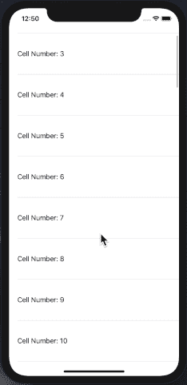

# 使用 Swift 5 在 iOS UITableView 中实现无限滚动或分页

> 原文：<https://medium.com/hackernoon/implement-infinite-scroll-or-pagination-in-ios-uitableview-using-swift-5-67ea1c4d236>


无限滚动是现代应用程序的基本要求之一。这是一种设计模式，当用户向下滚动时，内容会不断地加载到界面中。也称为无限滚动，重点是用户永远不会到达页面的末尾。取而代之的是，他们可以看到一个永久的内容流，而不需要点击或者在分页导航上花费认知负荷。

听起来熟悉吗？应该可以。大多数人在日常社交媒体浏览中使用无限滚动——想想脸书、Instagram 或 Twitter。

# 使用无限滚动的优势

无限滚动肯定有它的好处；如果没有，大型科技巨头就不会使用这种模式。例如:

*   用户在无限滚动的页面上消费更多的内容。
*   互动成本基本为零，认知负荷也相应较低。
*   滚动对于移动用户来说是一个直观的动作
*   无限滚动在“发现界面”上运行良好，这些界面的目标是让用户消费越来越多的同类内容

因此，如果一个页面上的所有项目都具有相同的层次结构，并且在概念上是相关的(比如播客中的片段)，如果设计的目标是让用户参与到内容中，那么 UI 和 UX 设计师应该考虑无限滚动。

> 冗长、无休止的页面有利于消磨时间，因为用户倾向于意外的探索和发现。不必获取并点击“下一页”的优势是让观众与内容保持互动。” [*和洛朗格，NN 组*](https://www.nngroup.com/articles/infinite-scrolling/)

# 如何使用 swift 在 iOS 中实现无限滚动

在我们的 iOS 应用中，我们必须在所有的表格视图中实现分页/无限滚动；而这个任务是分配给我的，让我想想，如果我没有错的话他们是六个人。

嗯，我很擅长想象😅以下图片是我能找到的最接近我想象的图片。


在每个视图控制器中添加分页是错误的，所以我决定做一些不同的事情。一些同样的时间和精力，更少的重复和单一的地方，我们可以修复错误，改变设计，或添加功能等。

> 所以我决定做一个 PaginatedTableView 库。

# 拯救 PaginatedTableView 库

[](https://github.com/salmaanahmed/PaginatedTableView) [## salmaanahmed/PaginatedTableView

### 将这个类分配给你的 UITableView，它将配备拉刷新以及无限滚动…

github.com](https://github.com/salmaanahmed/PaginatedTableView) 

将这个类分配给你的 UITableView，它将配备拉刷新、无限滚动和回调功能，你不必担心页码/大小的问题。这就是图书馆存在的原因，❤️🙂

# 设置分页表格视图的分步指南

**第一步:**分配自定义类

**第二步:**记住只分配分页的委托和数据源，不要分配`tableViewDelegate`或`tableViewDataSource`

**第三步:`ViewDidLoad`上的**调用可选参数 refresh true 的 load 方法

**步骤 4:** 实现存根并调用 api

**第五步:享受**
耶！就这些。现在你有了分页的表格视图，可以无限滚动，还可以拉刷新❤️
很简单，不是吗？✋ 😉



PaginatedTableView

PaginatedTableView 可通过 [CocoaPods](https://cocoapods.org/) 获得。要安装它，只需将下面一行添加到您的 Podfile 中:

```
pod 'PaginatedTableView'
```

你对 github 上的这个库的赞赏是我❤️的巨大动力

> 所以关键不是努力工作，而是聪明地工作


这是我的第一个 iOS 库，因为我之前一直在 android 上工作。我在下面的文章里分享了我的平台切换经验。

[](https://hackernoon.com/a-journey-from-android-development-to-ios-development-in-2018-kotlin-and-swift-e2601eb97174) [## 2018 年从 android 开发到 iOS 开发的旅程——kot Lin 和 Swift

### 早在 2014 年，我就开始了我作为 android 应用程序开发人员的职业生涯，我参与了许多项目，包括核心 android…

hackernoon.com](https://hackernoon.com/a-journey-from-android-development-to-ios-development-in-2018-kotlin-and-swift-e2601eb97174)