# 在 Tezos 中实现多签名智能合同；使用原因

> 原文：<https://medium.com/hackernoon/implementing-a-multi-sig-smart-contract-in-tezos-using-reasonml-1066d080eb68>

## 本文将带您为 tezos 建立一个智能契约开发环境。同时解释如何使用 ReasonML & Liquidity 设计和实现一个精益的多签名智能契约。

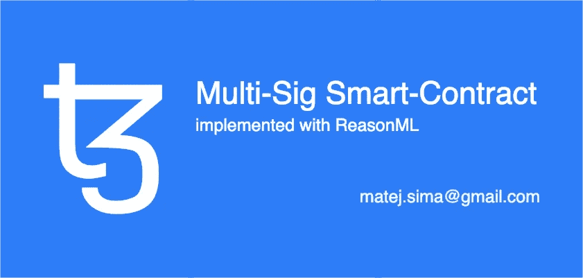

# 先决条件

这篇文章假设至少对区块链技术的工作原理有一个基本的了解。我们将使用沙盒 Tezos [网络](https://hackernoon.com/tagged/ne)来开发我们的智能合约，但同样的过程也适用于其他网络，如 Alphanet 或 Mainnet。我们开始吧！

> **🚨免责声明**
> 
> 以下合同仅用于教育目的，未经审计或审查，请谨慎使用。
> 
> 如果你想快进一点，你可以在这里找到最终智能合约的源代码。*🏎*

# 什么是多重签名？

多重签名是一个范例，用于**划分资金** **的责任。在我们的例子中，我们希望两个用户共享对他们的ꜩ的控制权。**

# 设置 sanboxed 环境

为了开发我们的智能合同，我们将从设置[tezos-environment-manager](https://github.com/maht0rz/tezos-environment-manager)开始。

> 你可以在这里阅读对 tezos-环境管理器[更详细的介绍。*👈*](https://hackernoon.com/tezos-smart-contracts-with-reasonml-docker-and-a-sandboxed-node-89df929ca1cf)

设置非常简单:

1.  克隆[仓库](https://github.com/maht0rz/tezos-environment-manager)
2.  选择一个环境
3.  构建图像
4.  启动节点，*启动*大约需要 30 秒
5.  启动客户端

> *⏰在构建您的 docker 映像时，请耐心等待，在未来的版本中，这些映像将在 hub.docker.com 可用*

Setting up [tezos-environment-manager](https://github.com/maht0rz/tezos-environment-manager)

# 设计我们的智能合同

要实现多签名功能，我们首先需要知道**谁控制账户(合同)**。在我们的例子中，应该是两个不同的账户(也就是钱包)。我们的沙盒环境已经提供了一些可用的帐号，它们的别名是 **bootstrap1** 到 **bootstrap5。**

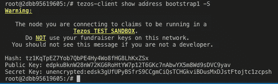

Account aliased as bootstrap1 and it’s keys

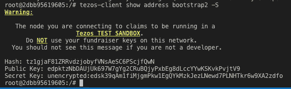

Account aliased as bootstrap2 and it’s keys

我们的所有者应该是**bootstrap 1&bootstrap 2**，，实际上，这意味着这些帐户(私钥)通常由两个不同的人持有，他们可以通过我们正在开发的智能合约一起参与多签名交易。

> ⚠️:我们聪明的契约是用理性写成的，但它被转化为流动性，并从那里编译成迈克尔逊

## 入口点

我们将在合同中公开四个入口点:`create_proposition`、`sign_proposition`、`delete_proposition`、`execute_proposition`。随着教程的深入，我们将逐一介绍。

流程应该如下进行:

1.  提出新的交易
2.  与所有合同所有人签署提议的交易(个人切入点电话)
3.  一旦所有人都签字了，就执行这个提议。

或者，您可以在流程中途删除一个提议，以便能够创建一个新的提议。

## 仓库

智能合约可以**通过其存储将数据存储在链**上，存储被定义为类型，并且在部署之前用默认值 **初始化**。****

这使我们能够部署无数的多签署合同，这些合同由不同的帐户组合拥有。

我们的存储将由以下属性组成:

1.  一组所有者—基本上是一组地址，可以操作我们的智能合同
2.  提议——由合同所有人之一提出的交易建议，指明应发送的金额和发送对象。*(目的地，金额)*
3.  一组所有者，他们签署了现有提议—同样是“一组”帐户，他们是智能合同的所有者，在合同中成功提出交易后，他们签署了提议的交易。

> *🔬顺便说一句——每份合同都必须指定它所使用的 Liquidty 语言的版本，所以我们就在文件的顶部这样做吧*

让我们从在`src/contracts`下创建一个文件开始编码，我们可以称它为`multisig.re`。以下所有与合同相关的代码都应该在我们的合同文件中结束。

Each contract specifies the Liquidity version it’s written in at the top

Contracts can store data in storage, which is of a certain type.

为了简单起见，让我们也立即初始化我们的存储。我们将使用`bootstrap1` & `bootstrap2`来设置我们的存储器中的`owners`。我们将省去其他存储属性“空白”，因此有一个变量`None`和一个空的`Set`。

Storage can be initialised, in our case with predefined owner addresses

# ACL —访问控制锁

我们的智能合同需要**限制对某些入口点的访问。**我们可以通过将通过事务调用我们的合同的人的**地址与我们指定为初始存储的所有者**的**地址进行比较。**

让我们定义一个可以重用的方法，我们称之为`can_call`，它接受一个参数，即当前的存储值。此外，我们将实现一个助手方法`fail_with_wrong_ownership`，它使当前的契约事务失败——我们将在`can_call`评估为`false`时使用它。

# 提议多签名交易

为了在我们的多签名契约中提出一个新的事务，我们将使用一个叫做`create_proposition`的方法，它有两个参数，一个是类型`proposition`的，另一个是类型`storage`的。

该方法的流程相对简单，首先检查当前事务是否是由所有者之一发起的，如果不是，则因为所有权问题而失败。如果一个实际的多签署合同所有者调用这个入口点，检查是否已经有一个现有的提议，如果有，失败，因为我们不想覆盖它和丢失它的数据。如果没有现有的命题，将我们的新命题保存为当前命题。

# 删除多签名命题

有出路总是好的，在我们的例子中，我们允许预定义的所有者在创建一个新的命题之前删除一个未决的命题。我们的`delete_proposition`入口点没有参数，因此我们使用`unit`。

我们再次检查谁在调用契约入口点，如果我们的 ACL 通过，我们删除现有的未决命题，如果没有，我们中止操作。

# 签署多签名提案

为了执行提议的交易，我们必须先签字。我们将有一个入口点来实现这一点，它将由每个所有者独立调用，以提供所有者独有的命题签名。

首先，我们像在`delete_proposition`中一样检查 ACL，如果通过，我们将添加一个基于`Current.sender()`的签名，T10 是调用我们事务入口点的帐户的地址，它是合同所有者之一。

> `*Set.add*`仅在值是唯一的情况下将值添加到集合中，这意味着如果您多次调用`*sign_proposition*`入口点，由同一个所有者签署契约调用事务，您将不会创建第二个签名，因为我们集合中的地址是唯一的。

# 执行多签名提案

在所有的所有者都签署了提案之后，我们就可以执行提案了。

我们首先验证我们的 ACL，如果通过，我们检查现有签名的数量是否与多签名合同所有者的数量相匹配。如果我们有足够的(100%)签名覆盖率，我们继续创建一个`Account.transfer`交易，目的地&金额取自我们提议的交易。

我们通过返回一个清理过的存储来结束入口点执行，这要感谢前面定义的`delete_proposition`帮助函数，它将我们的存储重置回没有现有命题&签名的初始状态。我们指定一个要作为调用结果执行的交易/操作——这是一个给定金额的对目标帐户的建议交易。

**🎉恭喜您，您的智能合同现已准备好部署到区块链！🎉**

*您可以在这里* *找到* [*全合同的来源。*](https://github.com/maht0rz/tezos-environment-manager/blob/master/src/contracts/multisig.re)

# 部署我们的智能合同

我们现在将回到我们的客户端外壳，我们已经开始运行`make client`。

首先，我们必须将我们的 ReasonML 代码转换/翻译成 Liquidity 代码，我们可以使用`refmt`来做到这一点，这是一个用于将 ReasonML 转换成 OCaml 的工具，反之亦然，由于 Liquidity 是 OCaml 的子集，我们也可以在我们的合同中使用它。

Converting ReasonML to Liquidity

> 现在我们有了一个名为`multisig.liq`的文件，你可以用你的编辑器检查它，语法应该是 OCaml，所以如果它不能马上识别`.liq`，不要忘记配置你的编辑器

## 伪造部署行动

我们现在将**伪造一个我们可以签署的部署操作**。在我们这样做之前，让我们检查一下到底会发生什么。

我们使用 Liquidity 的 CLI，本地沙盒节点为`$NODE_URL`

在执行提议的交易时，我们的合同将消耗`1000tz`的金额。

指定费用`1tz`，作为面包师将我们的经营纳入新街区的激励。

Source 是促进部署的帐户地址——在我们的例子中是`bootstrap1`,他也是多签名合同的所有者和我们沙盒环境中的面包师。

## 签署部署操作

我们现在有了要签名的操作字节，所以让我们通过运行下面的命令来完成它。我们会签为`bootstrap1`。

确保保存生成的签名，我们将在下一步中使用它。

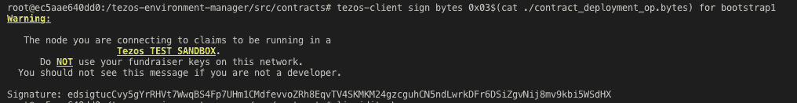

## 用签名注入部署操作

部署过程的下一步是注入一个操作，使用前面生成的字节和签名。

> 请注意，您生成的签名可能会有所不同，请确保将真正的签名**复制到下面的命令中。**

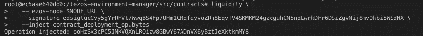

## 在 TzScan 查找我们的合同

此时，我们的合同尚未包含在新的块中，因为我们自己尚未烘焙新的块。让我们通过在您的浏览器中访问[http://localhost:8000/contracts](http://localhost:8000/contracts)来确保我们还不能在 TzScan 上看到我们的合同。

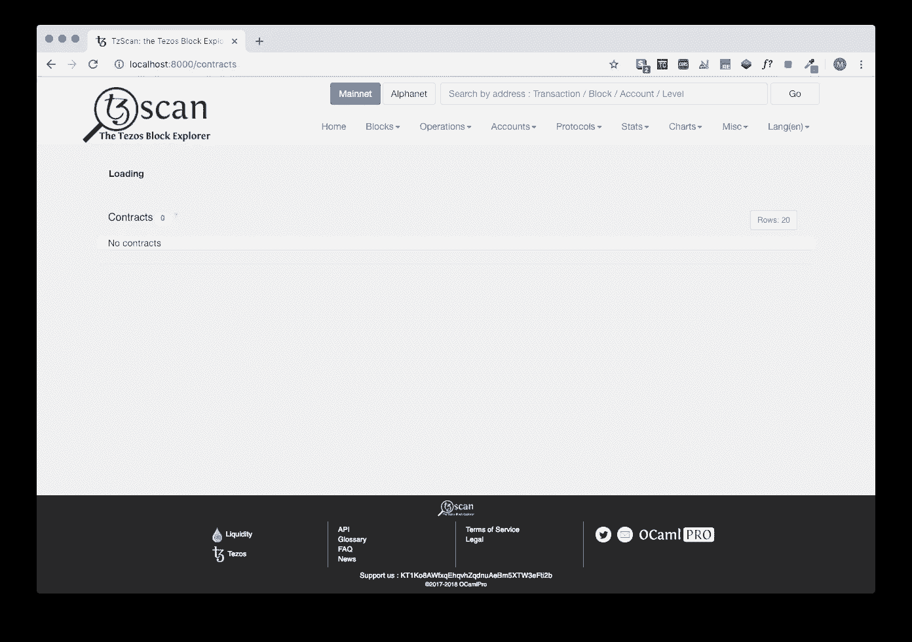

No contracts available at this time

## 烘焙一个新的块来包含我们的部署操作

为了在我们的沙盒环境中完成部署过程，我们必须烘焙一个新的块，以便包括部署操作。

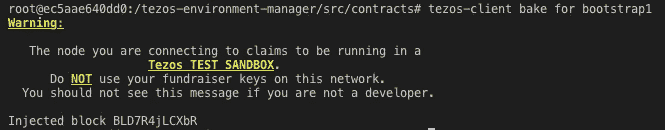

New block has been baked, including our smart contract.

**🎉您现在可以再次检查 TzScan，您将看到我们的多签名合同已部署🎉**

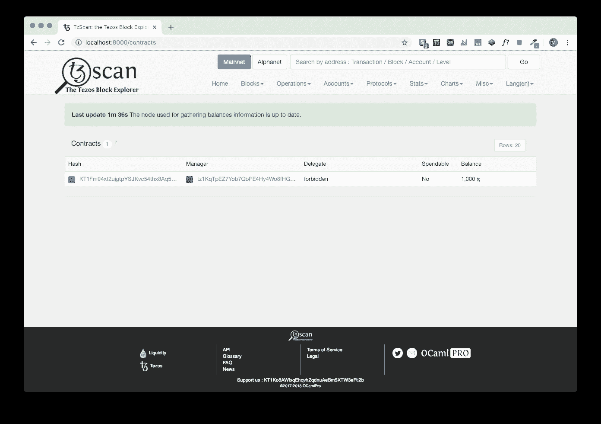

Contract has been deployed successfully

# 与我们的智能合同对话

在我们开始与我们的智能合约交互之前，让我们看看它在 TzScan 上是什么样子的。

我们可以看到我们的合同的当前存储状态，现在除了我们预定义的一组所有者— `bootstrap1` & `bootstrap2`之外，什么也没有。

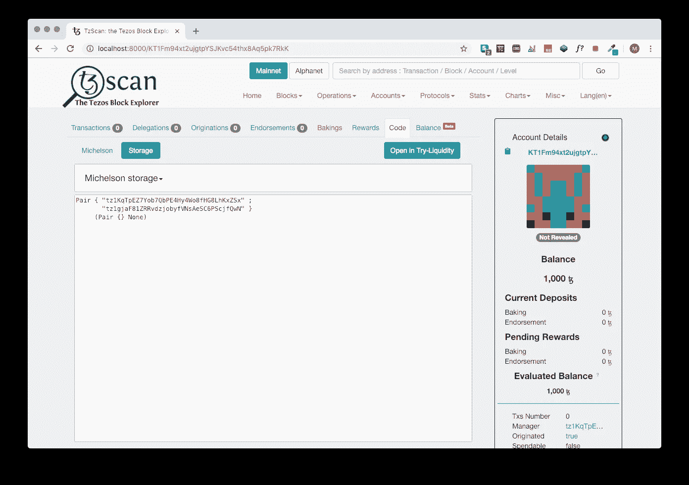

Storage is initialised correctly

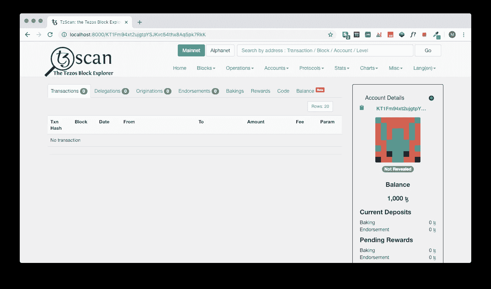

There are no transactions yet, and the balance is 1000tz

## 创建一个多签名提案，由一个不公正的所有者签名

与我们的智能合约的一个可能的交互是使用一个帐户调用一个入口点，该帐户在我们的合约中没有被列为所有者。

让我们看看如何结束，我们将使用我们的客户的`bootstrap3`帐户，这在我们的合同中没有使用。

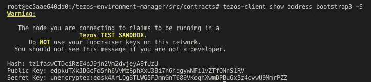

Retrieving the keys for bootstrap3

然后，我们从这里复制我们部署的智能合同的地址:

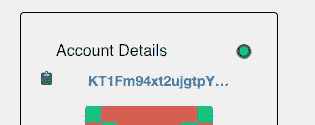

在我的情况下，合同地址是`KT1Fm94xt2ujgtpYSJKvc54thx8Aq5pk7RkK`。

我们现在可以使用`bootstrap3`的键和我们的智能契约地址来执行契约入口点调用。我们将向`bootstrap4` → `tz1b7tUupMgCNw2cCLpKTkSD1NZzB5TkP2sv`提出一笔金额为`0.01tz`的交易。

> ⚠️在调用`create_proposition`时，我们也必须指定参数，在本例中是我们的`new_proposition`。用于指定参数值的语法是 Liquidity/Ocaml。

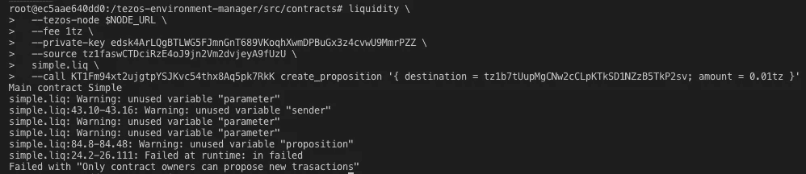

Failed contract call

这个调用将不可避免地失败，因为我们的 ACL 逻辑就是这样设置的——除了预定义的所有者之外，不允许任何人创建事务提议。

## 创建由合法所有者签名的多签名提议

如果我们使用`bootstrap1`的钥匙签署我们的呼叫，我们就能够成功地呼叫合同并创建一个提议。

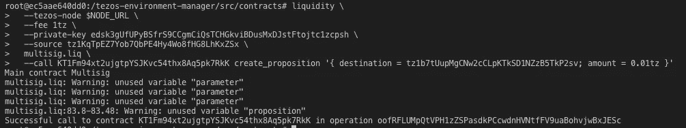

Successful contract call

为了让我们的契约调用生效，我们必须再次在我们的沙盒环境中烘焙一个新的块:`tezos-client bake for bootstrap1`。

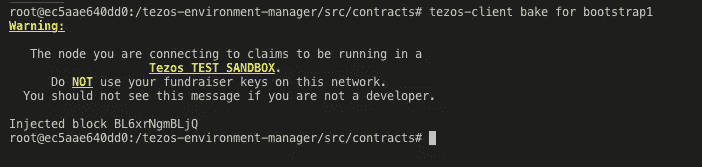

Baking a new block to include our contract call

我们可以使用 TzScan 验证我们的呼叫/交易是否包含在链中:

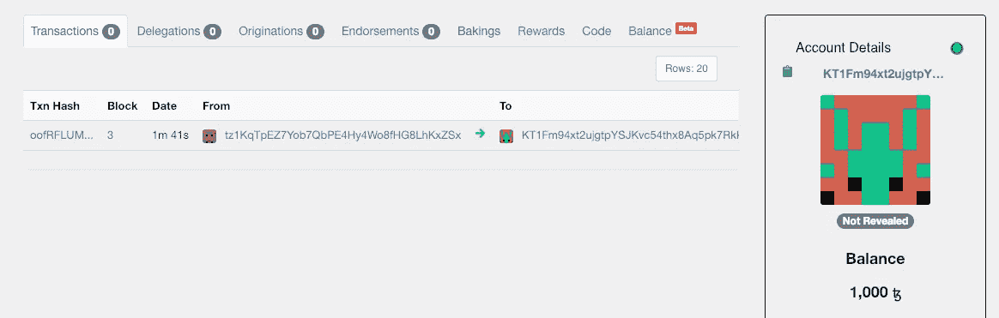

Transaction has been included

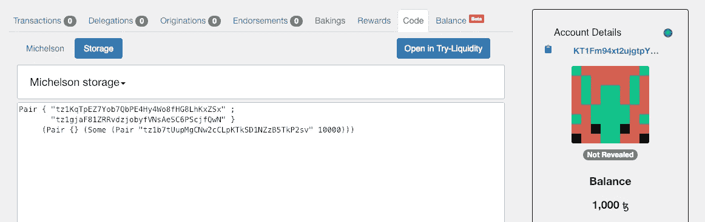

Storage has been updated with the proposed transaction

## 合同所有人签署建议书

在我们可以执行我们提议的交易之前，我们必须由合同所有人签字，让我们分两次给`sign_proposition`打电话，由不同的所有人签字并盖章我们的提议。我们将使用`bootstrap1`和`bootstrap2`来签署我们的提议。

> *👉*如果你想冒险，你可以试着用一个账户给`sign_proposition`打电话，这个账户不是指定的所有者。由于我们的 ACL 限制，它应该会失败。

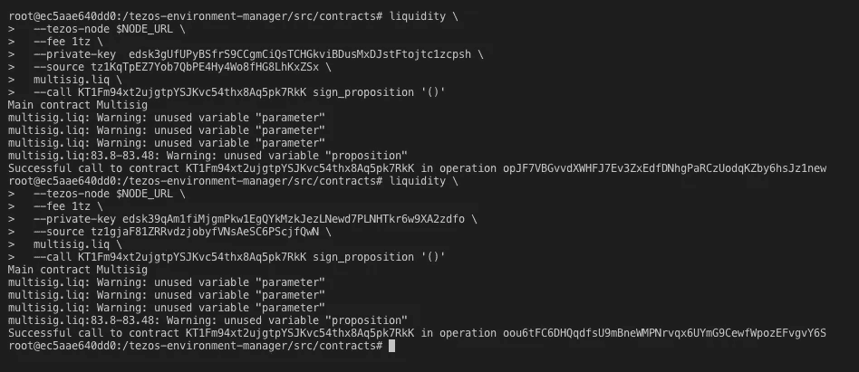

Two independent sign_proposition calls successfully executed

现在我们只需要烘焙一个新的块，来包含我们的调用。

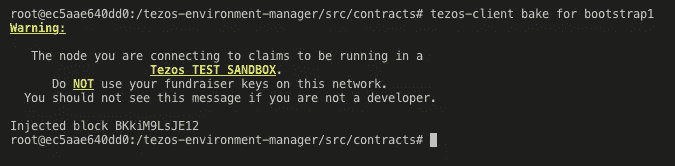

返回 TzScan 以验证我们的通话是否包含在内:

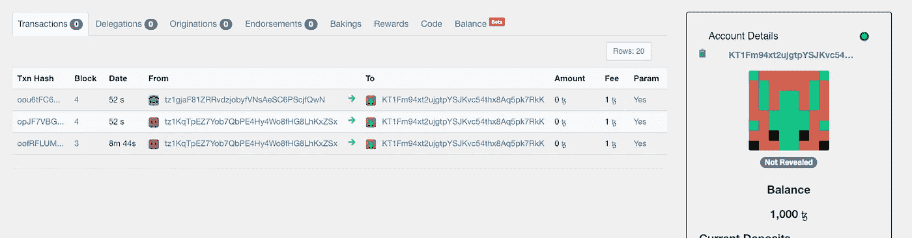

Two new transactions are visible, one for each sign_proposition call

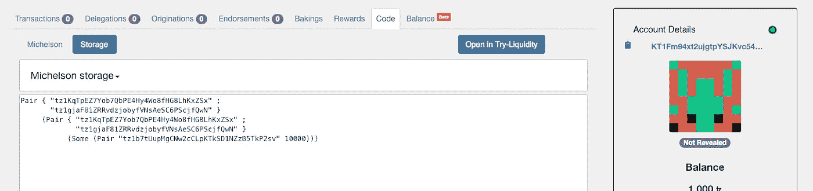

Two signatures have been added to our contract’s storage

## 执行提议的交易

就是这样，时间终于到了。我们将执行一项交易，该交易已由多签名合同的所有人签名。我们将使用`bootstrap1`来完成交易，并将合同提交给`execute_proposition`。

Executing the proposed transaction

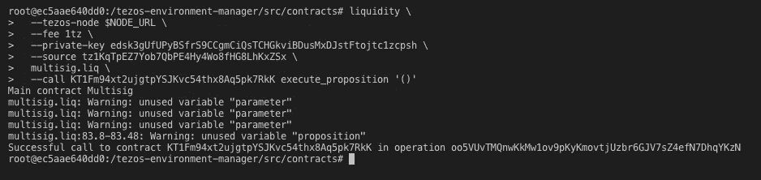

Successful call to execute_proposition

再次烘焙一个新的块来包含我们的操作。

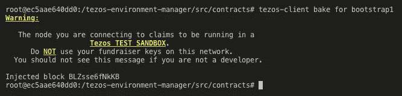

回到 TzScan，我们会注意到合同的存储回到了原始状态，只定义了所有者，并且`0.01tz`已经从我们的合同转移到了`bootstrap4`。

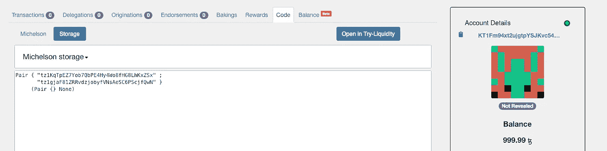

Contract storage has been reset

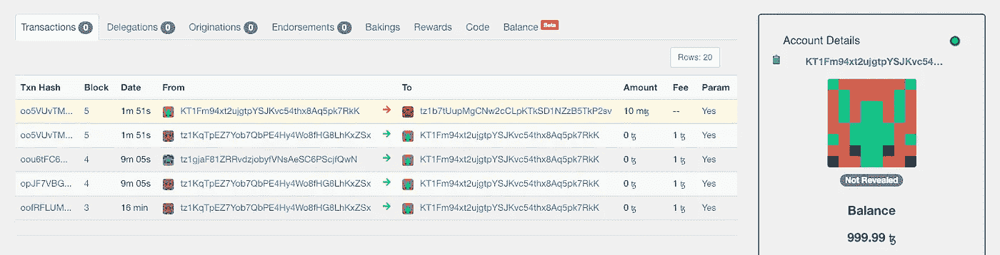

0.01tz has been transferred to tz1b7tUupMgCNw2cCLpKTkSD1NZzB5TkP2sv → bootstrap4

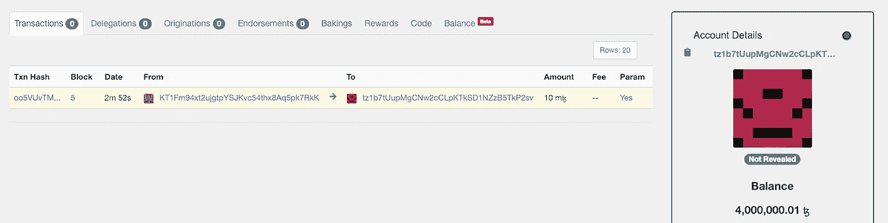

Bootstrap4 has indeed received our multi-sig transaction

**🎉就是这样！我们已经成功部署了一个多签名智能合同，并且能够使用它来提议交易、签名并执行交易，从而更新我们的合同和目标客户的余额。🎉**

## 让我知道你的想法

你有任何问题或意见吗？运行代码有问题吗？你发现错误了吗？

我很想听听你的想法，你可以通过 t.me/maht0rz 或 matej.sima@gmail.com 联系我

> ***可以在:***
> ETH:0x 56 ba 1a 8681 db 66 DD 7 f 3158 a5e 2623577 D2 Fe 7 EC 2 捐款。
> 
> **BTC**:BC 1 qcc 7j 72 wl 7 l 8 mue pr 3 rewjfn 3 HDZ q 7h 9j 4 RPR 50
> 
> XTZ:tz 1 njgqajnlk 6 axrpj 78 fdwtjc 68y 9 clcrvf

***编辑:*** *感谢**[*亚瑟·布莱特曼*](https://medium.com/u/50f422e6e1a9?source=post_page-----1066d080eb68--------------------------------) *对于指出合同中可能存在的漏洞，可以在此处* *查看修订历史* [。](https://gist.github.com/maht0rz/2bb5469d58ee71a07ea449fcbd0e4a97/revisions)*

# *额外资源*

***词汇:**https://zeronet.tzscan.io/glossary*

***原因 ML 文档:**[https://reasonml.github.io/docs/en/what-and-why](https://reasonml.github.io/docs/en/what-and-why)*

***TQGroup 的学习:**[https://learn.tqgroup.io/](https://learn.tqgroup.io/)*

***流动性参考:**[http://www.liquidity-lang.org/doc/reference/liquidity.html](http://www.liquidity-lang.org/doc/reference/liquidity.html)*