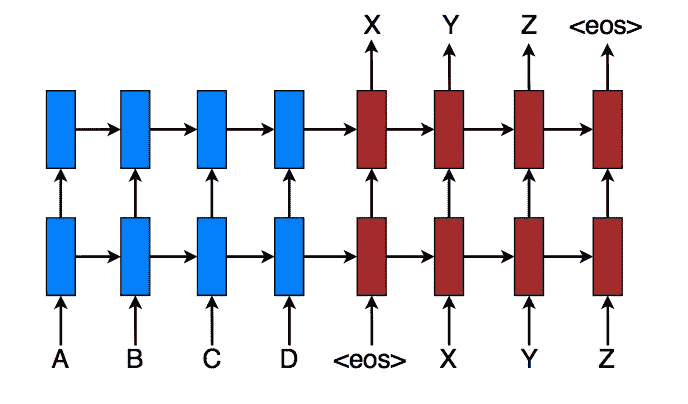
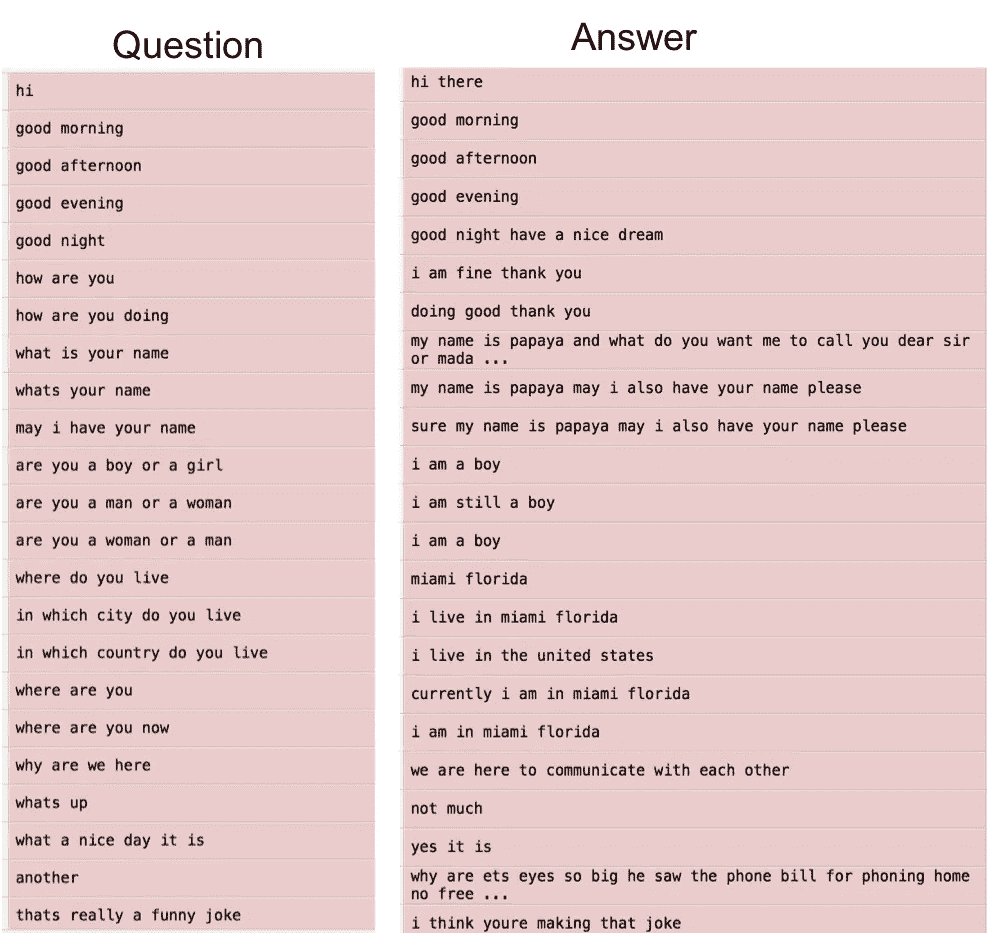
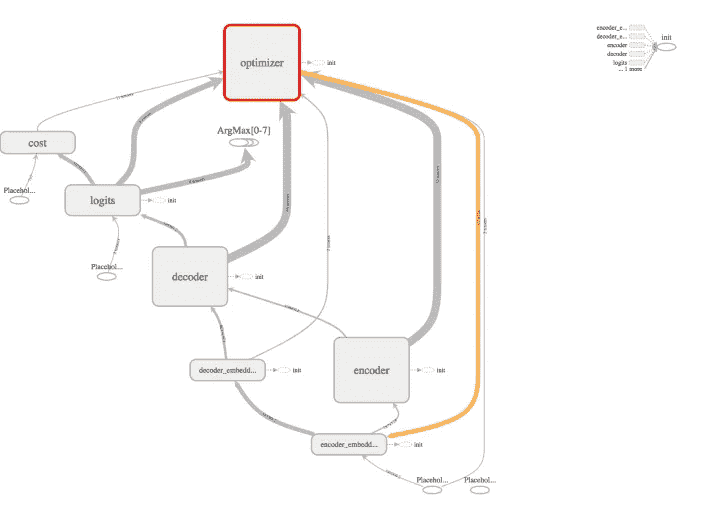

# 实现序列到序列模型

> 原文：<https://medium.com/hackernoon/implementing-a-sequence-to-sequence-model-45a6133958ca>

*在这篇文章中，了解如何实现序列到序列模型，作者是 Skejul 的创始人兼首席执行官 Matthew Lamons，这是一个帮助人们管理其活动的人工智能平台，作者是人工智能科学家、深度学习实践者和独立研究员 Rahul Kumar。*

在本文中，您将为一个简单的序列间问答任务实现一个 seq2seq 模型(一个编码器-解码器 RNN)。该模型可以被训练成将输入序列(问题)映射到输出序列(答案)，输出序列不一定彼此长度相同。

这种类型的 seq2seq 模型在各种其他任务中表现出令人印象深刻的性能，例如语音识别、机器翻译、问题回答、**神经机器翻译** ( **NMT** )和图像字幕生成。

下图有助于您可视化 seq2seq 模型:



The illustration of the sequence to sequence (seq2seq) model

每个矩形框是 RNN 单元，蓝色的是编码器，红色的是解码器。在编码器-解码器结构中，一个 RNN(蓝色)**编码**输入序列。编码器发出上下文 **C** ，通常作为其最终隐藏状态的简单函数，第二 RNN(红色)**解码器**计算目标值并生成输出序列。一个重要的步骤是让编码器和解码器进行通信。在最简单的方法中，使用编码器的最后一个隐藏状态来初始化解码器。其他方法让解码器在解码过程中的不同时间步骤关注编码输入的不同部分。

因此，从数据准备、模型构建、训练、调优和评估 seq2seq 模型开始，看看它的表现如何。模型文件可以在[https://github . com/packt publishing/Python-Deep-Learning-Projects/blob/master/chapter 05/3 找到。%20rnn_lstm_seq2seq.py](https://github.com/PacktPublishing/Python-Deep-Learning-Projects/blob/master/Chapter05/3.%20rnn_lstm_seq2seq.py) 。

# 数据准备

在这里，你建立你的问题回答系统。对于该项目，您需要一个包含问题和答案对的数据集，如下面的屏幕截图所示。这两列都包含单词序列，这是您需要输入 seq2seq 模型的内容。另外，请注意，您的句子可以是动态长度的:



The dataset prepared with a set of questions and answers

现在，加载它们并使用`build_dataset()` ***进行数据处理。*** 最后，你会有一个以单词为关键字的字典，其中关联的值是单词在各自语料库中的计数。此外，您还有四个额外值:

```
import numpy as npimport tensorflow as tfimport collectionsfrom utils import *file_path = './conversation_data/'with open(file_path+'from.txt', 'r') as fopen:text_from = fopen.read().lower().split('\n')with open(file_path+'to.txt', 'r') as fopen:text_to = fopen.read().lower().split('\n')print('len from: %d, len to: %d'%(len(text_from), len(text_to)))concat_from = ' '.join(text_from).split()vocabulary_size_from = len(list(set(concat_from)))data_from, count_from, dictionary_from, rev_dictionary_from = build_dataset(concat_from, vocabulary_size_from)concat_to = ' '.join(text_to).split()vocabulary_size_to = len(list(set(concat_to)))data_to, count_to, dictionary_to, rev_dictionary_to = build_dataset(concat_to, vocabulary_size_to)GO = dictionary_from['GO']PAD = dictionary_from['PAD']EOS = dictionary_from['EOS']UNK = dictionary_from['UNK']
```

# 定义 seq2seq 模型

在本节中，您将概述 TensorFlow seq2seq 模型定义。您将使用一个嵌入层将输入从整数表示转换为向量表示。这个 seq2seq 模型有四个主要组件:嵌入层、编码器、解码器和成本/优化器。

您可以在下图中以图形形式看到该模型:



The TensorBoard visualization of the seq2seq model

该图显示了编码器和解码器与优化器等其他相关组件之间的连接。以下是 TensorFlow seq2seq 模型定义的正式概述:

```
class Chatbot:def __init__(self, size_layer, num_layers, embedded_size,from_dict_size, to_dict_size, learning_rate, batch_size):def cells(reuse=False):return tf.nn.rnn_cell.LSTMCell(size_layer,initializer=tf.orthogonal_initializer(),reuse=reuse)self.X = tf.placeholder(tf.int32, [None, None])self.Y = tf.placeholder(tf.int32, [None, None])self.X_seq_len = tf.placeholder(tf.int32, [None])self.Y_seq_len = tf.placeholder(tf.int32, [None])with tf.variable_scope("encoder_embeddings"):encoder_embeddings = tf.Variable(tf.random_uniform([from_dict_size, embedded_size], -1, 1))encoder_embedded = tf.nn.embedding_lookup(encoder_embeddings, self.X)main = tf.strided_slice(self.X, [0, 0], [batch_size, -1], [1, 1])with tf.variable_scope("decoder_embeddings"):decoder_input = tf.concat([tf.fill([batch_size, 1], GO), main], 1)decoder_embeddings = tf.Variable(tf.random_uniform([to_dict_size, embedded_size], -1, 1))decoder_embedded = tf.nn.embedding_lookup(encoder_embeddings, decoder_input)with tf.variable_scope("encoder"):rnn_cells = tf.nn.rnn_cell.MultiRNNCell([cells() for _ in range(num_layers)])_, last_state = tf.nn.dynamic_rnn(rnn_cells, encoder_embedded,dtype = tf.float32)with tf.variable_scope("decoder"):rnn_cells_dec = tf.nn.rnn_cell.MultiRNNCell([cells() for _ in range(num_layers)])outputs, _ = tf.nn.dynamic_rnn(rnn_cells_dec, decoder_embedded,initial_state = last_state,dtype = tf.float32)with tf.variable_scope("logits"):self.logits = tf.layers.dense(outputs,to_dict_size)print(self.logits)masks = tf.sequence_mask(self.Y_seq_len, tf.reduce_max(self.Y_seq_len), dtype=tf.float32)with tf.variable_scope("cost"):self.cost = tf.contrib.seq2seq.sequence_loss(logits = self.logits,targets = self.Y,weights = masks)with tf.variable_scope("optimizer"):self.optimizer = tf.train.AdamOptimizer(learning_rate = learning_rate).minimize(self.cost)
```

# 超参数

既然您已经准备好了模型定义，那么就定义超参数。保持大部分配置与上一个配置相同:

```
size_layer = 128num_layers = 2embedded_size = 128learning_rate = 0.001batch_size = 32epoch = 50
```

# 为 seq2seq 模型定型

现在，训练模型。您将需要一些辅助函数来填充句子并计算模型的准确性:

```
def pad_sentence_batch(sentence_batch, pad_int):padded_seqs = []seq_lens = []max_sentence_len = 50for sentence in sentence_batch:padded_seqs.append(sentence + [pad_int] * (max_sentence_len - len(sentence)))seq_lens.append(50)return padded_seqs, seq_lensdef check_accuracy(logits, Y):acc = 0for i in range(logits.shape[0]):internal_acc = 0for k in range(len(Y[i])):if Y[i][k] == logits[i][k]:internal_acc += 1acc += (internal_acc / len(Y[i]))return acc / logits.shape[0]
```

现在，初始化您的模型，并按照定义的历元数迭代会话:

```
tf.reset_default_graph()sess = tf.InteractiveSession()model = Chatbot(size_layer, num_layers, embedded_size, vocabulary_size_from + 4,vocabulary_size_to + 4, learning_rate, batch_size)sess.run(tf.global_variables_initializer())for i in range(epoch):total_loss, total_accuracy = 0, 0for k in range(0, (len(text_from) // batch_size) * batch_size, batch_size):batch_x, seq_x = pad_sentence_batch(X[k: k+batch_size], PAD)batch_y, seq_y = pad_sentence_batch(Y[k: k+batch_size], PAD)predicted, loss, _ = sess.run([tf.argmax(model.logits,2), model.cost, model.optimizer],feed_dict={model.X:batch_x,model.Y:batch_y,model.X_seq_len:seq_x,model.Y_seq_len:seq_y})total_loss += losstotal_accuracy += check_accuracy(predicted,batch_y)total_loss /= (len(text_from) // batch_size)total_accuracy /= (len(text_from) // batch_size)print('epoch: %d, avg loss: %f, avg accuracy: %f'%(i+1, total_loss, total_accuracy))**OUTPUT:**epoch: 47, avg loss: 0.682934, avg accuracy: 0.000000epoch: 48, avg loss: 0.680367, avg accuracy: 0.000000epoch: 49, avg loss: 0.677882, avg accuracy: 0.000000epoch: 50, avg loss: 0.678484, avg accuracy: 0.000000...epoch: 1133, avg loss: 0.000464, avg accuracy: 1.000000epoch: 1134, avg loss: 0.000462, avg accuracy: 1.000000epoch: 1135, avg loss: 0.000460, avg accuracy: 1.000000epoch: 1136, avg loss: 0.000457, avg accuracy: 1.000000
```

# seq2seq 模型的评估

因此，在 GPU 上运行几个小时的训练过程后，您可以看到精度已经达到了值`1.0`，并且损耗已经显著降低到`0.00045`。现在，看看当你问一些一般性的问题时，模型的表现如何。

要进行预测，创建一个`predict()`函数，该函数将任意大小的原始文本作为输入，并返回您所提问题的答案。你做了一个快速修复来处理词汇(**)中的**，把它们替换成`PAD`:****

```
def predict(sentence):X_in = []for word in sentence.split():try:X_in.append(dictionary_from[word])except:X_in.append(PAD)passtest, seq_x = pad_sentence_batch([X_in], PAD)input_batch = np.zeros([batch_size,seq_x[0]])input_batch[0] =test[0]log = sess.run(tf.argmax(model.logits,2),feed_dict={model.X:input_batch,model.X_seq_len:seq_x,model.Y_seq_len:seq_x})result=' '.join(rev_dictionary_to[i] for i in log[0])return result
```

**当为前 50 个时期训练模型时，您将得到以下结果:**

```
>> predict('where do you live')>> i PAD PAD PAD PAD PAD PAD PAD PAD PAD PAD PAD PAD PAD PAD PAD PAD PAD PAD PAD PAD PAD PAD PAD PAD PAD PAD PAD PAD PAD PAD PAD PAD PAD PAD PAD PAD PAD PAD PAD PAD PAD PAD PAD PAD PAD PAD PAD PAD PAD>> print predict('how are you ?')>> i am PAD PAD PAD PAD PAD PAD PAD PAD PAD PAD PAD PAD PAD PAD PAD PAD PAD PAD PAD PAD PAD PAD PAD PAD PAD PAD PAD PAD PAD PAD PAD PAD PAD PAD PAD PAD PAD PAD PAD PAD PAD PAD PAD PAD PAD PAD PAD PAD
```

**当模型被训练 1136 个时期时:**

```
>> predict('where do you live')>> miami florida PAD PAD PAD PAD PAD PAD PAD PAD PAD PAD PAD PAD PAD PAD PAD PAD PAD PAD PAD PAD PAD PAD PAD PAD PAD PAD PAD PAD PAD PAD PAD PAD PAD PAD PAD PAD PAD PAD PAD PAD PAD PAD PAD PAD PAD PAD PAD PAD>> print predict('how are you ?')>> i am fine thank you PAD PAD PAD PAD PAD PAD PAD PAD PAD PAD PAD PAD PAD PAD PAD PAD PAD PAD PAD PAD PAD PAD PAD PAD PAD PAD PAD PAD PAD PAD PAD PAD PAD PAD PAD PAD PAD PAD PAD PAD PAD PAD PAD PAD PAD
```

**嗯！令人印象深刻，对吧？现在你的模型不仅能够理解上下文，还能逐字生成答案。**

***如果你觉得这篇文章有趣，可以探索* [*Python 深度学习项目*](https://www.amazon.com/Python-Deep-Learning-Projects-demystifying/dp/1788997093) *掌握使用 Python 和 Keras 的深度学习和神经网络架构。* [*Python 深度学习项目*](https://www.packtpub.com/big-data-and-business-intelligence/python-deep-learning-projects) *传授在计算语言学和计算机视觉领域实现复杂深度学习项目所需的所有知识。***