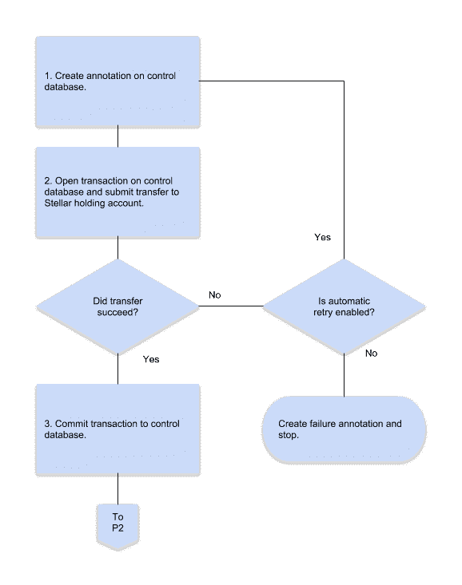
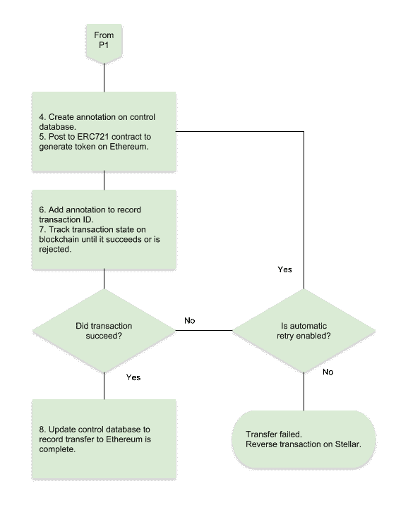
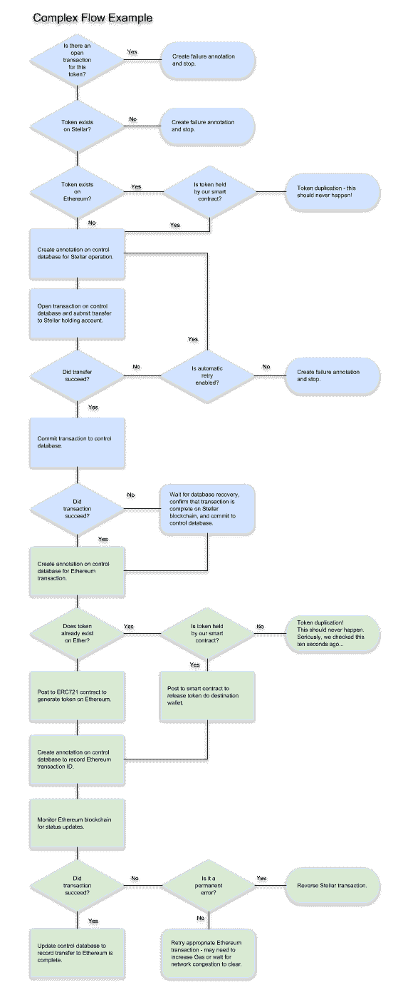

# 实现恒星到以太网网关

> 原文：<https://medium.com/hackernoon/implementing-a-stellar-to-ethereum-gateway-21f3d22a1909>

由 PeopleBrowsr 和[网站的 Snr 架构师 Andrew Maizels](https://www.coin.kred) 撰写。硬币 Kred

恒星和以太网网络在许多方面是互补的。**star**提供简单的交易功能，价格便宜且速度快，交易成本仅为一美分的一小部分，而且通常不到十秒钟就能完成。 **Ethereum** 提供了完整的编程语言(Solidity)、智能合同和数据存储，但结果是交易速度慢了几个数量级，而且更昂贵。此外，以太网上的交易成本随着复杂性(代码和元数据)和网络拥塞而变化。

**打造应用双平台**使其能够两全其美——恒星的低成本和高速度，以及以太网的强大和灵活性。但这要求令牌可以安全地从一个区块链移动到另一个，不会丢失或重复。

# **表示**

由于 small 上的元数据仅限于一项资产和一个 32 个字符的元数据字段，而且当令牌的实际价值相对较低时，大量元数据在 Ethereum 上变得极其昂贵，因此大部分元数据都存储在 IPFS。

stall 事务使用元数据字段存储令牌 ID，链接回完整令牌数据的 IPFS 地址。他们可以选择使用替代资产类型存储额外的数字元数据字段。

Ethereum 使用 ERC721 合同，允许关键元数据直接存储在区块链，无需参考 IPFS。硬币 ID 和值、批次 ID、序列和计数，以及与 IPFS 元数据和相应 API 终点的直接链接(遵循 ERC721 元数据标准)。

IPFS 元数据总是存在的，所以当我们从恒星移动到以太博物馆时，我们可以依靠它来填充额外的字段。核心的、不可变的元数据也被写入到 ERC721 令牌中，这样它就可以被 Ethereum 智能合同直接使用。例如，令牌的面值可以由管理令牌销售、拍卖或交易的智能合同使用，并且批次和顺序可以控制唯一性。

# **转账**

以太网和恒星区块链是完全独立的实体，令牌不能真正离开两个网络。因此，转移代币的过程是一个仔细的、可审计的记账过程。要求是:

1.  任何令牌都不会丢失—从一个网络到另一个网络的传输应该完全成功或失败，这样才能恢复所有更改。
2.  没有令牌可以复制—如果令牌被传输到另一个网络，它在原始网络上就不再可用。
3.  交易是可验证的——任何第三方都应该能够检查各自的区块链，并就任何令牌的所有权得出相同的结论。

# 简单的例子

在主要用例中，令牌最初是在委派给应用程序的 Stellar wallets 中创建的。希望在个人钱包中持有代币(如 Metamask)或在交易所(如 Rarebits 或 Opensea)或分散网络(如 0x)进行交易的高级用户需要首先将代币转移到以太坊。

最简单的处理方法是使用传统的数据库作为控制机制，并向 IPFS 发布事务符号。

## 简单流程示例

1.  在数据库和 IPFS 上进行注释，指定的令牌将从用户的 Stellar 钱包转移到期望的以太坊钱包。
2.  在数据库和 Stellar 上同时打开一个交易，将令牌移动到指定的持有钱包。用户或正常应用程序交易无法使用保留钱包中的令牌。
    Stellar 事务携带令牌的值(在应用程序的定义资产中)和令牌的唯一散列。
3.  当事务在 Stellar 上完成时，数据库事务被自动提交，在数据库中进行第二次注释并发布到 IPFS。
    应用程序数据和 IPFS 被更新，以显示令牌上有一个未决事务，并且在它完成之前不可能有其他操作。
4.  一个新的注释被添加到数据库并发布到 IPFS，显示令牌正从 Stellar 上的持有钱包转移到以太坊。
5.  将交易过账到 ERC721 合同，以在以太坊上创建令牌。
6.  产生的事务 ID 被发送到数据库并发布到 IPFS。
7.  在这一点上，事务不能再被锁步处理，因为处理时间既长又不可预测。相反，我们使用以太坊区块链扫描仪来监控交易 ID，以验证成功或失败。
    (在实践中，我们实际上跟踪与应用的 ERC20 和 ERC721 令牌相关的所有以太坊交易，因此不需要运行单独的任务来跟踪这个特定的交易。)
8.  当扫描器看到交易验证时，我们清除应用程序数据库中的未决状态，并发布最终注释以确认令牌现在在以太坊网络上是活动的。

## 故障模式和错误处理

1.  如果数据库中已经存在该令牌的挂起事务的注释，该事务将立即失败。如果事务失败并需要重试，则需要等待通过区块链扫描器处理的失败确认以及数据库的更新。
2.  如果在 Stellar 上向保留钱包的转移失败，则数据库事务被回滚，并且在数据库中做出失败注释并被发布到 IPFS。(数据库注释是在独立的事务中创建的，不会回滚。在这种不寻常的情况下，我们可以通过应用程序或 API 向用户提供即时反馈。
3.  如果我们在 Stellar 处理窗口期间遇到本地服务器故障，我们将得到一个事务注释，而没有后续注释。
    如果在恢复时发现任何此类孤立注释，我们可以根据 Stellar 区块链验证它们的状态，并选择重启或恢复事务。
4.  如果我们在以太坊交易中收到一个验证失败，我们可以自动重试交易。可能是以太坊网络暂时拥堵，也可能是分配的气体太低。
    无论哪种情况，我们都将在数据库和 IPFS 中创建一个失败注释和一个重试注释，并在区块链扫描器中再次等待验证。
5.  如果以太坊交易无法及时处理——如果以太坊网络严重拥堵或油价过高，正如 2018 年 8 月的几天所看到的那样——我们可以选择完全解除交易，并将令牌返回到用户的 Stellar 钱包。
    但是，这必须等待以太坊交易失败的确认，在严重拥挤的情况下，这本身可能需要几个小时。当交易仍在以太坊上进行时，不可能取消交易；它可以被更高的汽油费所取代，但如果汽油费由于网络拥塞而过高，这也无济于事。

# 更复杂的情况

在这种应用中，设想一旦令牌被转移到以太坊进行交易，它将保留在以太坊网络上。然而，同样可以通过相反的过程将令牌传输回 Stellar 网络。

令牌被转移到指定目标 Stellar 钱包的智能合同，并且区块链扫描器在 Stellar 网络上发起交易，以将先前持有的令牌从持有钱包返回到目的地用户钱包。

在下列情况下，这可能会失败:

1.  如果转移到智能合约失败，则由以太坊处理，不需要网关调解。这适用于以太坊网络故障和被智能合约拒绝的传输，例如无效的 ERC721 令牌。
2.  如果目标钱包在 Stellar 上不存在，可以告诉智能合约返回原始令牌。

如果令牌双向传输，当从 Stellar 发起传输时，令牌可能已经存在于以太坊网络上。

在这种情况下，令牌将已经保存在智能合约中。我们没有使用 ERC721 契约来生成令牌(由于令牌的唯一性约束，这将会失败)，而是指示智能契约将令牌释放到指定的以太坊钱包。

安德鲁关于恒星到以太坊网关的工作正在 NFT 的 NFT 平台上进行。Kred **)** 以及在该平台上构建的应用，包括 **Kred 币(** [**币。Kred**](http://www.Coin.Kred) **)** 。

几个以 Andrew 的 Stellar to Ethereum Gateway **为特色的用例应用将在 NFT 上展示。2 月 20 日在纽约时代广场 PlayStation 剧院举行的纽约市不可替换代币活动**。

开发者门票在 [**NFT 发售。纽约市**](http://www.NFT.NYC/#register) 代码 **NFTDEV**