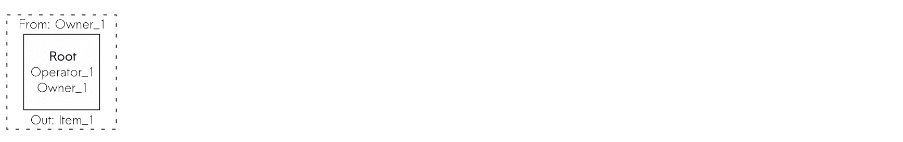

# 没有标记的标记化

> 原文：<https://medium.com/hackernoon/implementing-asset-ownership-without-tokens-1d5ae0238590>

## 如何使用访问控制在区块链中实现资产所有权？


Photo by [ELEVATE](https://www.pexels.com/@elevate?utm_content=attributionCopyText&utm_medium=referral&utm_source=pexels) from [Pexels](https://www.pexels.com/photo/person-using-forklift-1267338/?utm_content=attributionCopyText&utm_medium=referral&utm_source=pexels)

> 科技行业唯一不变的就是变化。—马克·贝尼奥夫

# 介绍

一般认为，要在区块链中表示资产，应该使用 ERC721 令牌。作为 TechHQ 的首席架构师，我设计了许多用区块链表示实物资产的解决方案，我发现在供应链场景中，ERC721 并不出色。

有向无环图允许更自然地跟踪资产生命周期，在[以前的文章](https://hackernoon.com/implementing-a-supply-chain-in-the-ethereum-blockchain-dcc91ea718ab)中我们详细描述了如何实现它。

简而言之，每个资产由一系列状态表示，每个状态记录资产生命周期中的一个事件。状态可以指向过去的状态，并且状态一旦创建就不能修改。


Supply Chain as a Directed Acyclic Graph

由于抛弃了 ERC721 令牌，我们必须想出一种方法来表示资产所有权和转移。

想想看，来自任何 ERC 令牌的*传输*和*传输自*方法都是一种访问控制形式。 *transfer* 调用只是记录令牌所有权的数据结构的更新，只有特定用户才能执行。一个 *transferFrom* 调用是一个权限委托。

我们将不得不实现类似于*传输*的东西，但是是针对图中的节点。我们必须编写访问控制代码，以便将数据添加到我们的图形结构中。

为了不用令牌来表示资产所有权和转移，我们正在解构然后重建以太坊生态系统的核心特性之一。请跟我进兔子洞。

# 概念解

在我们的供应链中，每一项资产都被描绘成一系列相互关联的状态。随着资产经历其生命周期，我们附加更多的状态，表示诸如转换、组合、破坏等事件。

只有资产的所有者能够向其生命周期添加新的状态。只要所有者愿意，他就可以将这一权利让给其他人。他也应该能够为了别人而失去将国家附加到资产上的权利。

对附加状态的这种限制表示每个资产的所有权。资产的所有权控制着对它的访问。

一个真实世界的场景可以帮助我们更清楚地想象我们的用例。

*   比方说，我拥有一家制造厂，接收材料，将其转化为小工具，然后卖给经销商。
*   当材料到达我的工厂时，我获得了它们的所有权，并委托给我的工厂操作员。
*   我的操作员将材料转换成小工具，记录供应链图中的步骤。
*   然后，我将把这些小工具连同向它们添加状态的权限一起交给分发者。

我们现在将使用我们最近发布的[基于角色的访问控制](https://hackernoon.com/role-based-access-control-for-the-ethereum-blockchain-bcc9dfbcfe5c)库来实现这些功能，而[出现在这个媒体的首页](https://hackernoon.com/role-based-access-control-for-the-ethereum-blockchain-bcc9dfbcfe5c)。

# 履行



Using access control to represent asset ownership on a supply chain

在最初的供应链图实现中，我们为每个状态记录了三个数据项。

*   创建状态的帐户；
*   国家所指的资产
*   先例表明。

为了实现所有权概念，我将在每个状态中添加两个变量:

*   可以创建新资产并将其移交给其他用户的所有者角色
*   以及可以在不改变所有权的情况下向资产添加新状态的操作员角色。

下面你可以看到基本的契约实现，包括事件、结构、契约变量和助手方法。

```
contract SupplyChain is RBAC {uint256 constant public NO_STATE = 0;event **StateCreated**(uint256 state);event **AssetCreated**(uint256 asset);struct **State** {
        address creator;
        uint256 asset;
        uint256 precedent;
        uint256 operatorRole;
        uint256 ownerRole;
    }State[] public **states**;mapping(uint256 => uint256) public **lastStates**;uint256 public **totalAssets**;function **isAsset** (
        uint256 _asset
    )
        public
        view
        returns(bool)
    {
        return lastStates[_asset] != 0;
    }function **isOperator** (
        address _address, 
        uint256 _asset
    )
        public
        view
        returns(uint256)
    {
        State memory lastState = states[lastStates[_asset]];
        return hasRole(_address, lastState.operatorRole);
    }function **isOwner** (
        address _address, 
        uint256 _asset
    )
        public
        view
        returns(uint256)
    {
        State memory lastState = states[lastStates[_asset]];
        return hasRole(_address, lastState.ownerRole);
    }
```

我现在将实现三个新函数，在我们的三个新用例中向供应链图添加状态:

*   通过添加没有先例的状态来创建新资产；
*   在考虑所有权的情况下，向现有资产添加新状态
*   并且将资产的控制权移交给不同的账户。

```
 function **createAsset** (
        uint256 _operatorRole,
        uint256 _ownerRole
    )
        public
    {
        require(
            hasRole(msg.sender, _ownerRole), 
            “Creator not in ownerRole.”
        ); totalAssets += 1;
        asset = totalAssets;
        emit AssetCreated(asset);

        uint256 stateId = states.push(
            State(
                msg.sender,
                totalAssets,
                NO_STATE,
                _operatorRole,
                _ownerRole
            )
        ) — 1;
        lastStates[asset] = stateId;
        emit StateCreated(stateId);
    } function **addState** (
        uint256 _asset
    )
        public
    {
        require(
            isAsset(_asset), 
            “Asset does not exist.”
        );
        require(
            isOperator(msg.sender, _asset),
            “Not an operator of asset.”
        ); uint256 precedent = lastStates[_asset];
        uint256 stateId = states.push(
            State(
                msg.sender,
                _asset,
                precedent,
                states[precedent].operatorRole,
                states[precedent].ownerRole
            )
        ) — 1;
        lastStates[_asset] = stateId;
        emit StateCreated(stateId);
    } function **handoverAsset** (
        uint256 _action,
        uint256 _asset,
        uint256 _operatorRole,
        uint256 _ownerRole
    )
        public
    {
        require(
            isAsset(_asset), 
            “Asset does not exist.”
        );
        require(
            isOwner(msg.sender, _asset), 
            “Needs owner for handover.”
        ); precedent = lastStates[_asset];
        uint256 stateId = states.push(
            State(
                msg.sender,
                _asset,
                precedent,
                operatorRole,
                ownerRole
            )
        ) — 1;
        lastStates[_asset] = stateId;
        emit StateCreated(stateId);
    }
}
```

insiġ库有这个代码的全功能版本。为了简单起见，我在本文中删除了每个州有多个先例的功能。

# 结论

在本文中，我们展示了如何为供应链实现资产所有权。我们解构了 ERC721 方法的目的，以表明实际上资产所有权是一种访问控制形式。

在实现中，我们通过控制谁可以向特定资产添加新状态来表示资产所有权。为了表示资产转移，所有者更改资产最后状态中的权限。

本文和实现是制造业供应链新解决方案的一部分。我们正在颠覆我们所知道的我们所消费的东西，并释放出目前与实物资产挂钩的大量投资资本。

接下来还有更多。在以后的文章中，我们将展示如何表示资产的合并和分割，以及如何在所描述的供应链中标记资产。