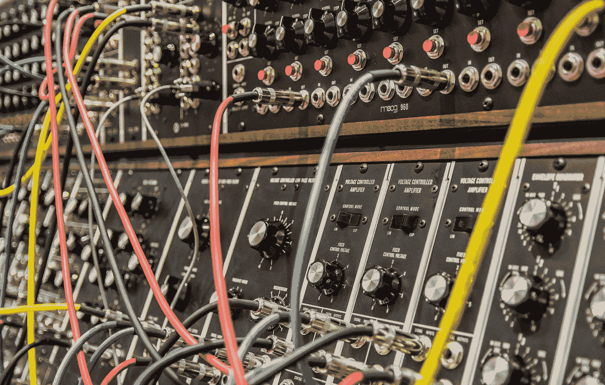
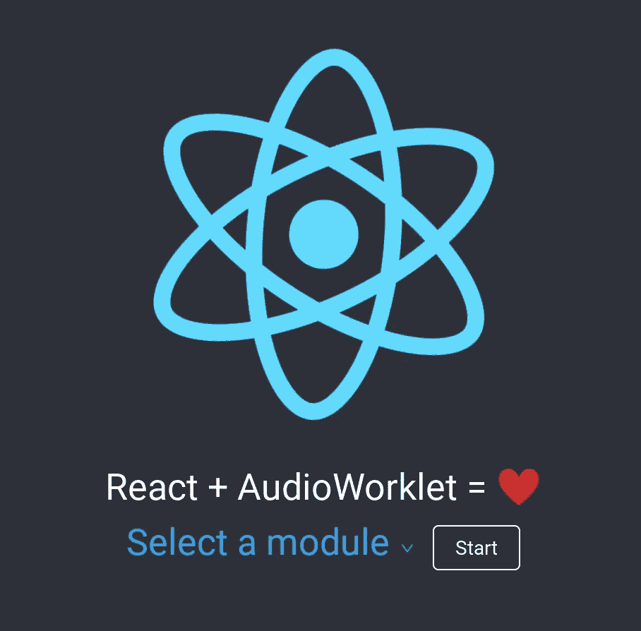

# 用 React 实现 AudioWorklets

> 原文：<https://medium.com/hackernoon/implementing-audioworklets-with-react-8a80a470474>



Photo by [Steve Harvey](https://unsplash.com/photos/xWiXi6wRLGo?utm_source=unsplash&utm_medium=referral&utm_content=creditCopyText) on [Unsplash](https://unsplash.com/search/photos/synthesizer?utm_source=unsplash&utm_medium=referral&utm_content=creditCopyText)

随着 [Chrome](https://hackernoon.com/tagged/chrome) 64 中 [AudioWorklet](https://hackernoon.com/tagged/audioworklets) 功能的推出，可能有理由说 2018 年是网络音频 API 的好年景。在它发布近一年后，除了谷歌 Chrome Labs 和 dsp.audio 之外，可供开发者借鉴的例子仍然相对较少。这些都是对界面的很好的介绍，但是由于可供学习的用户创建的例子相对较少，所以在弄清楚如何在野外实现它时，我们只能靠自己的设备。事实是，让 AudioWorklets 与 React 和其他 UI 框架完美结合的任务并不像看起来那么简单。本文的目的是向已经熟悉 Web Audio API 的程序员展示如何将 AudioWorklets 连接到 React 接口。有关 AudioWorklet 规范的更多信息，请参见本文最底部的链接。

# 背景

作为一名音乐学院培养的音乐家，通过[计算音乐学](/@krisshaffer/what-is-computational-musicology-f25ee0a65102)进入软件工程和 DSP 的世界，我曾经(现在仍然)对用专用音频渲染线程创建 web 界面的前景感到眩晕。简而言之，一听到这个消息，我就准备发射了！我启动了`create-react-app`，从 Chrome 实验室复制了一些例子，然后运行`yarn start`，却收到了以下错误:

```
Failed to compile.
./src/worklet/worklet-node.js
  Line 2:  'AudioWorkletNode' is not defined  no-undef
```

我的 Chrome 版本过时了吗？不是吗？为什么 AudioWorkletNode 没有定义？谢天谢地，丹·阿布拉莫夫很快消除了我对 StackOverflow 的困惑(谢谢，丹！):

> Create React App 被配置为强制您使用`window.`限定符访问这样的浏览器 API。这样很明显你在使用一个全局变量，并且没有忘记导入一些东西(这是很常见的)。
> 
> 这应该可行:
> 
> `class MyWorkletNode extends window.AudioWorkletNode {`
> 
> (在未来的版本中，默认情况下，ESLint 会知道这个全局，并且您可以删除`window.`)

好吧，没什么大不了的！我们现在应该没事了，对吧？不完全是。尝试使用`context.audioWorklet.addModule()`加载我的 AudioWorklet 处理器时，出现了一个最模糊、最致命的错误，这是任何开发人员都不想遇到的:

```
DOMException: The user aborted a request.
```

我回到了 StackOverflow。 [AudioNodes](http://audionodes.com) 的 John Weisz 指出，这个错误可能是 Chromium 模块加载器中的一个 [bug](https://bugs.chromium.org/p/chromium/issues/detail?id=807160) :

> …它通过删除空白来解析`worklet/processor.js`文件，这反过来导致它到处都是 JavaScript 语法错误，这最终导致这个一般性的非解释性错误消息出现。

他继续建议为模块提供指定的头`Content-Type: application/javascript`。我不知道在哪里或者如何指定 AudioWorklet 内容头，所以我暂时离开 audio work let，希望随着时间的推移会出现更多的例子。

# 7 个月后:出乎意料的简单解决方案

从`public`文件夹为你的 AudioWorklet 处理器服务。去做吧。我四处摸索，发现`addModule('path/to/your/module')`方法默认指向那里。没有进口，没有需求，不需要`{process.env.PUBLIC_URL}/my-worklet-processor`。

有了这些，移植来自[谷歌 Chrome 实验室](https://googlechromelabs.github.io/web-audio-samples/audio-worklet/)的四个音频处理演示来作出反应将是一个很好的练习:旁路器、单极滤波器、噪声发生器和 BitCrusher。如果你没有耐心，想要立即深入了解整个代码库，那么 GitHub repo 的链接就列在最底部。简单克隆一下，用`yarn install`安装依赖项，用`yarn start`运行 app。



[Click here](https://react-audio-worklet.herokuapp.com) to view the demo.

在下面的演练中，我们将在 create-react-app 样板代码上创建一个非常简单的 UI。我们将使用 [Ant Design](https://ant.design/) 组件，并通过对每个处理器稍作修改以通过 messagePort 接受数据来打开或关闭它，从而熟悉 AudioWorklets。用户可以从下拉菜单中选择四种音频处理演示。我们将在下拉菜单旁边粘贴一个按钮，该按钮将打开和关闭当前节点。就是这样！如果你想看演示，点击左边的链接(如果你在手机上看，它在上面)。

下面是我们将要创建的项目的概述。我们添加到 create-react-app 样板文件中的目录和文件以粗体和斜体显示，并带有相邻的描述。

```
| — README.md
| — package.json
| — public
| | — favicon.ico
| | — index.html
| | — manifest.json
***| ` — worklet*** */*Contains AudioWorkletProcessors*/* ***| | — bit-crusher-processor.js
| | — bypass-processor.js
| | — noise-generator.js
| ` — one-pole-processor.js***
| — src
| | — App.css
| | — App.js /* Main UI */
| | — App.test.js
*| |* ***— Demos.js*** */*Functions that interface with the processors*/*
| | — index.css
| | — index.js
| | — logo.svg
| — serviceWorker.js
| — yarn.lock
```

# 准系统用户界面

第一步:`create-react-app react-audio-worklet`

步骤 2:安装依赖项。在这种情况下，我们只使用一个 UI 包，所以继续运行命令`yarn add antd`。确保`import 'antd/dist/antd.css'`进入 *index.js.*

步骤 3:引入必要的组件来创建下拉菜单并设置初始状态:

# 模块选择/加载和音频切换

第 1 步:牢记关注点的分离，让我们包含回调以从一个名为 *Demos.js:* 的单独文件中触发音频演示

步骤 2:在`public/worklet:`中创建 AudioWorklet 处理器

注意:和演示一样，这些实际上是 Chrome 团队的代码，只是稍微修改了一下，将端口的 onMessage 函数绑定到 AudioWorkletProcessor，以获得更好的可读性。

步骤 3:现在我们将在 *App.js* 中创建方法来处理处理器模块的选择/加载，以及切换当前所选模块的回放:

在我们忘记之前，让我们将 *Demos.js* 导入到主应用程序中。您的最终 *App.js* 现在应该如下所示:

现在继续运行`yarn start`并听那些演示。听到了吗？这是网络音频处理在其专用渲染线程上的甜美声音！

# 结论

我希望这篇文章已经阐明了如何避免在尝试将 AudioWorklets 集成到 React 时可能会遇到的一些常见问题。我还希望它有助于熟悉使用 Worklet API 本身。Chrome WebAudio 团队通过 AudioWorklets 向网络平台引入了强大的技术——随着 [WebAssembly](https://developers.google.com/web/updates/2018/06/audio-worklet-design-pattern#using_audio_worklet_with_webassembly) 的兴起，DSP 在网络上的前景一片光明。

# 链接

[GitHub 回购](https://github.com/bloom510/react-audio-worklet-example)

[输入 AudioWorklet](https://developers.google.com/web/updates/2017/12/audio-worklet)

[audio work let 接口](https://www.w3.org/TR/webaudio/#audioworklet)

[网络音频 API | MDN](https://developer.mozilla.org/en-US/docs/Web/API/Web_Audio_API)

## 关于作者

Aphra Bloomfield 是一名音乐学院培养的音乐家，他通过计算音乐学与软件工程和 DSP 世界发生了碰撞。

[LinkedIn](https://linkedin.com/in/heyaphra)|[aphra . link](https://aphra.link)