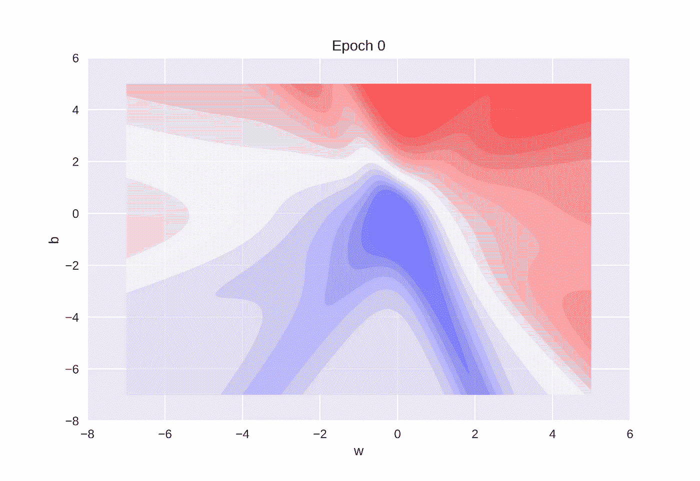
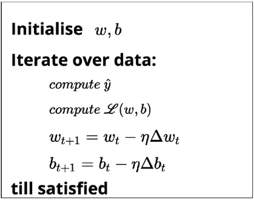
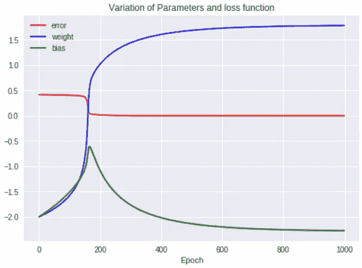
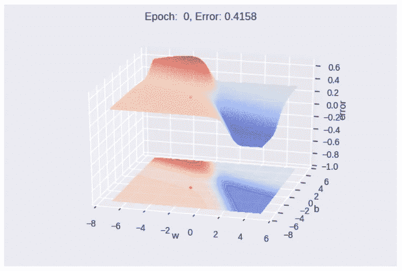
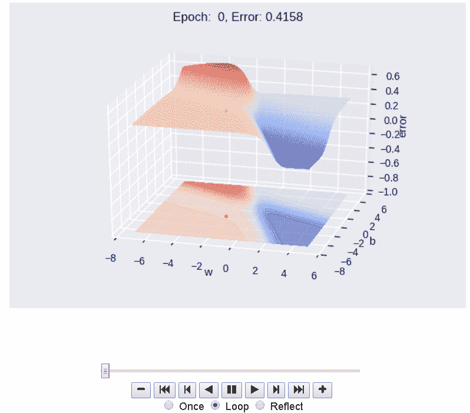
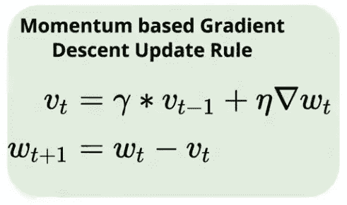
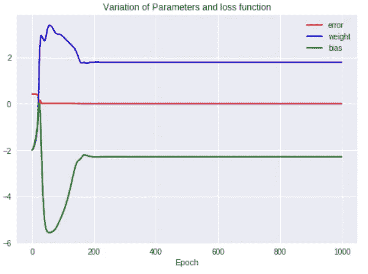
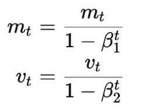
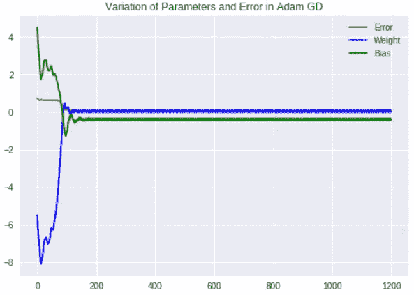
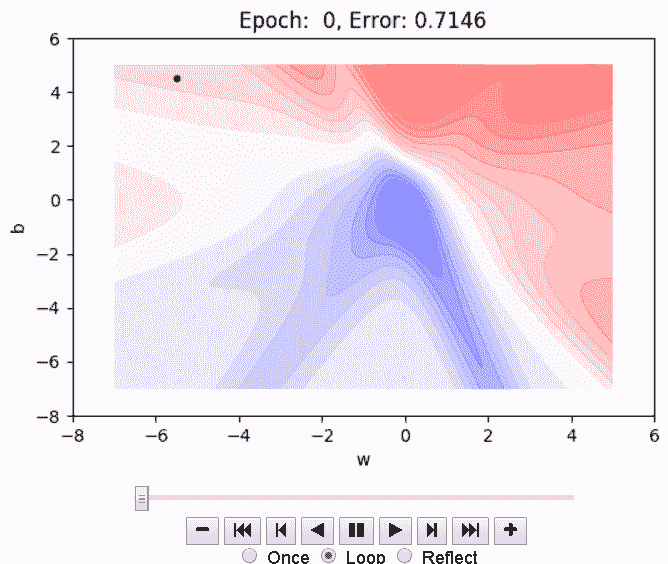

# 使用 Numpy 在 Python 中实现梯度下降优化算法的不同变体

> 原文：<https://medium.com/hackernoon/implementing-different-variants-of-gradient-descent-optimization-algorithm-in-python-using-numpy-809e7ab3bab4>

## [深入分析](https://medium.com/towards-data-science/in-depth-analysis/home)

## 了解 tensorflow 或 pytorch 如何使用 numpy 实现优化算法，并使用 matplotlib 创建漂亮的动画

在这篇文章中，我们将讨论如何实现梯度下降优化技术的不同变体，并使用 matplotlib 可视化这些变体的更新规则的工作。这是我之前关于[优化算法](https://hackernoon.com/demystifying-different-variants-of-gradient-descent-optimization-algorithm-19ae9ba2e9bc)的帖子的后续。

> 引用说明:本文的内容和结构基于四分之一实验室——[Padh](https://padhai.onefourthlabs.in)AI 的深度学习讲座。



梯度下降是优化神经网络最常用的优化技术之一。梯度下降算法通过相对于网络参数在与目标函数的梯度相反的方向上移动来更新参数。

[](https://hackernoon.com/demystifying-different-variants-of-gradient-descent-optimization-algorithm-19ae9ba2e9bc) [## 揭秘梯度下降优化算法的不同变体

### 了解对梯度下降的不同改进，并使用 2D 等高线图比较它们的更新规则。

hackernoon.com](https://hackernoon.com/demystifying-different-variants-of-gradient-descent-optimization-algorithm-19ae9ba2e9bc) 

# 使用 Numpy 在 Python 中实现


Photo by [Christopher Gower](https://unsplash.com/@cgower?utm_source=medium&utm_medium=referral) on [Unsplash](https://unsplash.com?utm_source=medium&utm_medium=referral)

在编码部分，我们将涉及以下主题。

*   **乙状结肠神经元类**
*   **整体设置—什么是数据、模型、任务**
*   **绘图功能— 3D &等高线图**
*   **单个算法及其执行方式**

单独的算法包括，

*   **批量梯度下降**
*   **气势 GD**
*   **内斯特罗夫加速 GD**
*   **小批量和随机 GD**
*   阿达格拉德 GD
*   **RMSProp GD**
*   **亚当 GD**

如果你想跳过理论部分，直接进入代码，

[](https://github.com/Niranjankumar-c/GradientDescent_Implementation) [## niranjankumar-c/GradientDescent _ 实现

### 使用 numpy-Niranjankumar-c/GradientDescent _ Implementation 在 python 中实现梯度下降的不同变体

github.com](https://github.com/Niranjankumar-c/GradientDescent_Implementation) 

在我们开始实现梯度下降之前，首先我们需要导入所需的库。我们正在从`mpl_toolkits.mplot3d`导入`Axes3D`提供一些基本的 3D 绘图(散点，表面，线条，网格)工具。不是最快或功能最全的 3D 库，但它附带了 Matplotlib。我们还从 matplotlib 导入了`colors`和`colormap(cm)`。我们希望有动画图来展示每个优化算法是如何工作的，所以我们正在导入`animation`和`rc`来使图形看起来更好。在 jupyter 笔记本导入`HTML`中内联显示/呈现 HTML 内容。最后，导入`numpy`用于计算目的，这是我们最繁重的工作。

# 乙状结肠神经元实现

为了实现梯度下降优化技术，我们将采用 sigmoid 神经元(逻辑函数)的简单情况，并查看梯度下降的不同变体如何学习参数' **w** 和' **b** '。

## 乙状结肠神经元概述

一个 sigmoid 神经元类似于感知器神经元，对于每个输入`xi`，它都有与该输入相关联的权重`wi`。权重表明决策过程中输入的重要性。与感知器模型不同，sigmoid 的输出不是 0 或 1，而是 0-1 之间的真实值，可以解释为概率。最常用的 sigmoid 函数是逻辑函数，它具有“ **S** 形曲线的特征。


Sigmoid Neuron Representation (logistic function)

## 学习算法

学习算法的目标是确定参数( **w** 和 **b** )的最佳可能值，使得模型的总损失(平方误差损失)尽可能最小。



Learning Algorithm

我们随机初始化 **w** 和 **b** 。然后，我们迭代数据中的所有观察值，对于每个观察值，使用 sigmoid 函数找到相应的预测结果，并计算均方误差损失。基于损失值，我们将更新权重，使得模型在新参数下的总损失将比模型的当前损失小**。**

要理解梯度下降优化技术背后的数学原理，请浏览我以前关于 sigmoid 神经元学习算法的文章——链接在本文末尾。

## 乙状结肠神经元类

在我们开始分析梯度下降算法的不同变体之前，我们将在一个名为 *SN 的类中构建我们的模型。*

在`SN`类中，我们有 7 个函数，我将一个接一个地向你介绍这些函数，并解释它们在做什么。

```
#constructor  
def __init__(self, w_init, b_init, algo):    
    self.w = w_init    
    self.b = b_init    
    self.w_h = []    
    self.b_h = []    
    self.e_h = []    
    self.algo = algo
```

`__init__`函数(构造函数)帮助初始化 sigmoid 神经元 **w** 权重和 **b** 偏差的参数。该函数有三个参数，

*   `w_init,b_init` —这些参数采用参数' **w** '和' **b** '的初始值，而不是随机设置参数，我们将其设置为特定值。这使我们能够通过可视化不同的初始点来理解算法是如何执行的。一些算法在某些参数上陷入局部极小值。
*   `algo` —告知使用哪种梯度下降算法来寻找最佳参数。

在此函数中，我们初始化参数，并定义了三个新的数组变量，后缀为“_h ”,表示它们是历史变量，以跟踪 sigmoid 神经元学习参数时权重(w_h)、偏差(b_h)和误差(e_h)值如何变化。

```
def sigmoid(self, x, w=None, b=None):
    if w is None:
      w = self.w
    if b is None:
      b = self.b
    return 1\. / (1\. + np.exp(-(w*x + b)))
```

我们有`sigmoid`函数，它接受输入 **x —** 强制参数，并计算输入的逻辑函数和参数。该函数还接受另外两个可选参数。

*   `w & b`—通过将“ **w** ”和“ **b** ”作为参数，它帮助我们计算特定参数值下的 sigmoid 函数值。如果这些参数没有通过，它将采用学习参数的值来计算逻辑函数。

```
def error(self, X, Y, w=None, b=None):
    if w is None:
      w = self.w
    if b is None:
      b = self.b
    err = 0
    for x, y in zip(X, Y):
      err += 0.5 * (self.sigmoid(x, w, b) - y) ** 2
    return err
```

接下来，我们有`error`函数，它将输入 **X** 和 **Y** 作为强制参数和可选参数，就像在`sigmoid`函数中一样。在这个函数中，我们遍历每个数据点，并使用 sigmoid 函数计算实际特征值和预测特征值之间的累积均方误差。就像我们在`sigmoid`函数中看到的，它支持计算指定参数值的误差。

```
def grad_w(self, x, y, w=None, b=None):
   .....def grad_b(self, x, y, w=None, b=None):
   .....
```

接下来，我们将定义两个函数`grad_w`和`grad_b`，将输入“ **x** 和“ **y** ”作为强制参数，这有助于分别计算参数“ **w** ”和“ **b** ”相对于输入的 sigmoid 的梯度。同样，我们有两个可选参数，允许我们计算指定参数值的梯度。

```
def fit(self, X, Y, epochs=100, eta=0.01, gamma=0.9, mini_batch_size=100, eps=1e-8,beta=0.9, beta1=0.9, beta2=0.9):
    self.w_h = []
    .......
```

接下来，我们定义“fit”方法，该方法接受输入“ **X** ”、“ **Y** ”和一系列其他参数。每当它被用于梯度下降算法的特定变体时，我将解释这些参数。该功能首先初始化历史变量，并设置本地输入变量以存储输入参数数据。

然后，我们为它支持的每个算法准备了一堆不同的“if-else”语句。根据我们选择的算法，我们将在`fit`函数中实现梯度下降。我将在本文的后面部分详细解释这些实现。

```
def append_log(self):
    self.w_h.append(self.w)
    self.b_h.append(self.b)
    self.e_h.append(self.error(self.X, self.Y))
```

最后，我们使用`append_log`函数来存储梯度下降的每个变量中每个时期的参数值和损失函数值。

# 为打印设置

在本节中，我们将使用一个简单的 2D 玩具数据集定义一些配置参数来模拟梯度下降更新规则。我们还定义了一些函数来创建 3D 和 2D 图并制作动画，以可视化更新规则的工作。这种设置有助于我们使用不同的起点、不同的超参数设置以及梯度下降的不同变量的绘图/动画更新规则来运行不同的实验。

首先，我们取一个简单的 2D 玩具数据集，它有两个输入和两个输出。在第 5 行，我们定义了一个字符串变量`algo`，它接受我们想要执行的算法类型。我们初始化第 6 — 7 行中的参数' **w** 和' **b** '，以指示算法开始的位置。

从第 9 行到第 12 行，我们正在设置参数的限制，即 sigmoid neuron 在指定范围内搜索最佳参数的范围。这些数字被特别选择来说明工作梯度下降更新规则。接下来，我们设置超参数的值，一些变量将特定于一些算法，当我们讨论算法的实现时，我将讨论它们。最后，在第 19–22 行，我们声明了动画或绘制更新规则所需的变量。

一旦我们设置了配置参数，我们将初始化我们的 *SN* 类，然后使用配置参数调用 fit 方法。我们还绘制了三个历史变量，以显示参数和损失函数值在不同时期的变化。

# 3D 和 2D 绘图设置

为了首先创建 3D 绘图，我们通过在' **w** 和' **b** '的最小值和最大值之间创建 256 个等距值来创建网格，如第 2–5 行所示。使用 mesh grid 将通过调用 sigmoid 类`SN`中的`error`函数来计算这些值的误差(第 5 行)。在第 8 行，我们创建一个轴句柄来创建一个 3D 绘图。

为了创建一个 3D 图，我们使用`ax.plot_surface`功能，通过设置`rstride`和`cstride`来指定我们想要采样点和数据的频率，从而创建一个关于重量和偏差的误差的表面图。接下来，我们通过将误差值指定为“Z”方向(第 9-10 行),使用`ax.contourf`函数在表面顶部绘制相对于重量和偏差的误差轮廓。在第 11–16 行，我们设置了每个轴的标签和所有三个维度的轴限制。因为我们正在绘制 3D 图，所以我们需要定义视点。在第 17–18 行中，我们在“z”轴的 25 度仰角和 12 个单位的距离处为我们的绘图设置了一个视点。

在我们的静态 3D 图的顶部，我们想要可视化算法正在动态地做什么，这是由我们算法的每个时期的参数和误差函数的历史变量捕获的。为了创建我们的梯度下降算法的动画，我们将通过传递我们的自定义函数`plot_animate_3d`作为参数之一来使用`animation.FuncAnimation`函数，并指定创建动画所需的帧数。函数`plot_animate_3d`更新‘w’和‘b’各自的参数值和误差值。在第 7 行的同一个函数中，我们设置文本来显示特定时期的误差值。最后，为了以内联方式显示动画，我们调用`rc`函数来呈现 jupyter 笔记本中的 HTML 内容。

与 3D 绘图类似，我们可以创建一个函数来绘制 2D 等值线图。

# 算法实现

在这一节中，我们将实现梯度下降算法的不同变体，并生成 3D 和 2D 动画情节。

# 香草梯度下降

梯度下降算法通过相对于网络参数在与目标函数的梯度相反的方向上移动来更新参数。

参数更新规则将由下式给出:


Gradient Descent Update Rule

```
for i in range(epochs):
        dw, db = 0, 0
        for x, y in zip(X, Y):
          dw += self.grad_w(x, y)
          db += self.grad_b(x, y)
        self.w -= eta * dw / X.shape[0]
        self.b -= eta * db / X.shape[0]
        self.append_log()
```

在批量梯度下降中，我们迭代所有训练数据点，并计算参数‘w’和‘b’的梯度累积和。然后根据累积梯度值和学习率更新参数值。

要执行梯度下降算法，请按如下所示更改配置设置。

在配置设置中，我们将变量`algo`设置为‘GD ’,以指示我们想要在我们的 sigmoid 神经元中执行普通梯度下降算法，以找到最佳参数值。在我们设置好配置参数之后，我们将继续执行*SN*class‘fit’方法来训练玩具数据上的 sigmoid neuron。



Gradient Descent History

上图显示了算法学习最佳参数时，误差、权重和偏差的历史值在不同时期的变化情况。从图中要注意的重要一点是，在初始时期误差值徘徊在接近 0.5，但是在 200 个时期之后，误差值几乎达到零。

如果你想绘制 3D 或 2D 动画，你可以设置布尔变量`plot_2d`和`plot_3d`。我将展示对于' **w** '和' **b** '的相应值，3D 误差表面将会是什么样子。学习算法的目标是向误差/损失最小的深蓝色区域移动。



为了可视化算法动态地做什么，我们可以使用函数`plot_animate_3d`生成一个动画。播放动画时，您可以看到纪元编号和该纪元的相应误差值。



Gradient Descent Animation

如果你想减慢动画的速度，你可以点击视频控件中的减号，如上图所示。类似地，您可以为 2D 等高线图生成动画，以查看算法如何向全局最小值移动。

# 基于动量的梯度下降

在动量 GD 中，我们以先前梯度和当前梯度的指数衰减累积平均值移动。



动量 GD 的代码在下面给出，

```
v_w, v_b = 0, 0
for i in range(epochs):
  dw, db = 0, 0
 for x, y in zip(X, Y):
   dw += self.grad_w(x, y)
   db += self.grad_b(x, y)
 v_w = gamma * v_w + eta * dw 
 v_b = gamma * v_b + eta * db
 self.w = self.w - v_w
 self.b = self.b - v_b
 self.append_log()
```

在基于动量的 GD 中，我们已经包括了历史变量来跟踪先前梯度的值。变量 gamma 表示我们需要赋予算法多少动量。变量`v_w`和`v_b`将用于基于历史和当前梯度计算梯度的移动。在每个时期结束时，我们调用`append_log`函数来存储参数和损失函数值的历史。

为了对我们的 sigmoid 神经元执行 Momentum GD，您需要对配置设置做一些修改，如下所示，

```
X = np.asarray([0.5, 2.5])
Y = np.asarray([0.2, 0.9])algo = 'Momentum'w_init = -2
b_init = -2w_min = -7
w_max = 5b_min = -7
b_max = 5epochs = 1000
mini_batch_size = 6
gamma = 0.9
eta = 1animation_frames = 20plot_2d = True
plot_3d = True
```

变量`algo`被设置为“动量”,以指示我们想要使用动量 GD 来为我们的乙状结肠神经元找到最佳参数，另一个重要的变化是`gamma`变量，它用于控制我们需要向学习算法传递多少动量。伽玛值在 0-1 之间变化。在我们设置好配置参数之后，我们将继续执行*SN*class‘fit’方法来训练玩具数据上的 sigmoid neuron。



Variation for Momentum GD

从图中，我们可以看到，由于累积的历史动量 GD 在极小值内外振荡，所以权重和偏置项的值有很多振荡。

# 内斯特罗夫加速梯度下降

在内斯特罗夫加速梯度下降中，我们期待在基于当前梯度值采取另一步骤之前看到我们是否接近最小值，以便我们可以避免超调的问题。


动量 GD 的代码在下面给出，

```
v_w, v_b = 0, 0
for i in range(epochs):
  dw, db = 0, 0
 v_w = gamma * v_w
 v_b = gamma * v_b
 for x, y in zip(X, Y):
   dw += self.grad_w(x, y, self.w - v_w, self.b - v_b)
   db += self.grad_b(x, y, self.w - v_w, self.b - v_b)
 v_w = v_w + eta * dw
 v_b = v_b + eta * db
 self.w = self.w - v_w
 self.b = self.b - v_b
 self.append_log()
```

NAG GD 代码的主要变化是`v_w`和`v_b`的计算。在动量 GD 中，我们一步计算这些变量，但是在 NAG 中，我们分两步计算。

```
v_w = gamma * v_w
v_b = gamma * v_b
for x, y in zip(X, Y):
   dw += self.grad_w(x, y, self.w - v_w, self.b - v_b)
   db += self.grad_b(x, y, self.w - v_w, self.b - v_b)
 v_w = v_w + eta * dw
 v_b = v_b + eta * db
```

在第一部分中，在我们迭代数据之前，我们将伽马乘以我们的历史变量，然后通过使用从`self.w`和`self.b`减去的历史值计算梯度。为了执行 NAG GD，我们只需要将`algo`变量设置为‘NAG’。您可以生成 3D 或 2D 动画来查看 NAG GD 在达到全局最小值方面与 Momentum GD 有何不同。

# 小批量和随机梯度下降

我们不是一次性查看所有数据点，而是将整个数据分成若干子集。对于每个数据子集，计算子集中每个点的导数，并更新参数。我们没有根据损失函数计算整个数据的导数，而是将其近似为更少的点或更小的批量。这种批量计算梯度的方法称为**小批量梯度下降**

下面给出了小批量 GD 的代码，

```
for i in range(epochs):
dw, db = 0, 0
points_seen = 0
for x, y in zip(X, Y):
  dw += self.grad_w(x, y)
  db += self.grad_b(x, y)
  points_seen += 1
  if points_seen % mini_batch_size == 0:
     self.w -= eta * dw / mini_batch_size
     self.b -= eta * db / mini_batch_size
     self.append_log()
     dw, db = 0, 0
```

在 Mini Batch 中，我们循环遍历整个数据，并通过使用变量`points_seen`跟踪我们看到的点数。如果看到的点的数量是小批量的倍数，那么我们正在更新乙状结肠神经元的参数。在特殊情况下，当小批量等于 1 时，就变成了随机梯度下降。为了执行小批量 GD，我们只需要将`algo`变量设置为‘Mini Batch’。您可以生成 3D 或 2D 动画来查看小批量 GD 在达到全局最小值方面与动量 GD 有何不同。

# 阿达格拉德梯度下降

AdaGrad 背后的主要动机是针对数据集中不同要素的自适应学习率的想法，即，我们可能需要针对不同要素的不同学习率，而不是针对数据集中的所有要素使用相同的学习率。


阿达格拉德的代码如下所示，

```
v_w, v_b = 0, 0
for i in range(epochs):
 dw, db = 0, 0
 for x, y in zip(X, Y):
   dw += self.grad_w(x, y)
   db += self.grad_b(x, y)
 v_w += dw**2
 v_b += db**2
 self.w -= (eta / np.sqrt(v_w) + eps) * dw
 self.b -= (eta / np.sqrt(v_b) + eps) * db
 self.append_log()
```

在 Adagrad 中，我们保持梯度的运行平方和，然后通过将学习率除以历史值的平方根来更新参数。这里不是静态学习率，而是针对密集和稀疏特征的动态学习。生成图/动画的机制与上面相同。这里的想法是玩不同的玩具数据集和不同的超参数配置。

# RMSProp 梯度下降

与 AdaGrad 中的梯度总和不同，RMSProp 使用指数衰减平均值计算梯度历史，这有助于防止密集要素分母的快速增长。


RMSProp 的代码如下所示，

```
v_w, v_b = 0, 0
for i in range(epochs):
 dw, db = 0, 0
 for x, y in zip(X, Y):
   dw += self.grad_w(x, y)
   db += self.grad_b(x, y)
 v_w = beta * v_w + (1 - beta) * dw**2
 v_b = beta * v_b + (1 - beta) * db**2
 self.w -= (eta / np.sqrt(v_w) + eps) * dw
 self.b -= (eta / np.sqrt(v_b) + eps) * db
 self.append_log()
```

我们在 AdaGrad 代码中需要做的唯一改变是如何更新变量`v_w`和`v_b`。在 AdaGrad `v_w`和`v_b`中，从第一个历元开始，每个参数总是以梯度的平方递增，但是在 RMSProp `v_w`和`v_b`中，通过使用称为“伽马”的超参数，梯度的加权和呈指数衰减。要执行 RMSProp GD，我们只需要将`algo`变量设置为‘rms prop’。您可以生成 3D 或 2D 动画来查看 RMSProp GD 在达到全局最小值方面与 AdaGrad GD 有何不同。

# 亚当梯度下降

Adam 维护了两个历史，'mₜ'类似于 Momentum GD 中使用的历史，'vₜ'类似于 RMSProp 中使用的历史。


实际上，亚当做了一些被称为偏差修正的事情。它对'mₜ'和'vₜ'使用以下等式，



Bias Correction

偏差校正确保在训练更新开始时不会以奇怪的方式运行。Adam 中的关键点在于它结合了 Momentum GD(在平缓区域移动更快)和 RMSProp GD(调整学习速率)的优点。

Adam GD 的代码如下所示，

```
v_w, v_b = 0, 0
m_w, m_b = 0, 0
num_updates = 0
for i in range(epochs):
dw, db = 0, 0
 for x, y in zip(X, Y):
   dw = self.grad_w(x, y)
   db = self.grad_b(x, y)
   num_updates += 1
   m_w = beta1 * m_w + (1-beta1) * dw
   m_b = beta1 * m_b + (1-beta1) * db
   v_w = beta2 * v_w + (1-beta2) * dw**2
   v_b = beta2 * v_b + (1-beta2) * db**2
   m_w_c = m_w / (1 - np.power(beta1, num_updates))
   m_b_c = m_b / (1 - np.power(beta1, num_updates))
   v_w_c = v_w / (1 - np.power(beta2, num_updates))
   v_b_c = v_b / (1 - np.power(beta2, num_updates))
   self.w -= (eta / np.sqrt(v_w_c) + eps) * m_w_c
   self.b -= (eta / np.sqrt(v_b_c) + eps) * m_b_c
   self.append_log()
```

在 Adam optimizer 中，我们计算`m_w & m_b`来跟踪动量历史，计算`v_w & v_b`来衰减分母，防止其快速增长，就像在 RMSProp 中一样。之后，我们对基于动量的历史变量和基于 RMSProp 的历史变量实施偏差校正。一旦我们计算出参数' **w** 和' **b** '的修正值，我们将使用这些值来更新参数值。

要执行 Adam 梯度下降算法，请按如下所示更改配置设置。

```
X = np.asarray([3.5, 0.35, 3.2, -2.0, 1.5, -0.5])
Y = np.asarray([0.5, 0.50, 0.5,  0.5, 0.1,  0.3])algo = 'Adam'w_init = -6
b_init = 4.0w_min = -7
w_max = 5b_min = -7
b_max = 5epochs = 200
gamma = 0.9
eta = 0.5
eps = 1e-8animation_frames = 20plot_2d = True
plot_3d = False
```

变量`algo`被设置为‘Adam ’,以表明我们想要使用 Adam GD 来为我们的 sigmoid 神经元找到最佳参数，另一个重要的变化是`gamma`变量，它用于控制我们需要向学习算法传递多少动量。伽玛值在 0-1 之间变化。在我们设置好配置参数后，我们将继续执行*SN*class‘fit’方法，根据 toy 数据训练 sigmoid neuron。



Variation of Parameters in Adam GD

我们还可以创建 2D 等高线图动画，显示亚当 GD 是如何学习全局极小值的路径。



Adam GD Animation

与 RMSProp 的情况不同，我们没有太多的振荡，而是更加确定地向最小值移动，尤其是在最初的几个时期之后。

这就结束了我们关于如何使用 Numpy 实现优化技术的讨论。

# 下一步是什么？

> 通过实践学习

在本文中，我们已经看到了不同的静态初始化点的玩具数据集，但你可以做的是，采取不同的初始化点，对于这些初始化点的每一个，玩不同的算法，看看什么样的调整需要在超参数中完成。

本文中讨论的全部代码都在这个 GitHub 存储库中。随意叉或者下载。**最棒的是，你可以直接运行 google colab 中的代码，不需要担心安装包**。

[](https://github.com/Niranjankumar-c/GradientDescent_Implementation) [## niranjankumar-c/GradientDescent _ 实现

### 使用 numpy-Niranjankumar-c/GradientDescent _ Implementation 在 python 中实现梯度下降的不同变体

github.com](https://github.com/Niranjankumar-c/GradientDescent_Implementation) 

*PS:如果你有兴趣把代码转换成* ***R，*** *一旦完成就给我发消息。我会在这里和 GitHub 页面上展示你的作品。*

# 结论

在这篇文章中，我们看到了如何通过一个简单的 sigmoid 神经元来实现不同的梯度算法。此外，我们还看到了如何为每一种变体创建漂亮的 3D 或 2D 动画，展示学习算法如何找到最佳参数。

# 下一步是什么？

反向传播是神经网络如何学习它们所学内容的支柱。如果你有兴趣了解更多关于神经网络的知识，请查看来自 [Starttechacademy](https://courses.starttechacademy.com/full-site-access/?coupon=NKSTACAD) 的 Abhishek 和 Pukhraj 的[人工神经网络](https://courses.starttechacademy.com/full-site-access/?coupon=NKSTACAD)。本课程将使用最新版本的 Tensorflow 2.0 (Keras 后端)进行教学。

*推荐阅读*

[](https://hackernoon.com/demystifying-different-variants-of-gradient-descent-optimization-algorithm-19ae9ba2e9bc) [## 揭秘梯度下降优化算法的不同变体

### 了解对梯度下降的不同改进，并使用 2D 等高线图比较它们的更新规则。

hackernoon.com](https://hackernoon.com/demystifying-different-variants-of-gradient-descent-optimization-algorithm-19ae9ba2e9bc) [](https://hackernoon.com/building-a-feedforward-neural-network-from-scratch-in-python-d3526457156b) [## 用 Python 从头开始构建前馈神经网络

### 在没有任何框架的情况下，构建您的第一个通用前馈神经网络

hackernoon.com](https://hackernoon.com/building-a-feedforward-neural-network-from-scratch-in-python-d3526457156b) 

在我的下一篇文章中，我们将讨论不同的激活函数，如逻辑、ReLU、LeakyReLU 等，以及一些最好的初始化技术，如 Xavier 和 He 初始化。因此，请确保您跟随媒体上的 [me](/@niranjankumarc) ，以便在它下跌时得到通知。

直到那时和平:)

NK。

Niranjan Kumar 是汇丰银行分析部门的实习生。他对深度学习和人工智能充满热情。他是 [Medium](https://medium.com/u/504c7870fdb6?source=post_page-----809e7ab3bab4--------------------------------) 在[人工智能](/tag/artificial-intelligence/top-writers)的顶尖作家之一。在 [LinkedIn](https://www.linkedin.com/in/niranjankumar-c/) 上与我联系，或者在 [twitter](https://twitter.com/Nkumar_283) 上关注我，了解关于深度学习和人工智能的最新文章。

**免责声明** —这篇文章中可能有一些相关资源的附属链接。你可以以尽可能低的价格购买捆绑包。如果你购买这门课程，我会收到一小笔佣金。