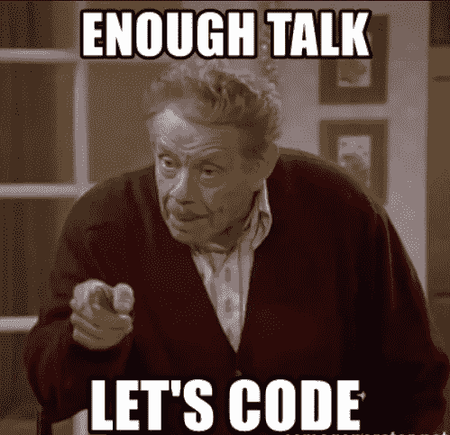
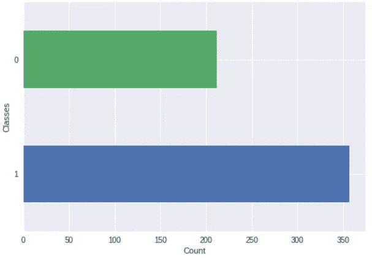

# 用 Python 从头开始实现感知器算法

> 原文：<https://medium.com/hackernoon/implementing-the-perceptron-algorithm-from-scratch-in-python-48be2d07b1c0>

在本帖中，我们将看到如何使用 python 中的乳腺癌数据集实现感知器模型。

感知器是神经网络的基本单元，它接受加权输入，对其进行处理，并能够执行二元分类。这是我之前关于[感知器模型](https://hackernoon.com/perceptron-deep-learning-basics-3a938c5f84b6)的帖子的后续。

如果你想跳过理论直接跳到代码，点击[这里](https://github.com/Niranjankumar-c/Perceptron_Model)。

*声明:本文的内容和结构基于四分之一实验室的深度学习讲座——*[*pad hai*](https://padhai.onefourthlabs.in)*。*

# 感知器概述

与 MP 神经元模型中的布尔输入不同，感知器模型中的输入可以是实数。模型的输出仍然是二进制的{0，1}。感知器模型接受输入 **x** 如果输入的加权和大于阈值 **b** 输出将为 1，否则输出将为 0。

Fig 1— Mathematical Representation

# 学习算法

学习算法的主要目标是找到能够绝对分离正的 **P** (y = 1) 和负的**N(y = 0)组数据的向量 **w** 。感知器学习算法是这样的，**

****

**Fig 2— Perceptron Algorithm**

**要详细了解学习算法以及为什么更新权重的概念在对正负数据集进行完美分类方面起作用的直觉，请参考我以前关于[感知器模型](https://hackernoon.com/perceptron-deep-learning-basics-3a938c5f84b6)的帖子。**

# **让我们编码**

****

**[Image Source](https://memegenerator.net/instance/42970028/frank-costanza-enough-talk-lets-code)**

**我们将使用的数据集是来自 [sklearn](https://scikit-learn.org/stable/modules/generated/sklearn.datasets.load_breast_cancer.html) 的乳腺癌数据集。数据集有 569 个观察值和 30 个变量，不包括类变量。乳腺癌数据是一个不平衡的数据集，这意味着类“0”和“1”没有被平等地表示。在这个例子中，我们不打算执行任何采样技术来平衡数据，因为这是感知器模型的简单实现。**

****

**Class Imbalance**

**在开始构建感知器模型之前，首先我们需要加载所需的包和数据集。数据集存在于 sklearn 数据集模块中。一旦我们加载了数据，我们需要使用`breast_cancer.data`和`breast_cancer.target`命令获取特性和响应变量。**

**Perceptron Preprocessing**

**获取 X 和 Y 变量后，我们将执行最小-最大缩放，以显示范围 0-1 内的所有要素。在建立模型之前，我们将拆分数据，以便我们可以根据训练数据训练模型，并根据测试数据测试模型的性能。我们将使用 sklearn 的`train_test_split`函数将数据按照 90:10 的比例拆分，分别用于训练和测试。现在我们已经完成了预处理步骤，可以开始构建模型了。我们将在一个名为*感知器*的类中构建我们的模型。**

**在感知器类中，我们将创建一个构造函数`def__init__`。构造器将权重向量 **w** 和阈值 **b** 初始化为无。**

**Perceptron Model**

**函数`model`将输入值 **x** 作为参数，并执行输入的加权聚合(在 **w.x** 之间的点积)，如果聚合大于阈值 **b** 否则返回值 1。接下来，我们有一个`predict`函数，它将输入值 **x** 作为参数，对于 **x** 中出现的每个观察值，该函数计算预测结果并返回一个预测列表。**

**最后，我们将实现`fit`函数来学习给定数据的最佳可能权重向量 **w** 和阈值 **b** 。该函数以输入数据( **x** & **y** )、学习率和历元数为自变量。**

**Perceptron Model Execution**

**一旦我们准备好我们的类，我们初始化一个新的感知器类对象，并使用该对象，我们将在我们的训练数据上调用`fit`方法来学习最好的可能参数。我们将通过计算测试精度来评估模型在测试数据上的性能。**

**本文中讨论的全部代码都在这个 GitHub [库](https://github.com/Niranjankumar-c/Perceptron_Model/blob/master/PerceptronModel.ipynb)中。随意叉或者下载。**

# **进一步的改进**

**您可以尝试一些可能的改进来提高模型的准确性，**

*   **改变训练-测试大小分割，并查看准确性是否有任何变化。**
*   **选择更大的历元值、学习率，在感知器模型上测试，并可视化准确度的变化。**
*   **在感知器模型中采用随机权重并进行实验。**

# **继续学习**

**如果你想让你的学习从感知器模型更上一层楼。查看来自 [Starttechacademy](https://courses.starttechacademy.com/full-site-access/?coupon=NKSTACAD) 的 Abhishek 和 Pukhraj 的[人工神经网络](https://courses.starttechacademy.com/full-site-access/?coupon=NKSTACAD)。还有，课程是用最新版本的 Tensorflow 2.0 (Keras 后端)讲授的。他们还有一个非常好的包，关于 Python 和 R 语言的[机器学习(基础+高级)](https://courses.starttechacademy.com/full-site-access/?coupon=NKSTACAD)。**

# **结论**

**在本文中，我们看到了如何使用 python 从头开始实现感知器算法。**

> **联系我
> GitHub:[https://github.com/Niranjankumar-c](https://github.com/Niranjankumar-c)LinkedIn:[https://www.linkedin.com/in/niranjankumar-c/](https://www.linkedin.com/in/niranjankumar-c/)**

****免责声明** —这篇文章中可能有一些相关资源的附属链接。你可以以尽可能低的价格购买捆绑包。如果你购买这门课程，我会收到一小笔佣金。**