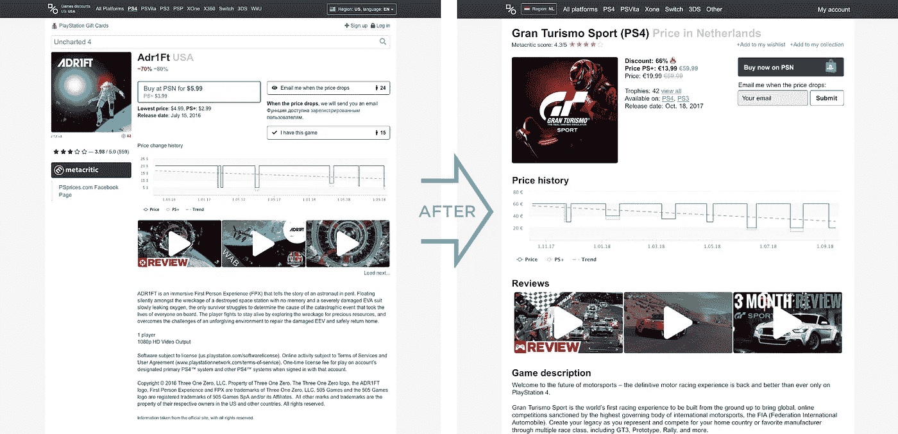

# 提高 PSprices.com 的 UX:增加转化率的结构。

> 原文：<https://medium.com/hackernoon/improving-the-ux-of-psprices-com-structure-to-increase-conversion-f4a16fbab136>

不久前，我决定作为一个爱好项目来改善 PSprices.com 的用户体验。我喜欢他们的价格监测网站，但 UX 是相当混乱。我试图保持设计和品牌不变，只专注于改善 UX。

通常我不会在没有分析现有使用数据的情况下对网站进行修改。在这种情况下，我不得不做出一些假设，因为我与网站无关。

# 前后

我的主要焦点是帮助用户达到他们的目标:在价格低的时候现在购买游戏，或者在价格下降更多的时候再购买。通过减少不必要的信息和改善页面的流程，我创建了一个 UX 设计，它很可能在实现用户目标(以及网站的商业目标)方面表现得更好。在接下来的部分中，我将深入到每个 UX 和转换改进背后的细节和推理。

# **改善流程&关注最常见的用例**

*   要得到正确的价格，用户必须做的第一件事是选择他的国家。遵循[古腾堡法则](/user-experience-3/the-gutenberg-diagram-in-web-design-e5347c172627)，我把这个按钮移到左上角，在阅读其余内容之前引起注意。作为一名用户，我经常看到错误的价格数据，因为默认的国家设置不是我的。
*   用户必须采取的第二个行动是选择游戏平台，以获得正确的信息。在这里，我通过移除老一代游戏机并把它们放在“其他”下来创造更多的焦点。我的假设是，不到 5%的用户仍然在为那些旧平台购买游戏，他们形成了不必要的干扰。
*   价格信息过去分散在整个页面上。现在，一切都集中在一个区域，使用一种字体大小，使得核心信息的扫描更加容易。我使用图标来进一步引导用户注意重要的信息。我还呼吁优先考虑 PS+的价格高于正常价格，假设访问该网站的 75%的 Playstation 用户拥有 PS+帐户，可以访问这些较低的价格。让网站专注于最常见的用例将减少最大用户群的摩擦。
*   此结果详细信息页面上的搜索栏已被删除。相反，在到达这一页之前，它会在页面上更加突出。为了让搜索在每一页都可以快速访问，我还是会考虑把它作为一个较小的字段添加到顶部菜单栏中。

# **利用成熟的最佳实践提高转化率**

*   减少了大量的按钮，将注意力集中在一个吸引用户注意力的主要行动号召按钮上。将“立即购买”按钮做成实心的，并赋予它高对比度的颜色，可以提高转化率。
*   第二个“行动号召”按钮允许用户注册价格通知。通过允许用户直接输入他们的电子邮件并按 submit，去掉了一个额外的步骤来增加这个特性的使用。
*   删除了分散用户主要目标注意力的不必要的功能。“观看这个价格的其他人的 nr”和“拥有这个游戏的人”不会直接对主要目标做出贡献。虽然 AB 测试在未来可以用来观察平台上其他用户的活动数量是否可以增加信任度，并因此转化。
*   已更改“登录”；将文案“注册”到“我的帐户”和“添加到我的 whishlist ”,以更好地传达创建帐户的好处。
*   通过将平台名称和单词“价格”添加到页面的 H1 标题来改进 SEO。使这些长尾游戏详细信息页面在普通搜索查询中更容易找到。比如:‘Grand turismo ps4 price’。

归根结底，UX 就是要做出明确的决定。理解用户的目标，保持事情的简单和结构化，并遵循最佳实践可以帮助提高转化率。