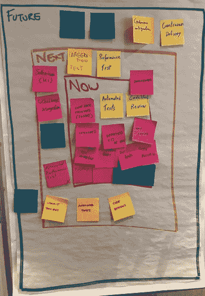

# 提高你对完成的定义

> 原文：<https://medium.com/hackernoon/improving-your-definition-of-done-d467c06837bf>

> 由[西蒙·赖因德尔](https://www.scrum.org/simon-reindl)，专业 Scrum 训练师，[Scrum.org](http://www.scrum.org)

Scrum 的目的是创建一个潜在的可发布的成品增量，以实现商业价值。许多团队努力改进他们对完成的定义。这里描述的技术允许在 Done 的定义和接下来的步骤上有更大的透明度。

目的是为团队提供一个思考的结构，然后建立一个关于引入什么来提高产品增量质量的计划。这可以在 Sprint 回顾中进行，可以在组建团队之前进行，也可以在 Sprint 的任何时候进行。

在白板或活动挂图上画三个嵌套的三角形，如下图所示。将中间的矩形标为“现在”，中间的矩形标为“下一步”，外部的矩形标为“未来”。用这个来指导团队。我喜欢用颜色来强调绿色的未来！

邀请 Scrum 团队建立一条通向更严格的 Done 定义的道路，这将意味着产品增量可以在没有进一步工作的情况下发布。

# 产生

该团队集思广益，想成为国防部的一部分，假设他们可以做任何事情。这应该包括任何东西，没有任何限制或界限。团队成员分别将每个项目写在单独的便利贴上，并将所有项目放在矩形旁边的墙上。

# 现在

团队集体将他们认为要见面的项目移到标有“现在”的空间作为一个团队，他们需要同意其中的项目是团队当前正在做的，或者在下一个 Sprint 中能够做的。此列表中的所有内容都应反映当前的工作实践。典型的例子包括，签入代码，所有单元测试通过，同行评审。

在下一个 Sprint 中，强调团队将对此定义负责是至关重要的。

# 然后

对标有“下一个”的空间做同样的操作。这将包括团队可以在短期内添加到他们的完成定义中的项目。这些可能需要一点研究，实践或改变行为。这不是关于计划什么时候去做，更多的是一种意图的表示。典型的例子包括:结对编程、测试驱动开发、自动化 UI 测试、自动化环境部署。

团队不能将这些放入他们当前的定义是有原因的，因为他们需要一些工作和努力或购买才能实现。

# 将来的

对标有“未来”的空间做同样的操作。这些项目需要投入大量的时间、精力和材料才能完成。这可能需要购买设备或工具，在严格控制的环境中协商使用工具，或者对团队实践进行重大更改。这些方面更难实现。

团队更新了他们对“完成”的定义，以包括“现在”的项目。这些项目可能需要进行细分以获得更好的粒度，或者重新措辞以获得更好的清晰度。我鼓励你现在就完成这项工作，这样你就对“同意”有了一个清晰的定义。

剩余的项目可以被订购到一个粗略的待办事项列表中。然后这些被捕获为行动，这样整个团队对他们下一步要包括什么有了透明度。你将这些纳入你的完成定义的速度将取决于 Scrum 团队能够容纳的东西。至关重要的是，每个人都认识到这将改善整个组织的成果。

完成是透明的核心，拥有一个可以发布的完成增量是有效 Scrum 团队的关键指标。要走到这一步，需要努力和专注。整个团队及其利益相关者需要支持对质量的无情关注，以实现这一价值。

时装零售商 ASOS 是一个组织如何接受这一点并获得回报的真实例子。在这里阅读他们的故事:[https://www . slide share . net/WinOpsConf/Ian-marge TTS-asos-journey-to-continuous-deployment](https://www.slideshare.net/WinOpsConf/ian-margetts-asos-journey-to-continuous-deployment)。我有幸参与了他们的部分旅程，实现高流量水平的努力意义重大，然而这些努力回报了组织能够支持指数级增长。

*原载于 2019 年 3 月 1 日*[*【www.advancedproductdelivery.com*](https://www.advancedproductdelivery.com/blog/2019/03/01/improving-your-definition-of-done/)*。*