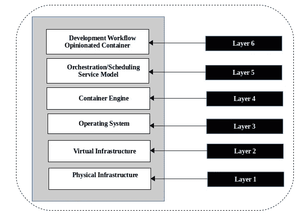
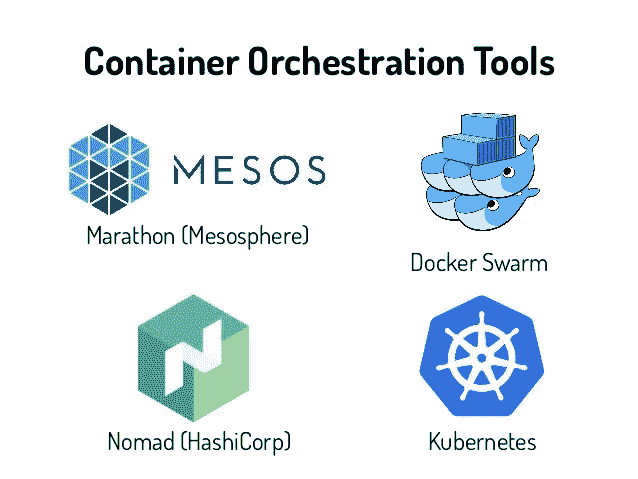
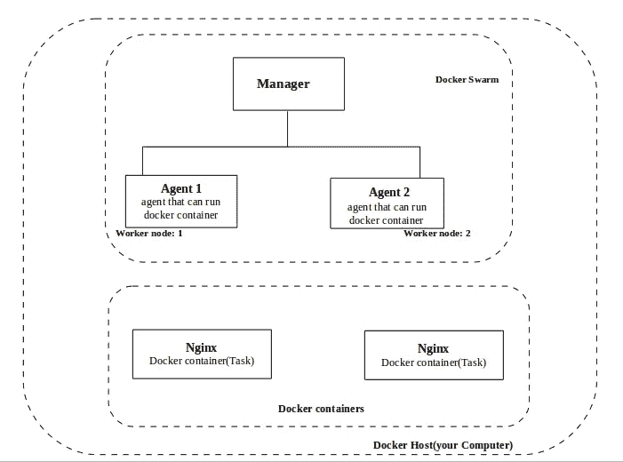
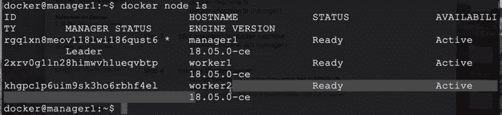
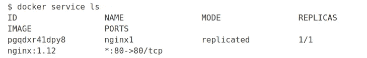
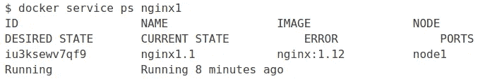

# 关于 Docker Swarm 的详细信息

> 原文：<https://medium.com/hackernoon/in-detail-of-docker-swarm-bbf623597c54>

***Docker Swarm*** 是一个流行的编排解决方案。


container Orchestration 就是管理容器的生命周期，尤其是在大型的动态环境中。容器编排的主要职责是:

```
1\. Provisioning and deployment of containers2\. Redundancy and availability of containers3\. Cluster management4\. Scaling up or removing containers to spread application 
   load evenly across host infrastructure5\. Movement of containers from one host to another if there is 
   a shortage of resources in a host, or if a host dies6\. Allocation of resources between containers7\. External exposure of services running in a container with 
   the outside world8\. Load balancing of service discovery between containers9\. Health monitoring of containers and hosts10\. Configuration of an application in relation to the 
    containers running it
```

一些开源编排解决方案有:Docker Swarm、Kubernetes、Apache Mesos、OPENSHIFT、Nomad 等。



Container Ecosystem Layers



一个 **集群的架构**

## Swarm 的主要架构组件包括:

> 群集:

1.  **一组节点，至少有一个主节点和几个工作节点，可以是虚拟机或物理机。**

> 服务:

1.  由群管理员定义的管理器或代理节点必须执行的任务。
2.  它定义了集群应该使用哪些容器图像，以及集群将在每个容器中运行哪些命令。

> 这个上下文中的服务类似于微服务；例如，您可以在这里为运行在 swarm 中的 nginx web 服务器定义配置参数。副本的参数也在服务定义中定义。

> 管理器节点:

部署应用程序后，管理器节点提供了多种功能，例如:

1.  它将工作(以任务的形式)交付给工作节点，
2.  管理它所属的群体的状态。

> 工作节点:

1.  工作者节点运行由群中的管理者节点分发的任务。
2.  每个工作节点运行一个代理，向主节点报告分配给它的任务的状态，因此管理节点可以跟踪群中运行的服务和任务。

> 任务:

1.  **任务**是 Docker 容器，它执行您在服务中定义的命令。
2.  管理者节点将*任务*分配给工作者节点，并且在该分配之后，该任务不能被移动到另一个工作者。如果任务在副本集中失败，管理器会将该任务的新版本分配给群中的另一个可用节点。



**Docker Swarm Architecture**

创造一个码头工人群体

> 步骤 1||安装 Docker 机器

**Docker Machine** 是一个工具，让你在虚拟主机上安装 **Docker** 引擎，用**Docker**-**Machine**命令管理主机。

使用以下命令在`ubuntu`上安装对接机:

```
$ base=https://github.com/docker/machine/releases/download/v0.16.0 && curl -L $base/docker-machine-$(uname -s)-$(uname -m) >/tmp/docker-machine && sudo install /tmp/docker-machine /usr/local/bin/docker-machine
```

> 步骤 2||创建 docker 机器作为 Docker 群的节点

创建一台`manager`机器和其他`worker`机器

创建`manager`节点:

```
$ sudo docker-machine create --driver virtualbox manager1
```

创建两个`worker`节点:

```
1\. $ sudo docker-machine create --driver virtualbox worker1
2\. $ sudo docker-machine create --driver virtualbox worker2
```

> 注意:如果您遇到 docker-machine:预创建检查错误:“退出状态 126”，您必须在您的机器上安装`*virtualbox*`。

检查创建的机器列表:

```
$ sudo docker-machine ls#  we have one 'manager'machine ----> manager1 
   and two 'worker' machine ------> worker1 and worker2
```

检查特定机器运行的`ip address`:

```
$ sudo docker-machine ip manager1
```

> 步骤 3||通过 ssh 从终端连接管理器和工作机

打开 3 个终端窗口，运行以下命令连接`manager1` `worker1`和`worker2`节点:

```
# connect to manager1 node
1\. $ sudo docker-machine ssh manager1# connect to worker1 node
2\. $ sudo docker-machine ssh worker1# connect to manager1 node
3\. $ sudo docker-machine ssh worker2
```

> 步骤 4||初始化 Docker 群

通过`manager1` **IP 地址**运行以下命令，初始化`manager`节点上的`docker swarm`:

> **注意:这只适用于蜂群管理器，不适用于工人机器**

```
# chek manager1 IP_address
1\. $ sudo docker-machine ip manager1# initialize docker swarm on manager1
2\. $ docker swarm init --advertise-addr manager1_ip_addressoutput will be something like this:Swarm initialized: current node (vq7xx5j4dpe04rgwwm5ur63ce) is now a manager.To add a worker to this swarm, run the following command: docker swarm join --token SWMTKN-1-50qba7hmo5exuapkmrj6jki8knfvinceo68xjmh322y7c8f0pj-87mjqjho30uue43oqbhhthjui 10.0.120.3:2377To add a manager to this swarm, run 'docker swarm join-token manager' and follow the instructions.
```

运行`docker node ls`以验证`manager`。这只在`swarm manager`中有效，在`worker`中无效。如果你愿意，你可以通过在你的终端的`worker`机器上运行这个命令来检查。

> **注意:**该`*docker swarm init*`命令生成一个加入令牌。令牌确保没有恶意节点加入群集。您需要使用这个令牌将其他节点加入到群中。

> 第五步||加入工人群体

在`worker1`和`worker2`上，复制并运行最后一个命令输出到控制台的`docker swarm join`命令:

```
$ sudo docker swarm join --token SWMTKN-1-50qba7hmo5exuapkmrj6jki8knfvinceo68xjmh322y7c8f0pj-87mjqjho30uue43oqbhhthjui 10.0.120.3:2377# after running the command you will be prompted "This node has joined a swarm
```

万岁！你现在有一个三节点群！！通过从您的`manager`机器运行以下命令进行验证:

```
$ sudo docker node ls
```



3-node swarm

> 第 6 步||查看更多信息

在管理器上运行标准 docker 命令

```
# check the swarm section no of manager, nodes etc
1\. $ sudo docker info
```

> 步骤 7 ||在 docker swarm 上运行或部署容器(服务)

既然我们已经初始化了三节点 Swarm 集群，我们将部署一些容器。为了在 Docker 集群上运行容器，我们需要创建一个服务。

> **注意:**服务是一种抽象，它表示部署在分布式集群中的同一映像的多个容器。

让我们用 NGINX 做一个简单的例子。目前，我们将创建一个具有一个运行容器的服务，但是我们将在以后扩展。

```
$ sudo docker service create --detach=true --name nginx1 --publish 80:80  --mount source=/etc/hostname,target=/usr/share/nginx/html/index.html,type=bind,ro nginx:1.12
pgqdxr41dpy8qwkn6qm7vke0q# description of flag1\. --detach=true: Run this container in the background
2\. --name: Gives a name to the container in our case it's 'nginx1'.
3\. --mount: NGINX print out the hostname of the node it's running on.
2\. --publish: Uses the swarm's built-in routing mesh. In this case, port 80 is exposed on every node in the swarm. The routing mesh will route a request coming in on port 80 to one of the nodes running the container.
```

> 这个命令语句是声明性的，Docker Swarm 会试图维持这个命令中声明的状态，除非被另一个`*docker service*`命令显式改变。

1.  **检查服务:(仅来自管理器节点)**

```
$ sudo docker service ls
```



**Inspect the service**

```
1\. $ docker node inspect worker1
2\. $ docker node inspect self 
3\. $ docker node inspect worker2
```

2.**检查服务的运行容器**

通过命令检查正在运行的服务

```
$ docker service ps.
```



> 在我们的例子中，它将是`*manager1*`而不是`*node1*`
> 
> 任务是 Docker Swarm 中的另一个抽象，代表服务的运行实例。在这种情况下，任务和容器之间存在一对一的映射。

3.**测试服务**

由于路由网格，可以在端口 80 上向群的任何节点发送请求。这个请求将被自动路由到运行 NGINX 容器的节点。

在每个节点上尝试以下命令:

```
$ curl localhost:80
# manager1Note: Curling will output the hostname where the container is running. In our case, it is running on manager1
```

> 步骤 8 ||扩展服务

在生产中，我们可能需要处理应用程序的大量流量，因此我们将学习如何伸缩。我们将按照以下步骤扩展我们的应用程序:

1.  **用更新的副本数量更新我们的服务:**

使用`docker service`命令更新我们之前创建的`NGINX` 服务，以包含 5 个副本。这为服务定义了一个新的状态。

```
$ sudo docker service update --replicas=5 --detach=true nginx1
```

运行此命令会发生以下事件:

*   服务的状态被更新为 5 个副本，这些副本存储在 swarm 的内部存储器中。
*   Docker Swarm 发现现在计划的副本数量与声明的状态 5 不匹配。
*   Docker Swarm 调度 5 个以上的任务(容器),试图满足服务的声明状态。

*该群主动检查期望状态是否等于实际状态，并在需要时尝试协调。*

2.**检查正在运行的实例:**

几秒钟之内，蜂群就会成功完成任务。运行以下命令检查正在运行的实例:

```
$ sudo docker service ps nginx1
```

3.**向** [**发送大量请求 http://localhost:80。**](http://localhost:80.)

现在，当您在`port 80`上发送请求时，路由网格有多个容器来路由请求。路由网格充当这些容器的负载平衡器，交替将请求路由到哪里。

```
$ curl localhost:80
worker2
$ curl localhost:80
worker2
$ curl localhost:80
worker1
$ curl localhost:80
manager1
$ curl localhost:80
manager1
```

> **注意:**您向哪个节点发送请求并不重要。接收请求的节点和该请求被路由到的节点之间没有连接。

4.**检查服务的汇总日志:**

查看这些请求被路由到哪些节点的另一个简单方法是检查聚合日志。您可以通过使用命令`docker service logs [service name]`获得服务的聚合日志。

```
$ sudo docker service logs nginx1# you can see that each request was served by a different container.
```

> 步骤 9||更新服务

现在您已经部署了您的服务，您将看到您的应用程序的发布。你要把 NGINX 的版本更新到 1.13 版。

1.  **运行** `**update**` **命令:**

```
$ sudo docker service update --image nginx:1.13 --detach=true nginx1# This triggers a rolling update of the swarm.
```

2.**查看更新:**

```
$ sudo docker service ps nginx1
```

您已经成功更新了您的应用程序！

> 步骤 9:关闭节点

如果您想关闭一个节点，可以通过运行以下命令来完成:

```
1\. $ sudo docker node update --availability drain worker1
# worker1 node will shut-down2\. $ sudo docker node ls
# verify the running node
```

> 步骤 9:删除服务

您可以通过运行以下命令从所有计算机上删除服务:

```
$ sudo docker rm nginx1# In our case 'nginx1' is our service name
```

验证删除的服务:

```
$ sudo docker service ps nginx1
# no such service: nginx1
```

> 第十步:离开蜂群

如果你想让一个`worker`节点离开集群，从期望的`worker node`运行以下命令:

```
$ sudo docker swarm leave
# Node left the swarm# verify it from manager node running:
$ sudo docker node ls
```

> 步骤 10:停止并移除机器

如果要停止机器运行:

```
$ sudo docker-machine stop machineName
```

如果要删除机器运行:

```
$ sudo docker-machine rm machineName
```

> **注意:**您必须从外部运行`*stop*`和`*rm*`命令。既不来自`*manager*`也不来自`*worker*`机器。

你可以查看我之前的文章看看如何 dockerize 一个 flask 应用点击这里[https://medium . com/@ tasnuva 2606/dockerize-flask-app-4998 a 378 a6aa？source = friends _ link&sk = 93569352 f 150 BF 5 e 6141 ABC 152654734](/@tasnuva2606/dockerize-flask-app-4998a378a6aa?source=friends_link&sk=93569352f150bf5e6141abc152654734)。

恭喜你！！现在你已经很了解 docker swarm 了，不是吗？？