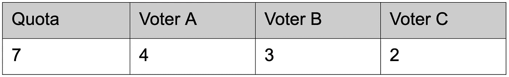
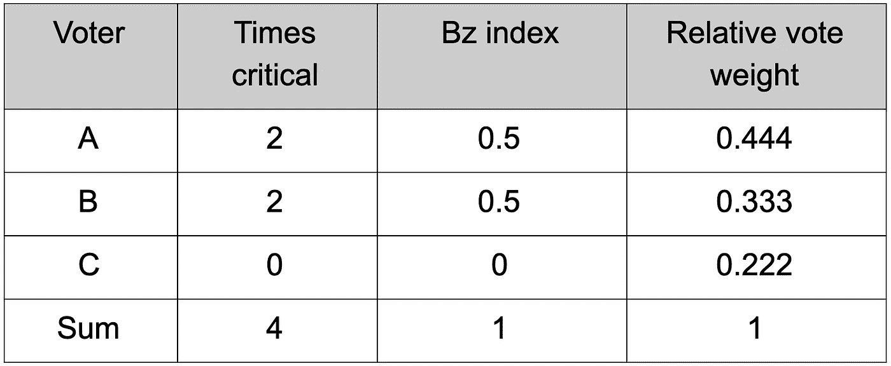
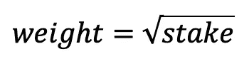
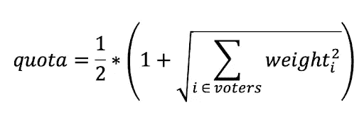

# 赞扬双平方根投票制度对区块链的管治

> 原文：<https://medium.com/hackernoon/in-praise-of-the-double-square-root-voting-system-for-blockchain-governance-977fa37f62cd>

2004 年，科学界和媒体确信欧洲部长理事会的投票程序是不公平的。许多研究表明，投票程序制定于《尼斯条约》，该条约将于 1 月 1 日生效。那一年的 11 月，会不公平地有利于像德国这样的人口大国，而对像西班牙和波兰这样的中等国家尤其不利。作为一种妥协，克拉科夫雅盖隆大学的数学家提议使用“双平方根投票系统”，这不同于所有以前的投票程序，应该基于博弈论原理[ [2](https://arxiv.org/pdf/physics/0701338.pdf) ]。

与欧盟类似，区块链社区是一个多元化的利益相关者群体，在该体系中有着各自的利益和不同程度的利害关系。在这两种情况下，利益相关者都依赖于底层的共享基础设施，所有成员都从中受益。修改这一基础设施，无论是欧洲法律还是区块链议定书，都会对个体利益相关者产生重大影响。因此，对这个基础设施进行变更的决策权应该在涉众之间公平分配。

但是公平地分配决策权意味着什么呢？在欧盟，这意味着必须在根据人口规模分配决策权与同时给予所有较小成员国发言权之间找到一个折中方案。在区块链空间中，根据参与者在系统中拥有的股份分配决策权，例如拥有的令牌数或散列权，通常被认为是公平的。但对二次投票等系统的广泛兴趣也表明，许多人会支持更平等的决策权分配，在这种情况下，拥有更多投票权对个人来说成本高昂。双平方根投票系统试图避免集中决策权，同时确保利益相关者的投票权实际上等于其分配的投票权重。

# 先验投票权

为了理解双平方根投票系统，必须理解的最重要的概念是先验投票权。先验投票权是投票理论中的一个核心概念，描述了加权二元投票游戏中参与者的真实投票权(例如，决定支持或反对某项提案)。存在投票权重不等于玩家的投票权的情况。最好用一个例子来解释:让我们想象一个只有两个投票者的简单加权投票游戏。一个拥有 51%的投票权，另一个拥有 49%的投票权。尽管投票权重几乎相同，但很明显，如果需要多数票(> 50%)，第一个投票人拥有 100%的投票权。这样的投票人被称为独裁者，因为他或她拥有全部的决定权。另一个投票人被称为虚拟投票人，因为他或她的投票永远不会对结果产生影响。

有不同的权力指数可以用来表示加权投票游戏的玩家的先验投票权力。相对班扎夫指数是学术界最广泛认可的指数，也是最适合区块链治理的指数。它可以用来比较一个特定投票游戏中玩家的投票能力。相对 Banzhaf 指数的计算方法是计算某个玩家处于关键地位的联盟的数量，这意味着如果没有该玩家，该联盟将不会获胜，并将该数量除以投票游戏中选民处于关键地位的总次数[[3](https://www.elgaronline.com/view/9781858988054.00009.xml)]。

这也可以通过一个例子来更好地说明:想象一个投票游戏，参数如下。配额描述了联盟获胜所需的投票权重。

此投票游戏的第一个获胜联盟是{A，B，C}，共享投票权重为 9。在这个联盟中，A 和 B 是关键的，而 C 不是关键的，因为 A 和 B 的共享投票权重是 7，这已经满足了所需的配额。因此，第二个获胜的联盟是{A，B}，其共享投票权重为 7。在这个联盟中，两个成员都至关重要，因为单独一个成员无法达到配额。因此，A 和 B 在第一个和第二个获胜联盟中都是关键的，而 C 在任何获胜联盟中都不是关键的。因此，A 和 B 的 Banzhaf 指数都是 2/4=0.5，而 C 0/4=0。很明显，A 和 B 都有一半的决策权，因为只有他们彼此同意并组成联盟才能达到配额。这意味着 C 在这个投票游戏中是一个虚拟人物，玩家的真实相对投票权与其相对投票权重相差很大。

应该指出的是，先验投票权不对任何结果发生的概率做出任何预测，而仅表示仅从决策规则本身得出的玩家的投票权，这意味着玩家由于获胜所需的配额和投票权重的分配方式而拥有的投票权。

# 求平方根

顾名思义，双平方根投票系统由两部分组成。首先，在二次投票的精神中，取投票权重应该基于的值的平方根(例如，人口或代币数量等)。).求平方根对最终的投票权重有调整作用。例如，一个国家的人口比另一个国家多 100 倍，或者一个令牌持有者的令牌比另一个令牌持有者多 100 倍，那么这个国家的投票权重只有 10 倍。由于平方根函数的梯度，这种影响随着群体或记号的更大差异而增加(sqrt(10，000)=100，sqrt(1，000，000)=1，000 等)。).因此，人口较多的国家或拥有大量代币的代币持有者仍将始终比较小的国家或小规模代币持有者拥有更多的投票权，但程度不同于人口或代币的差异。因此，在系统中拥有更大利益的实体应该拥有更多决策权的原则(这可能是非常有益的)得到了维护，同时有效地防止了决策权集中在少数大国或秘密鲸手中。

> 在欧盟理事会的情况下，取人口的平方根实际上是基于彭罗斯方法，该方法认为，在双层投票系统中，公民的投票权随着 1/sqrt(人口)而减少，因此，如果成员国的投票权是其人口的平方根，则欧盟中每个公民的投票权是相同的。这当然不适用于区块链治理，但有益的属性是相同的

# 调整配额

但是正如我们所了解的，投票游戏中玩家的投票权重并不总是该玩家投票权的有效表达。为了确保分配的投票权重等于他们的投票权，在双平方根投票系统的第二部分中，配额以这样的方式调整，即每个参与者的投票权重等于他们的相对 Banzhaf 指数。这是通过使用一个数学近似值来实现的，该近似值产生作为所有参与投票人的投票权重分布的函数的所需配额。这一配额取决于选民人数和他们的投票权重，总是高于 50%，但对于大量选民和平均分配的投票权重来说，接近多数决原则。

使投票权重等于相对 Banzhaf 指数有许多有益的特性。首先，也是最重要的一点，如果有不止一个投票人，就永远不会有独裁者，因为那需要 100%的投票权重。例如，如果一个投票人的投票权重为 80%,配额将以相对 Banzhaf 指数等于 80%的方式进行调整。在简单多数规则(配额= 50%)下，这样的投票者将是独裁者。但是因为配额调整，双平方根投票制就不是这样了。在实践中，这意味着根据其他投票权重，最终的配额将远远超过 80%，以确保该投票人实际上只拥有 80%的投票权。此外，与其他投票机制不同，在其他投票机制中，配额通常或多或少地根据似乎合适的“保守主义水平”任意设置，而在这里，配额是根据博弈论原则进行调整的，动态地适应各自的情况。在更保守的配额更合适的情况下(投票权重差异大和/或选民人数少)，配额自动更高；在保守程度较低的配额可接受的情况下(平均分配的投票权重和/或选民人数多)，配额自动更低。这是选择适当配额的一个非常好的解决方案，因为它自动创建了一个公平的投票系统，而不需要任何额外的规则。

您可以在这个小示例计算器中使用一个只有 10 名投票者的示例来体验一下投票系统:

[https://docs . Google . com/spreadsheets/d/16 h8 aw 8 yeofr 4 trli 5 tpzdm 4 _ sjmqzasffwg 95 gwt ma/edit # GID = 0](https://docs.google.com/spreadsheets/d/16hG8AW8YEOfR4trli5TpZdM4_sJmqZasFFWG95gWTmA/edit#gid=0)

双平方根投票制度也可以抑制不同形式的操纵。反对在区块链治理中使用正式投票的一个重要理由是，它容易被操纵，尤其是容易被收买。由于区块链的基本特征，如透明度和每笔交易的有效性，在区块链投票可以非常有效地购买选票。

当投票买卖双方对他们的交易有把握时，投票购买是最有效的。这就是为什么所有现代民主国家都引入了无记名投票:如果买票者或胁迫者无法确切知道一个人在投票站做出了什么选择，那么买票或胁迫就变得无利可图。考虑到这一点，很清楚为什么区块链投票是购买选票的完美选择。投票买方和卖方可以绝对确定对方坚持他们的交易，交换甚至可以在智能合同中自动化。

双平方根投票系统可以通过在另一个层面引入不确定性来抑制投票购买和胁迫。因为所需配额是根据所有*参与*投票人的投票权重分配计算得出的，所以在投票期结束之前，不清楚需要多少配额，例如提案通过所需的配额。只有在投票期结束，所有信息都知道之后，才能计算出结果。选民参与、其他选民的决定、他们的投票权重和由此产生的配额的不确定性可能会阻止选民参与这种操纵。如果购买选票对特定选举的影响真的很难预测，那么它的期望值就变得很难计算。因此，类似于引入关于交易的不确定性，引入关于该交易将具有的效果的实质不确定性，可以阻止或者至少抑制投票购买。

此外，在区块链治理中，人们可以想象许多指标，如代币，甚至“用过的汽油”，可能会作为投票权重的基础。这些指标通常可以“人为地”增加，唯一的原因是增加投票权。在双平方根投票系统中，这种人为增加的效果受到设计的限制。求平方根并调整配额使得增加恶意参与者的决策权比在简单的例如令牌加权投票系统中成本高得多。此外，与通过购买选票进行操纵类似，这种人为增加可能产生的影响如上所述非常不确定。高昂的成本及其效果的不确定性可能会阻碍许多行为者参与此类活动。

不幸的是，与许多其他投票系统类似的唯一一种操纵是 Sybil 攻击，这种操纵对于双平方根投票系统来说是很成问题的，在这种攻击中，参与者采用多个身份来获得更多的决策权。尽管双平方根投票系统中 Sybil 攻击的影响比一人一票系统中的影响要小得多，但根据设置，它可以显著增加攻击者的决策能力。例如，当投票权重分布非常不均匀时，Sybil 攻击会产生相当大的影响。例如，如果一个拥有 80%投票权重的演员设法通过假设多重身份分裂成 40%和 40%甚至 20%、20%、20%、20%的实体，这可能足以使这个演员成为独裁者。但是在许多情况下，西比尔的攻击不会产生如此严重的影响。例如，每当投票权重由于 Sybil 攻击而变得更加不均衡时，配额就会增加，攻击的影响就会减弱。然而，由于其易受 Sybil 攻击，双平方根投票系统需要某种身份方案来发挥其全部潜力。

很明显，双平方根投票系统满足了成为区块链治理的有价值的投票系统的许多要求。该机制相对简单，适度保守，可以很容易地适应不断变化的环境，所有参数都可以很容易地验证，并且在利益相关者之间公平地分配决策权。它可以帮助解决不同形式的操纵，并基于博弈论的原则。与某种形式的身份系统一起，它可以用于在链上做出集体决策。它易于实施，比二次投票简单，因此可以用于今天的区块链治理。但这当然也可以被视为试验更复杂的正式投票系统的第一步。

系统的两个部分也可以单独应用。如果调整投票权重并朝着类似二次投票的方向迈出第一步似乎是一个好主意，但不断变化的配额和“这整个投票权的事情”有点太多了，只有用平方根来调整投票权重可能是一种选择。相比之下，如果参与者应该拥有与他们在系统中的股份直接类似的投票权，而不是通过平方根来调整投票权重，则只有第二部分可以用于选择有意义的配额。

最后，我认为区块链世界的人们应该研究在区块链实现正式投票的所有不同方式，然后再完全排除这种可能性。与此同时，我鼓励每一个致力于设计治理流程的人在他们通常的圈子之外寻找答案，并向其他民主机构学习。尤其是从他们的错误中学习。例如，欧盟理事会没有接受波兰数学家的提议，而是采纳了一个选项，这个选项是政治谈判的结果，没有考虑任何博弈论原则。

[1]《电讯报》:根据博弈论的观点，欧盟宪法是“不公平的”

[2]索姆琴斯基和 życzkowski(2007 年)。从玩具模型到双平方根投票系统。【经济人 24(3-4):【https://arxiv.org/pdf/physics/0701338.pdf】T4

[3]费尔森塔尔博士和马乔夫博士(1998 年)。*投票权的测量*:https://www.elgaronline.com/view/9781858988054.xml 埃德华·埃尔加出版社

[4]黑客，分布式:链上投票购买与暗道的兴起:[http://Hacking Distributed . com/2018/07/02/On-Chain-Vote-Buying/](http://hackingdistributed.com/2018/07/02/on-chain-vote-buying/)