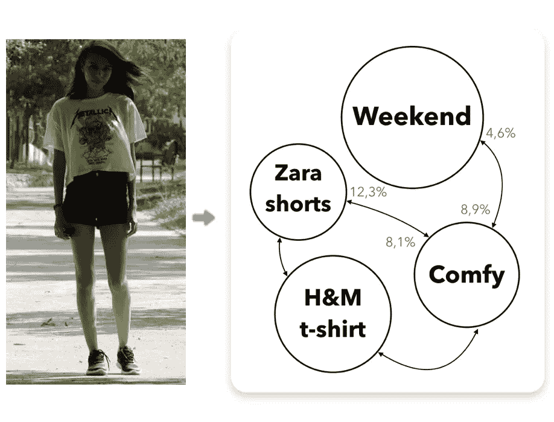
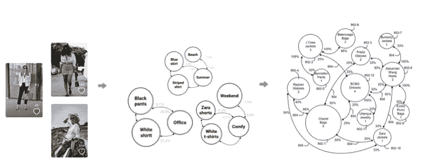
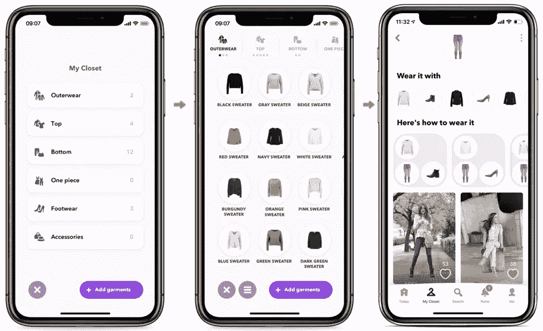

# 店内服装推荐:将你衣柜里的衣服和你将要购买的衣服搭配起来

> 原文：<https://medium.com/hackernoon/in-store-outfit-recommender-matching-the-clothes-in-your-closet-with-garments-you-are-about-to-buy-70c0dc03851>

Introducing an in-store outfit recommender system, powered by the [**Fashion Taste API**](https://fashiontasteapi.com). See complete video below.

在**时尚品味 API** ，我们在每个购物者的品味档案之上建立[全渠道个性化体验](https://fashiontasteapi.com/)。这个基础设施有几个组成部分，比如一个[时尚本体](https://fashiontasteapi.com/technology/our-fashion-ontology)，一个针对每个时尚零售商的[品味图](https://fashiontasteapi.com/omnichannel-retail/your-fashion-taste-graph)或者[数字衣橱技术](https://fashiontasteapi.com/omnichannel-retail/digital-closet-technology)，时尚零售商可以向他们的顾客提供这些。

有了这种数字衣橱技术，女性可以轻松再造她们的实体衣橱，以数字方式储存她们的衣服。然后，衣柜向人们展示如何根据我们对真实女性上传到我们的消费者应用程序的数百万套服装的分析来组合他们的衣服。衣橱也向他们展示其他人如何穿他们的衣服，或者类似的衣服。

# 带着你的衣服去购物

今天，我们介绍一个店内装备推荐系统。建立在 [**时尚品味 API**](https://fashiontasteapi.com) **，**之上，它基于一个系统，可以将用户的衣服与任何外部服装相匹配，而不管其来源。

在下面的视频中，你可以看到我的同事 Maria 在一家实体店看衣服，以及 [**时尚品味 API**](https://fashiontasteapi.com) 如何推荐她可以用衣柜里的衣服和她即将购买的服装制作出什么样的服装。

这是一个过程:我们正在读取 QR，提取图像，并将图像发送到我们的系统，在系统中，深度学习算法提取服装的描述符。把这些描述符想象成一个“描述符包”。这包描述符然后被发送到我们的品味图，它告诉我们它如何与用户衣柜中的衣服相关联。

Demo of the in-store outfit recommender

# 一个本体和一个品味图来实现装备建议的自动化

允许我们解释任何进来的服装的资产是我们的本体。它也适用于服装和文本。

时尚品味 API 本体是定义一套服装所需的描述符的分类，用与女性相关的术语，说出她们使用的词汇。我们通过分析女性如何寻找服装，如何标记服装，以及如何分类服装，创建了这个本体。

(除了别的以外)我们的本体允许我们将任何服装转换成“元服装”。元服装是对服装最基本但相关的描述(就像描述符的袋子一样)，它们让我们的系统和算法能够对所有进来的服装有一个清晰的理解。正是这种理解使得味道图能够有效地完成它的工作，并使服装与其他服装相匹配。因为我们知道人们衣柜里有什么衣服，所以我们根据这些衣服进行过滤，并返回一套完整的服装。由此，为时尚零售打造一个[个性化平台成为现实。](https://fashiontasteapi)

我们看到这种基础设施应用于试衣间、卧室里的智能镜子以及网上购物。这里的教训是，虽然从分类和捕捉的角度来看，衣服是混乱的，但有一种方法可以自动将干净、结构化的数据带到衣服和时尚品味中。这改变了一切，因为这是一个新的开始。

# 服装提供了品味的独特视角

自 2004 年以来，我们一直致力于不同垂直领域的推荐系统。在时尚界，我们发现有趣的挑战是如何捕捉数据，然后辨别潜在的品味。我们的论点是，在线时尚将被一种理解品味的工具所改变。因为如果你懂得品味，你就能取悦人们。

“服装”是让品味被理解的资产。他们带来的背景引导人们描述他们的衣服，他们穿什么的需求，以及其他相关的品味描述。

虽然时尚推荐系统的传统方法侧重于建议您购买更多产品，而不了解您的口味，但我们认为侧重点应该有所不同。这就是我们的关注点:在个人层面上理解人们:他们的需求、行为和品味。

*How do people describe their clothes and outfits? What clothes do they have in their closets?*

A taste graph to understand fashion taste

A user’s digital closet powered by the [**Fashion Taste API**](https://fashiontasteapi.com)

# 时尚的未来看起来很突出:新的硬件，新的投入来源，对人们更好的理解…

我们相信，时尚的未来看起来很棒。我们每个人都将拥有自己的[自动化私人造型师](https://fashiontasteapi.com/omnichannel-retail/in-bedroom-fashion-stylist)，既可以通过手机应用程序访问，也可以通过我们卧室里的一个硬件访问。这个系统将存储我们的衣服和我们的行为，来源于几乎没有摩擦的输入源。

基于这种理解，这位私人造型师将帮助我们对服装和我们自己感觉良好和自信。这就是目标。

了解更多关于 [**时尚品味 API**](https://fashiontasteapi.com) 。

感谢阅读！😍