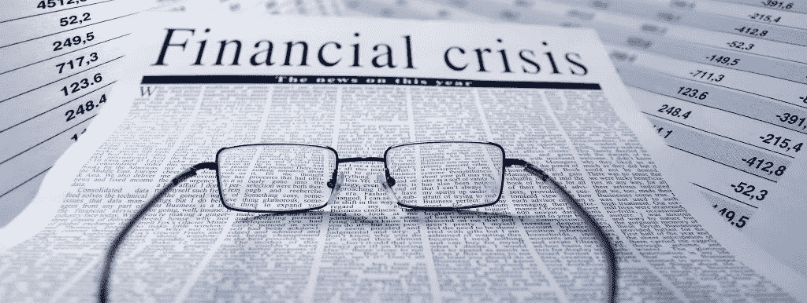
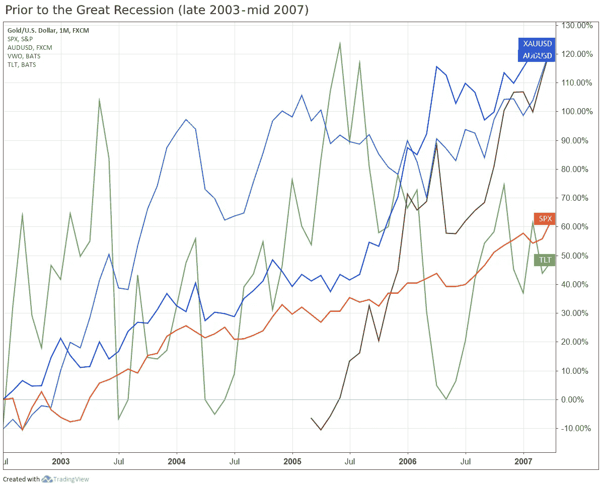
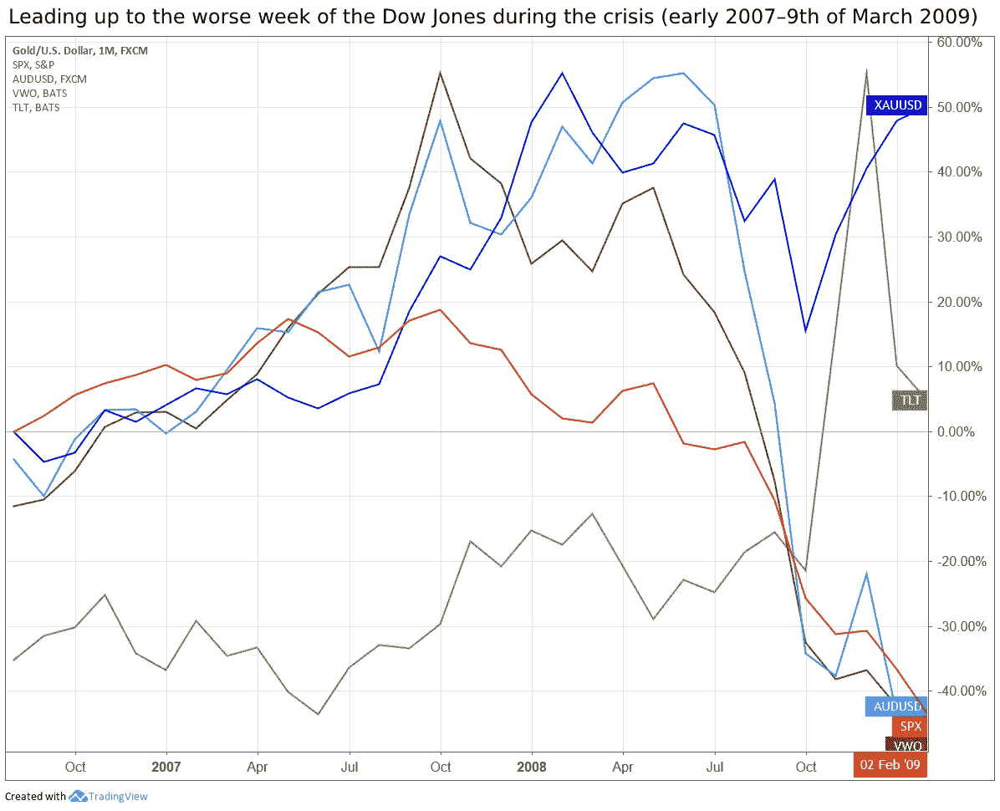
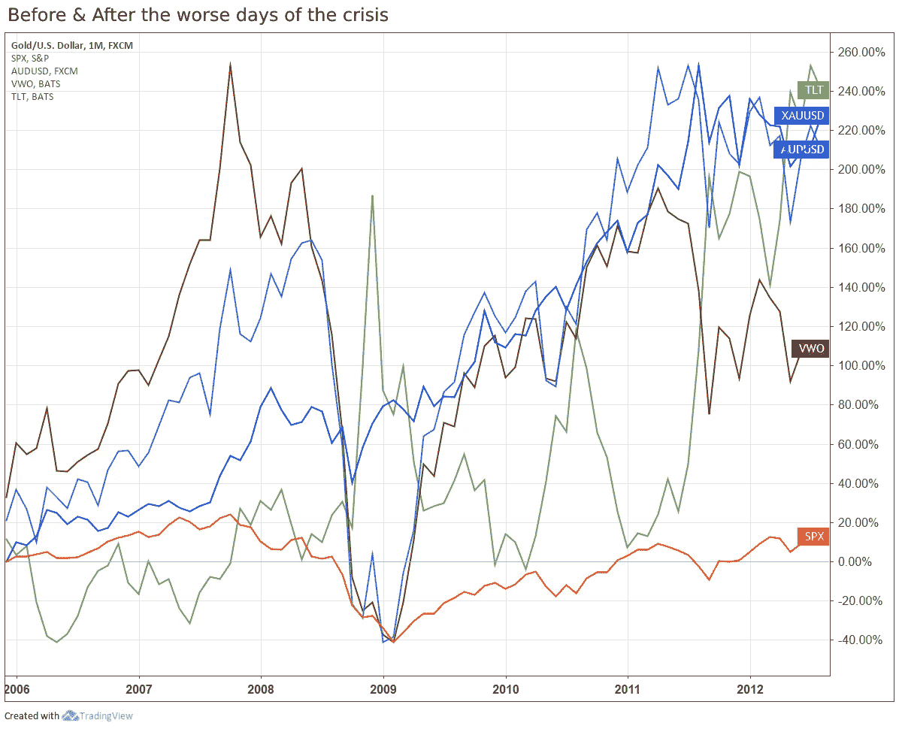
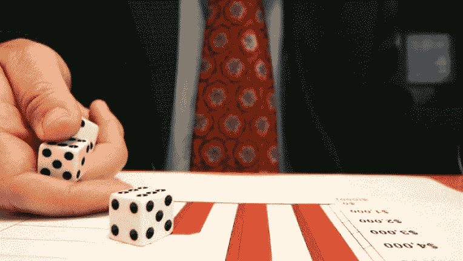
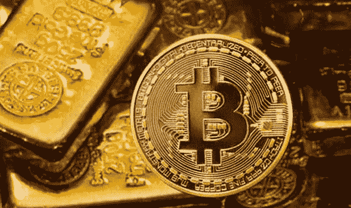
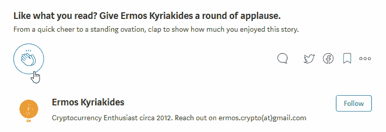

# 隐现的金融危机:比特币会怎么样？

> 原文：<https://medium.com/hackernoon/in-the-looming-financial-crisis-what-will-happen-to-bitcoin-71a6e079ccf0>

你可能已经注意到我在过去的几个星期里一直处于失踪状态，但是不用担心，我仍然在附近徘徊(虽然非常忙！)并一如既往地涉足加密货币领域。在**大衰退**(2000 年代末和 2010 年代初的经济衰退)期间，**发布了现在著名的论文，***比特币:点对点电子现金系统*** *。* **Satoshi** 提出了*‘一种纯粹点对点版本的电子现金，它将允许在线支付直接从一方发送到另一方* ***而不经过金融机构****’。***

**人们普遍认为，T21 对当时的经济形势(金融机构集中化、银行纾困等)感到不满。)这导致了**比特币**(2008 年)的诞生，其网络于 2009 年 1 月 3 日“上线”。第一个区块(genesis block)包括以下消息*“泰晤士报 03/Jan/2009 财政大臣濒临对银行的第二次救助”，*瞄准正在为英国银行准备 5000 亿英镑救助方案的阿利斯泰尔达林****。******

******在这篇文章中，我不仅会谈论**比特币**和**加密货币**(正如我之前所做的那样)，还会退一步，更深入地探讨**全球经济**、**隐现的金融危机**，并讨论**比特币**在面临诞生以来的第一场金融危机时会发生什么。在后续的帖子中，我将讨论在这种情况下，加密货币整体上会发生什么。******

********

# ****什么是金融危机，它是如何引起的？****

> ****在金融危机中，资产价格大幅下跌，企业和消费者无力偿还债务，金融机构面临流动性短缺。金融危机通常与恐慌或银行挤兑联系在一起，投资者抛售资产或从储蓄账户中提款，因为他们担心如果他们留在金融机构，这些资产的价值会下降。****
> 
> ****如果机构或资产被高估，就可能发生金融危机，而非理性的投资者行为可能会加剧金融危机。一连串的抛售可能会进一步导致资产价格下跌或更多的储蓄提款。如果任其发展，危机会导致经济衰退或萧条。****

****总是争取更多是人的本性，我们经济的资本主义本质是这样建立的，为了促进这种不断增长的 T2，我们经常让 T4 堆积债务。这种情况更容易发生——尤其是在“情绪高涨的市场”期间，在这种情况下，散户和机构通常会高估自己偿还贷款的能力。****

****当堆积这些债务不再是可持续的，一切都像纸牌搭的房子一样摇摇欲坠时，市场崩溃，随后发生金融危机。****

****有许多关于这个主题的资源，所以我不会深入细节，而是专注于一旦下一次金融危机来袭，比特币将如何发展——这是一个时间问题，而不是如果的问题。****

# ****研究数据****

****为了用事实来支持这篇文章，我想在下面列出不同的资产，在下面的图表中使用，并附有简短的描述和选择它们的原因。****

## ****资产****

*   ******金色** (XAUUSD，蓝色)****

> ****黄金价格在全球金融市场上广受关注。黄金是数百年来经济资本主义的基础，直到金本位被废除，这导致了法定货币体系的扩张，在这种体系中，纸币没有任何实物形式的货币化作为隐含的支持。以美元报价的黄金，这是全世界衡量黄金价值的通用尺度。****

****除了比特币被无数次称为“数字黄金”这一事实之外，黄金也被广泛认为是经济动荡时期的安全天堂。它通常与美元成反比，是一种很好的跟踪资产。****

*   ******标准&普尔 500 指数** (SPX，橙色)****

> ****标准普尔 500 指数是 500 只股票的资本化加权指数。该指数旨在通过代表所有主要行业的 500 只股票的总市值变化来衡量广泛的国内经济表现。该指数是以 1941 年至 1943 年为基准期，以 10 为基准水平制定的。****

****标准普尔 500 指数(标准普尔 500)是最常用的判断美国整体经济状况的基准，包含在任何表现比较图表中都是非常合理的。****

*   ******澳元对美元**(澳元对美元，青色)****

> ****货币对显示购买一美元(基础货币)需要多少澳元(报价货币)****

****这种“主要货币对”是很好的比较对象，因为在乐观的市场中，“高风险货币交易”表现良好，因为它们通常利率更高(这意味着更高的增长)，并且与大宗商品直接相关。澳大利亚是最大的煤炭和铁矿石出口国，因此其货币的困境严重依赖于大宗商品价格。****

*   ******先锋富时新兴市场 ETF** (VWO，布朗)****

> ****该 ETF 投资于全球新兴市场公司的股票，如中国、巴西、台湾和南非。它有很高的增长潜力，但也有很高的风险；股票价值的上下波动可能会超过投资于包括美国在内的发达国家的股票基金。****

*   ******iShares 20 年期以上国债 ETF** (TLT，绿色)****

> ****该 ETF 旨在跟踪由剩余期限超过 20 年的美国国债组成的指数的投资结果。****

****一般来说，在衰退期间，债券是一种“安全的玩法”，因为**利率下降**，而**债券价值上升**。然而，并不是所有的债券都是平等的。“安全策略”适用于信用评级良好的债券，如 AAA 级公司债券。这只 ETF 由信用评级非常好的美国国债组成。****

## ****排行榜****

****下面的三张图表(时间框架不同)显示了几年内**资产百分比变化**的快照，我将在下面的章节中提及。****

********

****Figure A****

********

****Figure B****

********

****Figure C****

# ****那么……比特币会怎么样？****

## ****场景 1****

****在“乐观市场”期间，散户和机构更加追求风险，投资于具有更高收益潜力的资产。如**图 A** 所示，高(额)风险资产，如**先锋富时新兴市场 ETF** 和**澳元**收益丰厚。你可能也注意到了**黄金**，也有类似的回报，这部分是由于 [*【商品超级周期】*](https://www.scmp.com/business/commodities/article/1279041/super-cycle-taking-break) 。****

********

****然而，毫无疑问，**最先被清算的投资**是**承担最高风险的**；金融危机期间，机构和散户都需要现金流，而最符合逻辑的出售投资是风险最高的投资。或者，他们可能会通过投资“更安全”的投资来寻求风险最小化，例如 **iShares 20 年期以上国债 ETF** 、 **Gold** 等。****

****在**图 B** & **图 C** 中，你可以清楚地看到，在经济动荡中受打击最大的资产是风险最高的资产。**先锋富时新兴市场 ETF** 和**澳元**下跌 **~80%** **触及**(从 2006 年至 2009 年 3 月的历史高点)。相比之下，“更安全的资产”受到了约 30%的冲击。****

****既然已经解决了，比特币在金融危机期间陷入困境也就不足为奇了，因为它可以被视为一种**高风险投资**，原因如下:****

*   ******市场风险** —比特币仅出现了近 10 年，仍然是一种纯粹由供需驱动的**高投机性资产**。比特币今天保持价值的唯一原因，是因为**增长预期**和**未来可能的真实用例**。****
*   ******监管风险** —由于比特币与“传统金融系统”相去甚远，并且有能力(更有效地)被用于邪恶目的，政府机构一直在试图寻找一种方式来**监管**它。然而，由于比特币的性质，这被证明是极其困难的，并且缺乏对比特币(和其他虚拟货币)的统一监管引发了对其寿命、流动性和普遍性的质疑。****
*   ******安全风险** —鉴于区块链的性质，在那里所有交易都是**最终**和**不可逆**的，安全是一个巨大的风险。一旦比特币从甲方转移到乙方，将它们退回的唯一方法是乙方明确地退还它们。自从比特币相关的活动(钱包、兑换等。)生活在**数字世界**，他们对**黑客**、**恶意软件**和**操作失误** *。*例如，一旦恶意行为者获得了对某个交易所的必要访问权非法将比特币从该交易所转移到他自己的钱包，那么**就没有办法逆转**这样的行动。发生了多起交易所黑客攻击，最著名的是 2014 年的 [Mt. Gox 黑客攻击](https://blockonomi.com/mt-gox-hack/)，当时导致损失超过**4.5 亿美元**。****
*   ******保险风险** —根据管辖范围的不同，一些**传统投资通过一些计划投保**，如 [*证券投资者保护公司*](https://www.investopedia.com/terms/s/sipc.asp) *(美国)* [*联邦存款保险公司*](https://www.investopedia.com/terms/f/fdic.asp) *(美国)*或 [*金融服务补偿计划*](https://www.fscs.org.uk/) *(英国)*。大多数交易所(和账户)没有这样的联邦/政府保护，大部分是自我保险的。****
*   ******欺诈风险**——由于比特币是假名且准入门槛低，因此其被欺诈使用的风险**更大**。与债券或股票相比，骗子和欺诈者更容易出售“假”比特币。****

## ****场景 2****

****在经济动荡时期，黄金一直被认为是“更安全的资产”，这一点可以从上面的图表中得到证明。在大衰退*期间，黄金遭受了**的打击，相比之下，其他资产的损失**超过了 80%** 。*******

******

***出于多种原因，比特币一直被称为“数字黄金”。尽管比特币的初衷是成为一种“数字货币”，但它作为价值储存手段的表现也非常出色。它与黄金有许多共同的特征，例如:***

*   *****稀缺**——很难衡量有多少黄金在流通，以及总供应量会是多少，但不可否认的是**黄金是稀缺的**。类似地，永远也不会有 2100 万枚比特币被铸造(截至今天，我们已经铸造了大约 1750 万枚比特币)。***
*   *****耐用性**——虽然黄金如果处理不当会有轻微磨损，但是[黄金](https://www.investopedia.com/articles/basics/09/precious-metals-gold-silver-platinum.asp)和比特币**都极其耐用**。黄金不会生锈也不会被腐蚀，比特币不会被破坏也不会被改变，即使互联网将要消失。他们都能经受住时间的考验而不影响他们的作品。***
*   ***可互换性 — *一种商品或商品的属性，其单个单元实质上是可互换的。*一盎司黄金总是等于另一盎司黄金(纯度相同)，同样，一个比特币总是等于另一个比特币。***

***此外，比特币有黄金没有的(甚至更好的)属性。其中包括:***

*   *****存储** —比特币是数字的，黄金是实物的。储存比特币非常容易，然而储存黄金就不那么简单了(也不安全)。很多黄金投资者使用第三方金库，带来**成本**和**风险**。此外，携带黄金非常不方便，因为它有一些固定的限额，也很容易被盗。相反，比特币存储在**数字钱包**中，没有**物理空间需求**。如果无法再访问数字钱包(即新手机)，可以使用[种子短语](https://en.bitcoin.it/wiki/Seed_phrase)轻松恢复数字钱包。***
*   *****安全性**——这归结为一个人储存黄金(物理)或比特币(数字)的安全程度。显然，安全存储比特币比黄金容易得多，这就是为什么第三方经常参与黄金存储，这带来了更大的风险。***
*   *****便携** —比特币比黄金更容易“随身携带”。黄金不便于携带(固定限额),但同时也带来了更大的被盗风险。另一方面，比特币可以只通过手机随身携带。可移植性带来了许多其他好处，我将在下面讨论。***
*   *****可分**——黄金**虽然可以**分，但**不容易**分，也不能分得很精确。另一方面，比特币可以很容易地被分割成 8 位小数****(有更多的可能性)。*******
*   *********支付方式**—如上所述，比特币被设定为一种“数字货币”,并且仍然可以表现得很好(尽管一些技术限制正在研究中)。虽然黄金可以进行电子交易(交易所等。)它[不能真正被认为是一种货币](https://www.investopedia.com/terms/c/currency.asp)，因为你不能随便去杂货店用黄金付款，然而，你可以用比特币轻松做到这一点(假设必要的框架已经到位)。*******
*   *******有限供应**——虽然从理论上讲，黄金是稀缺的，但是有一种可能性，即**更多的黄金可以被开采**(未被发现的金矿，陨石开采等。).另一方面，比特币将只铸造 2100 万枚硬币。*****

*****考虑到上述情况，有人可能会说，一旦我们进入黑暗的水域，比特币的表现会和黄金一样好，甚至更好。*****

# *****这一切给我们留下了什么？*****

*****在我看来，一旦金融危机爆发，有两个非常重要的因素将决定哪种情况会发生——流动性和投资者信心。在这个时间点上，这些似乎都不够，所以我倾向于第一种情况，一旦经济动荡来袭。*****

*****话虽如此，加密货币领域(尤其是比特币)仍有重大发展，例如， [**Bakkt 推出**](https://www.bakkt.com/index) ，**V**[**anEck/SolidX 比特币 ETF 提案**](https://www.coindesk.com/cboe-re-files-vaneck-solidx-bitcoin-etf-proposal) ， [**明确规定**](https://www.gov.uk/government/publications/tax-on-cryptoassets/cryptoassets-for-individuals) (针对个人和机构)等等。如果一旦下一次衰退来临，这些发展大部分/全部到位，我相信比特币将会蓬勃发展。*****

# *****这个帖子值得多少掌声？跟着来怎么样？*****

*****如果你喜欢这篇文章，请随意👏**拍手**👏很多次(你知道你想！)，给我的博客一个👣**跟随**👣**和**🤲**分享**🤲和朋友在一起。有一个限制👏 **50 拍**👏你可以给每个职位，所以我劝你不要试图超过这个限度…你可能会打破中等！*****

**********

# *****说到这个…*****

*****如果你仍然关注我，请留下评论，让我知道你还想看到我写些什么。你可以找到我的社交媒体的链接，并在下面注册我的时事通讯。*****

*******************************************************

contact@ermos.io***** 

*****也可以捐款到以下地址以示支持: **ETH**:[0x4c 7195 e 074 cf 0 ab 6 f 77 BDB 7 c 97 FD 2567066 bb 712](https://goo.gl/H8xSTn)*****

******免责声明:本文中的所有信息和数据仅供参考。我的观点是我自己的。我不提供个人投资建议，我也不是合格的特许投资顾问*。我对任何信息的准确性、完整性、适用性或有效性不做任何陈述。我将不对任何错误，遗漏，或任何损失，或因其展示或使用引起的损害负责。所有信息均按原样提供，不提供任何担保，也不授予任何权利。*****