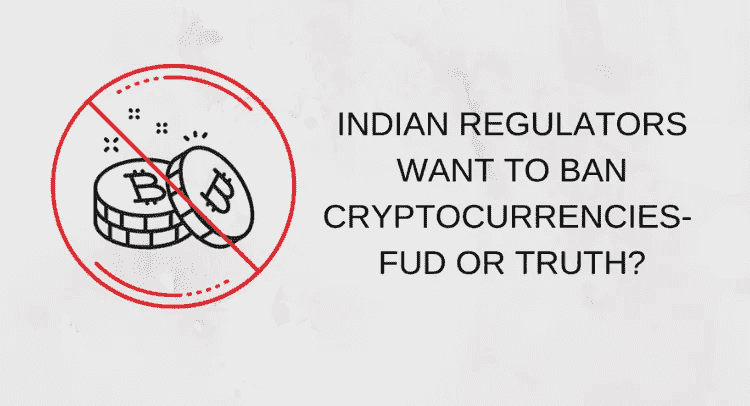

# 印度考虑全面禁止加密货币？

> 原文：<https://medium.com/hackernoon/india-considering-blanket-ban-on-cryptocurrencies-b9960c1cd8b2>

Source: [Indian regulators seek complete ban on cryptocurrencies: Economic Times](https://cryptodost.io/news/indian-regulators-seek-complete-ban-on-cryptocurrencies-economic-times.html)

印度监管机构可能计划向政府提出一项新法案，建议全面禁止加密货币。印度主流媒体《经济时报》报道称，政府已经开始就一项禁止加密货币的法案草案进行部际磋商。

该法案草案名为“2019 年禁止加密货币和监管官方数字货币法案”，已在主要政府部门之间传阅，包括经济事务部(DEA)、中央直接税委员会(CBDT)、中央间接税和海关委员会(CBIC)以及投资者教育和保护基金管理局(IEPFA)。

根据该报告，四个政府部门都赞成全面禁止销售、购买和发行加密货币。根据这些部门的反馈，该法案将在选举后提交给新政府。

该委员会还指出了与洗钱相关的风险，并建议根据《防止洗钱法》实施禁令。此外，监管机构还指出，该领域存在大量骗局，以巨额回报的承诺欺骗容易上当受骗的投资者。

[印度商业热线](https://www.thehindubusinessline.com/markets/forex/investor-protection-forum-bats-for-ban-on-cryptocurrencies/article26944100.ece)提到，是 IEPFA 写信给财政部下属的金融服务部门，建议禁止加密货币。

**主流媒体又是 FUD？**

主流媒体 FUD 并不新鲜。即使在过去，《经济时报》和其他几家媒体也曾报道过加密货币，但没有一篇报道成真。如果我们仔细看看《经济时报》的报道，就会发现有一些不一致之处:

*   这份报告谈到了“官方数字货币的监管”。这大概是指一种国家支持的加密货币。当印度监管机构尚未对加密货币表现出足够的了解时，我们真的能指望他们推出一种加密货币吗？如果他们不喜欢加密货币的想法，为什么首先要推出一种官方货币呢
*   该报告指出，洗钱和可疑的庞氏骗局是支持该禁令的主要原因之一。印度政府难道没有意识到，正是加密货币监管的缺失，让该行业暴露在这些问题面前吗？如果政府允许遵循 KYC 和反洗钱程序的加密货币交易所顺利运营，这些问题还会出现吗？如果政府实施全面禁令，将会产生一个平行经济，使政府更难追踪加密货币。
*   报告称“*…比特币、以太坊&现金币等加密货币的买卖和发行。”*该报告将比特币和以太坊与一种名为 CashCoin 的未知硬币混为一谈。这清楚地表明了主流媒体对加密货币的理解水平。
*   最后，报告依赖于“来源”。我们真的能再次相信未知来源吗？

**印度加密货币监管进展**

最近一篇关于 Bitcoin.com 的[文章披露，财政部最近发布了一份总结报告，就加密货币的各个方面征求了各个部门的意见。该报告称，委员会正在审查处理加密货币的各种选择。](https://news.bitcoin.com/india-progressing-crypto-regulation/)

《经济时报》的文章可能会再次成为媒体 FUD 的经典案例。所有的目光都集中在 7 月 23 日最高法院举行的印度储备银行对加密货币的下一次听证会上。