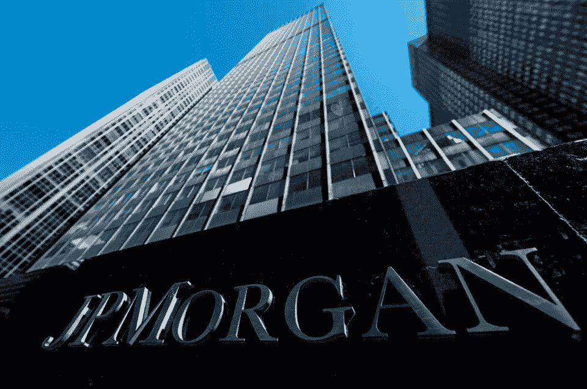

# 各行业都在寻求区块链的利润

> 原文：<https://medium.com/hackernoon/industries-are-looking-for-the-profit-in-blockchain-4053651ccbfb>

摩根大通首席执行官杰米·戴蒙(Jamie Dimon)可能对比特币和加密货币说过不好听的话，但他的银行正在追求区块链技术的利润。

**银行联合体和区块链**

早在 2017 年 10 月，这家恰好是美国最大的银行透露，它和其他几家银行正在进行使用区块链技术发送支付的测试。这些银行承认，使用分散式分类账技术(DLT)将简化流程，并将流程所用时间从“数周减少到数小时”

银行集团现在将自己命名为银行间信息网络(IIN ),其数量不断增加，所有这些银行都寻求利用区块链的力量。一些人一直在测试 Ripple 技术的使用，而其他人则在探索 Hyperledger 和企业以太坊联盟平台。

有些人认为这只是吸引媒体注意力的一种方式:在你的新闻稿中提到“区块链”，这篇报道肯定会找到它的印刷方式，这就是我们的想法。但是《福布斯》的 T2 写道，这一现象背后有一个鲜为人知的经济原理。他提到了来自 Prysm 的一篇研究论文:“称为“套牢”的原理表明，当个人投资于一个团队项目时，该投资作为团队的一部分比不作为团队的一部分更有价值，从而给予其他人与投资相等的议价能力。”

**解决“暂停”原则**

他将这一原则描述为类似于银行抢劫中的“抢劫”。他表示:“就像老式的银行抢劫一样，不幸的投资者基本上可能会因为投资于该集团的资金和其他资源的价值而被“劫持”，并被迫陷入不良境地，根本不愿意参与财团，甚至破坏了最大的潜在利益。”

他的意思是，区块链消除了“停顿”的情况。在 IIN 联盟中，使用区块链允许成员共享数据，“而不要求他们交出实际数据本身的控制权，在那里数据可以很容易地被复制并耗尽其价值。”

正如德尔·卡斯蒂略总结的那样，“因此，通过区块链联系在一起的竞争对手可以自由地投资于共同的目标，如果他们选择在未来离开该集团，他们可以带走他们的数据，就像移动比特币一样容易。”

而且从中可以赚钱。研究公司 Gartner [估计](https://www.gartner.com/en/documents/3627117)锁定在这些区块链财团和行业其他地方的商业价值到 2030 年将达到 3.1 万亿美元。

不仅仅是银行在组建区块链财团。在整个医疗行业，新的群体一直在涌现，汽车行业是另一个。

**行业财团欲解决区块链困境**

但仍有一些障碍需要解决，特别是关于“暂停”的情况。Prysm 的研究表明，财团的创建者会找出他们行业中过去停滞不前的原因，并编写智能合同来解释这些原因，而且数据“以一种既可以在*也可以在*区块链上阅读的方式进行组织，不仅更容易与其他财团整合，而且更容易离开它们。”

本周将在 Consensus 2019 上提出一些答案或补救措施，让竞争对手能够更有效地合作。我们看到区块链的采用取得了进展，不仅仅局限于成为“与加密货币有关”的技术。