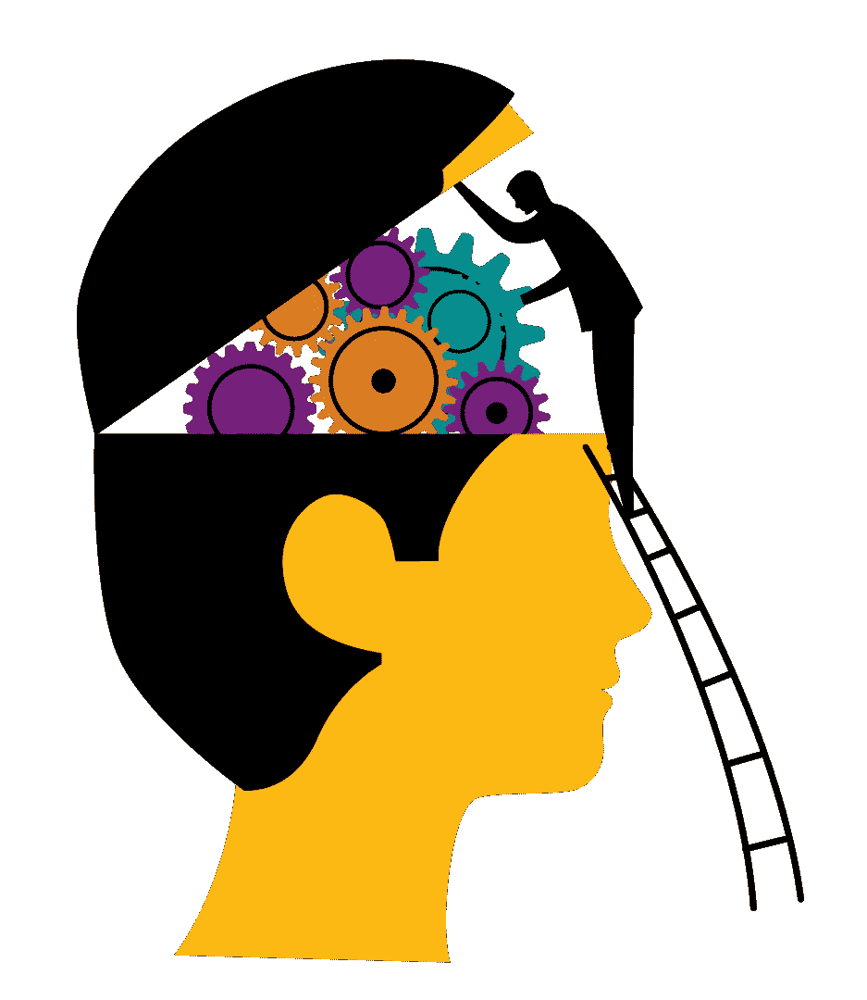

# 社交媒体如何利用影响心理学让你再次光顾

> 原文：<https://medium.com/hackernoon/influence-psychology-social-medias-6a3e65b3f3fa>

## 第一部分

这篇文章将讨论社交媒体——在某种程度上，*所有现有的应用程序和网站—*—如何使用心理黑客和触发器不断将你带回他们的平台。

如果你一直认为你在 YouTube 上花了几个小时是你的错/粗心的态度，那么，这不完全是你的错。今天我们有了**“注意力经济”**，我们的认知触发器被利用来一次又一次地让我们回到媒体上。换句话说，要让我们 ***【上钩】*** 。

让我们深入探究它是如何发生的:

在整个系列中，我将参考《影响力，说服心理学》一书，并提出如何在当前形式的社交媒体设计中使用这个技巧。

在这本书里，罗伯特·B·西奥迪尼首先举例说明了某些动物的行为是如何被固定在特定的触发点上的，不管这看起来多么不合逻辑。例如，在雌性火鸡的情况下，如果一只小鸡发出“吱-吱”的声音，它的妈妈就会照顾它；如果没有，母亲会忽视，有时甚至会杀死它。实验表明，她会对触发器“吱-吱”做出反应，即使天敌发出“吱-吱”声，她也会拥抱它——但如果它们不这样做，她会虐待或谋杀其中一只小鸡。

这一点在不同的生物体中得到了证明，在大多数情况下，它们会以一种模式化的方式对某些触发因素做出反应。而且，即使我们可能认为这是完全荒谬的，事实是:即使是人类也会对某些触发因素做出反应。

一项实验表明，在请求帮助时，如果你使用“因为”这个词，获得批准的几率会大大增加。所以当一个人排在队伍的最后，而不是说，“对不起，我有五页纸。我可以用复印机吗？”而是说“不好意思，我有五页纸。我可以用复印机*吗因为*我要复印一些东西”的几率从 60 %增加到 94 %，只是因为提供了一个理由，即使不是真正的理由。本质上，某些触发因素的存在在人类中也存在，不像非人类的大多数本能反应序列，我们的自动磁带通常从我们已经学会接受的心理学原则或刻板印象发展而来。

> 人类可以以一种模式化的方式对某些触发因素做出反应，这似乎并不总是合乎逻辑的。这是一种自动的顺从反应。

## ***往复法则***

“毫无疑问，人类社会从互惠规则中获得了真正重要的竞争优势，因此他们确保自己的成员受到训练，遵守并相信互惠规则。我们每个人都被教导要遵守规则，我们每个人都知道违反规则的人会受到社会的制裁和嘲笑。”

> 人们普遍厌恶那些索取却不努力回报的人，我们常常会竭尽全力避免被认为是他们中的一员。

我们就是这样长大的。这种互惠被用于整个营销领域，当他们给你免费样品或小优惠时，有一个未说的规则会敦促你回报他们的优惠，从而使你更有可能购买他们的产品。历史上有几个例子，无论是英国哈瑞·奎师那教派的筹款技巧，他过去常常在请求捐款前给人一朵花或一份薄伽梵歌(这使他们更有可能捐款)，还是女演员萨莉·凯勒曼把她的名字和努力借给民主党候选人杰里·布朗，因为他是十年前她请求帮助她搬家的十个朋友中唯一出现的人。

**人们还礼。**期。

而且这个规则真的很厉害；有时甚至会压制对一个人的反感。

> 我想我们在社交媒体上的主要活动都是由这条规则驱动的。
> 
> 标记一个人，如果这个人以前标记过你。
> 
> 互相喜欢图片。
> 
> 为追随而追随。

毫无疑问，在 Instagram 上迅速流行的一种增加关注者的技巧是去关注一个人，而这个人更有可能在 ***本能互惠法则*** 下再次关注。后来，他们可能会秘密地取消关注，而其他人并不知道，从而保持他们自己的关注者数量很高。叹气。

总的来说，这条规则可能是保持平台运行的驱动因素之一，让人们回到平台并使用它，因为，嗯，他们在脑海中有一个悬而未决的回报列表。

我并不是说每个人都这样做，但是当一群“暴民”卷入其中时，这种行为就很有可能表现出来。

下一步是什么？是什么让我们点击那个红色的通知铃？是什么让我们时不时地停下来刷新我们的订阅源或邮箱？是什么让我们在 Instagram 上发布故事？有许多有趣的问题摆在我们面前…

但由于这篇文章已经达到了它的长度，让我们在这里结束这篇文章。

希望你喜欢这篇文章。在本系列接下来的部分中，我将回答您剩下的问题。

在那之前，保重，开心点，断开一段时间~

这篇文章是在 90 年代夏天的概念下撰写的。

“90 年代的夏天”是一个有意识地分析我们对技术的使用，并传播对它带来的问题的认识的倡议，如数字隐私，安全，技术成瘾和设计道德。

欢迎你加入我们的行列！

在媒体上，在[脸书](https://www.facebook.com/summer.of.90s)或者在 Instagram *上的@ summer . of . 90 上关注我们，因为*我们需要传播消息。

