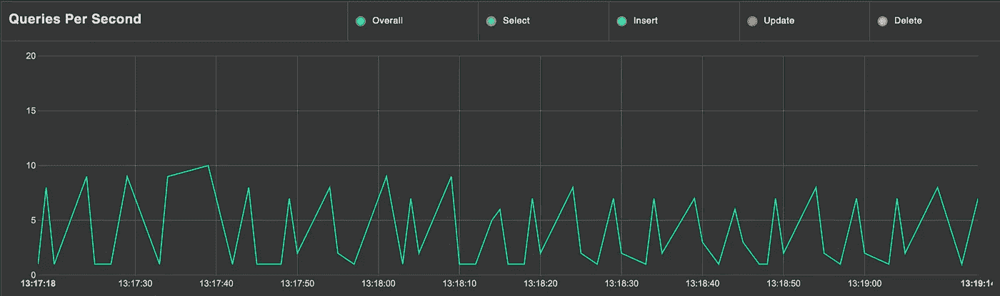
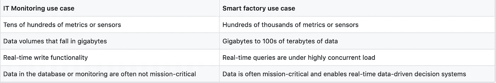
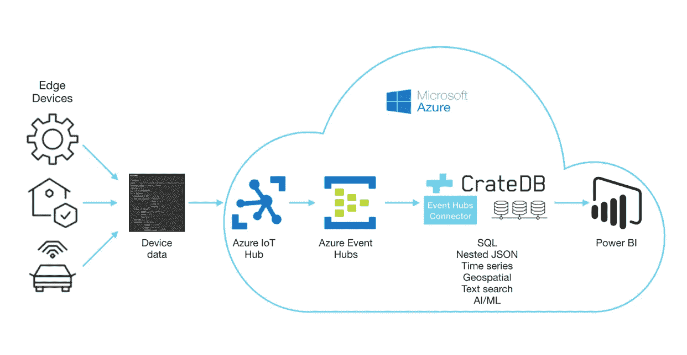
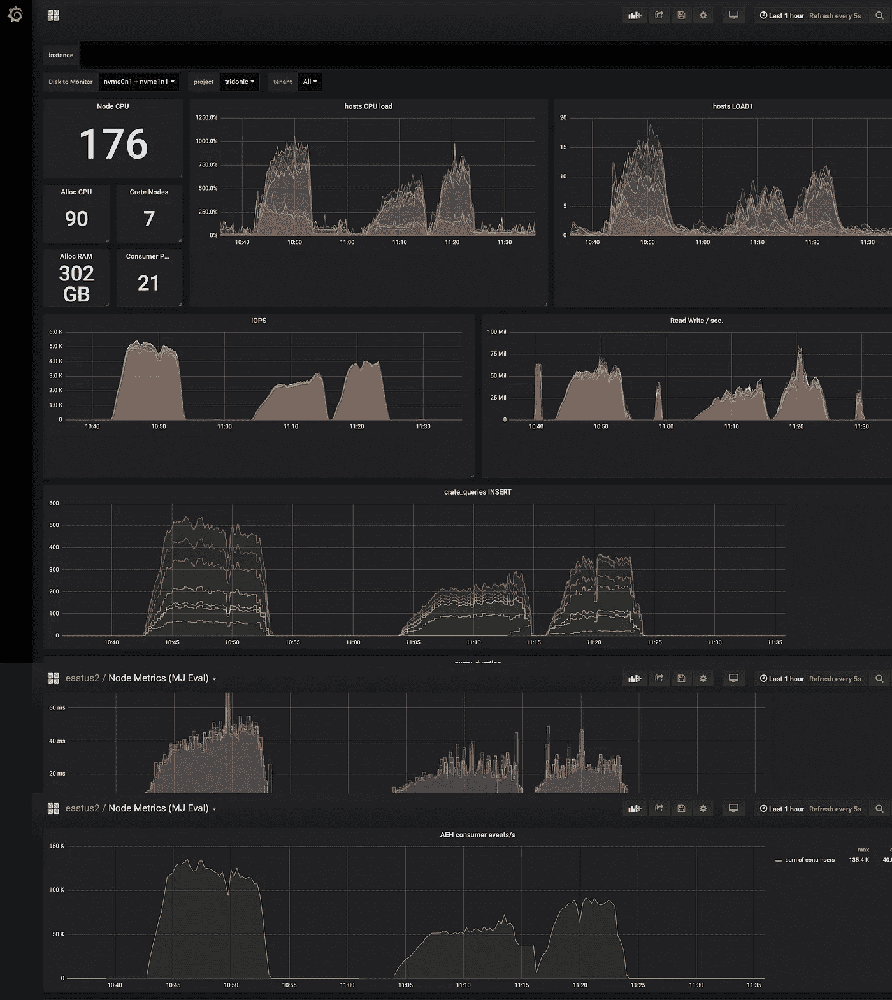

# 大规模吸收物联网和传感器数据

> 原文：<https://medium.com/hackernoon/ingesting-iot-and-sensor-data-at-scale-ee548e0f8b78>

随着过去几年物联网设备数量的激增，智能工厂和智能城市等相对较新的物联网和传感器数据用例导致了时间序列数据的大规模产生。在这种用例中，大量不同种类的传感器发送万亿字节的数据，以便实时监控可以提高效率并避免故障。举个例子，一架波音 787 飞机在一次飞行中会产生 5tb 的数据。


A factory producing bottle packaging

让我们来看看如何应对时间序列数据的挑战，并在保持高可用性的同时大规模处理此类数据的高吞吐量。

# 时间序列数据

时间序列数据是带有时间戳的任何数据。如果你将这种数据绘制在图表上，它的一个轴上会有时间。时间序列数据工作负载不同于其他种类数据的工作负载，因为时间序列数据主要是插入的，但很少更新。时间序列数据库通过将时间视为一等公民来引入效率。



A time-series data graph

记录大量时间序列数据使我们能够深入了解操作的各个方面，例如:

1.  **分析过去:**了解各种传感器的状态如何随时间变化，有助于我们了解当系统处于特定状态时，性能是如何受到影响的。它还允许我们回到某个特定的时间点，并了解特定错误发生的原因。
2.  **监控现状:**让传感器实时传输数据到您的仪表盘上有助于监控关键任务系统，以便有效地调试和识别需要维修的组件。
3.  **预测未来:**将丰富的历史数据插入机器学习框架，可以用来生成关于未来的可行见解，以便在问题出现之前就发现并解决问题(预测性维护)。

# 时序数据的使用案例和挑战

在抽象层次上，时序用例可以分为两大类。第一个是传统的 IT 和系统监控。InfluxDB 之类的时序数据库非常适合为这类用例获取时序数据。第二个用例是智能工厂或智能城市，其中工业时间序列数据通常需要完全不同的尺度，这不适合由传统的时间序列数据库处理。



IT Monitoring vs Smart Factory use case

查看此[白皮书](http://go.cratedb.com/time-series.html)以了解更多关于 CrateDB 时间序列和专门的时间序列数据库(如 InfluxDB)之间的功能差异，以及 CrateDB 和 InfluxDB 之间的性能基准。

# 什么是 CrateDB？

我们在这些用例中寻找的关键特征是水平扩展和自我修复集群。 [CrateDB](https://crate.io/) 是一种新型的分布式 SQL 数据库，它非常擅长处理工业时间序列数据，因为它易于使用，并且能够处理具有数千个传感器数据结构的数万亿字节的时间序列数据。


CrateDB Admin UI

CrateDB 在一个无共享架构中作为一个由相同配置的服务器(节点)组成的集群运行。这些节点彼此无缝协作，写和查询操作的执行自动分布在集群中的节点上。

增加或减少数据库容量是一项添加或删除节点的任务。随着群集大小的变化，数据的分片、复制(用于容错)和重新平衡都是自动进行的。你为什么不带着 CrateDB 去兜兜风？

CrateDB 也托管在 Microsoft Azure 上，允许您连接到 Azure 必须提供的各种服务。

# 活动枢纽+ CrateDB？

Azure Event Hubs 是一个实时数据摄取服务，允许您每秒从任何来源传输数百万个事件，以构建动态数据管道。它专为大规模消息传递和处理数据流而构建，例如来自智能工厂或智能城市基础设施的工业物联网数据。通过事件中心的数据流可以传递给 Azure 函数，以便进一步丰富或转换。



CrateDB on Microsoft Azure

完成后，处理后的数据被捕获到 CrateDB 中进行分析。使用 [CrateDB 活动中心连接器](https://crate.io/event-hubs-integration/)可以将 CrateDB 连接到活动中心。这使得实时集成和分析物联网数据变得更加容易，以便监控、预测或控制智能系统的行为。该连接器可以扩展到每秒从事件中心或物联网中心接收数百万个遥测数据读数，并将其插入 CrateDB。

# 摄取性能的实验

这听起来确实像是天作之合。我们决定检查一下 CrateDB 在这个工作流中的表现。首先需要决定的是输入数据的格式。我们选择的数据看起来接近智能工厂中传感器的数据。

```
OBJECT
payload[‘model’] STRING
payload[‘objectId’] STRING
payload[‘timestamp’] STRING
payload[‘value’] LONG
payload[‘variable’] STRING
```

每条消息的有效负载大小约为 100 字节。我们继续部署两个 Event hub 名称空间，每个名称空间有 20 个吞吐量单位(TPU)的 Azure Event Hubs。活动中心的[吞吐能力](https://docs.microsoft.com/en-us/azure/event-hubs/event-hubs-features#capacity)由吞吐单位控制。我们通过使用 CrateDB 的事件中心连接器将事件中心连接到 CrateDB，并运行 32 个消费者 pod(每个分区一个消费者)。可以调整这两个设置来增加吞吐量。

对于 CrateDB 云设置，我们部署了 7 个节点，复制因子设置为 1 和 21 个碎片(每个节点 3 个碎片)。



Grafana dashboard showing the ingestion metrics

我们每秒能够接收超过 110，000 条消息，也就是每天大约 100 亿条消息。顺便说一下，以这样的速度摄入，每天会产生大约 1.5 TB 的数据。

# 让机器数据发挥作用！

这个实验展示了在事件中心的帮助下，你可以从你的物联网设备或传感器摄取大量数据到 CrateDB。拥有如此丰富的时间序列数据使我们能够收集真正有价值的数据，这些数据可以为我们提供关于调试问题和避免未来可能发生的故障的可行见解。

CrateDB Cloud 托管在微软 Azure 上，你可以将它连接到 Azure 提供的许多服务，如用于生成见解的机器学习工作室或用于可视化数据的 Grafana。我们正处于一个数据蓬勃发展的时代，为什么不把它运用到工作中，让我们的生活更轻松、更安全、更美好呢！

在推特上给我喊一声！我很想知道你们目前是如何扩展机器数据基础设施的，以及你们打算如何使用 CrateDB。