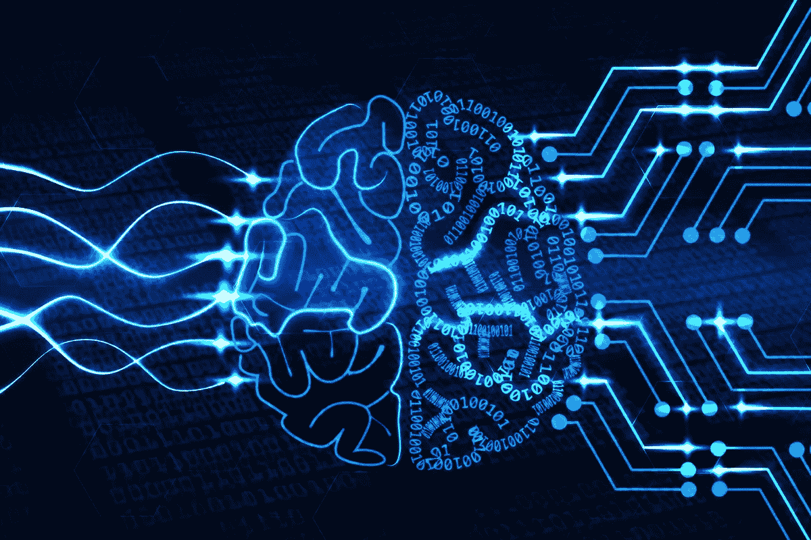

# 机器经济学第一部分:金融的拐点

> 原文：<https://medium.com/hackernoon/inhuman-economics-part-1-finances-inflection-point-ef41ca1942f>

Will biological ‘wet-ware’ always have a place in the economy?

未来的经济将很难被人类识别。投资和经济决策远不在我们的控制之下，它们将变得如此先进复杂，以至于在一场新奇、自动化方法和金融力量的寒武纪大爆发中，人类的思维将沦为纯粹的乘客。甚至很难掌握游戏规则。在一切的背后，以惊人的速度推动着一场无与伦比的范式转变的，将是众多的自主程序；进化，交易和穿越区块链的宇宙。

# 现实检查…

好了，回到现实中来。这与现在的经济状况大相径庭。虽然今天的用户界面肯定在改善，但投资和交易仍然是一个非常人性化和手工化的系统。和一个世纪前一样，现在开立一个银行账户仍然需要同样长的时间，我今天仍然会支付一些款项，如果我骑马运送一袋现金，这些款项会更快到达。如果没有真人发出指令、检查指令、批准和处理指令，然后等待，什么都不会发生…

在这种背景下，我对不可识别的自动化经济的上述愿景似乎还有很长的路要走，但我认为它比大多数人认为的更近。指数式增长通常很难被发现，即使我们以前见过..

# 信息爆炸

根据思科的一项研究，到 2025 年，全球数据总量将从 2018 年的 33 兆字节增长到 175 兆 ZB。如果一个满满的 4 抽屉文件柜包含大约 1g 的文本数据，那就相当于今天这些文件柜出现的速度与浓缩咖啡杯的水溢出尼亚加拉瀑布的速度相同。按照这种速度，不到两分钟，新数据就会超过 1986 年的所有数据。

One filing cabinet filled as each espresso cup of water falls

我们都知道从 1986 年到今天发生了什么变化导致了信息经济的爆炸。去中心化的互联网使得数据和内容的创建、共享和发布呈指数级增长，而不需要集中的出版商批准或打印设备。此外，除了博客和猫视频，越来越多的这类信息现在是程序生成的，永远不会被人类的眼睛看到，而是从超级互联的网络空间中涌现出来的无形算法和 API 网络的宝贵资源。IT 创新仍在继续，只受限于建筑师的想象力，不管是人还是机器。

# 回到银行家

因此，如果互联网是一个令人信服的例子，说明去中心化是如何解放和增强了*信息*经济，那么*金融*经济，相比之下，看起来肯定是原始的。

那么，为什么我们没有在金融领域看到同样的情况呢？

传统的金融体系仍然只是互联网出现之前的信息状态。它是集中的，自上而下的系统。在自上而下的系统中，目标从高层次开始，随着目标被分解成更小、更易管理的单元，复杂性也随之增加。大多数国家、公司和其他人造系统都是以这种方式组织的。它们对我们来说更容易管理、理解和规范，但问题是这种系统的范围和潜力受到早期有限信息决策的限制。偶然创新和意外收获不太可能发生。实际的最终用户反馈需要时间才能反馈给决策者。目标不灵活，对变化的情况反应迟钝。

然而最重要的是，自上而下的系统自然会产生筒仓效应。所有东西都被分区和守卫。银行家与自己的同事竞争更高的奖金。经理们热情地保护着他们的资源，并达到他们的目标，即使这些目标不再有意义。没有动力去合作，花时间培养新想法，或者花钱连接或自动化遗留基础设施。金融体系中到处都是墙，公司之间如此，公司内部也是如此。难怪在今天的金融体系中，大多数事情的运作都与一个世纪前非常相似。人类仍在统治，甚至算法自动化(如交易策略)的早期努力也局限于特定领域，并笼罩在秘密之中。那么，在金融领域，人们通常已经习惯了像自动取款机或信用卡这样需要几十年才能出现的有意义的全球创新，因此完全没有意识到即将发生的指数变化的爆发。

# 区块链的去人性化引爆

在朝着新的方向前进之前，改变现状需要一些痛苦的逆转，这种改变不会自然发生，也很少是自上而下的。这就是为什么社会会经历革命，现有公司会解体，而金融服务仍然充斥着攫取价值和建造围墙的寻租者。我不责怪银行家或寻租者；考虑到现有的系统，这是完全理性的人类行为。但是那些墙就要倒了。

区块链不是自上而下的系统。它不在乎利润。它不需要墙来保护自己。它甚至不需要人们去工作。它是分散的、开放的、非政治化的。从本质上说，这是我们所缺少的关键金融部分；实现数字稀缺性，就像互联网实现数字丰富性一样，并允许通过不受信任的媒介进行价值转移，而不需要人性化的金融孤岛。这些将融合在一起，形成一个全新经济出现的基础。这将是一种完全程序化的经济，与自动化兼容，一种被人工智能去人性化的经济。没有了墙壁，人类的守门人将变得没有必要。机器将直接与机器进行交易。数据和预测将成为可交易的资产。经济发展将不受董事会或生物学的约束。如果没有这些限制，经济走向非人性化的进程将是一场类似于 20 世纪末开始的信息爆炸。游戏将会改变，机器经济学将会出现，而我们人类的需求将会越来越多地成为出现的深不可测的系统中的一个次要参数。我们最好为自己辩护…

# 连接器和复合器

在这个系列中，我将尝试解释我是如何看待这种转变的。虽然不可能预测发展的确切顺序，但我通常可以将创新分为两类或两个维度，我将称之为**连接器**和**复合器**。*连接器*指的是“水平”发展，使竞争环境变得公平；通过连接性和互操作性打破壁垒和孤岛，弥合差距，提高速度和协作。*composers*将指“垂直”开发或层，它们利用连接器将不可能的事情变为可能；系统的去中心化和机器化特性使全新的能力从这个基础上涌现出来。

通过这些联系和复合效应，我预计向非人性化经济转变的步伐将是迅速而出乎意料的。事情已经发生了，当大多数人关注加密价格的时候，机器经济的基础正在被奠定。

(请继续关注第二部分……)

安迪【2019 年 3 月

*原载于 2019 年 3 月 29 日*[*https://www . andybryant . me*](https://www.andybryant.me/blog/2019/4/29/inhuman-economics-part-1-finances-inflection-point)*。*