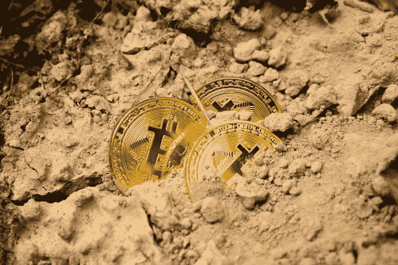

# 初始硬币发行(ICO):生、死与监管

> 原文：<https://medium.com/hackernoon/initial-coin-offering-ico-death-regulation-b615a7cb6b97>

Photo by [Dmitry Moraine](https://unsplash.com/@wildbook?utm_source=unsplash&utm_medium=referral&utm_content=creditCopyText) on [Unsplash](https://unsplash.com/search/photos/coin-offering?utm_source=unsplash&utm_medium=referral&utm_content=creditCopyText)

**【第一部分】**

*这辈子我们必须死几次才能再投胎。这些危机虽然令人恐惧，却终结了一个时代，开启了另一个时代。*

尤金尼奥·特里亚斯[【1】](/@jacqueline.rer/initial-coin-offering-ico-life-death-and-regulation-part-i-4e7d413be712#_ftn1)

**一.**简介

在一个不明确的法律框架内——甚至被认为是不存在的——具有挑战性的初始硬币…