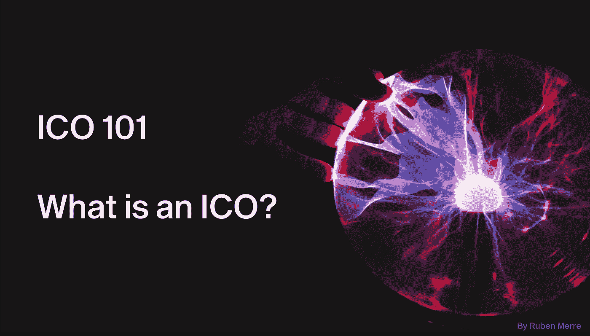

# ICO 101——初始硬币发行(ICO)——什么是 ICO，有哪些优点和缺点

> 原文：<https://medium.com/hackernoon/initial-coin-offerings-icos-what-is-an-ico-what-are-the-pros-and-con-s-c40813a8d419>

简单解释什么是 ico 及其优缺点。

作者的 2021 年快速更新:请在这里找到关于 ido(初始 Dex 产品)以及 ico 如何演变成 ido 的最新文章:

 [## 从 ICO 到 IDO:加密资金炒作周期的演变

### ico 如何以及为什么演变成 ieo 和 ido(初始 Dex 产品)

medium.com](/ngrave/from-ico-to-ido-evolution-of-the-crypto-funding-hype-cycle-5f867a1c367d) 

# 0.介绍

亲爱的读者:

本文是关于初始硬币发行(ico)、初始交易所发行(ieo)、分散自治 ico(DAICOS)和安全令牌发行(sto)的完整系列文章的一部分。

你可以找到最重要的[部分 I 她的](https://hackernoon.com/a-comprehensive-guide-to-icos-crypto-funding-the-rise-the-boom-the-bust-the-next-b159fdf38010) e:

 [## 下一代 ico 和加密基金的综合指南

### 为什么需要转变观念& ico 的未来会是什么样子

hackernoon.com](https://hackernoon.com/a-comprehensive-guide-to-icos-crypto-funding-the-rise-the-boom-the-bust-the-next-b159fdf38010) 

这里还有[第二部](https://hackernoon.com/a-comprehensive-guide-to-the-next-generation-of-crypto-funding-v-ico-ieo-daico-eto-sto-939909782da6):

 [## 下一代加密基金综合指南| (V)ICO | IEO |戴科|埃托| STO |

### ICOs 时代的到来。探索加密资金革命的下一步。(第二部分)

hackernoon.com](https://hackernoon.com/a-comprehensive-guide-to-the-next-generation-of-crypto-funding-v-ico-ieo-daico-eto-sto-939909782da6) 

# 1.什么是 ICO？

初始硬币发行——在某些情况下也称为初始货币发行——是一种通常由加密货币 **项目**使用的**融资机制。**

看待它的最佳方式实际上是将它视为以下因素的某种组合:

*   **众筹**或众筹销售的筹资方面(无论是法定货币还是加密货币，但通常大多数是后者)，包括必须达到某种**软/硬上限**才能有效的事实(即应筹集最低金额)
*   **早期风险投资的产品成熟度**甚至是商业天使轮(即非常不成熟的产品，在很多情况下实际上只是该产品的“想法”)
*   事实上，作为对资金的回报，会收到某种“代币”，后者变成“可交易的”，就像首次公开募股(IPO)或首次公开募股一样(即，当一家私人公司上市，每个人都可以开始购买——“交易”——股票)
*   代币销售在区块链基础设施上运行**，代币在区块链平台上变得可用(例如用于 ERC20 代币的区块链以太坊)**

只是为了确保每个人都还在关注，我很高兴包括我们在维基百科的朋友提供的描述:

> 在 ICO 中，一定数量的加密货币以“代币”(“硬币”)的形式出售给投机者或投资者，以换取法定货币或其他加密货币，如比特币或以太坊。如果或当 ICO 的筹资目标达到且项目启动时，售出的代币将作为未来功能性货币单位进行促销。在某些情况下，如以太坊，令牌需要使用系统来实现其目的。”(来源:[维基百科](https://en.wikipedia.org/wiki/Initial_coin_offering))

# 2.作为公司做 ICO 的利与弊

为了更好地理解 ico，建议了解一些优点和缺点。

## **作为公司做 ICO 的 5 大优势**

1.  世界是你的投资者。潜在投资者的范围和地理分布是巨大的。从字面上看，全球很大一部分人都能够投资该公司(给予或接受一些地理限制)。来自世界各地的电汇可以在几分钟内让你获得数百万美元(加密)，而不会被银行冻结；
2.  从 1 开始，公司的潜在宣传是巨大的，而且是全球性的；
3.  你可以快速筹集资金，并迅速获得资金，从而更容易在早期阶段为公司建立牵引力；
4.  对筹资者没有广泛的披露要求(到目前为止)；
5.  你可以在公司的早期阶段筹集到大量资金(很有可能，但是管它呢)。

**作为公司做 ICO 的 5 个缺点**

1.  你有相当大的风险，监管机构将在某个时候开始追捕你！(看看 SEC 最近的动作就知道了)；
2.  你筹集的资金(至少目前)本质上是极其不稳定的；
3.  沟通努力和潜在影响是巨大的。你有一个全球性的投资者群体，你必须尽你所能管理好沟通(尤其是糟糕的沟通);
4.  大多数 ICO 投资者习惯于加密货币的高度投机性，往往没有传统股票投资者那么有耐心；
5.  社区对你进步的压力会很大。毕竟，你刚刚从他们的口袋里筹集了相当于几百万美元的资金。

# 3.作为投资者参与 ICO 的利弊

**作为投资者参与 ICO 的 10 大优势**

1.  早期出资者可以获得早期公司更多的流动性。早期也增加了资本快速增长的潜力；
2.  根据 ICO，其背后可能有一个大网络(例如，如果代币发行发生在以太坊网络上)，产生额外的宣传和潜在的资本增值；
3.  没有中间人的监护。拥有私钥的人拥有令牌；
4.  有限的监管审查(到目前为止)；
5.  ICO 币和 BTC、ETH 等加密货币一样具有匿名性；
6.  资金使用的透明度，在 ICO 之后，可以使用托管来验证资金是如何使用的；
7.  一种创新的资本配置方式，可以对冲政治和经济冲击；
8.  贡献者通常是(公用事业)代币的第一批用户——因此，讽刺的是，与持有贡献者从未使用过其产品的公司股票不同，代币可能比证券更有形；
9.  (在某种程度上)与股市和经济脱节的高风险、高回报资产；
10.  拥有不基于法定(国家监管)货币的另类资产的可能性。

**作为投资者参与 ICO 的 10 个缺点**

1.  ico 不受监管，没有投资者验证或保护；
2.  IPO 通常由机构投资者支持，而 ico 主要由社区内的投资者支持；
3.  由于启动 ICO 时需要满足的要求有限，投资者很难获得正确和相关的信息来做出合理的投资决定(例如，在 2017 年，许多人认为观看几个 YouTube 视频是在进行合理的尽职调查)；
4.  产品和项目通常非常不成熟，大大增加了投资的内在风险。在某些情况下，人们只是投资于一个想法，而没有具体的实施计划；
5.  更糟糕的是，持有 ICO 的公司将在一开始就获得大部分投资，因为几乎没有责任，所以实际上没有交付产品的压力。许多项目要么在 ICO 后立即退出 scam，要么在开发活动中慢慢枯萎，因为团队享受他们新发现的财富；
6.  代币最终上市的交易所在防止欺诈活动方面具有相对有限的指导方针和政策；
7.  即使代币销售是完全合法的，并且背后有一个强大的项目，加密交易所和加密钱包每天都被黑客攻击和窃取。因此，当你登录网站，对自己不可思议的投资回报微笑的时候，一切可能都没了；
8.  如果你的钱以某种方式丢失了，实际上是没有办法找回来的。不管是你自己丢失了你的私钥还是黑客偷了你的令牌，一旦你失去了令牌的所有权，你就无能为力了；
9.  缺乏透明度。对于一个项目来说，完全没有公开进展的强制性义务，这可能会让投资者感到困惑；
10.  你的投资可能会倾向于人为的抽水和倾倒计划，在这种情况下，你的硬币的价值可能会变得更加不稳定，甚至比像 BTC 这样的高市值加密公司更不稳定。

*来源:自己的研究+荣誉奖:1)《普惠金融科技:区块链、加密货币和 ICO》——Lee David Kuo Chuen 著，Low Linda，2018；2)*[*ICOs 简介*](https://reftoken.io/introduction-to-initial-coin-offerings-icos/) *— Reftoken.io*

**注**:作者 2021 年快速更新:请点击此处找到关于 IDOs(初始 Dex 产品)以及 ICOs 如何演变成 IDOs 的最新文章。

 [## 从 ICO 到 IDO:加密资金炒作周期的演变

### ico 如何以及为什么演变成 ieo 和 ido(初始 Dex 产品)

medium.com](/ngrave/from-ico-to-ido-evolution-of-the-crypto-funding-hype-cycle-5f867a1c367d) 

**Outro:**

别忘了鼓掌！

并随时心醉神迷地关注我上 [**中**](/@ruben.merre)**[**推特**](https://twitter.com/RubenMerre)**[**Linkedin**](https://www.linkedin.com/in/ruben-merre/)。****

****我公司 Ngrave 的 [**网站**](https://www.ngrave.io/) **，**[**Twitter**](https://twitter.com/ngrave_official)**，**[**Linkedin**](https://www.linkedin.com/company/ngrave-io/about/)**，** [**脸书**](https://www.facebook.com/Ngraveio-230277351073137/) 也是如此。****

****再次感谢阅读和鼓掌。****

****[鲁本](https://www.linkedin.com/in/ruben-merre/)(CEO[n rave](http://www.ngrave.io))****

****************

******关于 Ruben 和 NGRAVE:******

*****Ruben Merre 是一位技术企业家，通晓多种语言，终身学习，是世界上最安全的加密货币钱包“ZERO”背后的数字资产安全公司*[*【n grave】*](https://ngrave.io/)*的创始人兼首席执行官。自 2018 年以来，鲁本和他的团队与纳米技术、密码学和硬件安全领域的顶级人士以及思想领袖合作，如著名密码学教授、比特币论文的第二参考文献 Jean-Jacques Quisquater。结果是:一个真正的端到端数字资产管理解决方案，具有最高的安全性(EAL7，世界上最高的安全认证)，以及直观的用户交互。*****

**** [## NGRAVE |无与伦比的加密安全性和无缝体验

### 第一个端到端的加密管理解决方案。最冷的硬件钱包。最冷的钥匙备份。不…

ngrave.io](https://ngrave.io)****