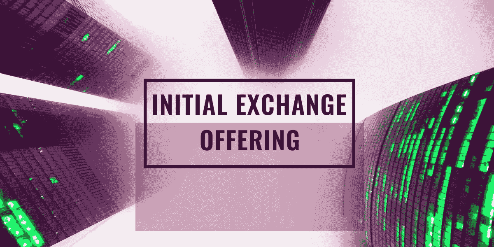
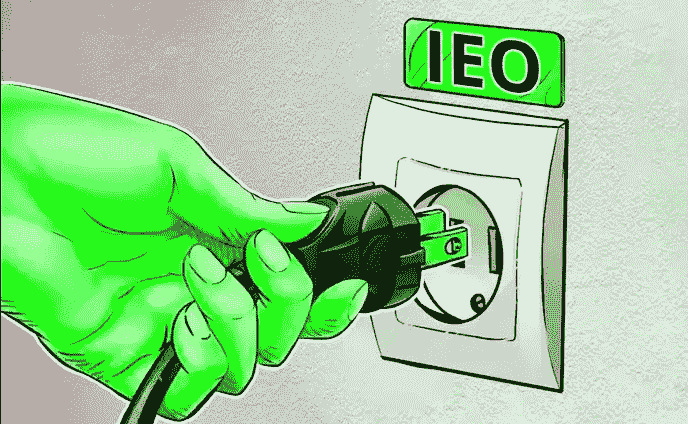
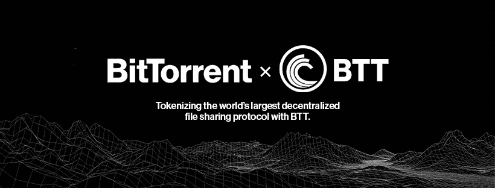
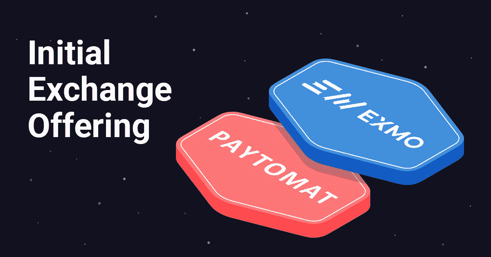
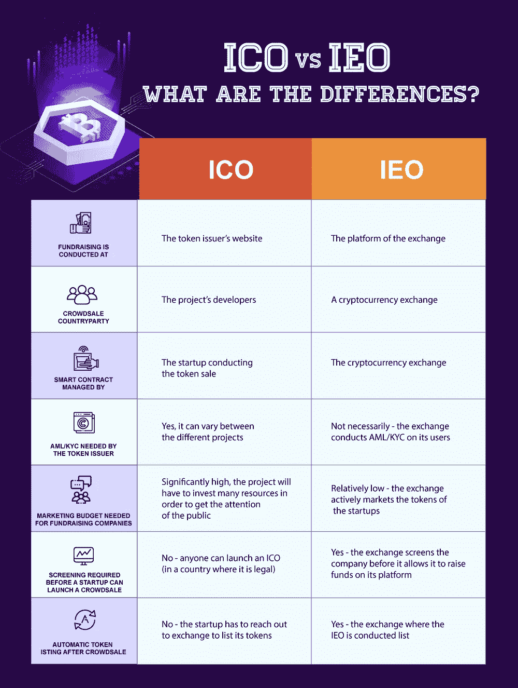

# 首次股票交易 Crypto 的下一个流行筹资计划？

> 原文：<https://medium.com/hackernoon/initial-exchange-offering-the-next-popular-fundraising-scheme-in-crypto-aa1c58679b98>

加密货币的出现带来了一种创新和分散的融资方式，即通过首次发行硬币(ico)进行融资。一些加密项目通过 ico 向投资者筹集资金(本国的数字货币)，以换取菲亚特/比特币投资，从而蓬勃发展。

然而，由于对这些分散的加密项目几乎没有监管审查，事情变得一团糟。在过去的一年里，由于几个欺诈计划浮出水面，ICO 行业经历了大规模的低迷。

加密筹资行业目前正在经历转型，其他模式，如安全令牌发售(sto)和首次交易所发售(IEO)占据了中心舞台。

# 首次公开募股越来越受欢迎(IEO)

IEO 是目前密码行业最受欢迎的筹资趋势。顾名思义，首次交易所发售是通过加密交易平台和交易所进行的。因此，与 ico 不同的是，ieo 以加密交易的形式涉及第三方，在 ico 中，加密项目直接接触投资者。

加密交易所代表初创公司筹集资金，同时做出必要的承诺并进行尽职调查。因此，加密项目在交易平台上进行代币销售，其中代币发行者需要向交易支付上市费。

作为回报，加密项目可以在交易平台上出售它们的令牌以及它们的列表。然而，IEO 的主要缺点是，与 ICO 不同，初创公司的加密令牌是不公开的。只有各自交易所的用户才能参与 IEO 事件。对于其他愿意参与代币销售的人，需要在托管 IEO 的交易所创建一个账户。

# 不同密码交换的 IEO 平台

为了给加密货币筹资计划带来更高的合法性，许多交易所正在加入 IEO 的行列。首先，币安交易所推出了“发射台”平台。

2019 年初，[币安](https://www.binance.com/)平台[进行了](https://www.binance.com/en/blog/296665704096014336/Binance-Launchpad-BitTorrent-Token-Sale-Results)BitTorrent(BTT)代币众筹，仅在开售的前十五分钟就筹集了高达 720 万美元。币安 Launchpad 平台上的另一个成功项目是 [Fetch。AI 仅用 22 秒就提高了 600 万美元的硬性上限。](https://fetch.ai)

如今，在其它全球交易所的参与下，IEO 市场正变得足够抢手。BitMax 交易所推出 BitMax Launchpad，Bittrex 推出 Bittrex 国际 IEO，KuCoin 推出 KuCoin Spotlight 等。

大多数 IEO 平台目前由亚洲交易所持有，然而，像 Paytomat 这样的欧洲平台也在为这一旅程做准备。东欧首届 Paytomat IEO 展将于 2019 年 4 月 1 日在 [EXMO](https://exmo.com/) 平台举行，为期三天。

[Paytomat](https://paytomat.com) 是一个现成的解决方案，将企业和加密用户聚集在一起，同时引领人们采用加密货币。该平台支持超过 18 种最受欢迎的加密令牌，拥有超过 300 家各行业的注册商户。

# IEOs 相对于 ico 的优势

代币发行者和投资者之间的中间平台(如加密交易所)的存在大大降低了欺诈和诈骗的风险。交易所在进行代币销售之前彻底检查代币发行者的信誉。因此，交易所作为一个额外的筛选层，帮助投资者在投资前做出明智的选择。

Bittrex 声明:

> 我们在推进区块链采用过程中面临的最大挑战之一是避免这个行业中无处不在的恐惧、不确定性和怀疑。

[Source](https://cryptopotato.com/what-is-an-initial-exchange-offering-ieo-and-how-it-differs-from-ico/)

与 ico 不同，IEO 机制有助于在代币发行者和投资者之间建立更高的信任，同时在早期阶段清除不良行为者。最近，由于 RAID 和电子游戏数据分析公司 OP.GG 之间的合作关系终止，Bittrex 平台取消了 RAID 项目 IEO。

与 ico 不同，在 ico 中，令牌发行者需要管理智能合约，而在 ieo 中，交易所完成这项任务。这确保了更好的众筹安全性，同时让令牌发行者无忧。此外，交易所对加入其平台的投资者进行强制性 KYC/反洗钱检查，从而减少匿名性。

此外，与受欢迎的交易所合作也有助于代币发行者大大减少营销工作，并在短时间内获得更好的可见性。因此，与 ico 相比，IEOs 为加密初创公司节省了更多成本。此外，该交易所稳定的客户基础有助于初创企业为他们的项目获得更好的贡献。

此外，与 ico 不同，代币发行者不需要经历上市的麻烦，因为它自然是与进行 IEO 的交易所交易的一部分。

因此，就执行代币销售的安全性和效率而言，ieo 比 ico 更有优势。然而，考虑到与流行的交易平台的早期合作，在 IEOs 上市的成本可能会高一些。然而，独立评价办公室的优点似乎肯定超过了成本。

目前，在其发展的 alpha 阶段，ieo 很少在加密社区中出现。然而，人们需要为即将到来的独立评估机构做足够的研究，并决定他们是否愿意投资这些机构。一旦完成，你需要在平台上的加密启动将推出其 IEO。

用户可以通过完成所有必要的 KYC 和反洗钱验证流程在该平台上注册。一旦你的账户被激活，下一步就是用支持 IEO 众筹的法定货币或加密货币为你的钱包充值。