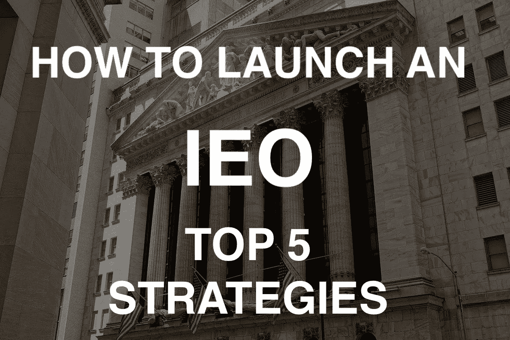

# 推出 IEO 的创新战略

> 原文：<https://medium.com/hackernoon/innovative-strategies-to-launch-an-ieo-b4f29197cbd7>

在[之前的文章](https://hackernoon.com/how-to-launch-your-ieo-guide-for-projects-list-of-exchanges-dcebca23bcac)中，我们探讨了如何启动 IEO 项目，在活动之前和期间需要什么营销活动，以及在哪里以及如何申请交换。

[我从这些项目中得到了很多问题](http://t.me/baloyan)，关于可能的上限、IEO 回合数和合适的交换。

因此，在本文中，我们将回顾运行 IEO 的主要策略。

提供在其平台上进行 IEO 的交易所的数量每天都在增加。此外，选择这种方式筹集投资的项目数量正在增加。这种市场形势需要 ***根据所选择的交易所及其交易量，以及围绕项目的目标和宣传来选择不同的策略。***

今天，我们将重点介绍我们为即将开始 IEO 营销活动的客户提供的主要当前策略。

首先，任何项目都需要 ***来决定哪部分代币将在 IEO*** 上出售。这可以是分配给令牌销售的全部部分，也可以是在私人或公共轮次中销售另一部分的部分。

无论如何，这部分的记号经济学应该被仔细考虑，以使其尽可能的现实和吸引投资。

此外，根据 IEO 的硬上限，有几种策略:

**1。一个交易所一轮 IEO**

这样的策略适合于那些有小的硬性上限(高达 100-200 万美元)的项目，或者那些有协议在举办大型 ieo 的超级明星交易所(当然首先是币安)推出的项目。

如果你对 IEO 的硬性限制超过 100 万美元，并且你意识到目前在像币安这样超售的交易所买到票是多么困难，那么下面的一个策略将最适合你。

否则，你很有可能达不到硬性上限，这反过来又会挫伤许多潜在投资者投资你的项目的积极性。

**2。不同交易所的几轮 ieo**

这一战略已经证明了自己的几个原因。

首先，许多项目在筹备 IEO 期间开展营销活动和交易所上市费用的预算很少。在这种情况下，为中等规模交易所的第一轮交易设置一个小的上限(最高 50 万美元)是有意义的。然后 ***在下一轮对更大规模的交易所进行更大规模的再投资。***

其次，许多交流在地理上面向特定的目标受众。有与更多欧洲投资者的交流，有主要观众来自亚洲的交流等等。在这方面，通过将 IEO 分成几轮在不同的交易所进行， ***你将能够覆盖更多来自不同地区和市场的投资者。***

**3。一个交易所的几轮 IEO**

在这种情况下，关键策略是这些回合发生在同一个交易所(最好至少是中等规模的交易所)，并且相互跟随。

在第一个回合中， ***令牌的价格应该低于第二个回合中的*** 。随着第一轮的成功完成，第二轮将吸引更多的关注，由于 IEO 本身需要更多的时间来进行，额外的营销活动可能会吸引更多的投资者。

否则，这种方法与前一种非常相似，并且不排除在其他交易所进行额外轮次的可能性。

**4。不同交易所同时进行一轮 IEO**

如果预算允许，有可能在不同的交易所同时发起一轮(一轮或几轮)。这将给 t ***他最大的覆盖面，通常有很多关于这类项目的炒作。***

在一轮交易中，所有交易所的代币价格应该相同。

**5。IEO 之前**

在进行一轮或多轮 IEO 之前，也可以发射所谓的 ***前 IEO*** 。基本上，这是一个经典意义上的 ICO，当你在自己的平台上出售代币时，即将到来的 IEO 为潜在投资者在早期阶段购买代币创造了动力。

然而，对于这一战略，有必要提及两个细微差别:

-IEO 之前的营销活动完全取决于该项目，以及

-有必要仔细考虑项目的象征性价格和象征性经济学，因为从投资的角度来看，一个或另一个方向的不平衡甚至会使一个非常有前途的项目失去吸引力( ***实际上，这对于任何选择的战略都是必要的:)*** )。

**结论。**

随着计划启动其 IEO 活动和交流、提供其启动平台的项目的增加，战略和各种营销工具的数量将会增长。

这个市场的主要任务是抓住脉搏，充分了解当前发生的情况。然后你就可以选择合适的策略和符合项目当前目标的交换。

如果您有任何问题或想推出您 IEO — **您可以随时通过** [**电报**](http://t.me/baloyan) **或**[**LinkedIn**](https://www.linkedin.com/in/sbaloyan/)**联系我。**

> [*Sergey balo Yan*](https://www.linkedin.com/in/sbaloyan/)*是* [*X10 机构*](http://x10.agency) *的联合创始人和 CBDO(全球领先的 STO/ICO/IEO 机构之一)，企业家和公共演说家。作为营销和投资顾问、专业的 CMO 和 CBDO，参与并建议了 30 多个 ICO/IEO/STO 项目。痴迷数字经济，AI，fintech。*