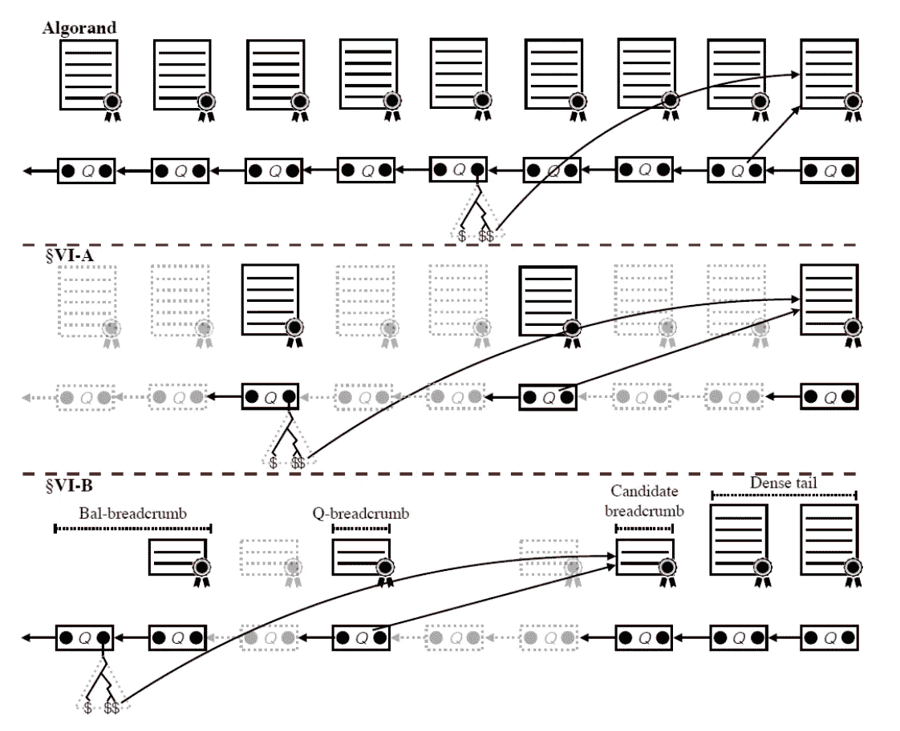
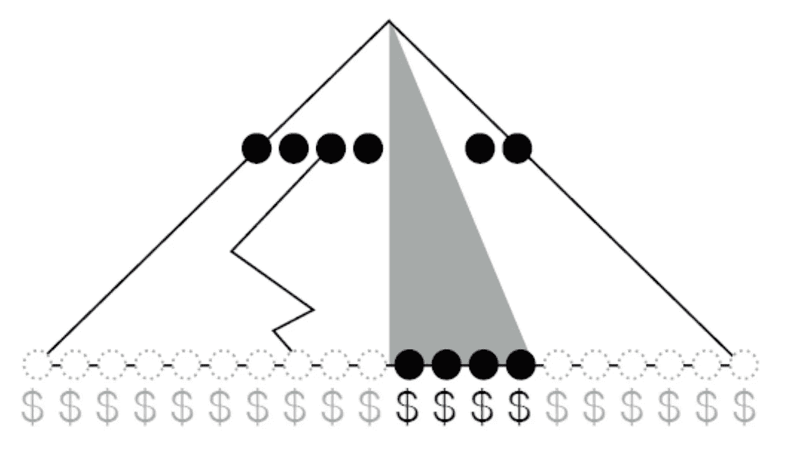
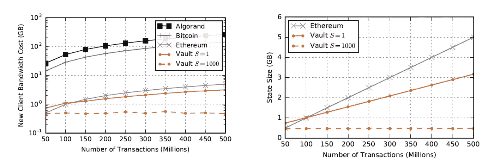

# 保险库内部:麻省理工学院的新协议可以使加密货币的效率比比特币高 99%

> 原文：<https://medium.com/hackernoon/inside-vault-mits-new-protocol-that-can-power-cryptocurrencies-99-more-efficient-than-bitcoin-7b58aafd28a0>

采用加密货币的主要障碍之一是随着时间的推移，处理交易和加入网络的成本不断增加。分散式加密货币依赖于不同的参与者来验证网络的状态，以便成功地处理交易。

随着网络的增长，下载和处理分类帐副本的过程变成了计算量很大的工作，这导致许多节点无法进行。最近，来自麻省理工学院(MIT)计算机科学和人工智能实验室(CSAIL) [的研究人员推出了 Vault](http://people.csail.mit.edu/nickolai/papers/leung-vault-eprint.pdf) ，这是一种新的加密货币，与今天的加密货币相比，它可以减少用户加入网络和验证交易所需的数据高达 99%。

大多数流行的加密货币背后的当前共识协议使得它们难以扩展且启动缓慢。

> 加密货币网络的发展使其安全性和稳定性与引导节点和验证交易所需的时间之间的摩擦越来越大。

上图中描述的摩擦是由几个因素造成的。首先，加密货币不断受到挑战，以防止重复消费(防止用户花两次钱或多次处理同一笔交易)。比特币等加密货币依赖于跟踪所有交易的工作证明协议，这在处理交易的成本和网络中的交易数量之间产生了线性依赖关系。

以太坊改进了这一概念，它不存储所有交易，而是跟踪从给定账户发出的最后一笔交易的序列号(“nonce”)。即使账户没有剩余余额，也必须存储该随机数，这在交易处理成本和旧账户的数量之间产生了线性相关性。除了计算成本，加密货币节点还会导致存储成本增加，以维护所有交易的状态。

阶段证明(PoS)协议可以提高事务的吞吐量和延迟，但它们也带来了自己的一系列挑战，特别是在引导节点时。

> 要让新参与者相信区块链区块的有效性，首先需要让他们相信早期区块中所有用户的余额(赌注)。

因此，让新用户相信最新块的有效性需要让他们相信所有用户在所有时间点的余额，从最初的 genesis 块开始。最近，诸如 Algorand 的区块链已经创建了 PoS 共识模型，其提高了速度和引导时间，但是仍然受到许多前述元素的挑战。

与交易处理成本和引导时间相关的挑战超出了可扩展性，并导致加密货币网络中的主要安全漏洞。加密货币网络中的大多数攻击都植根于这样一个原则，即每笔交易都依赖于长期存在的委员会来处理。

攻击委员会的个人成员通常是破坏网络最简单的方法。

# 进入金库

麻省理工学院的 Valt 是一种无需许可的基于 PoS 的加密货币，可以减少网络中的引导时间和交易处理成本。Vault 的初始设计基于阿尔格兰德区块链，但通过一系列独特的贡献扩展了其价值主张，包括以下要素:

**引导效率:**诚实的参与者应该能够让新节点相信它们的状态是正确的，并帮助它们使用最小的网络带宽进行引导。

**安全:**该协议应该防止不良行为者使新节点相信它们状态的有效性。

**存储效率:**为了帮助新节点加入网络，现有的 Vault 节点应该只需要存储少量的状态。

**可用性:**即使某些用户断开网络连接，Vault 仍会继续运行，尽管客户端之间存在分片状态。

**存储收费:**希望扩大协议状态规模的对手必须获得大量股份。

金库的最初设计是建立在阿尔格兰德区块链的基础上，这在安全性和可扩展性方面提供了一个良好的开端。与其他加密货币不同，在其他加密货币中，用户竞争解决验证块的方程，从而降低交易处理时间，Algorand 使用“利害关系证明”概念来更有效地验证块，并更好地支持新用户加入。

每个区块都选出一个有代表性的核查“委员会”。在网络中拥有更多资金或股份的用户更有可能被选中。为了加入网络，用户验证每个证书，而不是每个交易。在 Algorand 中，每个块都包含一些关键信息，以验证其前面的证书，这意味着新用户必须从链中的第一个块及其证书开始，并按顺序验证每个块，这可能非常耗时。

Vault 的主要创新都可以概括为对 Algorand 协议的改进。Vault 引入了第二种类型的证书，称为戳记证书，它允许使用多个块之前的信息来验证一个块。

Vault 并不依赖于前一个块，而是根据其后面几百或一千个块(称为“面包屑”)为每个新证书提供验证信息当一个新用户加入时，他们将一个早期块的面包屑与几个块之前的面包屑进行匹配。该面包屑可以与几个街区前的另一个面包屑匹配，依此类推。这一巧妙的创新让客户一次“跳过”几个街区，而不是必须验证区块链的每一个街区。

> 为了减轻第二个证书的影响，Vault 依靠一个较小的委员会来生成它，但它需要更多的成员一致投票。

分片是 Vault 带来一些巧妙创新的另一个领域。Vault 的研究论文提出了一种共享技术，将交易数据分成更小的部分或碎片，在网络上共享，因此个人用户只需处理少量数据即可验证交易。

Vault 改进了传统的 Merkle 树，它将 Merkle 树分成单独的分片，分配给不同的用户组。每个用户帐户只在分配给它的碎片中存储帐户余额，以及根哈希。诀窍是让所有用户存储一层跨越整个 Merkle 树的节点。

当用户需要从他们的 shard 外部验证一个事务时，他们会跟踪到那个公共层的路径。

下图说明了 Vault 的 Merkle 树的作用。默克尔树。此图中的圆点代表 Merkle 节点，而“$”符号代表账户余额。实心黑点和深色“$”符号代表碎片(灰色阴影三角形)中的余额，而灰色符号代表树中的非碎片部分。中间的一行黑点代表所有客户机存储的 Merkle 节点的边界，而不考虑分片分配。将这些节点中的一个连接到未存储的叶节点的锯齿状线表示执行平衡更新所必需的 Merkle 见证。

麻省理工学院团队根据市场上一些顶级加密货币的自举成本和存储大小评估了性能保险库。如下两张图表所示，结果非常显著。

除了头条新闻，认识到跳马仍然是一个高度理论化的练习也是很重要的。然而，它的许多想法可以成为下一代区块链协议的基础。