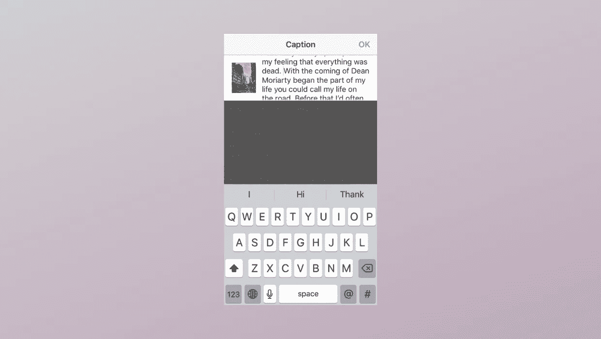
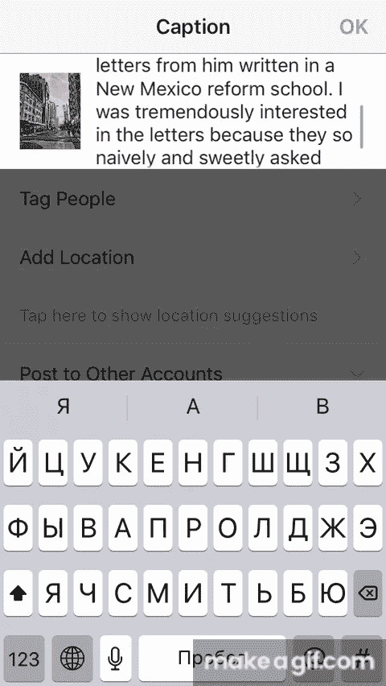

# Instagram，为什么把写作搞得这么复杂？

> 原文：<https://medium.com/hackernoon/instagram-why-do-you-make-writing-so-complicated-cbcdc9800a1c>

Photo by [Thought Catalog](https://unsplash.com/@thoughtcatalog?utm_source=medium&utm_medium=referral) on [Unsplash](https://unsplash.com?utm_source=medium&utm_medium=referral)

假设你想在 Instagram 上开一个教育博客。这是有道理的，因为应用程序中有很多潜在的读者。或者你即将在那里开始/推广你的业务。这也是一个好主意。这个平台似乎拥有你可能需要的一切:故事/照片/视频广告、有效的目标定位、洞察报告。一切。除了很棒或者至少一般的写作经验。

“Ok”你可以说“Instagram 是一个分享图片的平台”。是的，它是。但是现在越来越多的人使用 Instagram 来开发个人品牌、推广业务和销售课程、书籍等。对他们来说，短信是一种简单明了的讲述故事的方式。

## 如果可以的话写点东西

假设你是他们中的一员。你决定发布有趣且有思想的内容来吸引你的读者。所以你拿起这张惊人的照片，做了一些滤镜魔术，进入下一步，看到了这个。

真的吗？这 25%的表现是我们应得的吗？很难写出有意义的东西，因为文字消失了，给新单词留下了位置。

好吧，但是你更坚持，所以你设法写了相当大的文本，没有吓坏。顺便说一句，你不知道你还可以输入多少个符号。Instagram 有一个限制，但不会表明你离最后一个符号有多远。

然后你决定**修改文本**，并试着滚动一点。要做到这一点，你必须将拇指放在这一小块显示屏上，然后在 2-3 厘米内滑动。如果你需要向上滚动，你很幸运，因为，基本上，你可以将手指向下移动到这个小区域之外。否则，你将不得不做很多简短的幻灯片。老实说，这是一次可怕的经历。手指小的人从这个角度来看要幸运一点。

Yes, that’s Cyrillic. Don’t ask me how it happened.

也许你还想**格式化文本**以使其更容易消化。有个坏消息:这几乎是不可能的。为了构建文本，人们使用表情符号、从互联网上的某个地方或第三方应用程序复制的不间断空格，因为 Instagram 本身没有任何工具来提高文本的可读性。是的，你可以点击“返回”,但不能保证它会按你预期的方式工作。

最后，你肯定需要**预览文本**以确保一切正常。但是怎么做呢？嗯，你可以拉伸文本字段，并按保持它的延伸，但你可能不会看到所有的文本。

所以 Instagram，为什么会忽略这些东西呢？

也许这是旧的“拍照并分享”模式的遗留物。也许脸书不想发展文字博客。尽管如此，我相信如果人们以他们认为的另一种方式使用应用程序，那么这是一个发展的机会。现在，这些缺陷被为用户提供更多灵活性和更好体验的第三方 app 所利用。这对 Instagram 来说绝对是一个失去的机会。

## 我梦想的四件事

一些非常简单的功能可以显著改善用户体验，吸引更多有影响力的人。

1.  **可扩展的文本字段。**最简单的方法是扩展文本字段。显示器中间有很多未使用的空间。

2.**符号计数器。**让用户了解他们还有多少剩余的符号。

3.**清除格式。**是的，我想知道不发明轮子怎么开始一个新的段落！

4.**事后检讨。不是每个博客作者都能马上写出连贯的文章。所以看到整篇文章并检查它的可读性肯定会很棒。**

## Instagram 为什么要这么做

这些改进对产品本身非常有帮助。

1.  **为用户创造更多价值/提高参与度。**独特的内容是社交网络最重要的事情之一，因为它让用户着迷并渴望更多的内容。*有一次我花了 30 分钟在 Instagram 上阅读关于肝脏的内容。关键是我不在乎肝脏，我的很好！但它写得如此有趣，我无法停止阅读。*
2.  **写帖子的力气少=帖子多。**我假设 Instagram 最重要的指标之一是帖子数量。我还假设较少的写作努力会鼓励人们发布(和写)更多的东西。
3.  **最后，更多的货币化机会。**很简单。平台上更多的商家=更多的潜在广告买家。写肝脏的女孩也卖关于健康的书。而通过 Instagram 分享知识是让人们“品尝”她的产品的最佳方式。

但是，即使用户不是为了发展某种业务，而是想与世界分享他们的想法，难道这不值得改进吗？

有时一张照片能比成千上万的话更有意义。但是有时候你确实需要几千个字来表达一些重要的事情。有很多人在讲述这些故事。我真的不明白为什么 Instagram 鼓励商家加入该平台，但不改善这些基本的东西。

希望 Instagram 最终能解决这个问题。

希望在那之前你不会退出。

你觉得这篇文章有帮助、有趣或刺激吗？然后点击几下“拍手”图标。这对我意义重大！