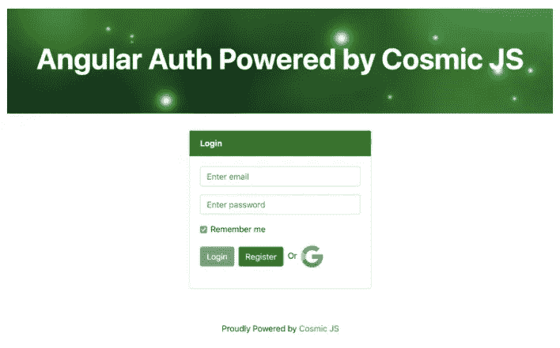
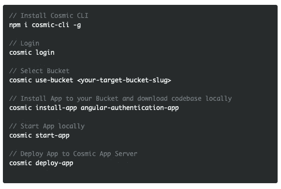
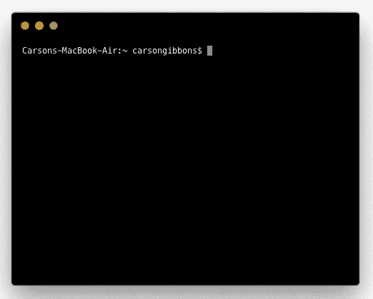

# 分 3 步安装角度认证应用程序

> 原文：<https://medium.com/hackernoon/install-an-angular-authentication-app-in-3-steps-1db87d71f25e>

Cosmic JS 是一个现代化的无头内容管理系统，它使团队能够更快地一起构建应用程序。Cosmic JS 为内容创建者提供了一个基于 web 的仪表板来管理内容，并为开发人员提供了 API 工具和资源来将他们的内容与他们的应用程序集成在一起。

在本教程中，我将演示如何使用 Cosmic JS CLI 安装一个由 [Cosmic 社区](https://cosmicjs.com/community)中的 [Ankit Kumar](https://cosmicjs.com/a9kitkumar) 使用 Angular 6、Node.js 和 Cosmic JS 构建的 [Angular 认证应用](https://cosmicjs.com/apps/angular-authentication-app)。用户可以使用他们的电子邮件地址或谷歌登录注册，所有数据都存储在 Cosmic JS 中。我鼓励你阅读[原文](https://cosmicjs.com/articles/how-to-build-an-authentication-app-using-angular-6-and-cosmic-js)，看看它是如何构建的。你可以从你的 Cosmic JS Bucket Dashboard 安装、部署和编辑这个 Angular Auth 应用程序的每个部分。🔥

# TL；博士:

[角度认证 App](https://cosmicjs.com/apps/angular-authentication-app)
[角度认证 App 演示](https://cosmicjs.com/apps/angular-authentication-app/demo)
[角度认证 App 代码库](https://github.com/cosmicjs/angular-auth)
[如何使用角度 6 和 Cosmic JS 构建认证 App](https://cosmicjs.com/articles/how-to-build-an-authentication-app-using-angular-6-and-cosmic-js)

# 第一步:创建账户

[**报名**](https://cosmicjs.com/signup) **参加宇宙 JS +安装** [**宇宙 CLI**](https://github.com/cosmicjs/cosmic-cli) **+创建新桶**

 [## cosmicjs/cosmic-cli

### Cosmic JS 的官方命令行工具。通过在…上创建帐户，为 cosmicjs/cosmic-cli 开发做出贡献

github.com](https://github.com/cosmicjs/cosmic-cli) 

# 步骤 2:安装🛠️

**通过** [**宇宙 CLI**](https://github.com/cosmicjs/cosmic-cli) **:** 安装

我为这个博客设置了一个示例桶:

运行`cosmic -h`获得所有命令的列表。运行`cosmic [command] -h`了解特定命令选项的详细信息。现在，您已经启动并运行了一个 Angular 身份验证应用程序，该应用程序可以通过电子邮件或他们的 Google 登录来注册用户，所有内容都完全通过您的 Cosmic JS Bucket 仪表盘和命令行终端工具来管理。

# 结论

我能够使用一个无头 CMS API 轻松安装一个 Angular 身份验证应用程序，现在我可以用它来管理动态内容更改。当抛弃已安装的内容管理系统并采用 API 优先还不够快时，请查看来自 Cosmic JS 的[入门应用](https://cosmicjs.com/getting-started)，让项目在几秒钟内启动并运行。🔥

了解更多关于[向 Cosmic JS 社区贡献自己的项目](https://cosmicjs.com/contribute)的信息。如果您对使用 Cosmic JS 构建应用程序有任何意见或问题，[在 Twitter 上联系我们](https://twitter.com/cosmic_js)和[加入 Slack 上的对话](https://cosmicjs.com/community)。