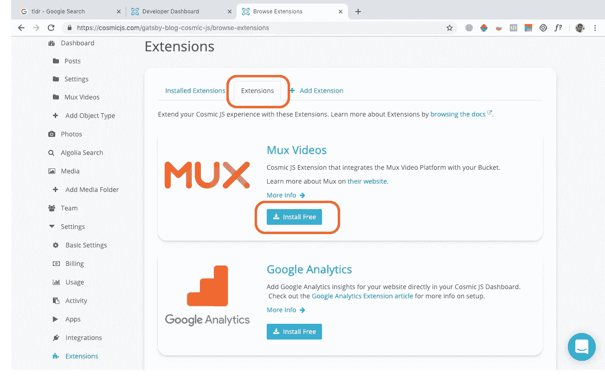
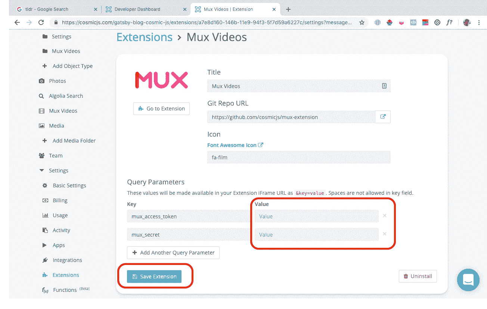
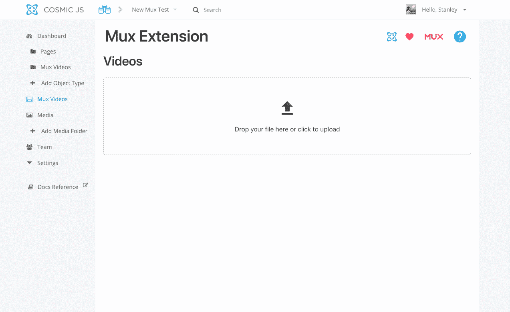
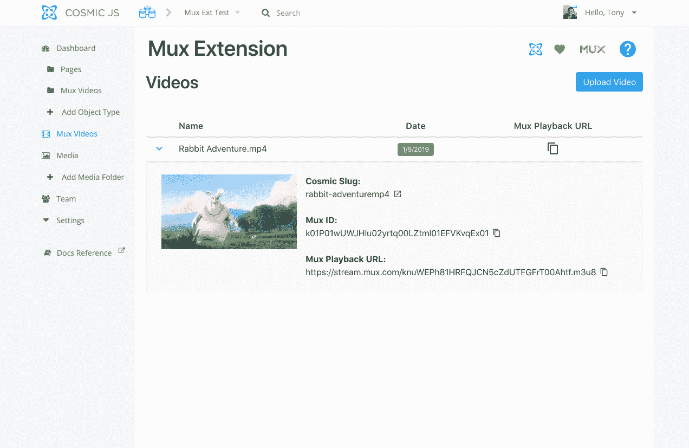

# 将高质量、API 优先的视频集成到一个无头 CMS 中

> 原文：<https://medium.com/hackernoon/integrating-api-first-optimized-video-using-a-headless-cms-47968e70fb0>


视频很难。编码、为正确的浏览器提供正确的版本、设备优化、带宽考虑，所有这些都令人望而生畏。令人欣慰的是，有了 [Mux](https://mux.com/) 和新的 [Mux 视频扩展](https://cosmicjs.com/extensions/mux-videos)，您可以将同类最佳的视频传输添加到您的应用程序中，而不会感到头痛。

在这篇概述中，我将向您展示如何使用 [Mux Videos 扩展](https://cosmicjs.com/extensions/mux-videos)，通过使用 [Cosmic JS Headless CMS](https://cosmicjs.com/) ，只需点击几下鼠标，即可在您的应用程序中添加视频内容。作为奖励，我将向您展示如何创建您自己的 [Cosmic JS 扩展](https://cosmicjs.com/extensions/)来连接到您的 Cosmic JS 仪表板中您最喜欢的 API 服务。

# TL；速度三角形定位法(dead reckoning)

[安装 Mux Videos 扩展](https://cosmicjs.com/extensions/mux-videos)
[查看 Mux Videos 扩展代码库](https://github.com/cosmicjs/mux-extension)
如果你还不是 Mux 客户，他们将向 Cosmic JS 客户提供 50 美元的信用！创建一个账号，向他们的团队提及**“宇宙 JS”**。

# 什么是 Mux？

[Mux](https://mux.com/) 是一个 API 优先的视频服务，帮助你为你的用户提供最高质量的视频。通过使用他们的视频流 URL 来托管您的视频，您可以确保您的用户将在所有设备和网络带宽限制下接收到最佳版本的视频。

Mux 和 [Cosmic JS](https://cosmicjs.com/) 是一个强大的组合。通过将 [Mux 视频扩展](https://cosmicjs.com/extensions/mux-videos)安装到你的 Cosmic JS 桶，你将能够从你的 Cosmic JS 仪表盘直接上传视频到 Mux。在您的内容中使用保存的 Mux 视频 URL，为您的最终用户提供尽可能高质量的视频体验。

# 如何安装 Mux 扩展

要安装 Mux Videos 扩展，[登录你的宇宙 JS 账户](https://cosmicjs.com/login)并导航到*你的桶>设置>扩展*。点击*扩展*选项卡浏览所有预建的扩展。从那里，找到并安装 Mux Videos 扩展。



安装后，您将被重定向到扩展设置页面。在*查询参数*下，您需要提供 Mux 账户上的 Mux API 凭证(`mux_access_token`、`mux_secret`)。您可以按照这里的步骤[来获取您的 Mux API 凭证。](https://docs.mux.com/docs/video#section-1-get-an-api-access-token)



输入凭据后，保存您的扩展名。你可以走了！

# 扩展是如何工作的？



安装扩展并设置 Mux 帐户密钥后，单击左侧导航中的 Mux 视频扩展链接。接下来，上传你的视频。该扩展将上传的视频数据保存到 *Mux Videos* 对象类型。现在，您可以使用对象元字段将 Mux 视频添加到任何对象中。然后，您可以通过使用位于对象元数据中的`mux_playback_url`属性将 Mux 数据提取到您的应用程序中。



# 履行

只需将 Mux 播放 URL 添加到您的 HTML 视频播放器。这里有一个例子:

# 结论

通过使用 Mux Videos 扩展，您的用户将感谢您为他们提供高质量的视频，并针对他们的特定设备和带宽进行了优化。这是 Cosmic JS 与可用的最佳工具集成的另一种方式，帮助您创建更好的应用程序体验，从而创造更多快乐的用户。

有关实现 Mux 流 URL 的最佳实践，请参考 [Mux 文档](https://docs.mux.com/docs/video)。

# 额外收获:如何创建自己的宇宙 JS 扩展

Mux Videos 扩展是使用 [Vue](https://vuejs.org/) 和 [Nuxt](https://nuxtjs.org/) 构建的。在 GitHub 上查看 [Mux 视频扩展代码库。](https://github.com/cosmicjs/mux-extension)

要为您的 [Cosmic JS](https://cosmicjs.com/) Bucket 创建您自己的 Cosmic JS 扩展，您至少需要以下必需文件:

```
extension.json
index.html
```

## 扩展设置

`extension.json`文件包含您的扩展的基本信息。以下是 Mux 扩展中`extension.json`文件的基本字段([参见此处的完整文件](https://github.com/cosmicjs/mux-extension/blob/master/extension.json)):

```
{
  "title": "Mux Videos",
  "font_awesome_class": "fa-film",
  "image_url": "https://cosmic-s3.imgix.net/ee0ef100-052b-11e9-a865-4d928f17b796-mux.png?w=600"
}
```

从这里，你只需在根文件夹中创建一个静态网站，并上传到*你的桶>扩展>添加扩展*。由于这可以是一个静态网站或 SPA，您可以使用 React、Vue 和 Angular 等现代前端开发工具。

关于构建扩展的更多信息，请查看[扩展文档](https://cosmicjs.com/docs/extensions)。