# 将散景可视化集成到 Django 项目中。

> 原文：<https://medium.com/hackernoon/integrating-bokeh-visualisations-into-django-projects-a1c01a16b67a>

尽管多年来我一直是 python 开发人员，但直到最近我才需要与 Django 互动。在探索 Django 的时候，我决定学习更多关于 Bokeh 可视化库的知识。我试图将它集成到我的 django 项目中，发现找到一个完整的教程很有挑战性。我想我会创建一个帖子，概述将 Bokeh 集成到 Django 的步骤，以防有人觉得有用。

## **先决条件:**

*   [Python](https://www.python.org/downloads/) —我用的是 python 3
*   [皮普](https://www.pythonforbeginners.com/basics/python-pip-usage/)

我在 Mac 上使用 [Sublime Text 3](https://www.sublimetext.com) 开发了这个项目。这可能意味着如果您使用另一个操作系统，我们可能会有稍微不同的命令。

## **建立 Django 项目**

在我们与 bokeh 合作之前，我们需要设置 django 项目。如果您已经熟悉了 django 项目的设置，请随意跳过。

让我们打开命令行/终端。通常，当您打开它时，它已经指向您的主目录。

通过使用 ***cd*** 命令导航至您的首选目录区域。我将把项目存储在名为 codeprojects 的目录中。

然后我使用 ***mkdir*** 命令为项目创建一个新目录。

```
mkdir bokeh_project
```

然后导航到您创建的目录。

```
cd bokeh_project
```

然后，我们需要为这个项目创建一个虚拟环境。虚拟环境允许 python 项目拥有一个独立的环境，其中每个项目都可以存储自己的依赖项，而不管其他项目的依赖项。

```
python3 -m venv myvenv
```

激活您的虚拟环境

```
source myvenv/bin/activate
```

现在我们有了虚拟环境，我们可以使用 pip 命令在其中安装 django。

```
python -m pip install django
```

创建 Django 项目目录

```
django-admin startproject bokeh_example
```

在 IDE 中打开项目。您将看到项目结构已经创建。

现在在终端中使用 ***cd*** 导航进入散景 _ 示例

```
cd bokeh_example
```

在终端中使用以下命令创建 sqlite3 数据库。

```
python manage.py migrate
```

现在，通过运行服务器命令检查网站是否已经创建

```
python manage.py runserver
```

导航到浏览器并输入该地址

```
http://127.0.0.1:8000
```

您应该会看到如下页面，确认您正确创建了网站！

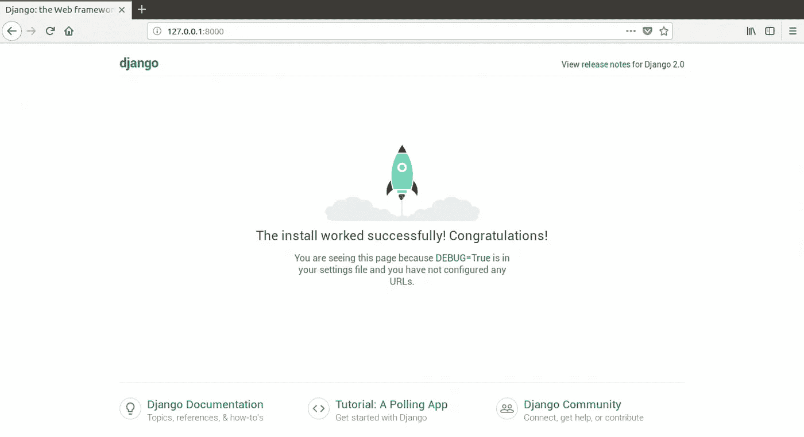

为了保持一切整洁，我们想在项目中创建一个新的区域来存储所有的站点文件。运行以下命令

```
python manage.py startapp mysite
```

这将创建一个新的目录结构。

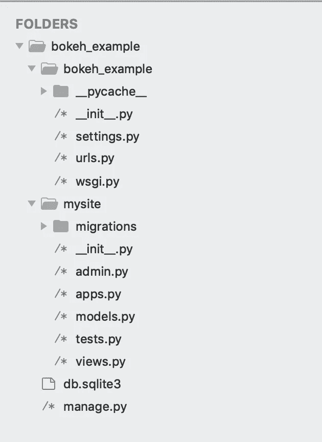

Directory Structure

下一步是创建 base.html 文件，它将存储网页和散景图像。

在 mysite 文件夹中添加一个名为 templates 的文件夹。在其中添加另一个名为 pages 的目录，然后在其中创建一个名为 base.html 的文件。

这个 base.html 文件将包含我们的核心 html 代码。

我们现在可以在里面放一些基本的 html

```
<html><head>
</head><body>
  <h1> Hello Medium! </h1>
</body></html>
```

然后，我们需要将 html 文件链接到一个视图。打开 mysite/views.py，创建一个名为 homepage 的新方法。

```
def homepage(request):
 return render(request, ‘pages/base.html’, {})
```

该方法将根据请求将视图重定向到 base.html 文件。

为此，我们需要更改 *bokeh_project/urls.py.* 您必须添加一行来包含 mysite.urls

```
urlpatterns = [
 path(‘admin/’, admin.site.urls),
 path(‘’, include(‘mysite.urls’)),
]
```

我们现在需要创建一个 url 连接 mysite.urls 文件。这将把一个 url 指向我们的视图，从而得到 base.html 文件。

```
from django.urls import path
from . import viewsurlpatterns = [
 path(‘’, views.homepage, name=’homepage’)
]
```

最后一步是将“mysite”添加到 settings.py 文件中的 INSTALLED_APPS 中。

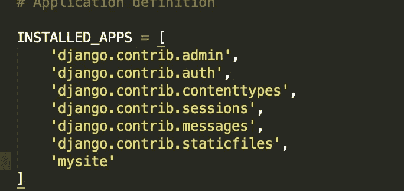

Settings.py

现在我们有我们的 base.html 连接起来。我们可以再次运行我们的服务器，我们可以看到我们的 html 页面显示 Hello Medium！

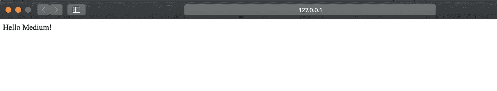

Homepage

## 将散景集成到项目中

现在我们有了 django 项目，我们现在可以将 Bokeh 集成到 html 页面中。

首先，我们必须在虚拟环境中使用 pip 安装散景。

```
python -m pip install bokeh
```

现在它已经准备好了。

首先在命令行中输入以下内容，检查安装的散景的版本

```
python
```

这将打开 python 交互式环境。然后，我们可以输入以下命令来找出散景版本

```
import bokehbokeh.__version___
```

一旦你有了版本，你可以通过输入 ***quit()来退出交互环境。***

作为参考，我有 1.0.4 版本。当你将散景整合到主页时，这一点很重要。

让我们回到 base.html 的档案。

我们需要在文件头中包含散景依赖。确保依赖项引用您拥有的散景版本。

```
<link href=”[http://cdn.pydata.org/bokeh/release/bokeh-1.0.4.min.css](http://cdn.pydata.org/bokeh/release/bokeh-1.0.4.min.css)" rel=”stylesheet” type=”text/css”>
 <link href=”[http://cdn.pydata.org/bokeh/release/bokeh-widgets-1.0.4.min.css](http://cdn.pydata.org/bokeh/release/bokeh-widgets-1.0.4.min.css)" rel=”stylesheet” type=”text/css”><script src=”[http://cdn.pydata.org/bokeh/release/bokeh-1.0.4.min.js](http://cdn.pydata.org/bokeh/release/bokeh-1.0.4.min.js)"></script>
 <script src=”[http://cdn.pydata.org/bokeh/release/bokeh-widgets-1.0.4.min.js](http://cdn.pydata.org/bokeh/release/bokeh-widgets-1.0.4.min.js)"></script>
{{ script | safe }}
```

我们还需要在 html 文件中包含一个显示可视化效果的 div

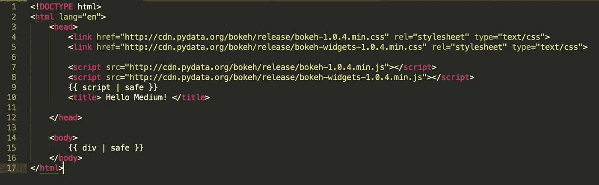

base.html

然后我们需要修改 views.py 文件来创建一个图表。我们将首先实现一个基本的线图。编辑 views.py 以包含以下信息

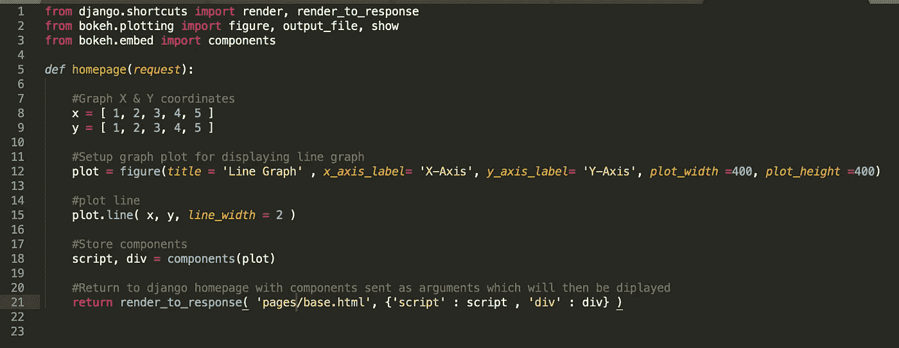

views.py

完成这些更改后，运行服务器，您应该会看到如下图:

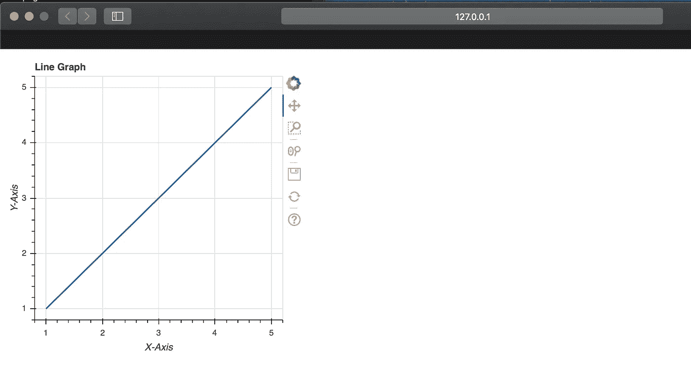

Bokeh Line Graph

我们可以从 Bokeh 的用户指南中实现一个更好的图形，让它更上一层楼。我选择实现嵌套条形图，并修改了 views.py 中的 homepage 方法。

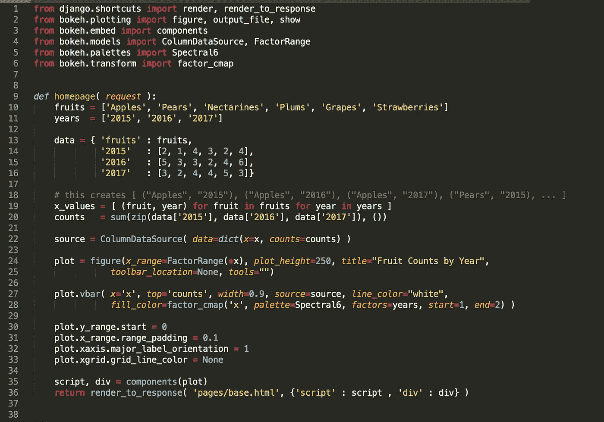

views.py

这导致了下图。

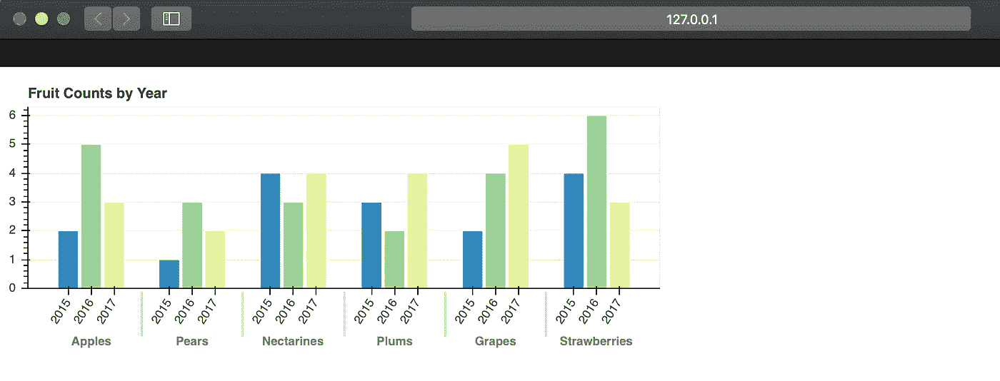

base.html view

## CSS 改造

网页看起来很平淡。我们可以利用 [bootstrap](https://getbootstrap.com/docs/4.3/getting-started/introduction/) 和 css 让网页看起来更真实。首先，让我们在 base.html 文件中包含 bootstrap。

将用于引导的样式表和 javascript 链接复制并粘贴到 base.html 部分。

```
<link rel=”stylesheet” href=”[https://stackpath.bootstrapcdn.com/bootstrap/4.3.0/css/bootstrap.min.css](https://stackpath.bootstrapcdn.com/bootstrap/4.3.0/css/bootstrap.min.css)" integrity=”sha384-PDle/QlgIONtM1aqA2Qemk5gPOE7wFq8+Em+G/hmo5Iq0CCmYZLv3fVRDJ4MMwEA” crossorigin=”anonymous”><script src=”[https://code.jquery.com/jquery-3.3.1.slim.min.js](https://code.jquery.com/jquery-3.3.1.slim.min.js)" integrity=”sha384-q8i/X+965DzO0rT7abK41JStQIAqVgRVzpbzo5smXKp4YfRvH+8abtTE1Pi6jizo” crossorigin=”anonymous”></script> <script src=”[https://cdnjs.cloudflare.com/ajax/libs/popper.js/1.14.7/umd/popper.min.js](https://cdnjs.cloudflare.com/ajax/libs/popper.js/1.14.7/umd/popper.min.js)" integrity=”sha384-UO2eT0CpHqdSJQ6hJty5KVphtPhzWj9WO1clHTMGa3JDZwrnQq4sF86dIHNDz0W1" crossorigin=”anonymous”></script> <script src=”[https://stackpath.bootstrapcdn.com/bootstrap/4.3.0/js/bootstrap.min.js](https://stackpath.bootstrapcdn.com/bootstrap/4.3.0/js/bootstrap.min.js)" integrity=”sha384–7aThvCh9TypR7fIc2HV4O/nFMVCBwyIUKL8XCtKE+8xgCgl/PQGuFsvShjr74PBp” crossorigin=”anonymous”></script>
```

让我们首先添加一个导航栏作为网页的标题。

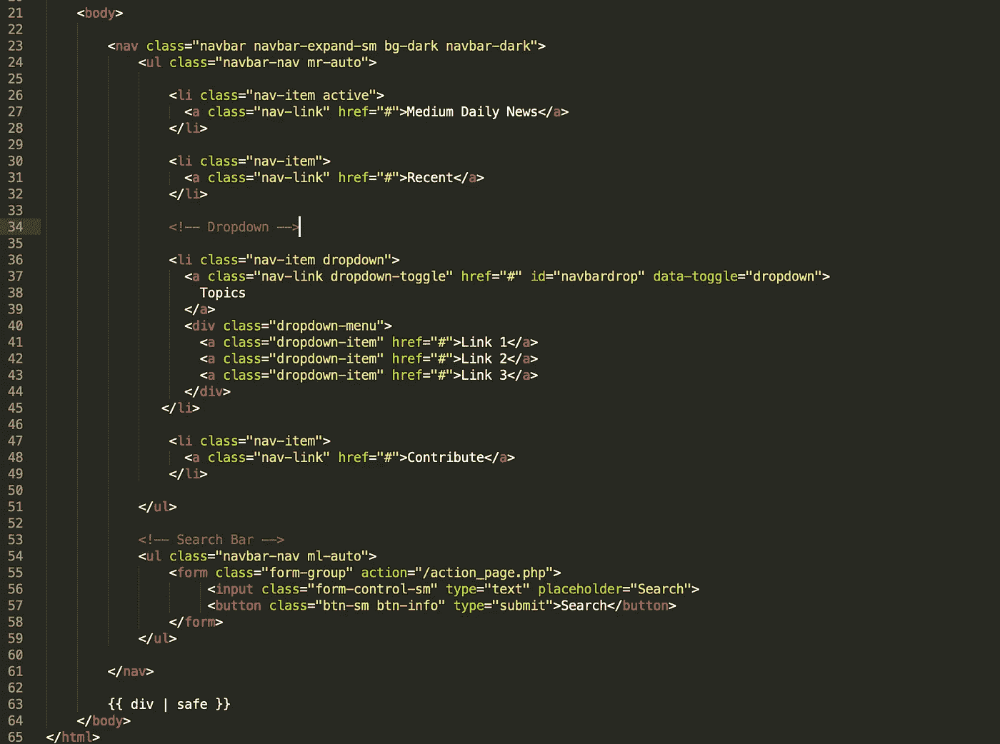

base.html

一旦集成到文件中，网页上的结果应该如下所示:

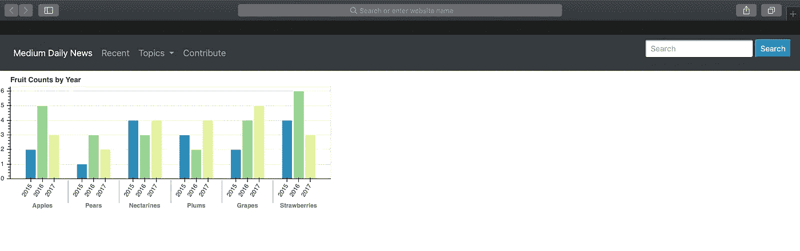

base.html

现在让我们集中精力填写网站的内容。我将创建一个样式，使 graph 看起来像是博客文章的一部分。

我们将使用容器。该容器将包含一个小列，这将是侧栏和一个更大的列，这是博客饲料。

在 html 页面中添加容器之前，我们需要创建 css 文档。添加一个名为 static 的新文件夹，就像我们添加模板一样。在 static 中创建另一个名为 css 的文件夹和一个名为 mysite.css 的新文件

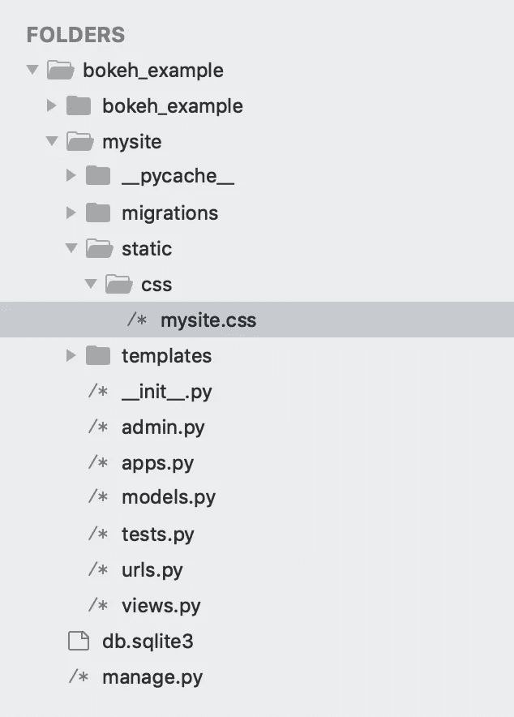

Folder directory

现在我们有了我们的 css 文件，让我们回到我们的 base.html，并包括在头部的文件。

```
<link rel=”stylesheet” href=””>
```

您还必须在 head 标记的开头引用加载静态文件。

```
<head>
 
```

我们还必须在 settings.py 文件中进行一些更改。我们必须将静态目录指向正确的区域，这样 css 文件才能被获取。

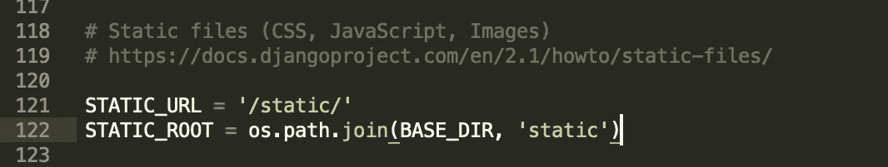

settings.py

让我们回到 base.html，创建存储站点内容的容器。在导航栏下输入:


base.html — content containers

首先，让我们填充侧栏。我们将添加一个垂直导航栏和一个侧部件。

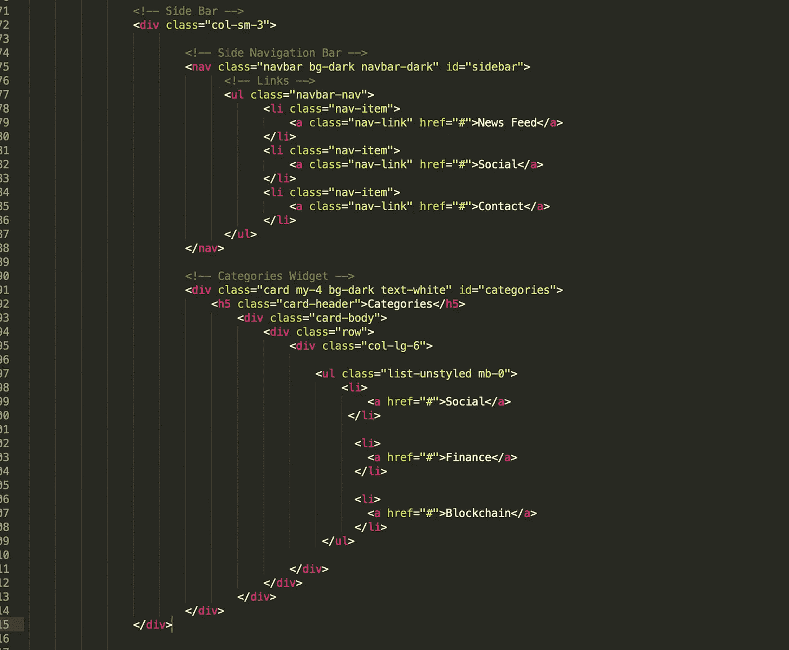

base.html — sidebar

然后，我们可以在 css 文件中添加一些样式。

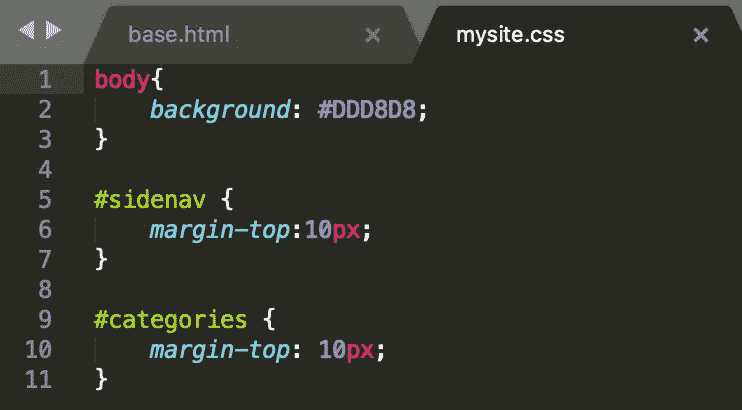

mysite.css

网页现在应该看起来像这样:

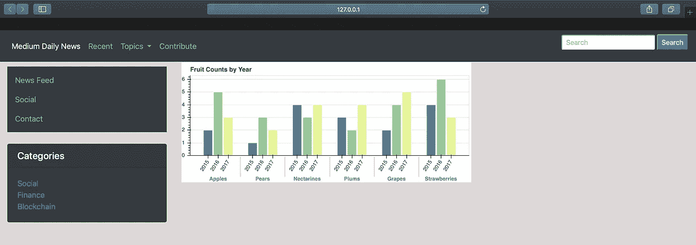

127.0.0.1:8000

现在让我们集中精力创建博客内容。我们必须为帖子添加标题和一些 Lorem Ipsum 内容等信息。我们这样做如下:

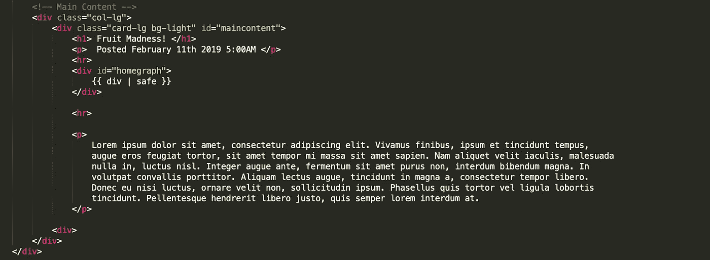

base.html

我们可以通过添加额外的样式和导入谷歌字体来改进博文。从谷歌字体中，我选择了 Oswald 和 Open Sans 在博客文章中使用。

首先，你必须包括链接到头部的字体。

```
<link href=”[https://fonts.googleapis.com/css?family=Open+Sans|Oswald](https://fonts.googleapis.com/css?family=Open+Sans|Oswald)" rel=”stylesheet”>
```

现在我们可以在 css 文件中添加字体系列和其他样式。

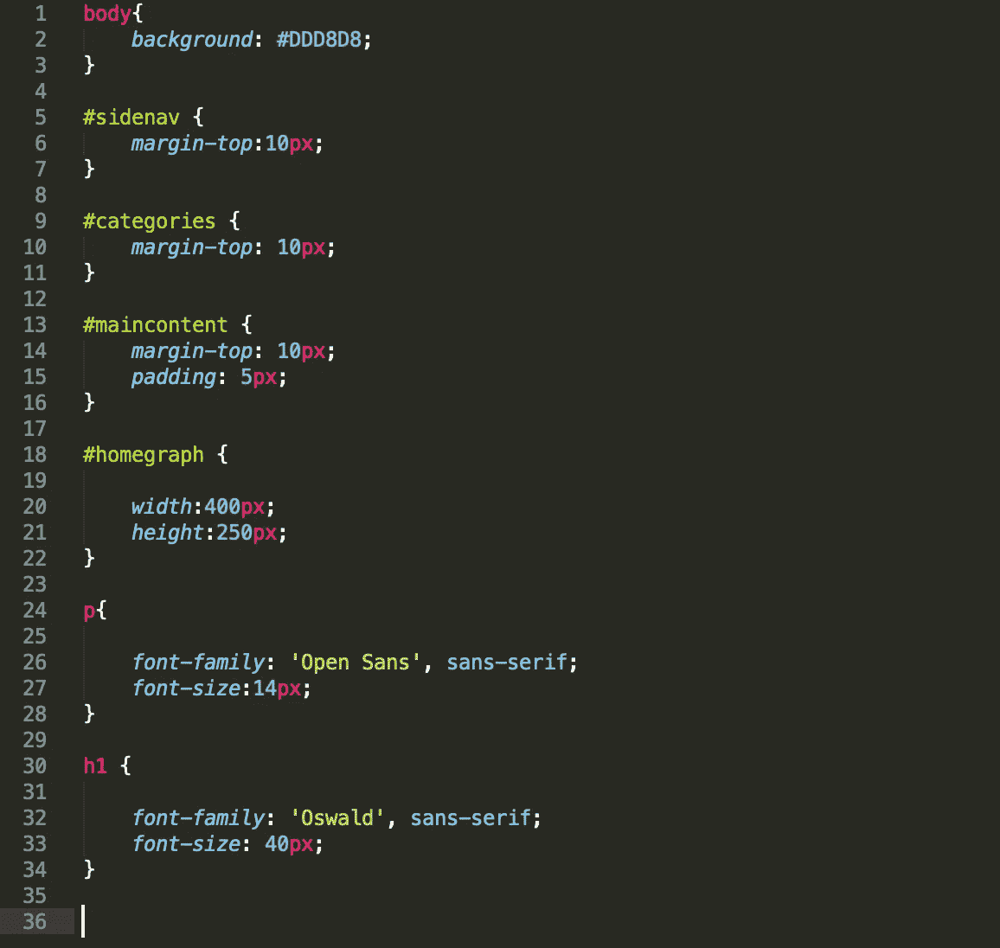

mysite.css

完成这些更改后，网站应该如下所示:

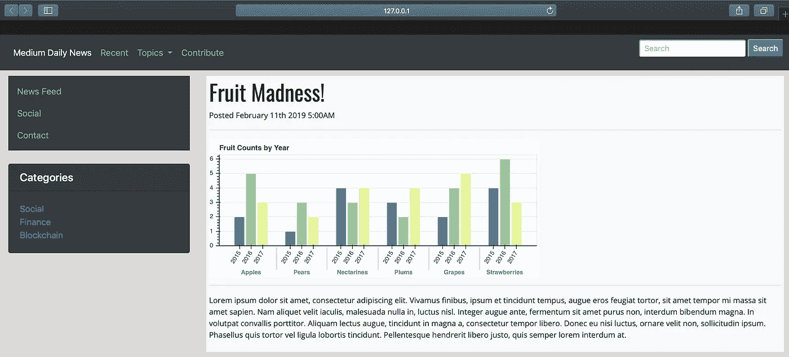

base.html

你现在可以从这里开始试验，用真实的内容、不同的风格或更多的散景视觉效果来构建网站！