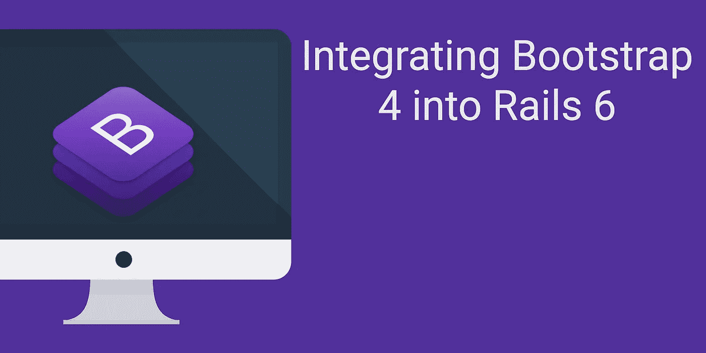

# 将引导程序 4 集成到 Rails 6 中

> 原文：<https://medium.com/hackernoon/integrating-bootstrap-4-into-rails-6-9ae2bbb44999>

## …以及如何使用主题

为了安装 Bootstrap 4 和一个主题，我们将添加一些包，更新一些配置，并添加一些额外的 gems 库，以使开发变得更容易。假设你已经用`rails new app_name`启动了一个应用