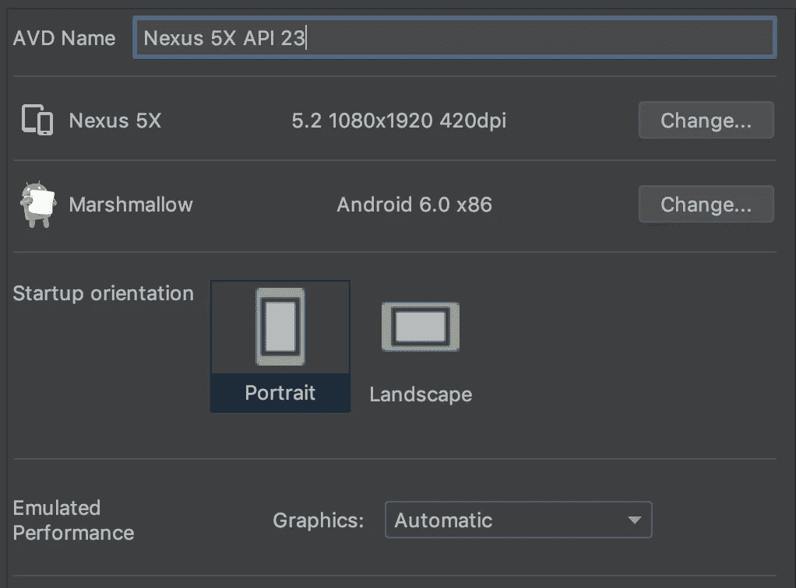
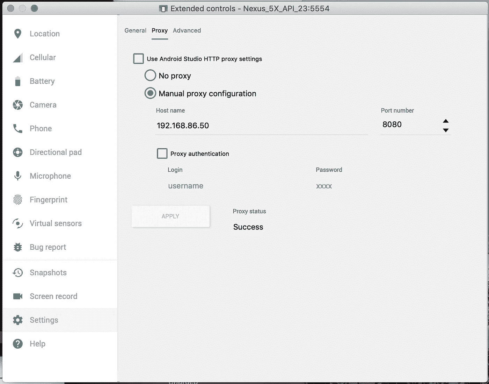
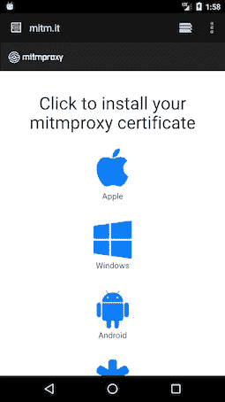
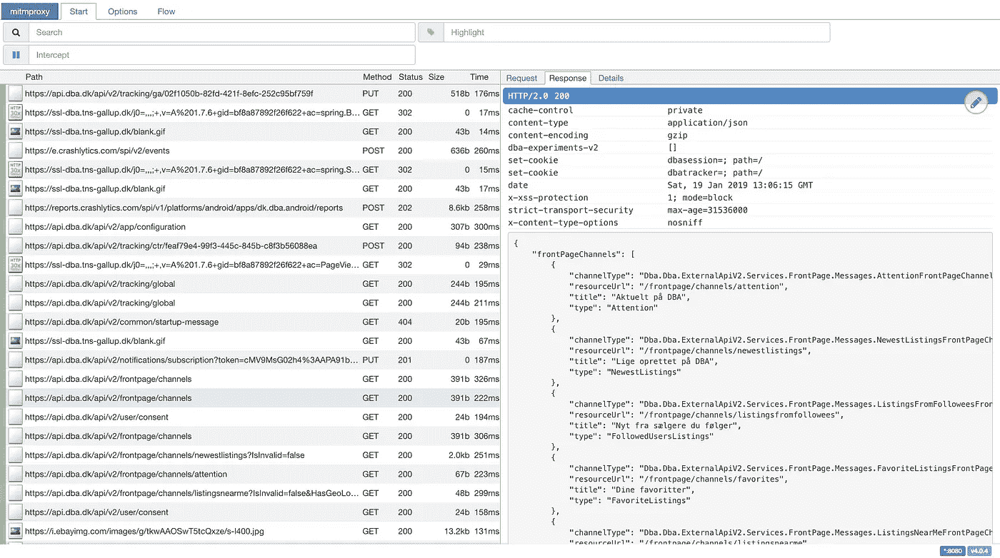

# 在安卓模拟器上拦截 HTTPS 流量

> 原文：<https://medium.com/hackernoon/intercept-https-traffic-on-a-android-emulator-46023f17f6b3>

有时候，我们希望在一个应用程序中看到所有的网络流量。这可能很麻烦，因此我们需要一种简单的方法来完成。
在本文中，我将介绍如何使用 MITM(中间人)代理拦截来自 Android 模拟器的 HTTP/HTTPS 流量。

开始时，我们需要两样东西

*   [Mitmproxy](https://mitmproxy.org/) (用于创建我们的代理服务器)
*   [Android 模拟器](https://developer.android.com/studio/run/emulator)(用于运行应用程序)

我们从安装 Mitmproxy 开始，他们的网站上有很好的[安装指南](https://mitmproxy.org/)。当使用 Mac 和自制软件时，你可以做`brew install mitmproxy`。
安装完 Mitmproxy 后，我们需要设置一个 android 模拟器。我们在这里采用的方法要求我们使用低于 7 的 Android 版本。我用的是 Android 6 (API 23)。

AVD example of setup with Android 6 (API 23)

安装完所有需求后，我们将启动代理并设置模拟器来使用它。
为了启动代理，我们运行`mitmweb`，这将启动一个在端口`8080`上运行的代理。(`mitmweb`打开一个显示请求的网站，如果您想在终端中看到它，只需使用`mitmproxy`代替)
要使用带有仿真器的代理，打开仿真器并进入配置窗口。在配置窗口下，转到`Settings` → `Proxy`，将其更改为手动代理配置。
然后输入你电脑的 IP 地址(可以用`ifconfig`找到)代理的默认端口是`8080`。请记住，图像显示的是我的本地 IP 的例子，你的可能会有所不同。

Android emulator settings example for my computer

现在您的代理已经设置好了，下一步是安装证书。要安装证书，请在 android 模拟器上进入 [mitm.it](http://mitm.it) ，您应该会看到以下屏幕。

Android emulator showing mitm.it

在这个屏幕上选择 android 并给证书一个名字。我给我的取名`mitm.it`，但是名字可以是你喜欢的任何名字。安装证书后，您就可以使用代理了。打开你的应用程序。现在，您可以在浏览器中查看您的请求，以便解决问题。

Example of data received through mitmproxy

请记住，一些应用程序可能不允许您这样做，因为这可能会违反您同意的条款。