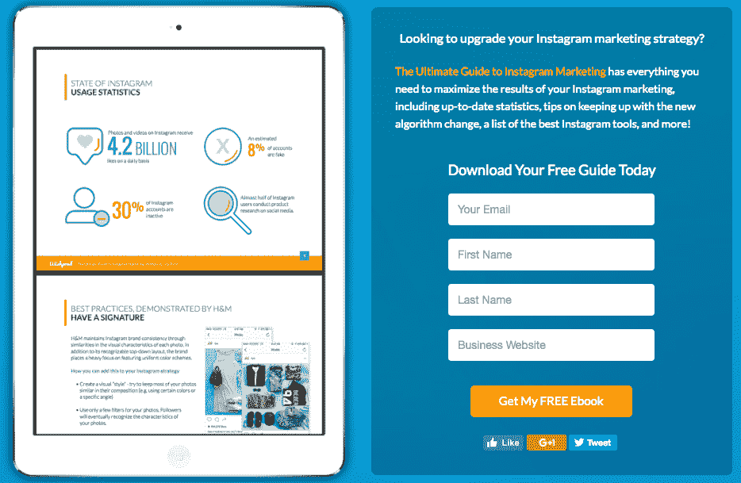
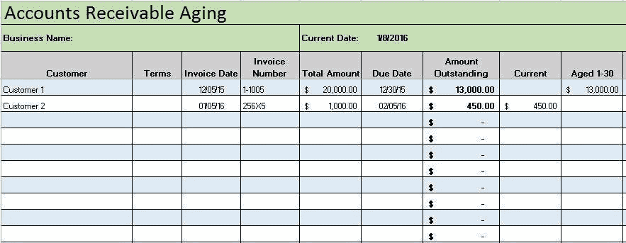
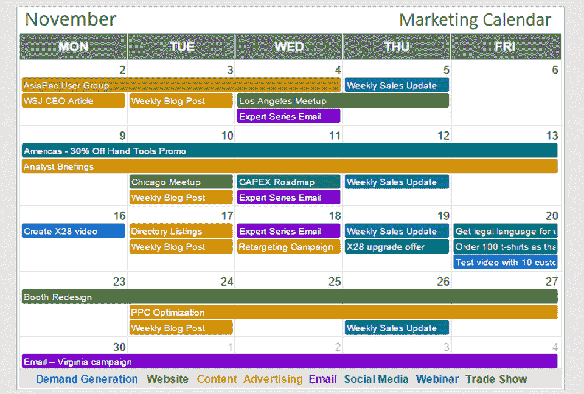
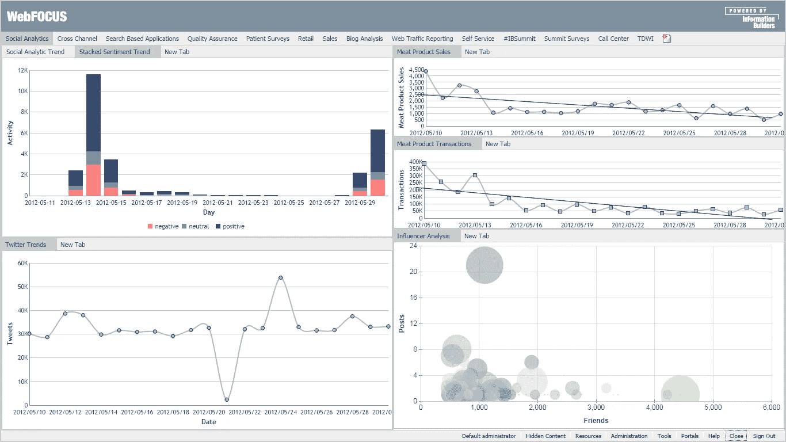

# A/B 测试中级指南-快乐网页优化！

> 原文：<https://medium.com/hackernoon/intermediate-guide-to-a-b-testing-happy-web-optimization-6a6398d07c74>

Img Source: [https://blog.ladder.io/ab-testing/](https://blog.ladder.io/ab-testing/)

过去 4-5 年来，我一直是一名数字分析和优化顾问。在不同公司进行了 100 多次 A/B 测试后，我在管理数字优化项目方面获得了一些有价值的见解。有一个可重复的构思过程，在常规的 A/B 测试文章中很少讨论。这篇文章就是关于这些知识的。

让我们看看以下场景中的一些挑战和解决方案。

**场景 1** : **测试下不太突出的特征**

一个网站，即使是单一的产品，也需要其他因素的支持才能获得完整的体验。这些因素共同作用于网站的关键体验和指标转换。

> 这些网站因素可能是可见的，也可能是不可见的，如果你对你的转化不够专注的话。

*Image Credit:* [*https://blog.wishpond.com/post/67068435596/landing-pages-the-fundamentals-and-conversion*](https://blog.wishpond.com/post/67068435596/landing-pages-the-fundamentals-and-conversion)

登录页面和信息请求表单通常是测试最多的大组件。尤其是在 CTA 文本、颜色和英雄图像测试用尽的情况下。对于以大单采购为驱动的 B2B、B2C 公司来说更是如此。

比如汽车经销店，教育，出国旅游等等。因此，许多团队的第一反应是从 KPI 的 RFI 中测试电梯。菜单、产品信息或随机下载按钮等其他方面往往会被忽略。但是遵循**循环的网站转换方法**的团队可以在一段时间内持续优化他们组织的网站。

下面是一个小测试周期的例子:

1.  **增量 RFI 测试**(最多 2-3 次测试)——如果第一次测试能给你带来提升，那太好了！实施成功的改变，并继续网站的下一部分。如果没有，我们仍然需要在 2-3 次测试后转移到另一个部分，并再次返回测试新的 RFI 变体。
2.  **关键 KPI 转换后优化访客旅程** -无论您的业务类型如何，都有更好的方式向访客告别。尤其是在发生了密钥转换时。你总能给你的访客留下更好的体验。他们肯定会离开你的网站。你在购买之前或之后如何计划他们的退出，可以决定他们是否会再次回来。例如，在汽车制造商的情况下，想象一个 RFI 或一个会议已经被建立。

> 现在，您可以在同一次访问中或稍后通过电子邮件向他们提供汽车的回顾视频。你也可以告诉他们当地经销商的一些潜在赠品或汽车的其他独特功能。通常，每个行业和商业类型都有很好的潜力。

**3。测试你网站的不可见部分-** A/B 测试不仅仅局限于评估访问者对网站可见部分的反应。一个优化团队可以帮助你塑造网站的*导航结构*。网站路径、测试菜单和导航选项等方面可以简化与访问者的互动。

**场景 2:活动记账**

*让我们学学会计，维护一份每季度或每年进行的所有测试的损益表！*

*Image credit-* [*https://www.smartsheet.com/top-excel-accounting-templates*](https://www.smartsheet.com/top-excel-accounting-templates)

测试、实现和忘记是非常常见的。团队很少保留过去 6 个月或一年前进行的测试的记录。A/B 测试通常是短期项目。但是，对过去 6 个月或一年中发生的所有测试活动的综合反思可以提供大量的知识。它还最大限度地减少了对下一个摇滚明星想法的依赖，并使营销团队能够计划“季节性”测试。

> 它也有助于对您想要测试的组件进行排序，而不是一种无组织的格式或对一个想法的过度测试。

要做到这一点，记录每个测试的最终结果的简单主动的方法可以走很长的路。您可以使用 excel 或任何共享文档来记录每次测试的结果。除了一个额外的有纪律的手动步骤之外，它不会花费任何成本。在上面分享的 excel 中，人们可以很容易地重命名列，以记录过去活动的表现、样本大小、运行持续时间和其他关键因素。

**场景 3:测试日历**

*Image Credit-* [*https://www.forbes.com/sites/joelyork/2016/09/29/marketing-calendar-software-that-scales-7-crucial-features/#29a3fbd73243*](https://www.forbes.com/sites/joelyork/2016/09/29/marketing-calendar-software-that-scales-7-crucial-features/#29a3fbd73243)

有一个测试日程表是测试簿记的另一面。随着团队开始成熟，他们通常会为测试制定一些日程表。然而，挑战不在于遵守纪律。

这样做的两个常见原因是:

1.  **管理或领导重点的变化:**这通常基于一些新的绩效报告而发生。一些新特性的发布或常规的部分被推翻，测试优先级会立即改变。在某些情况下，需要更灵活的方法。我们必须放弃一些预先决定的测试，为基于新知识的测试让路。

然而，重要的是要记住不要放弃所有的测试想法，这些想法是早期作为一个更大的策略的一部分而决定的。可以保持内部优先级顺序，低优先级的想法可以被新的想法淘汰。

**2。IT 资源的限制**:这更像是一个运营问题。可以为大中型组织有效地“规划”它。他们通常有专门的 IT 资源来进行现场优化。如果没有，那么你需要为日常工作雇佣一个。流行的 A/B 测试工具，如 Optimizely，VWO，ABTasty 可以帮助减少对它的依赖。但是也有很多测试需要它的帮助。作为一个指标，任何需要测试路径的想法，菜单，整合常见问题，聊天，等等。这些可能需要比标准工具所能提供的更多的 IT 帮助。

**场景四** : **活动分析**

一个被过度讨论但本质上未被充分利用的短语。重要的是在分析过程中保持中立，同时要彻底。

Image Credit- [http://www.informationbuilders.nl/blog/dan-grady/18573](http://www.informationbuilders.nl/blog/dan-grady/18573)

我感觉到 A/B 测试的分析很少在一份好的报告中完成。当结果出来后，不同的经理可以要求几个细分和细分报告。这会让分析师陷入困境，陷入无休止的报告循环，无助于做出决策。

我发现限制这种情况的一个有效方法是在测试开始前制定一个“测量计划”。协作是分析师工作的基础。根据您所在组织的工作方式，您可以与相关人员共享预期的衡量计划，以征求他们的反馈。即使只是一个人工作，纸上的计划也有助于在实际分析结果时进行反思，并避免任何返工。

**场景 5:做出决定&实施后监控结果**

*为您自己的组织定制行业标准仍然是关键。此外，在您监控结果之前，测试过程的最后 5%仍有待完成。*

*图片来源:*[*https://smart bear . com/blog/test-and-monitor/we B- performance-monitoring-101/*](https://smartbear.com/blog/test-and-monitor/web-performance-monitoring-101/)

有时测试的结果并不明确，并且会有一轮投票来推荐。在这种情况下，通常每个人都会推荐和提倡过去的行业标准。虽然它们是一个很好的参考点，但我认为它们不应该被视为可以依赖的圣杯。仅仅是因为很多时候他们太老了，不再相关。此外，可能适用于您的组织的内容可能与针对某个行业推荐的内容不同。因此，在这种情况下，了解你的直接业务目标、你自己的受众并相应地定制推荐是关键。

最后，无论实施了什么决定，都要进行监督！这是这个过程中最简单、最直观，但也是最容易被忽视的部分。你可以感觉这个测试已经完成，并为下一个做准备。但是这仍然只完成了 95%,过程的最后 5%仍然存在。

正常情况下，当部署到 100%流量时，获胜的变体会表现出预期的行为，但偶尔性能可能会因为多种原因而不是那么好。因此，需要在 100%发布后对其进行持续监控，并与所有利益相关方共享更新。

**结论**

还有许多其他要点，但我将在这里休息我的情况。希望上面讨论的一些要点能与您联系起来，并在您正在进行的测试过程中帮助您。你们中的许多人会有不同的意见，它们可能比本文中讨论的更有效。因此，如果您能分享任何对您一直有效的反馈或流程想法，那就太好了。我很乐意就这个问题进行任何讨论，并听取任何同意和反对的观点。

毕竟，这就是 A/B 测试活动的意义所在！

潘卡杰·辛格

页（page 的缩写）如果你对技术和设计方面的免费在线课程感兴趣，你可以[访问这个平台](https://www.quickcode.co/?utm_source=%22Medium%22&utm_medium=%22MedimPub%22&utm_campaign=%22HackerNoonABTesting%22)。