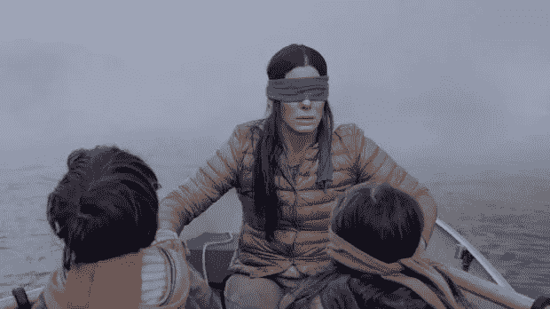
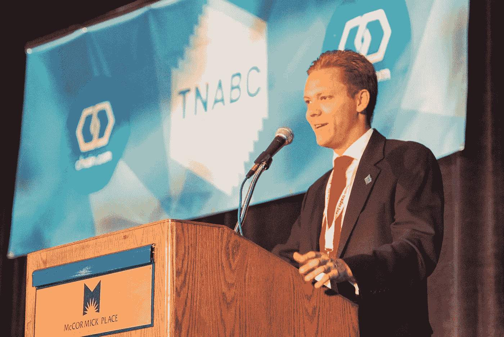
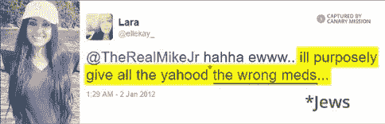
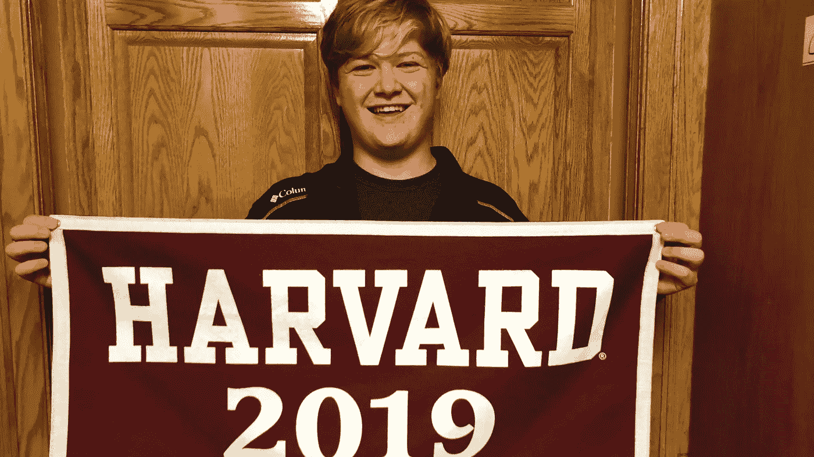

# 互联网文化综述#2:本周五大 Everipedia 页面

> 原文：<https://medium.com/hackernoon/internet-culture-roundup-2-top-five-everipedia-pages-of-the-week-98138ccae374>

似乎有两件事是肯定的，那就是互联网总是会给我们带来病毒式的模因挑战，总会有人因为旧推文而被解雇。在 Everipedia 互联网文化综述的第二版中，我们拥有所有这些，外加美国最聪明的 16 岁少年、鼓舞人心的遗愿清单完成者和比特币社区的领导者。如果你认为我们错过了什么，请在回复中留下评论！

Still image from the movie Bird Box

# [鸟箱挑战](https://everipedia.org/wiki/lang_en/bird-box-challenge/)

有超过 4500 万的用户收看了 Bird Box，可以说这是网飞最受欢迎的原创作品之一。这部电影的一个核心部分是人物在户外时需要蒙住眼睛，这激发了许多在线迷因和现实生活中的鸟箱挑战。简而言之，参加鸟箱挑战的人在进行正常活动时，必须被蒙上一定时间的眼睛。虽然许多人已经在 YouTube 上上传了参加挑战的视频，但网飞警告说不要这样做，并在推特上说他们不希望任何人“因模因而进医院”

Trace Mayer speaking at an event

# [追踪迈尔](https://everipedia.org/wiki/lang_en/trace-mayer/)

自从比特币价值 0.25 美元以来，Trace Mayer 一直在推荐比特币，并且从生态系统处于萌芽状态开始就一直在资助项目。现在，梅耶尔创办了一个年度活动来纪念比特币的起源，并让持有加密货币的第三方承担责任，这就是[密钥证明庆典](https://everipedia.org/wiki/lang_en/proof-of-keys/)。概念很简单；如果你在交易所有加密货币，请在 1 月 3 日将其转移到个人钱包中。迈尔是货币主权的大力支持者，他有一条信息“不是你的钥匙，也不是你的比特币。”根据密钥证明，一些交易所停止提款或冻结账户，包括 HitBTC、Bitfinex 和 Poloniex。

Tweet from Dr. Lara Kollab in 2012

# [劳拉·科拉布博士](https://everipedia.org/wiki/lang_en/lara-kollab/)

劳拉·科拉布博士因为各种错误的原因出现在新闻中。这位医生毕业于纽约市的犹太大学 Touro 学院骨科医学院，因其在网上发表的反犹太言论而被解雇。她的一些推文将犹太人比作动物，并挑逗犹太人因为是犹太人而服用错误的药物。Kollab 是许多因在网上发表评论而被解雇的人之一，她认为自己浪费了数万美元和数年时间学习成为一名医生，只是因为一些仇恨的评论而一路冲洗。

Morissa Schwartz taking a selfie

# [莫丽莎·施瓦茨](https://everipedia.org/wiki/lang_en/morissa-schwartz/)

鉴于她所取得的成就，称她为“有动力的”是一种轻描淡写的说法。当她 12 岁时，她列出了一张她想实现的愿望清单，比如创吉尼斯世界纪录、写一本书、在全国电视上露面等等。从那以后，施瓦茨已经完成了所有这些目标以及清单上的 75%。随着新的一年的开始，施瓦茨向我们展示了为我们自己努力奋斗而下决心永远不会太晚。

# [布拉克斯顿道德](https://everipedia.org/wiki/lang_en/braxton-moral/)

布拉克斯顿道德可不是一般的 16 岁孩子。这位堪萨斯人尤利西斯将于 2019 年从他的高中和哈佛大学毕业。尽管他对自然科学最感兴趣，但他在大学里学习了政府和政治。在未来，他计划参加约翰肯尼迪政府学院，并渴望有一天竞选美国总统，“只是说他是一个。”毫无疑问，道德是有天赋的，看看他将来如何为这个世界做出贡献会很有趣；希望他的道德指南针保持完整。