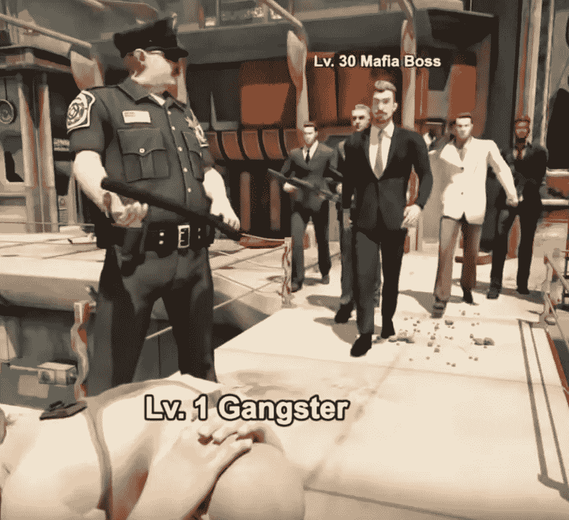
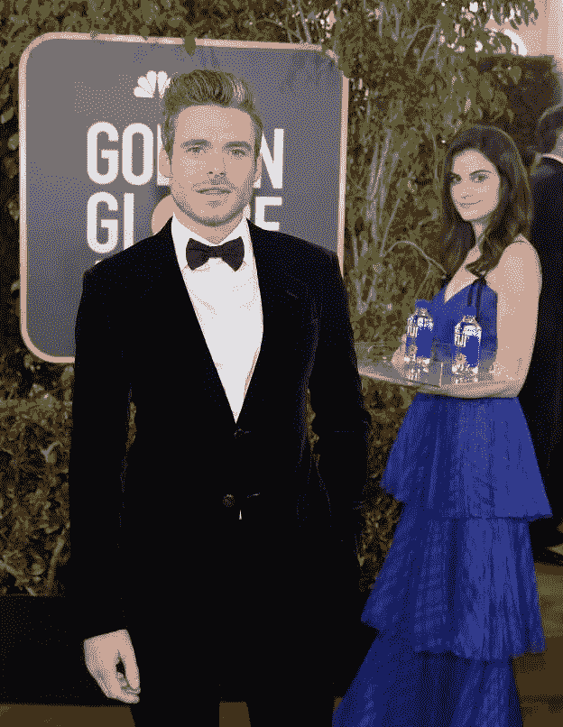
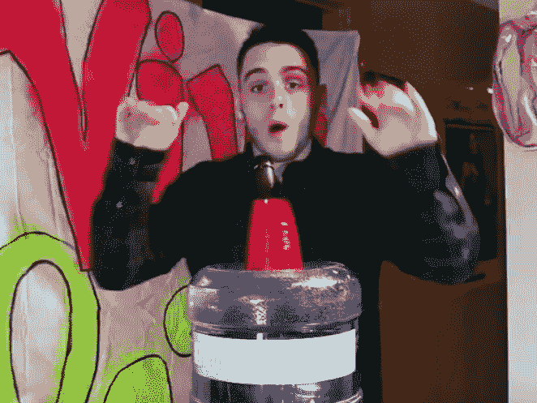
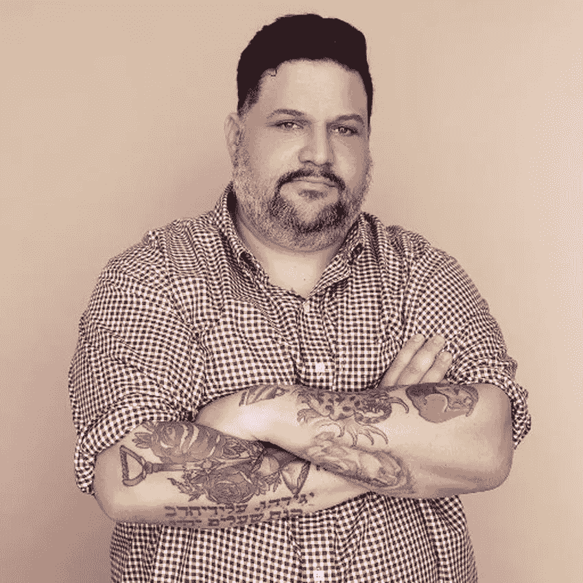

# 互联网文化综述#3:不够“引人注目”，这就是黑手党的工作方式

> 原文：<https://medium.com/hackernoon/internet-culture-roundup-3-not-notable-enough-thats-how-mafia-works-b9ccf26402dc>

如果互联网是一个不断进化的内容集体意识，那么模因就是它的 DNA。在本周的互联网文化综述中，我们有各种各样的模因受到关注，包括一款带有广告的手机游戏，展示了夸大妄想，一个拍照狂斐济水瓶模型，一个雄心勃勃的内容创作者，一个全明星棒球运动员 troll 活动的受害者，以及一个被删除的维基百科页面。

Screenshot of a Mafia City ad

# [黑手党城市](https://everipedia.org/wiki/lang_en/mafia-city-game-meme/)

有正常的手游广告，再有自成一格的黑道城市广告。由总部位于上海的 Yotta Games 创建的黑手党城市游戏由不同的家族组成，他们竞争成为城市中最突出的犯罪家族。但是真正席卷互联网的不是游戏，而是伴随游戏的广告，这些广告可笑到足以成为模因。一个典型的黑手党城市广告包括一个 1 级“骗子”执行一个行动，如抢劫银行或饮用提神饮料，然后转变为 35 级“黑手党老大”一些广告甚至在结尾出现了黑手党老大，标题是“黑手党就是这样运作的”自从黑手党城市广告在 2018 年底/2019 年初流行以来，出现了许多[迷因](https://www.youtube.com/watch?v=HA0Ruk7b4rI)，其中一些最受欢迎的包括在[恶作剧动作或标题](https://knowyourmeme.com/photos/1445159-thats-how-mafia-works)下方的“这就是黑手党的工作方式”图形。也许如果我们足够幸运的话，一部完整长度的电影将会在计划中。

Kelleth Cuthbert photobombing Richard Madden at the Golden Globes

# [凯莱思·库斯伯特(斐济水上女孩)](https://everipedia.org/wiki/lang_en/kelleth-cuthbert/)

模特兼品牌大使凯莉·库斯伯特最近在金球奖红毯上的亮相吸引了过多的关注。不，那天晚上她没有获得任何奖项的提名，但人们对她在提名者身后拿着一盘斐济水瓶看不够。她对妮可·基德曼、朱迪·格雷尔、伊德瑞斯·艾尔巴和金·凯瑞等名人的照片轰炸给她带来了新的名声，也让许多人想知道她来自哪里。这位多伦多出生、洛杉矶的模特拥有社会工作学士学位，在全职从事模特工作之前，她曾专门从事心理健康和成瘾咨询工作。一如既往，她的完整传记可以在她的 Everipedia 页面上找到。

Still-frame from the YOUNG PAGEVIEWS music video

# [年轻浏览量](https://everipedia.org/wiki/lang_en/young-pageviews/)

本·弗里德曼(Ben Friedman)也就是 Young Pageviews 有一条有趣的全职加入酒吧运动的道路。这位圣路易斯本地人制作了一个音乐视频，以引起 El Presidente David Portnoy 的注意，并在有机会的情况下，驱车 1000 英里到纽约市，以创建专注于户外活动/野生动物内容的 Barstool 凳。出于纯粹的决心和意愿，弗里德曼得到了这份工作，并自 2016 年以来一直在 Barstool Sports 工作。像许多高脚凳运动博主一样，弗里德曼制作了引人入胜的内容，并在社交媒体上拥有强大的追随者。然而，在酒吧运动社区之外，他们未能得到应有的认可(因此 Everipedia 社区创建了一个酒吧运动博客的[列表)。](https://everipedia.org/wiki/lang_en/list-of-bloggers-at-barstool-sports/)

A picture of Nikki Giles

# [尼基·贾尔斯](https://everipedia.org/wiki/lang_en/nikki-giles/)

德克萨斯州高级和前垒球运动员尼基·贾尔斯不得不应对由克利夫兰印第安人队全明星投手特雷弗·鲍尔领导的推特巨魔的全部愤怒。这一切都是从鲍尔跑向贾尔斯最喜欢的球员休斯顿太空人队的三垒手亚历克斯·布雷格曼开始的，后来她批评了他。被激怒的鲍尔甚至翻出贾尔斯的旧推文，与他的追随者分享，并在许多推文中给她贴上标签。推特上的争斗已经被主要媒体报道，如[《纽约邮报》](https://nypost.com/2019/01/09/college-student-in-hell-since-trevor-bauer-twitter-war/)和[《今日美国》](https://www.usatoday.com/story/sports/mlb/2019/01/08/trevor-bauer-twitter-nikki-giles/2517721002/)。尽管在快速发展中个人之间有许多 Twitter 争斗，贾尔斯-鲍尔的崩溃表明事情可以升级得多快，特别是当一方的粉丝比另一方多 135 倍的时候。

A picture of Micah Baldwin

# [米卡·鲍德温](https://everipedia.org/wiki/lang_en/Micah_Baldwin/?fbclid=IwAR3N-FF0X61jIxysTwJiqYBl6WxqmKHk3IZEZVMH4NcWK35sBS29owLhMuE)

Micah Baldwin 是世界社交媒体增长黑客的无名英雄。Create33 的执行董事早在 2009 年 1 月就开始了#followfriday (#ff)。起初是为了帮助他的两个朋友，他们正在竞争看谁能获得更多的粉丝，结果在接下来的周五成为一种全球趋势，包括标签在内的超过 40 万条推文。从那以后，鲍德温在创业领域取得了成功，创办了 Graphic.ly 等公司，与加速器 Y Combinator 和 TechStars 合作，并为许多公司提供咨询。然而，尽管他取得了巨大的成就，鲍德温的维基百科页面还是因为“知名度”的要求而被删除了。我猜黑手党就是这样运作的…